ssm+Vue计算机毕业设计信用卡增值业务系统（程序+LW文档）

**项目运行**

**环境配置：**

**Jdk1.8 + Tomcat7.0 + Mysql + HBuilderX** **（Webstorm也行）+ Eclispe（IntelliJ
IDEA,Eclispe,MyEclispe,Sts都支持）。**

**项目技术：**

**SSM + mybatis + Maven + Vue** **等等组成，B/S模式 + Maven管理等等。**

**环境需要**

**1.** **运行环境：最好是java jdk 1.8，我们在这个平台上运行的。其他版本理论上也可以。**

**2.IDE** **环境：IDEA，Eclipse,Myeclipse都可以。推荐IDEA;**

**3.tomcat** **环境：Tomcat 7.x,8.x,9.x版本均可**

**4.** **硬件环境：windows 7/8/10 1G内存以上；或者 Mac OS；**

**5.** **是否Maven项目: 否；查看源码目录中是否包含pom.xml；若包含，则为maven项目，否则为非maven项目**

**6.** **数据库：MySql 5.7/8.0等版本均可；**

**毕设帮助，指导，本源码分享，调试部署** **(** **见文末** **)**

### 系统的功能结构图

经过系统需求分析，该信用卡增值业务系统的设计与实现功能结构图如图4-1所示：

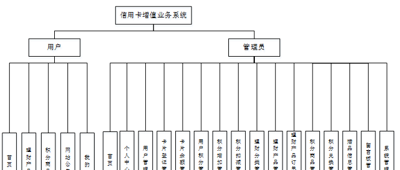

图4-1 系统功能结构图

### 4.2 数据库概念结构设计

####  4.2.1 数据库E-R图

概念设计主要是通过数据库的概念结构和模式进行建立数据库嗯逻辑结构，然后利用数据库的DBMS进行完成，它不需要计算机系统的支持。通过系统的整体来看，主要是对数据库进行管理、整理、更新等操作。数据库的功能是非常强大的，每个系统的开发肯定离不开数据库，通过数据库可以看得出整个系统的质量和效率，根据以上的系统分析，对系统中的主要实体进行规划。以下是几个关键实体的实体关系图：

(1) 卡片登记管理实体E-R图如图4-2所示：

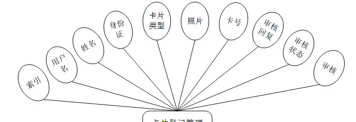

图4-2卡片登记管理实体属性图

(2) 理财产品管理E-R图如图4-3所示：

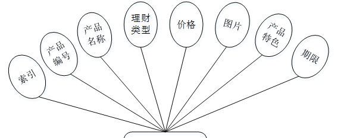

图4-3理财产品管理实体图

(3) 积分兑换管理实体E-R图如图4-4所示：

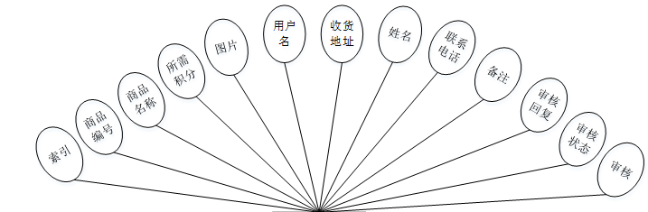

图4-4积分兑换管理实体图

### 用户前台功能模块（用户端）

信用卡增值业务系统登录界面，通过填写账号、密码、登录用户类型等信息进行登录，如图5-1所示。

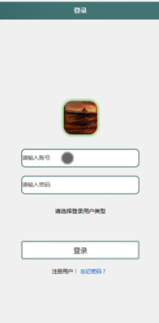

图5-1登录界面图

用户注册，通过填写用户名、密码、姓名、年龄、性别、手机、身份证、邮箱等信息，输入完成后选择提交即可注册成功，如图5-2所示。

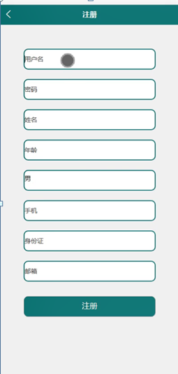

图5-2用户注册界面图

用户登录进入首页，可以进行首页、理财产品、积分商品、网站公告、我的等功能模块的查看与操作，如图5-3所示。

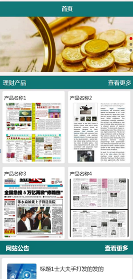

图5-3系统首页界面图

积分商品，在积分商品页面可以查看商品编号、商品名称、图片、品牌、规格、所需积分、商品介绍等信息，进行兑换，如图5-4所示。

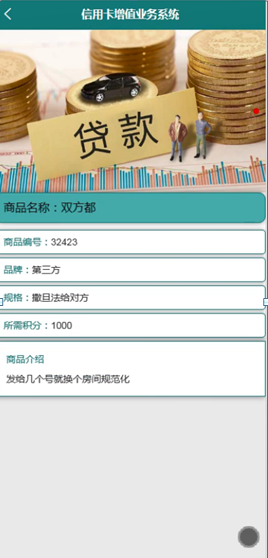

图5-4积分商品界面图

我的，在我的页面可以查看卡片登记、卡片余额、用户积分、积分增加、理财产品、理财产品订单、积分商品、积分兑换、赠品信息、医疗服务、留言板等详细信息，如图5-5所示。

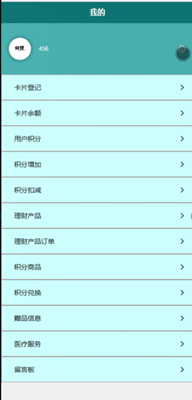

图5-5我的界面图

卡片登记，在卡片登记页面通过填写用户名、姓名、身份证、卡片类型、照片、卡号等信息并提交，如图5-6所示。

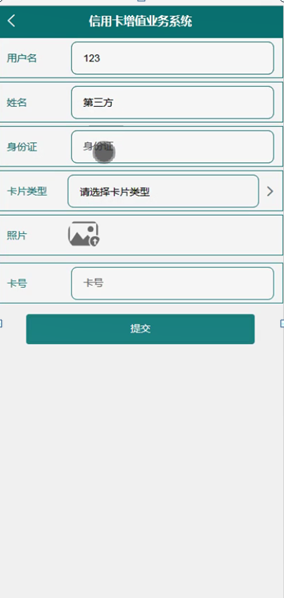

图5-6卡片登记界面图

理财产品，在卡片登记页面可以查看产品编号、产品名称、理财类型、价格、图片、产品特色、产品介绍、期限等信息，进行购买，如图5-7所示。

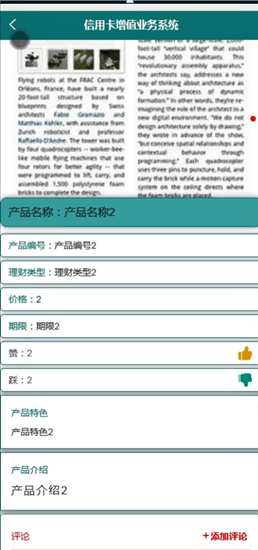

图5-7理财产品界面图

理财产品订单，在理财产品订单页面可以查看用户名、产品编号、产品名称、价格、购买数量、总价格、姓名、身份证等信息，如图5-8所示。

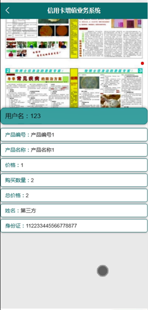

图5-8理财产品订单界面图

积分兑换，在积分兑换页面可以查看商品编号、商品名称、所需积分、图片、用户名、收货地址、姓名、联系电话、备注、审核回复等信息，如图5-9所示。

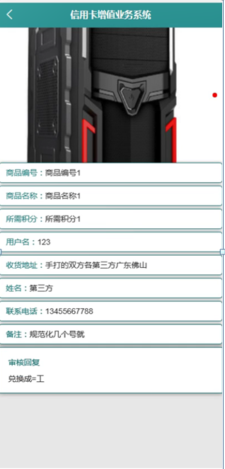

图5-9积分兑换界面图

赠品信息，在赠品信息页面可以查看赠品名称、用户名、姓名、领取时间、赠品描述等信息，如图5-10所示。

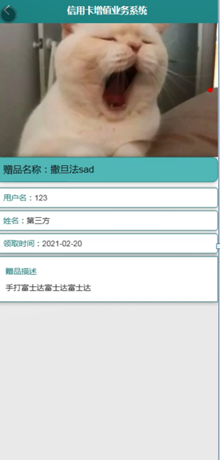

图5-10赠品信息界面图

留言板，在留言板页面通过填写留言内容并提交，如图5-11所示。

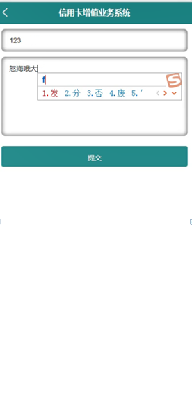

图5-11留言板界面图

### 5.2管理员功能模块（管理端）

管理员登录，管理员通过输入用户名和密码，选择角色并点击登录进行系统登录操作，如图5-12所示。

图5-12管理员登录界图面

#### **JAVA** **毕设帮助，指导，源码分享，调试部署**

