ssm+Vue计算机毕业设计信用卡逾期数据处理分析系统（程序+LW文档）

**项目运行**

**环境配置：**

**Jdk1.8 + Tomcat7.0 + Mysql + HBuilderX** **（Webstorm也行）+ Eclispe（IntelliJ
IDEA,Eclispe,MyEclispe,Sts都支持）。**

**项目技术：**

**SSM + mybatis + Maven + Vue** **等等组成，B/S模式 + Maven管理等等。**

**环境需要**

**1.** **运行环境：最好是java jdk 1.8，我们在这个平台上运行的。其他版本理论上也可以。**

**2.IDE** **环境：IDEA，Eclipse,Myeclipse都可以。推荐IDEA;**

**3.tomcat** **环境：Tomcat 7.x,8.x,9.x版本均可**

**4.** **硬件环境：windows 7/8/10 1G内存以上；或者 Mac OS；**

**5.** **是否Maven项目: 否；查看源码目录中是否包含pom.xml；若包含，则为maven项目，否则为非maven项目**

**6.** **数据库：MySql 5.7/8.0等版本均可；**

**毕设帮助，指导，本源码分享，调试部署** **(** **见文末** **)**

### 系统结构设计

系统架构图属于系统设计阶段，系统架构图只是这个阶段一个产物，系统的总体架构决定了整个系统的模式，是系统的基础。信用卡逾期数据处理分析系统的整体结构设计如图4-2所示。

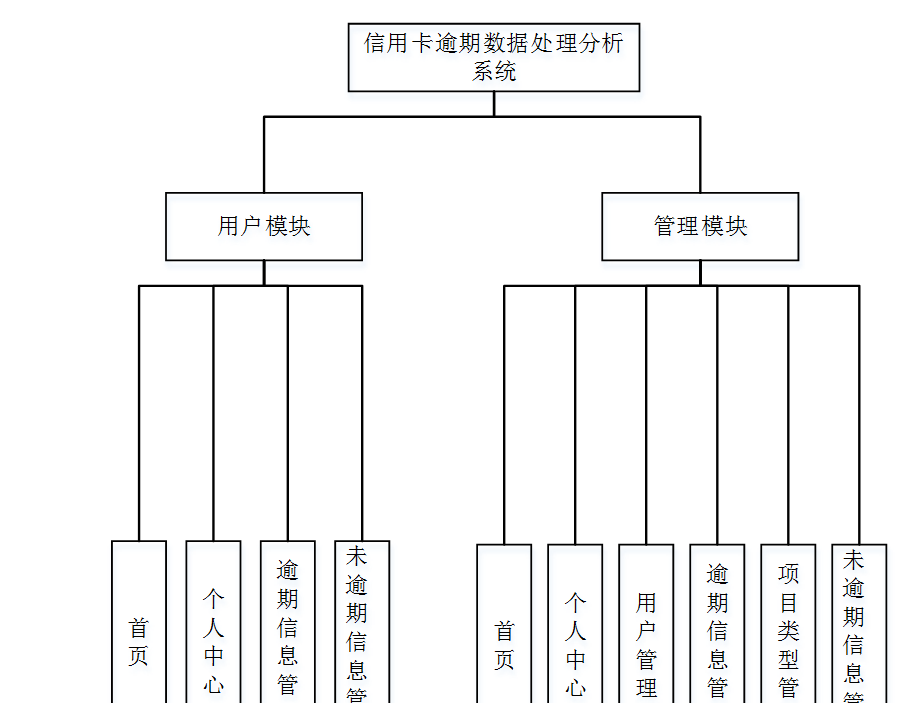

图4-2 系统结构图

### 4.3数据库设计

数据库是计算机信息系统的基础。目前，电脑系统的关键与核心部分就是数据库。数据库开发的优劣对整个系统的质量和速度有着直接影响。

#### 4.3.1 数据库设计原则

数据库的概念结构设计采用实体—联系（E-R）模型设计方法。E-R模型法的组成元素有：实体、属性、联系，E-R模型用E-
R图表示，是提示用户工作环境中所涉及的事物，属性则是对实体特性的描述。在系统设计当中数据库起着决定性的因素。下面设计出这几个关键实体的实体—关系图。

#### 4.3.2 数据库实体

数据模型中的实体（Entity），也称为实例，对应现实世界中可区别于其他对象的“事件”或“事物”。例如，公司中的每个员工，家里中的每个家具。

本系统的E-R图如下图所示：

1、用户信息实体图如图4-3所示：

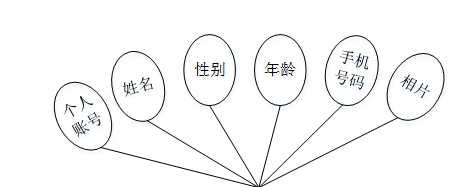

图4-3用户信息实体图

2、逾期信息管理实体图如图4-4所示：

图4-4逾期信息管理实体图

### 管理员功能模块

管理员登录，通过填写注册时输入的用户名、密码、角色进行登录，如图5-1所示。

图5-1管理员登录界面图

管理员登录进入信用卡逾期数据处理分析系统可以查看首页、个人中心、用户管理、逾期信息管理、项目类型管理、未逾期信息管理等信息，如图5-2所示。

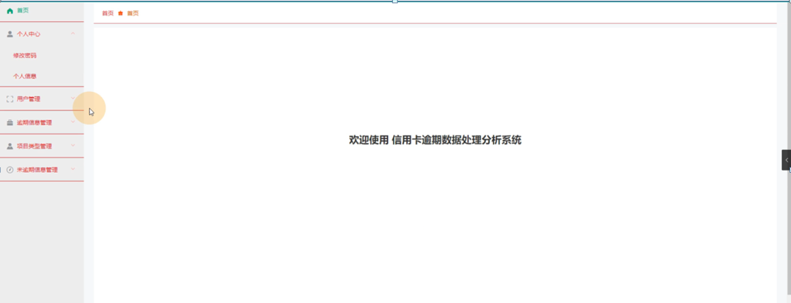

图5-2管理员功能界面图

用户管理，在用户管理页面中可以查看索引、个人账号、姓名、性别、年龄、手机号码、相片等信息，并可根据需要进行修改或删除等操作，如图5-3所示。

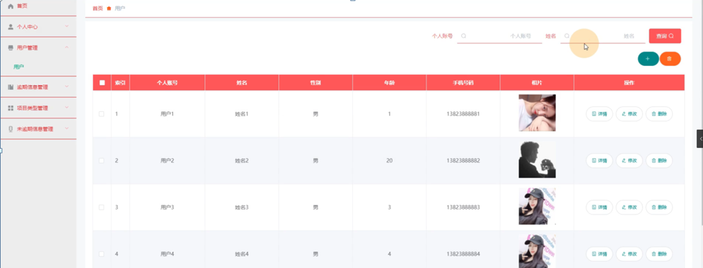

图5-3用户管理界面图

逾期信息管理，在逾期信息管理页面中可以查看索引、信息编号、项目类型、逾期人数、备注、发布日期等信息，并可根据需要进行修改或删除等操作，如图5-4所示。

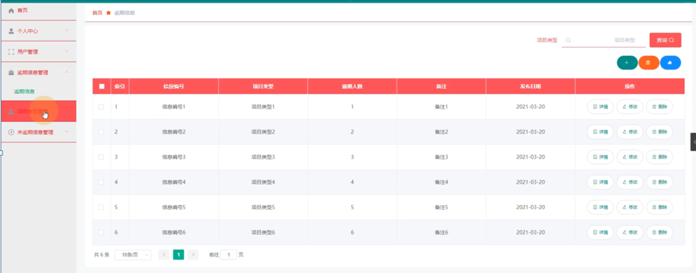

图5-4逾期信息管理界面图

项目类型管理，在项目类型管理页面中可以查看索引、项目类型等信息，并可根据需要进行修改或删除等操作，如图5-5所示。

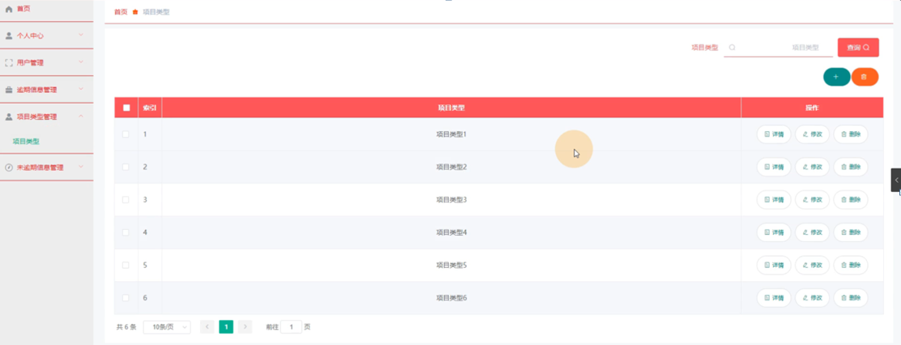

图5-5项目类型管理界面图

未逾期信息管理，在未逾期信息管理页面中可以查看索引、信息编号、项目类型、人数、备注、发布日期等信息，并可根据需要进行修改或删除等操作，如图5-6所示。

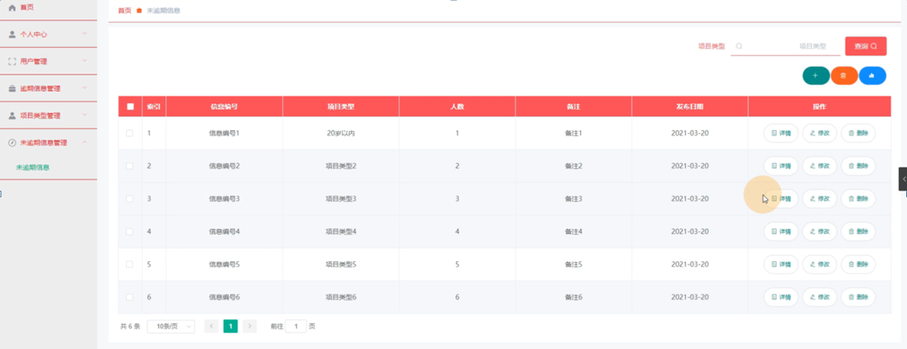

图5-6未逾期信息管理界面图

### 5.2用户功能模块

用户登录进入信用卡逾期数据处理分析系统可以查看首页、个人中心、逾期信息管理、未逾期信息管理等内容，如图5-7所示。

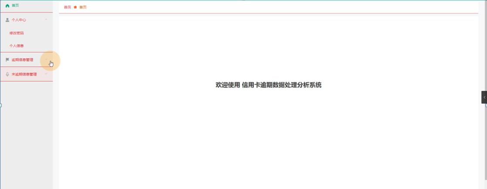

图5-7用户功能界面图

个人中心，在个人中心页面中通过填写个人账号、姓名、性别、年龄、手机号码、相片等信息对个人信息进行修改，如图5-8所示。

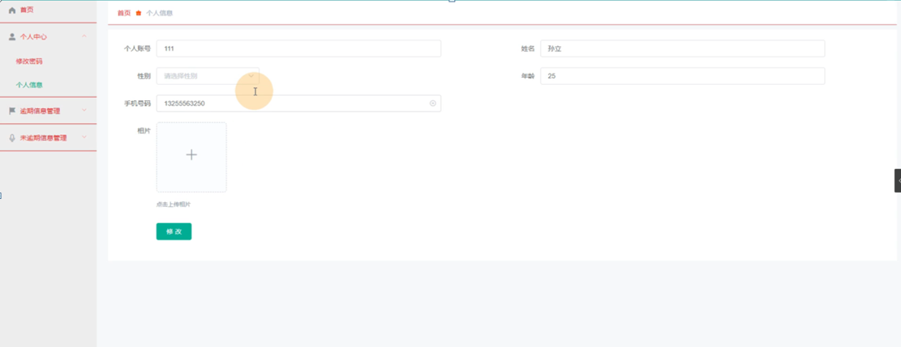

图5-8个人中心界面图

逾期信息管理，在逾期信息管理页面中可以查看索引、信息编号、项目类型、逾期人数、备注、发布日期等信息，如图5-9所示。

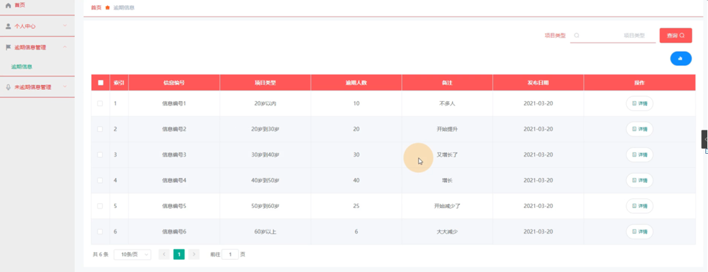

图5-9逾期信息管理界面图

未逾期信息管理，在未逾期信息管理页面中可以查看索引、信息编号、项目类型、人数、备注、发布日期等信息，如图5-10所示。

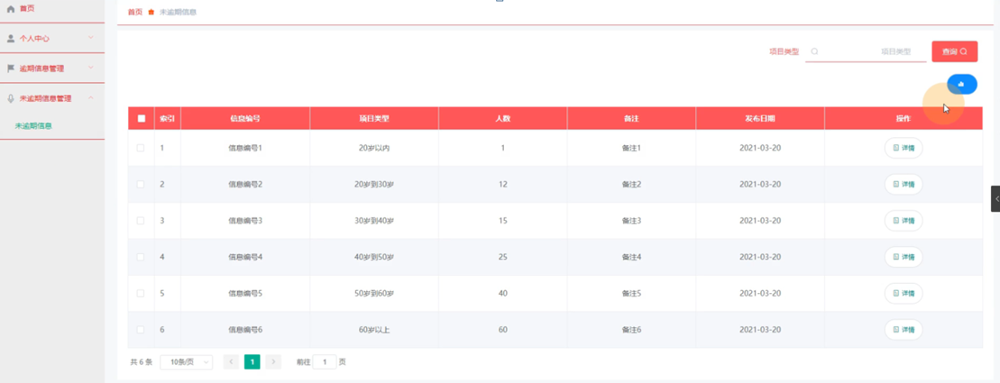

图5-10未逾期信息管理界面图

#### **JAVA** **毕设帮助，指导，源码分享，调试部署**

