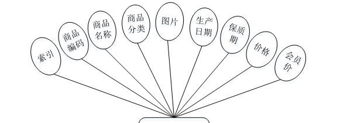
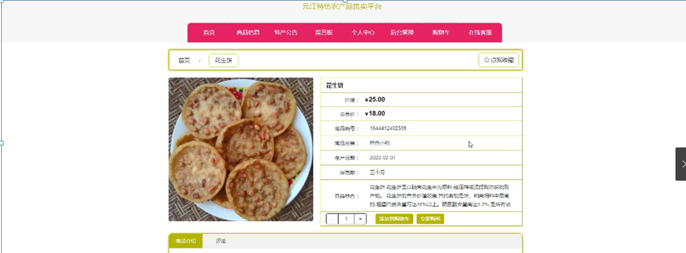

ssm+Vue计算机毕业设计元江特色农产品售卖平台（程序+LW文档）

**项目运行**

**环境配置：**

**Jdk1.8 + Tomcat7.0 + Mysql + HBuilderX** **（Webstorm也行）+ Eclispe（IntelliJ
IDEA,Eclispe,MyEclispe,Sts都支持）。**

**项目技术：**

**SSM + mybatis + Maven + Vue** **等等组成，B/S模式 + Maven管理等等。**

**环境需要**

**1.** **运行环境：最好是java jdk 1.8，我们在这个平台上运行的。其他版本理论上也可以。**

**2.IDE** **环境：IDEA，Eclipse,Myeclipse都可以。推荐IDEA;**

**3.tomcat** **环境：Tomcat 7.x,8.x,9.x版本均可**

**4.** **硬件环境：windows 7/8/10 1G内存以上；或者 Mac OS；**

**5.** **是否Maven项目: 否；查看源码目录中是否包含pom.xml；若包含，则为maven项目，否则为非maven项目**

**6.** **数据库：MySql 5.7/8.0等版本均可；**

**毕设帮助，指导，本源码分享，调试部署** **(** **见文末** **)**

### **总体设计**

根据元江特色农产品售卖平台的功能需求，进行系统设计。

前台功能：用户进入系统可以实现首页，商品信息，特产公告，留言板，个人中心，后台管理，购物车，在线客服等内容进行操作；

后台主要是管理员，管理员功能包括首页，个人中心，用户管理，商品分类管理，商品信息管理，留言板，系统管理，订单管理等；

系统对这些功能进行整合，产生的功能结构图如下图所示：

图3-1 系统总体设计图

### **3.3** **数据库设计**

在每一个系统中数据库有着非常重要的作用，数据库的设计得好将会增加系统的效率以及系统各逻辑功能的实现。所以数据库的设计我们要从系统的实际需要出发，才能使其更为完美的符合系统功能的实现。

#### 3.3.1 数据库E-R图

E-R图为实体-关系图，本系统的E-R图展现了各个实体之间的关系，在本数据库中，各个实体之间的关系均为多对多的关系；

用户管理属性图如图3-2所示。

图3-2用户管理实体属性图

商品信息管理实体属性图如图3-3所示。

图3-3商品信息管理实体属性图

留言板实体属性图如图3-4所示。

图3-4留言板实体属性图

### **系统功能模块**

元江特色农产品售卖平台，在系统首页可以详情首页，商品信息，特产公告，留言板，个人中心，后台管理，购物车，在线客服等内容，并进行详细操作；如图4-1所示。

图4-1系统首页界面图

用户注册，在用户注册页面，用户通过填写用户账号，用户姓名，密码，确认密码，年龄，电话号码等信息进行注册操作，如图4-2所示。

图4-2用户注册界面图

商品信息，在商品信息页面可以详情商品名称，价格，会员价，食品编号，食品分类，生产日期，保质期，商品特色等内容，并进行商品介绍，评论，点我收藏等操作，如图4-3所示。

图4-3商品信息界面图

个人中心，在个人中心页面通过填写用户账号，用户名称，密码，性别，图片，年龄，电话号码，余额，会员等内容进行更新信息，还可以根据需要对我的订单，我的地址，我的收藏进行详细操作，如图4-4所示。

图4-4个人中心界面图

### **4.2** **管理员功能模块**

管理员进行登录，进入系统前在登录页面根据要求填写用户名和密码，选择角色等信息，点击登录进行登录操作，如图4-6所示。

图4-6管理员登录界面图

管理员登录系统后，可以对首页，个人中心，用户管理，商品分类管理，商品信息管理，留言板，系统管理，订单管理等功能进行相应的操作管理，如图4-7所示。

图4-7管理员功能界面图

用户管理，在用户列表可以对索引，用户账号，用户姓名，性别，头像，年龄，电话号码，是否会员等内容进行详情，修改和删除等操作，如图4-8所示。

图4-8用户管理界面图

商品信息管理，在商品信息管理列表可以对索引，商品编码，商品名称，商品分类，图片，生产日期，保质期，价格，会员价等内容进行详情，修改，查看评论和删除操作，如图4-9所示。

图4-9商品信息管理界面图

商品分类管理，在景点分类列表可以对索引，分类信息进行详情，修改和删除操作，如图4-10所示。

图4-10商品分类管理界面图

订单管理，在已支付订单列表可以对索引，订单编号，商品名称，商品图片，购买数量，价格/积分，折扣价格，总价格/总积分，折扣总价格，支付类型，状态，地址，电话，收货人，下单时间等内容进行审核，详情和删除操作，如图4-11所示。

图4-11订单管理界面图

留言板管理，在留言板列表可以对索引，用户名，留言内容，留言图片，回复内容，回复图片等内容进行详情，修改，回复和删除操作，如图4-12所示。

图4-12留言板管理界面图

#### **JAVA** **毕设帮助，指导，源码分享，调试部署**

