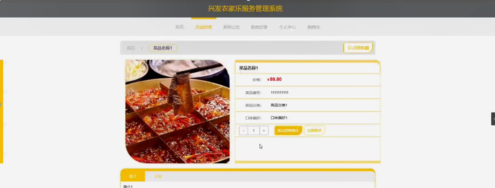
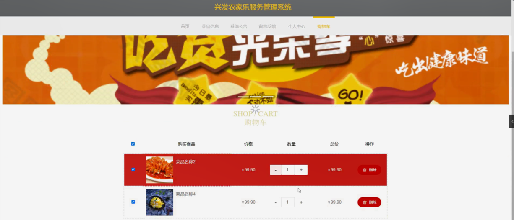
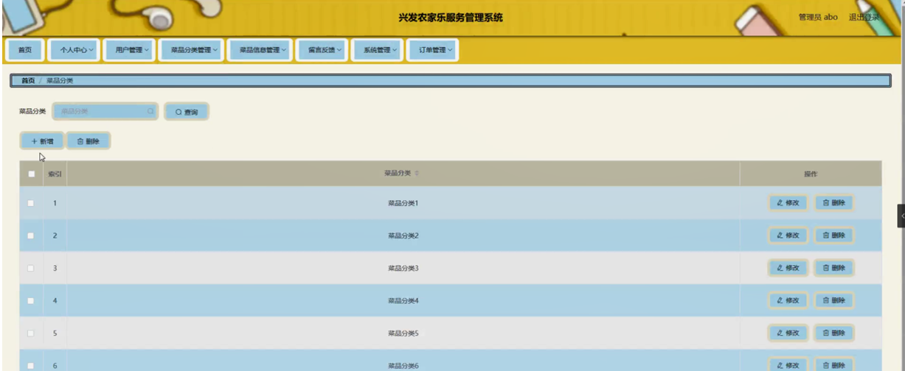

ssm+Vue计算机毕业设计兴发农家乐服务管理系统（程序+LW文档）

**项目运行**

**环境配置：**

**Jdk1.8 + Tomcat7.0 + Mysql + HBuilderX** **（Webstorm也行）+ Eclispe（IntelliJ
IDEA,Eclispe,MyEclispe,Sts都支持）。**

**项目技术：**

**SSM + mybatis + Maven + Vue** **等等组成，B/S模式 + Maven管理等等。**

**环境需要**

**1.** **运行环境：最好是java jdk 1.8，我们在这个平台上运行的。其他版本理论上也可以。**

**2.IDE** **环境：IDEA，Eclipse,Myeclipse都可以。推荐IDEA;**

**3.tomcat** **环境：Tomcat 7.x,8.x,9.x版本均可**

**4.** **硬件环境：windows 7/8/10 1G内存以上；或者 Mac OS；**

**5.** **是否Maven项目: 否；查看源码目录中是否包含pom.xml；若包含，则为maven项目，否则为非maven项目**

**6.** **数据库：MySql 5.7/8.0等版本均可；**

**毕设帮助，指导，本源码分享，调试部署** **(** **见文末** **)**

### 系统功能模块

根据系统功能分析，可以画出系统的功能模块图，系统总体功能如下图所示：

图 4-1 系统总体功能模块图

### 4.2数据库设计

#### 4.2.1 数据库需求分析

管理员：具有最高的管理权限，支持后台管理，对用户信息进行增删改查，对处方信息进行及时更新，还可以管理留言信息，删除一些不健康的留言。

#### 4.2.2 数据库概念结构设计

概念模型是对现实中的问题出现的事物的进行描述，ER图是由实体及其关系构成的图，通过E-R图可以清楚地描述系统涉及到的实体之间的相互关系。

菜品信息实体图如图4-2所示：

图4-2菜品信息实体图

购物车实体图如图4-3所示：

图4-3购物车实体图

用户信息实体图如图4-4所示：

图4-4用户信息实体图

### 前台功能模块

兴发农家乐服务管理系统，在系统首页可以查看首页、菜品信息、系统公告、留言反馈、个人中心、购物车等内容进行详细操作，如图5-1所示。

图5-1系统首页界面图

用户注册，在用户注册页面通过填写用户账号、密码、确认密码、用户姓名、年龄等信息完成注册操作，如图5-2所示。

图5-2用户注册界面图

菜品信息，在菜品信息页面可以查看菜品名称、图片、价格、菜品编号、菜品分类、口味偏好、简介等详细内容，并进行添加到购物车，立即购买，评论或收藏操作，如图5-3所示。

图5-3菜品信息界面图

留言反馈，在留言反馈页面通过输入留言内容，上传图片等信息并提交或重置进行留言操作，还可以对留言信息和图片进行回复操作；如图5-4所示。

图5-4留言反馈界面图

个人中心，在个人中心页面通过填写用户账号、密码、用户姓名、性别、年龄、上传图片、余额等内容进行更新信息，根据需要对我的订单，我的收藏进行相对应操作，如图5-5所示。

图5-5个人中心界面图

购物车，在购物车页面可以查看购买商品，图片、价格、数量、总价等内容，并进行点击购买或删除操作，如图5-6所示。

图5-6购物车界面图

### 5.2管理员功能模块

管理员登录进入系统前在登录页面根据要求填写用户名、密码等信息，点击登录进行登录操作，如图5-7所示。

图5-7管理员登录界面图

管理员登录系统后，可以对首页、个人中心、用户管理、菜品分类管理、菜品信息管理、留言反馈、系统管理、订单管理等功能进行相应的操作管理，如图5-8所示。

图5-8管理员功能界面图

用户管理，在用户管理页面可以对索引、用户账号、用户姓名、性别、年龄、头像等内容进行详情，修改和删除等操作，如图5-9所示。

图5-9用户管理界面图

菜品分类管理，在菜品分类管理页面可以对索引、菜品分类等内容进行修改和删除操作，如图5-10所示。

图5-10菜品分类管理界面图

菜品信息管理，在菜品信息管理页面可以对索引、菜品编号、菜品名称、菜品分类、图片、口味偏好、价格等内容进行详情，修改，查看评论和删除操作，如图5-11所示。

图5-11菜品信息管理界面图

留言反馈，在留言反馈页面可以对索引、用户名、留言内容、留言图片、回复内容、回复图片等内容进行详情，修改，回复和删除操作，如图5-12所示。

图5-12留言反馈界面图

#### **JAVA** **毕设帮助，指导，源码分享，调试部署**

