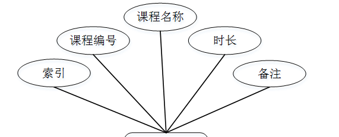

ssm+Vue计算机毕业设计兴澜幼儿园管理系统（程序+LW文档）

**项目运行**

**环境配置：**

**Jdk1.8 + Tomcat7.0 + Mysql + HBuilderX** **（Webstorm也行）+ Eclispe（IntelliJ
IDEA,Eclispe,MyEclispe,Sts都支持）。**

**项目技术：**

**SSM + mybatis + Maven + Vue** **等等组成，B/S模式 + Maven管理等等。**

**环境需要**

**1.** **运行环境：最好是java jdk 1.8，我们在这个平台上运行的。其他版本理论上也可以。**

**2.IDE** **环境：IDEA，Eclipse,Myeclipse都可以。推荐IDEA;**

**3.tomcat** **环境：Tomcat 7.x,8.x,9.x版本均可**

**4.** **硬件环境：windows 7/8/10 1G内存以上；或者 Mac OS；**

**5.** **是否Maven项目: 否；查看源码目录中是否包含pom.xml；若包含，则为maven项目，否则为非maven项目**

**6.** **数据库：MySql 5.7/8.0等版本均可；**

**毕设帮助，指导，本源码分享，调试部署** **(** **见文末** **)**

### 系统结构

系统架构图属于系统设计阶段，系统架构图只是这个阶段一个产物，系统的总体架构决定了整个系统的模式，是系统的基础。兴澜幼儿园管理系统的整体结构设计如图4-2所示。

图4-2 系统结构图

### 4.3. 数据库设计

#### 4.3.1 数据库实体

教室信息管理结构图，如图4-3所示：

图4-3教室信息管理结构图

班级信息管理实体属性图，如图4-4所示：

图4-4班级信息管理实体属性图

课程信息管理实体属性图，如图4-5所示：

图4-5课程信息管理实体属性图

### 管理员功能模块

管理员登录，管理员通过输入账号，密码，选择角色等信息即可进行系统登录，如图5-1所示。

图5-1管理员登录界面图

管理员登录进入兴澜幼儿园管理系统可以查看首页、个人中心、教师管理、保育员管理、幼儿信息管理、教室信息管理、班级信息管理、课程信息管理、排课信息管理、健康监测管理、幼儿出勤管理、收费信息管理、收支统计管理等内容进行详细操作，如图5-2所示。

图5-2管理员功能界面图

教师管理，在教师管理页面可以对索引、教师工号、教师姓名、性别、照片、联系电话、出生年月、民族、籍贯、政治面貌、身份证、入职时间、授课说明、文化程度、专业名称、健康状况、家庭住址、状态等信息进行详情，修改或删除等操作，如图5-3所示。

图5-3教师管理界面图

保育员管理，在保育员管理页面可以对索引、员工编号、员工姓名、性别、照片、出生年月、员工电话、民族、籍贯、政治面貌、身份证、入职时间、文化程度、健康状况、家庭住址、状态等信息进行详情操作，如图5-4所示。

图5-4保育员管理界面图

幼儿信息管理，在幼儿信息管理页面可以对索引、幼儿编号、姓名、性别、血型、出生年月、照片、班级名称、民族、籍贯、身份证号、健康状况、特长、入园时间、家庭住址、联系电话、紧急联系人、学籍状态等信息进行详情，修改或删除等操作，如图5-5所示。

图5-5幼儿信息管理界面图

教室信息管理，在教室信息管理页面可以对索引、教室编号、教室名称、容纳人数、教室图片、教室位置、教室分类等信息进行详情，修改或删除等操作，如图5-6所示。

图5-6教室信息管理界面图

班级信息管理，在班级信息管理页面可以对索引、班级编号、班级名称、负责人1、负责人2、负责人3、教室名称、状态等信息进行详情，修改或删除等操作，如图5-7所示。

图5-7班级信息管理界面图

课程信息管理，在课程信息管理页面可以对索引、课程编号、课程名称、时长、备注等信息进行详情，修改或删除等操作，如图5-8所示。

图5-8课程信息管理界面图

排课信息管理，在排课信息管理页面可以对索引、教师工号、教师姓名、课程名称、学期、学年、星期、节数、奇偶周、班级名称、教师名称等信息进行详情，修改或删除等操作，如图5-9所示。

图5-9排课信息管理界面图

健康监测管理，在健康监测管理页面可以对索引、健康监测、幼儿姓名、班级名称、病情名称、人数、月份、登记时间、员工编号、员工姓名等信息进行详情，修改或删除等操作，如图5-10所示。

图5-10健康监测管理界面图

幼儿出勤管理，在幼儿出勤管理页面可以对索引、幼儿编号、幼儿姓名、性别、班级名称、日期、首次打卡、末次打卡、出勤时间、人数、月份、备注、教师工号、教师姓名等信息进行详情，修改或删除等操作，如图5-11所示。

图5-11幼儿出勤管理界面图

收费信息管理，在收费信息管理页面可以对索引、幼儿编号、幼儿姓名、班级名称、收费金额、收费时间、备注说明、月份等信息进行详情，修改或删除等操作，如图5-12所示。

图5-12收费信息管理界面图

#### **JAVA** **毕设帮助，指导，源码分享，调试部署**

