ssm+Vue计算机毕业设计养生知识平台（程序+LW文档）

**项目运行**

**环境配置：**

**Jdk1.8 + Tomcat7.0 + Mysql + HBuilderX** **（Webstorm也行）+ Eclispe（IntelliJ
IDEA,Eclispe,MyEclispe,Sts都支持）。**

**项目技术：**

**SSM + mybatis + Maven + Vue** **等等组成，B/S模式 + Maven管理等等。**

**环境需要**

**1.** **运行环境：最好是java jdk 1.8，我们在这个平台上运行的。其他版本理论上也可以。**

**2.IDE** **环境：IDEA，Eclipse,Myeclipse都可以。推荐IDEA;**

**3.tomcat** **环境：Tomcat 7.x,8.x,9.x版本均可**

**4.** **硬件环境：windows 7/8/10 1G内存以上；或者 Mac OS；**

**5.** **是否Maven项目: 否；查看源码目录中是否包含pom.xml；若包含，则为maven项目，否则为非maven项目**

**6.** **数据库：MySql 5.7/8.0等版本均可；**

**毕设帮助，指导，本源码分享，调试部署** **(** **见文末** **)**

总体设计

根据养生知识平台的功能需求，进行系统设计。

用户功能：用户进入系统可以实现首页、个人中心、在线咨询管理等进行操作；

后台主要是管理员，管理员功能包括首页、个人中心、养生分类管理、商品分类管理、用户管理、医生管理、在线咨询管理、健康测试管理、养生知识管理、健康菜谱管理、养生商城管理、养生论坛、系统管理、订单管理等；

系统对这些功能进行整合，产生的功能结构图如下：

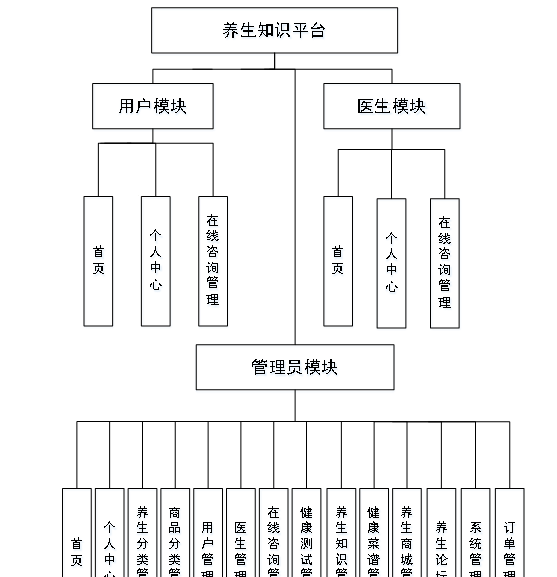

图3-7 系统总体结构图

3.5 数据库设计与实现

在每一个系统中数据库有着非常重要的作用，数据库的设计得好将会增加系统的效率以及系统各逻辑功能的实现。所以数据库的设计我们要从系统的实际需要出发，才能使其更为完美的符合系统功能的实现。

#### **3.5.1** **数据库概念结构设计**

数据库的E-R图反映了实体、实体的属性和实体之间的联系。下面是各个实体以及实体的属性。

管理员信息实体属性图如下所示：

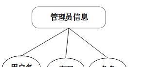

图3-8 管理员信息实体属性图

用户信息实体属性图如下所示：

图3-9用户信息实体属性图

健康菜谱信息实体属性图如下所示：

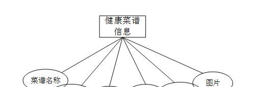

图3-10健康菜谱信息实体属性图

在线咨询信息实体属性图如下所示：

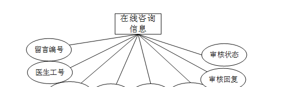

图3-11在线咨询信息实体属性图

### 系统功能模块

养生知识平台，用户进入网站查看首页、医生、健康测试、养生知识、健康菜谱、养生商城、养生论坛、养生公告、个人中心、后台管理、购物车等内容进行操作，如图4-1所示。

图4-1网站首页界面图

用户注册；在用户注册页面中输入用户名、姓名、密码、确认密码、年龄、手机号等内容进行注册操作；如图4-2所示。

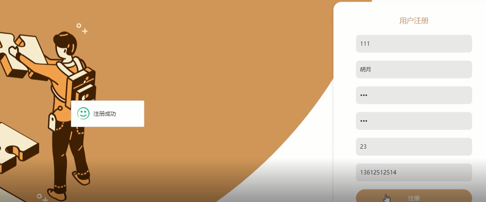

图4-2用户注册界面图

用户登录；在登录页面中输入账号、密码等内容进行登录操作；如图4-3所示。

图4-3用户登录界面图

在个人中心页面中输入用户名、姓名、密码、性别、年龄、手机号、余额等内容进行更新信息，如遇余额不足可进行充值，还能查看我的发布、我的订单、我的地址、我的收藏，进行详细操作，如图4-4
4-5 4-6 4-7所示。

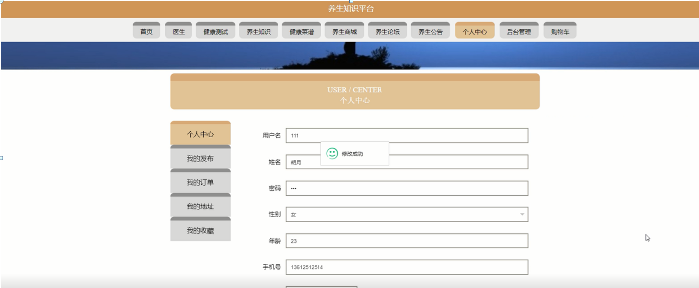

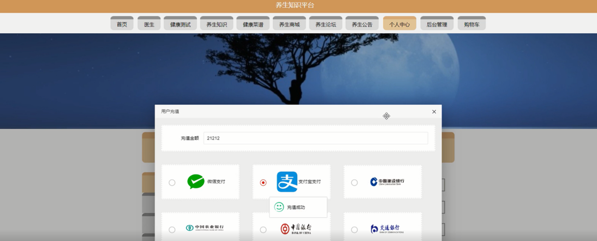

图4-4个人中心界面图

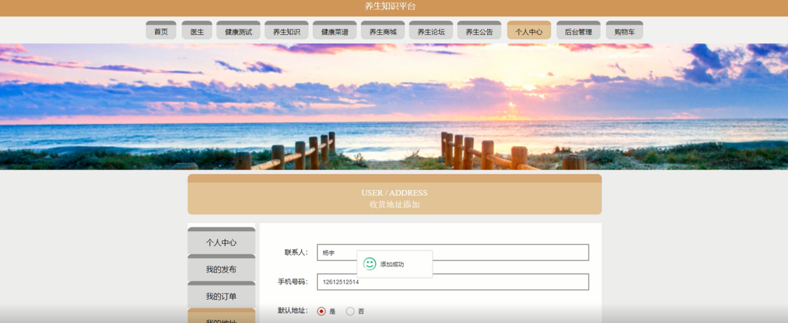

图4-5我的地址界面图

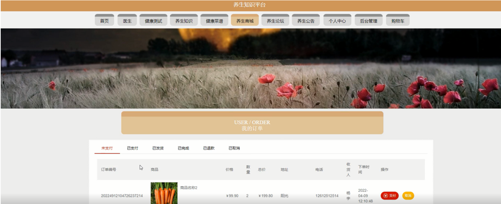

图4-6我的订单界面图

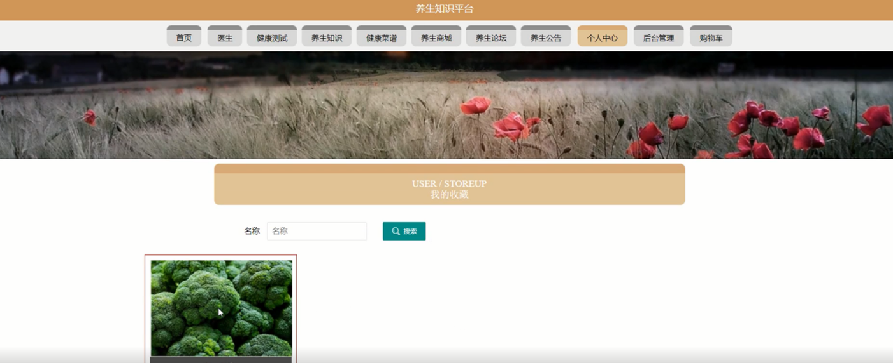

图4-7我的收藏界面图

养生知识；在养生知识页面中可以查看文章标题、养生分类、季节、图片、发布时间等内容进行点赞、收藏或者评论等操作，如图4-8所示。

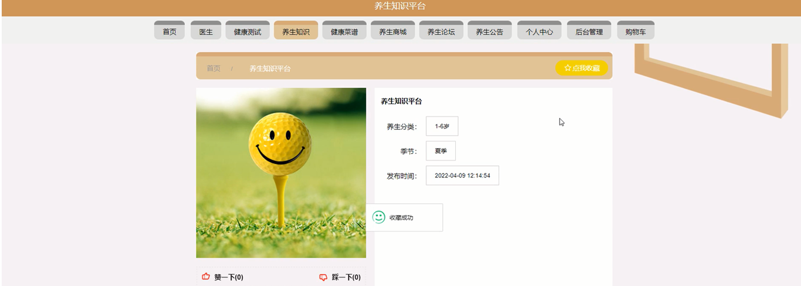

图4-8养生知识界面图

健康菜谱；在健康菜谱页面中可以查看菜谱名称、养生分类、口味、难度、烹饪时长、图片等内容进行点赞、收藏或者评论等操作，如图4-9所示。

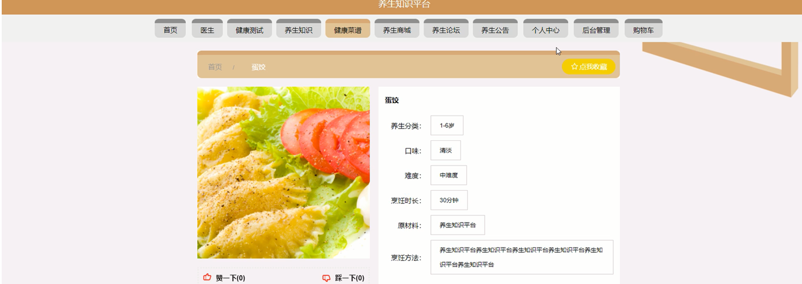

图4-9健康菜谱界面图

养生商城；在养生商城页面中可以查看商品编号、商品名称、商品分类、养生方法、品牌、规格、封面、价格、单限、库存、点击次数等内容进行添加到购物车、立即购买、收藏或者评论等操作，如图4-10所示。

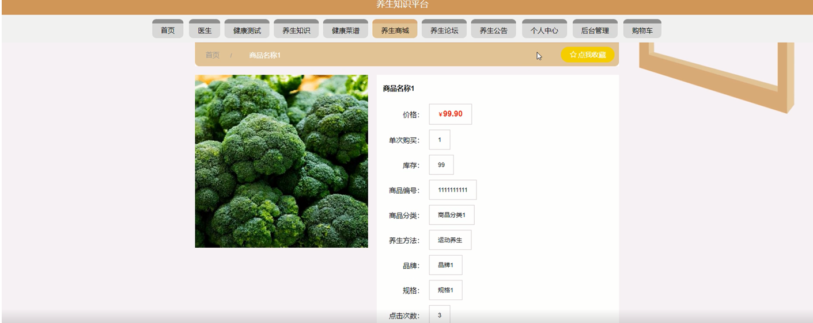

图4-10养生商城界面图

医生；在医生页面中可以查看医生工号、医生姓名、科室、职称、主治方向、性别、医龄、联系电话、头像、坐诊时间、所属医院等信息，如有需要可进行咨询、收藏等操作，如图4-11所示。

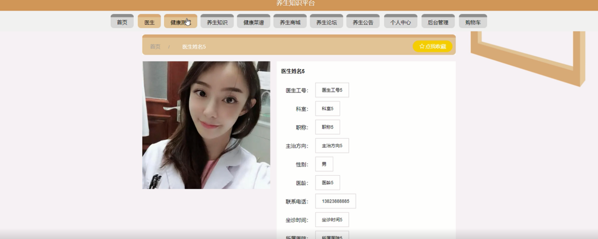

图4-11医生界面图

购物车，在购物车页面查看购买商品、价格、数量、总价等信息，可进行点击购买或删除等操作，如图4-12所示。

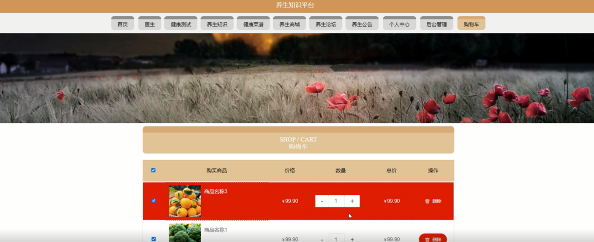

图4-12购物车界面图

**JAVA** **毕设帮助，指导，源码分享，调试部署**

