ssm+Vue计算机毕业设计养老机构服务信息管理（程序+LW文档）

**项目运行**

**环境配置：**

**Jdk1.8 + Tomcat7.0 + Mysql + HBuilderX** **（Webstorm也行）+ Eclispe（IntelliJ
IDEA,Eclispe,MyEclispe,Sts都支持）。**

**项目技术：**

**SSM + mybatis + Maven + Vue** **等等组成，B/S模式 + Maven管理等等。**

**环境需要**

**1.** **运行环境：最好是java jdk 1.8，我们在这个平台上运行的。其他版本理论上也可以。**

**2.IDE** **环境：IDEA，Eclipse,Myeclipse都可以。推荐IDEA;**

**3.tomcat** **环境：Tomcat 7.x,8.x,9.x版本均可**

**4.** **硬件环境：windows 7/8/10 1G内存以上；或者 Mac OS；**

**5.** **是否Maven项目: 否；查看源码目录中是否包含pom.xml；若包含，则为maven项目，否则为非maven项目**

**6.** **数据库：MySql 5.7/8.0等版本均可；**

**毕设帮助，指导，本源码分享，调试部署** **(** **见文末** **)**

### 系统结构设计

整个系统是由多个功能模块组合而成的，要将所有的功能模块都一一列举出来，然后进行逐个的功能设计，使得每一个模块都有相对应的功能设计，然后进行系统整体的设计。

本养老机构服务信息管理系统结构图如图3-2所示。

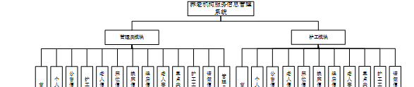

图3-2 养老机构服务信息管理系统结构图

### 3.3 数据库设计

数据库可以说是所有软件的根本，如果数据库存在缺陷，那么会导致系统开发的不顺利、维护困难、用户使用不顺畅等一系列问题，严重时将会直接损害企业的利益，同时在开发完成后，数据库缺陷也更加难以解决。所以必须要对数据库设计重点把握，做到认真细致。因此，数据库设计是这个在线养老机构购票系统的重点要素。

3.3.1概念结构设计

(1) 老人信息管理实体属性图如下图3-3所示

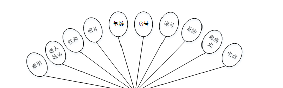

图3-3老人信息管理实体属性图

(2) 护工管理实体属性如下图3-4所示

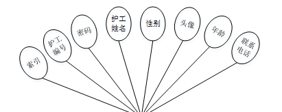

图3-4护工管理实体属性图

(3) 重点关注管理实体属性如下图3-5所示

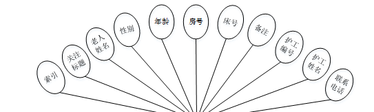

图3-5重点关注管理实体属性图

### 管理员功能模块

管理员登录，通过填写注册时输入的用户名、密码、角色进行登录，如图4-1所示。

图4-1管理员登录界面图

管理员登录进入养老机构服务信息管理系统可以查看首页、个人中心、公告信息管理、护工管理、老人信息管理、床位信息管理、换床信息管理、退房信息管理、老人事故管理、重点关注管理、护工工资管理、请假信息管理、管理员管理等信息进行相应操作，如图4-2所示。

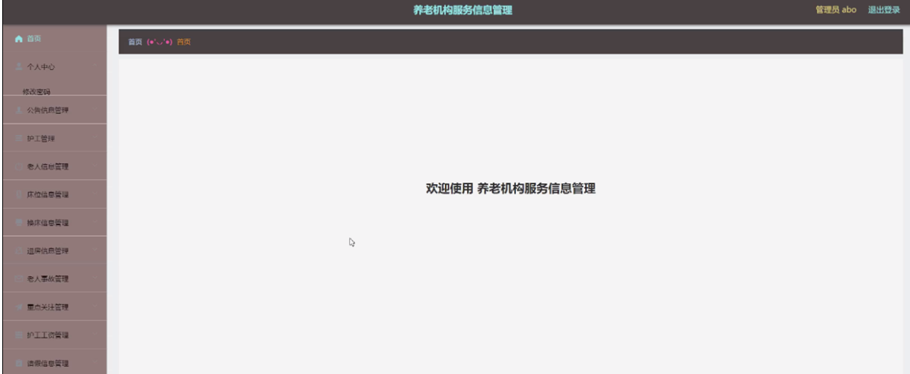

图4-2管理员功能界面图

公告信息管理，在公告信息管理页面中可以查看索引、公告标题、公告类型、图片、发布日期等信息进行修改或删除等操作，如图4-3所示。

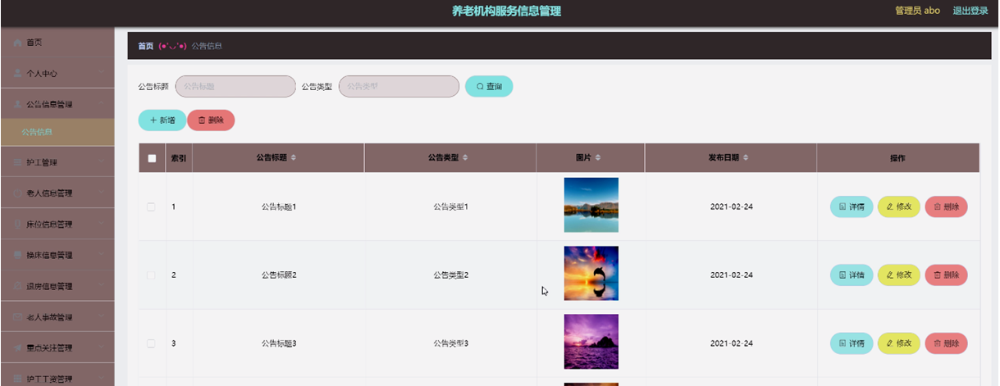

图4-3公告信息管理界面图

护工管理，在护工管理页面中可以查看索引、护工编号、密码、护工姓名、性别、头像、年龄、联系电话等信息进行详情、添加工资、修改或删除等操作，如图4-4所示。

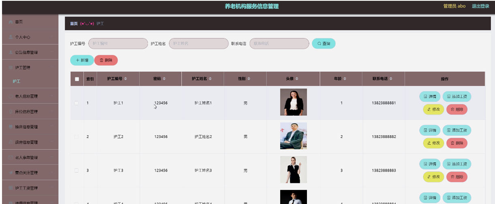

图4-4护工管理界面图

老人信息管理，在老人信息管理页面中可以查看索引、老人姓名、性别、照片、年龄、房号、床号、备注、患病史、电话等信息进行修改或删除等操作，如图4-5所示。

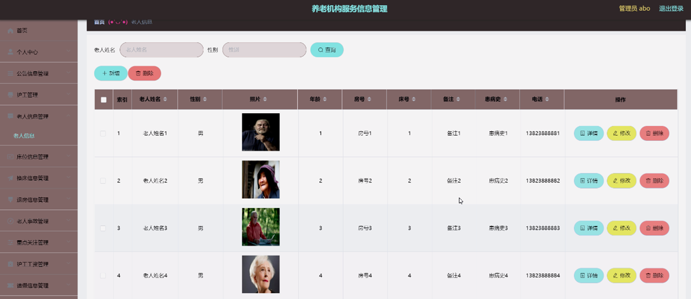

图4-5老人信息管理界面图

床位信息管理，在床位信息管理页面中可以查看索引、房号、床号、图片、位置、备注、状态等信息进行修改或删除等操作，如图4-6所示。

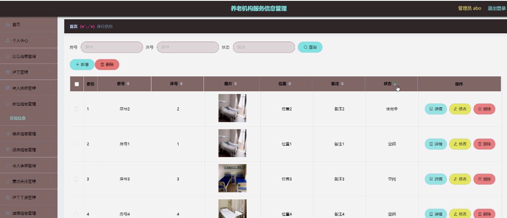

图4-6床位信息管理界面图

换床信息管理，在换床信息管理页面中可以查看索引、年龄、房号、床号、更换房号、更换床号、更换备注、申请日期、护工编号、护工姓名、联系电话、审核回复、审核状态、审核等信息进行修改或删除等操作，如图4-7所示。

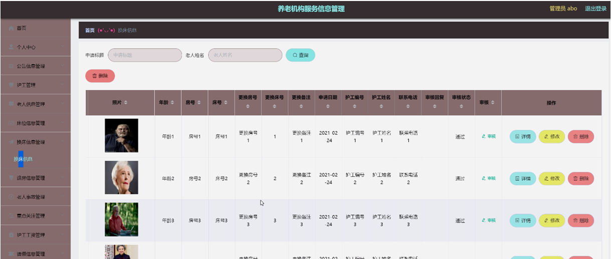

图4-7换床信息管理界面图

退房信息管理，在退房信息管理页面中可以查看索引、退房标题、老人姓名、性别、年龄、房号、床号、退房内容、退房备注、退房日期、护工编号、护工姓名、联系电话、审核回复、审核状态、审核等信息进行修改或删除等操作，如图4-8所示。

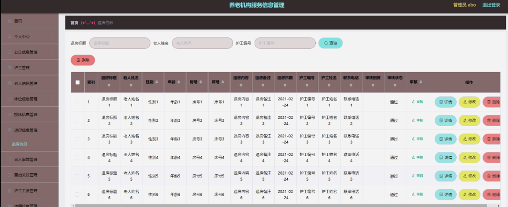

图4-8退房信息管理界面图

老人事故管理，在老人事故管理老人事故管理页面中可以查看索引、事故名称、事故类型、老人姓名、性别、年龄、房号、床号、发生日期、事故备注、护工编号、护工姓名、联系电话、审核回复、审核状态、审核等信息进行修改或删除等操作，如图4-9所示。

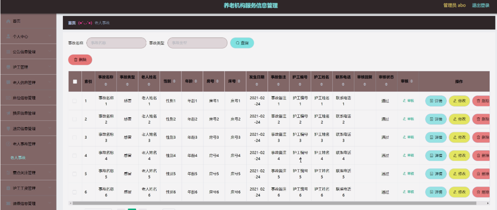

图4-9老人事故管理界面图

重点关注管理，在重点关注管理页面中可以查看索引、关注标题、老人姓名、性别、年龄、房号、床号、备注、护工编号、护工姓名、联系电话等信息进行修改或删除等操作，如图4-10所示。

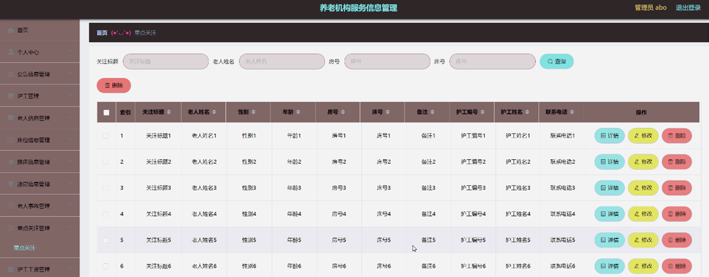

图4-10重点关注管理界面图

护工工资管理，在护工工资管理页面中可以查看索引、工资月份、护工编号、护工姓名、性别、底薪、绩效、加班工资、扣请假、扣五险一金我、其它捐款、其它奖励、补发工资、工资备注等信息进行修改或删除等操作，如图4-11所示。

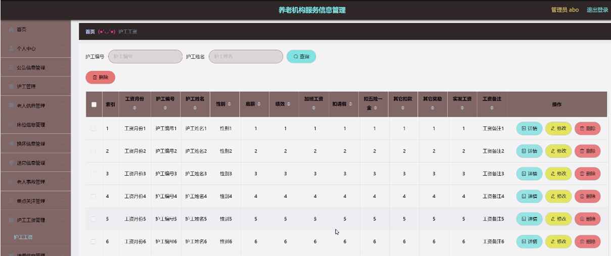

图4-11护工工资管理界面图

请假信息管理，在请假信息管理页面中可以查看索引、请假标题、护工编号、护工姓名、联系电话、请假类型、请假天数、审核回复、审核状态、审核等信息进行修改或删除等操作，如图4-12所示。

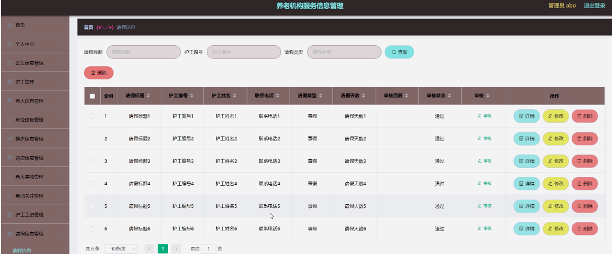

图4-12请假信息管理界面图

**JAVA** **毕设帮助，指导，源码分享，调试部署**

