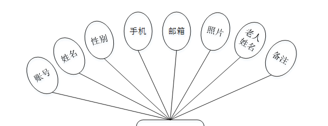

ssm+Vue计算机毕业设计养老机构管理信息系统（程序+LW文档）

**项目运行**

**环境配置：**

**Jdk1.8 + Tomcat7.0 + Mysql + HBuilderX** **（Webstorm也行）+ Eclispe（IntelliJ
IDEA,Eclispe,MyEclispe,Sts都支持）。**

**项目技术：**

**SSM + mybatis + Maven + Vue** **等等组成，B/S模式 + Maven管理等等。**

**环境需要**

**1.** **运行环境：最好是java jdk 1.8，我们在这个平台上运行的。其他版本理论上也可以。**

**2.IDE** **环境：IDEA，Eclipse,Myeclipse都可以。推荐IDEA;**

**3.tomcat** **环境：Tomcat 7.x,8.x,9.x版本均可**

**4.** **硬件环境：windows 7/8/10 1G内存以上；或者 Mac OS；**

**5.** **是否Maven项目: 否；查看源码目录中是否包含pom.xml；若包含，则为maven项目，否则为非maven项目**

**6.** **数据库：MySql 5.7/8.0等版本均可；**

**毕设帮助，指导，本源码分享，调试部署** **(** **见文末** **)**

### 系统体系结构

养老机构管理信息系统的结构图4-1所示：

图4-1 系统结构

登录系统结构图，如图4-2所示：

图4-2 登录结构图

系统结构图，如图4-3所示：

图4-3 系统结构图

### 4.2 数据库实体设计

数据库的功能就是对系统中所有的数据进行存储和管理。所有的数据可以在数据库中产时间的进行存储，方便用户的使用。而且所有的数据库中的数据也应该具有一定的共享性，任何的系统可以对一些数据进行使用，同时还应该保持一定的独立性，每一个数据库中的数据都有很强的安全性，可以被很好的存放到数据库，没有进行身份的验证是不能对这些数据进行查看和使用的。数据库的设计需要明确每一个实体之间的联系，系统的E-
R图如下图所示：：

管理员实体主要存储管理信息包括用户名、密码、角色属性。管理员信息属性图如图4-4所示。

图4-4 管理员信息实体属性图

用户信息主要包括账号、姓名、性别、手机、邮箱、照片、老人姓名、备注等属性，用户信息属性图如图4-5所示。

图4-5用户信息实体属性图

老人信息管理实体属性主要包括索引、老人姓名、性别、照片、年龄、其他、联系电话、账号、姓名、手机等属性。老人信息管理实体属性图如图4-6所示。

图4-6老人信息管理实体属性图

家属预约管理属性主要包括索引、账号、姓名、老人姓名、预约时间、审核回复、审核状态等属性。家属预约管理实体属性图如图4-7所示。

图4-7家属预约管理实体属性图

### 系统功能模块

养老机构管理信息系统，在系统首页可以查看首页、机构简介、养老资讯、留言反馈、个人中心、后台管理、在线客服等内容，如图5-1所示。

图5-1系统首页界面图

机构简介，在机构简介页面可以查看标题、发布时间、封面等信息，如图5-2所示。

图5-2机构简介界面图

养老资讯，在养老资讯页面可以查看标题、简介、图片等信息，如图5-3所示。

图5-3养老资讯界面图

留言反馈，在留言反馈页面通过输入留言内容并立即提交，如图5-4所示。

图5-4留言反馈界面图

个人中心，在个人中心页面通过填写账号、密码、姓名、性别、手机、邮箱、老人姓名、备注等信息进行更新信息，如图5-5所示。

图5-5个人中心界面图

### 5.2管理员功能模块

管理员登录，管理员通过输入账号、密码、角色等信息即可进行系统登录，如图5-6所示。

图5-6管理员登录界面图

管理员登录进入养老机构管理信息系统可以查看首页、个人中心、用户管理、老人信息管理、健康信息管理、膳食信息管理、家属预约管理、机构简介管理、留言板管理、系统管理等内容，如图5-7所示。

图5-7管理员功能界面图

用户管理，在用户管理页面可以查看索引、账号、姓名、性别、手机、邮箱、照片、老人姓名、备注、审核回复、审核状态、审核等信息，并可根据需要进行添加、修改或删除等操作，如图5-8所示。

图5-8用户管理界面图

老人信息管理，在老人信息管理页面可以查看索引、老人姓名、性别、照片、年龄、其他、联系电话、账号、姓名、手机等信息，并可根据需要进行健康信息、膳食信息、修改或删除等操作，如图5-9所示。

图5-9老人信息管理界面图

健康信息管理，在健康信息管理页面可以查看索引、账号、姓名、老人姓名、添加时间等信息，并可根据需要进行修改或删除等操作，如图5-10所示。

图5-10健康信息管理界面图

膳食信息管理，在膳食信息管理页面可以查看索引、账号、姓名、老人姓名、添加时间等信息，并可根据需要进行修改或删除等操作，如图5-11所示。

图5-11膳食信息管理界面图

家属预约管理，在家属预约管理页面可以查看索引、账号、姓名、老人姓名、预约时间、审核回复、审核状态、审核等信息，如图5-12所示。

图5-12家属预约管理界面图

#### **JAVA** **毕设帮助，指导，源码分享，调试部署**

