ssm+Vue计算机毕业设计养老院管理信息系统（程序+LW文档）

**项目运行**

**环境配置：**

**Jdk1.8 + Tomcat7.0 + Mysql + HBuilderX** **（Webstorm也行）+ Eclispe（IntelliJ
IDEA,Eclispe,MyEclispe,Sts都支持）。**

**项目技术：**

**SSM + mybatis + Maven + Vue** **等等组成，B/S模式 + Maven管理等等。**

**环境需要**

**1.** **运行环境：最好是java jdk 1.8，我们在这个平台上运行的。其他版本理论上也可以。**

**2.IDE** **环境：IDEA，Eclipse,Myeclipse都可以。推荐IDEA;**

**3.tomcat** **环境：Tomcat 7.x,8.x,9.x版本均可**

**4.** **硬件环境：windows 7/8/10 1G内存以上；或者 Mac OS；**

**5.** **是否Maven项目: 否；查看源码目录中是否包含pom.xml；若包含，则为maven项目，否则为非maven项目**

**6.** **数据库：MySql 5.7/8.0等版本均可；**

**毕设帮助，指导，本源码分享，调试部署** **(** **见文末** **)**

### 系统体系结构

养老院管理信息系统的结构图4-1所示：

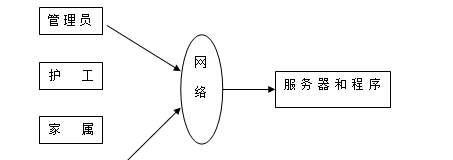

图4-1 系统结构

登录系统结构图，如图4-2所示：

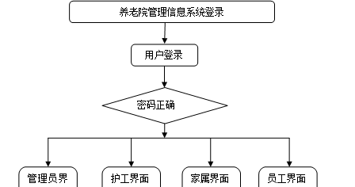

图4-2 登录结构图

管理员结构图，如图4-3所示。

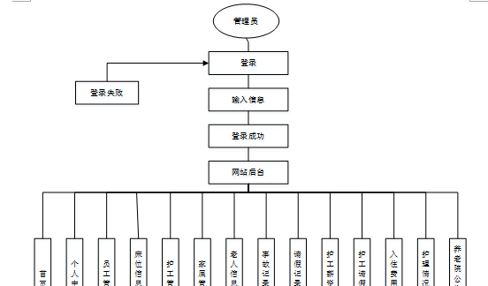

图4-3 管理员结构图

###

### 4.3 数据库设计原则

学习编程，我们都知道数据库设计是基于需要设计的系统功能，我们需要建立一个数据库关系模型，用于存储数据信息，这样当我们在程序中时，就没有必要为程序页面添加数据，从而提高系统的效率。数据库存储了很多信息，可以说是信息管理系统的核心和基础，数据库还提供了添加、删除、修改和检查，使系统能够快速找到自己想要的信息，而不是在程序代码中找到。数据库中信息表的每个部分根据一定的关系精确地组合，排列和组合成数据表。

通过养老院管理信息系统的功能进行规划分成几个实体信息，实体信息将通过ER图进行说明，本系统的主要实体图如下：

管理员信息属性图如图4-5所示。

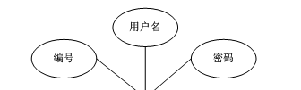

图4-5 管理员信息实体属性图

家属信息管理实体属性图如图4-6所示。

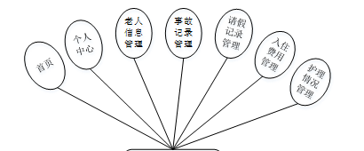

图4-6家属信息属性图

管理员系统菜单实体属性图如图4-7所示。

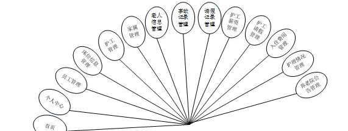

图4-7管理员系统菜单实体属性图

老人信息管理实体属性图如图4-8所示。

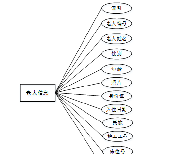

图4-8老人信息管理实体属性图

### 系统功能模块

养老院管理信息系统，在系统首页可以查看首页、老人信息、护理情况、养老院公告、我的、跳转到后台等内容，如图5-1所示。

图5-1系统功能界面图

老人信息，在老人信息页面可以查看老人姓名、标题、家属账号、护工工号、最近情况等详细内容，如图5-2所示。

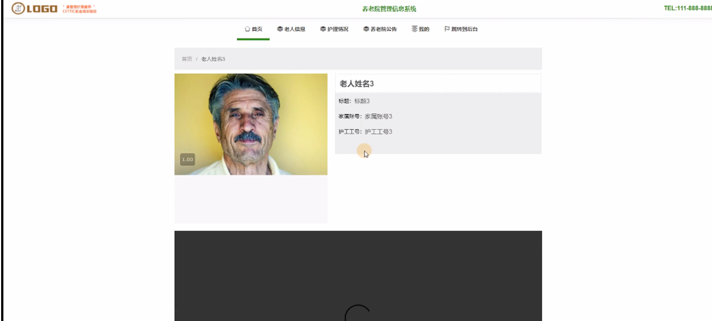

图5-2老人信息界面图

家属注册，在家属注册页面通过填写家属账号、密码、姓名、手机号、身份证、关系、家庭住址等信息完成注册，如图5-3所示。在个人中心页面通过填写家属账号、密码、姓名、手机号、身份证、关系、家庭住址、上传图片等信息进行信息更新，如图5-4所示。

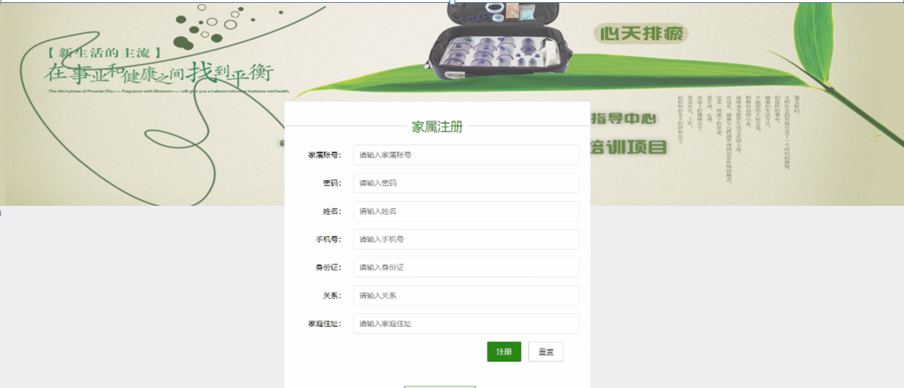

图5-3家属注册界面图

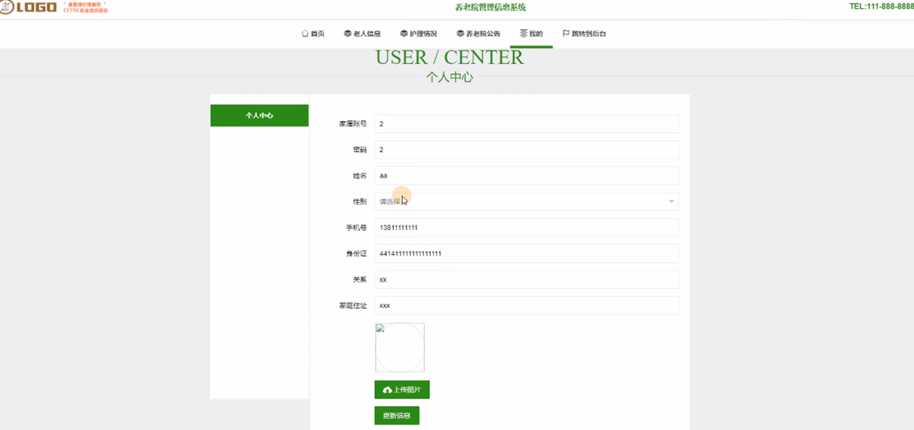

图5-4个人中心界面图

### 5.2管理员功能模块

管理员登录，通过填写注册时输入的用户名、密码、角色进行登录，如图5-5所示。

图5-5管理员登录界面图

管理员登录进入养老院管理信息系统可以查看首页、个人中心、员工管理、床位信息管理、护工管理、家属管理、老人信息管理、事故记录管理、请假记录管理、护工薪资管理、护工请假管理、入住费用管理、护理情况管理、养老院公告管理等信息，如图5-6所示。

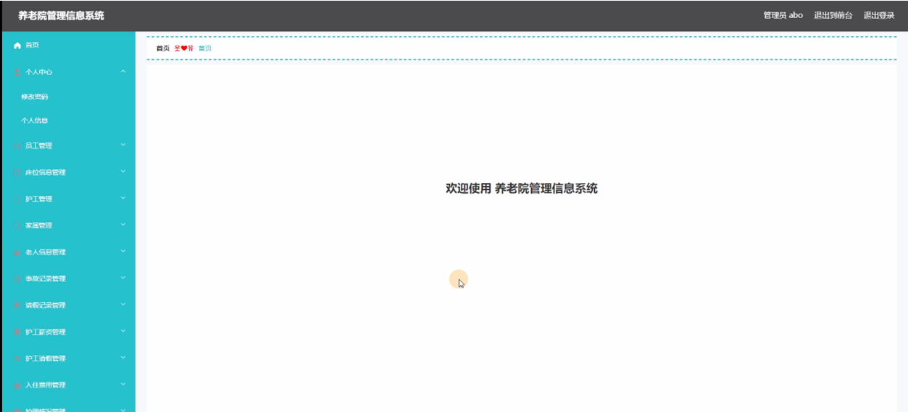

图5-6管理员系统功能界面图

员工管理，在员工管理页面中可以查看索引、工号、密码、员工姓名、性别、头像、手机号等信息，并可根据需要进行修改或删除等操作，如图5-7所示。

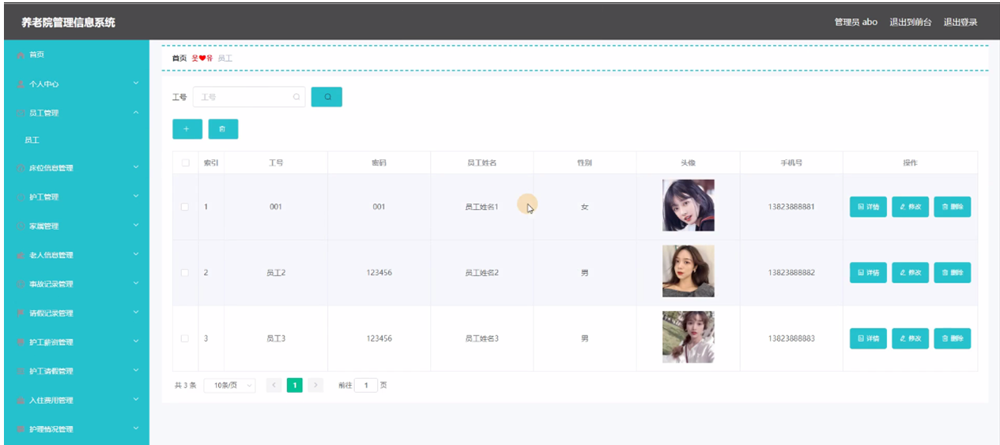

图5-7员工管理界面图

床位信息管理，在床位信息管理页面中可以查看索引、床位号、位置等信息，并可根据需要进行修改或删除等操作，如图5-8所示。

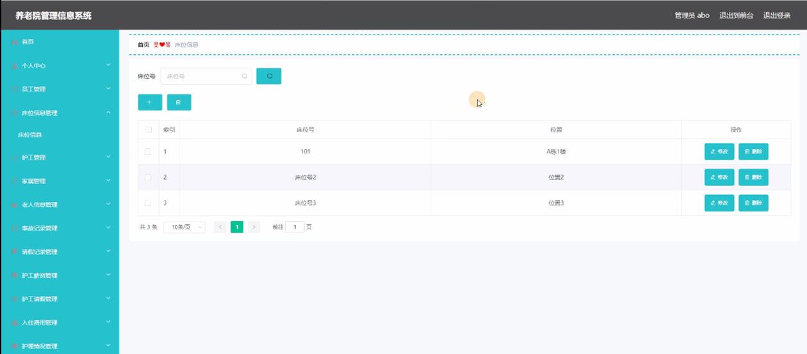

图5-8床位信息管理界面图

护工管理，在护工管理页面中可以查看索引、护工工号、密码、护工姓名、性别、头像、手机号等信息，并可根据需要进行护工请假、护工薪资、修改或删除等详细操作，如图5-9所示。

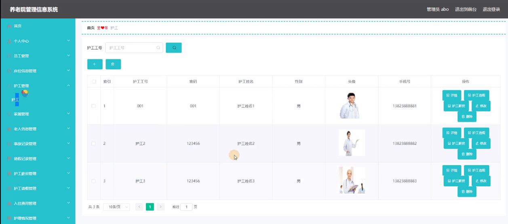

图5-9护工管理界面图

家属管理，在家属管理页面中可以查看索引、家属账号、密码、姓名、性别、手机号、身份证、关系、家庭住址、头像等内容，并且根据需要进行修改或删除等详细操作，如图5-10所示。

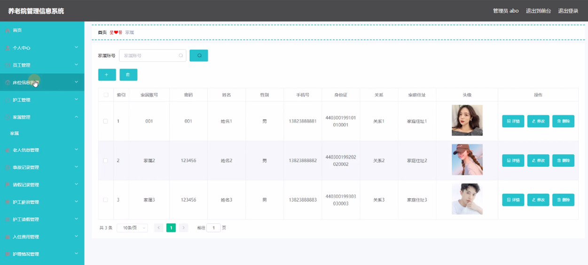

图5-10家属管理界面图

老人信息管理，在老人信息管理页面中可以查看索引、老人编号、老人姓名、性别、年龄、照片、身份证、入住日期、民族、护工工号、床位号、家属账号等内容，并且根据需要进行费用登记、修改或删除等详细操作，如图5-11所示。

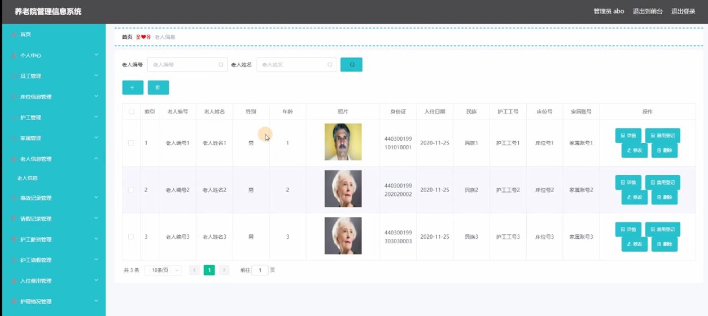

图5-11老人信息管理界面图

事故记录管理，在事故记录管理页面中可以查看索引、事故编号、老人姓名、家属账号、发生时间、事故情况、解决情况等内容，并且根据需要进行修改或删除等详细操作，如图5-12所示。

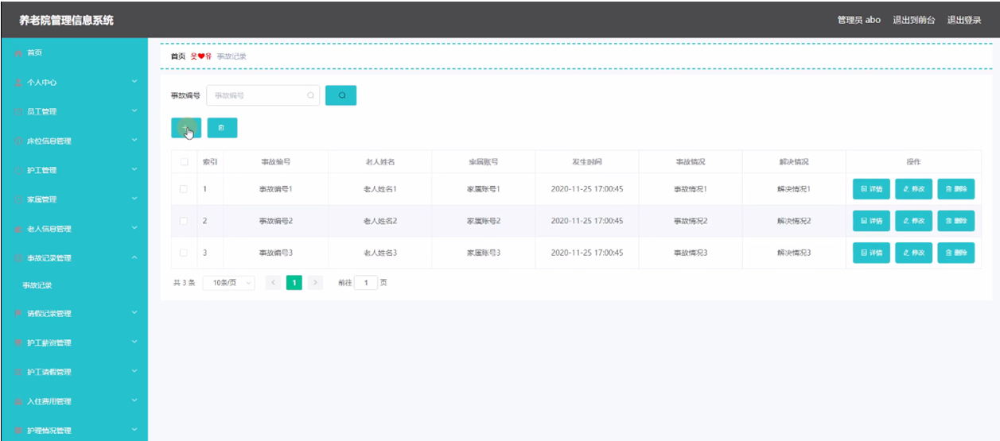

图5-12事故记录管理界面图

**JAVA** **毕设帮助，指导，源码分享，调试部署**

