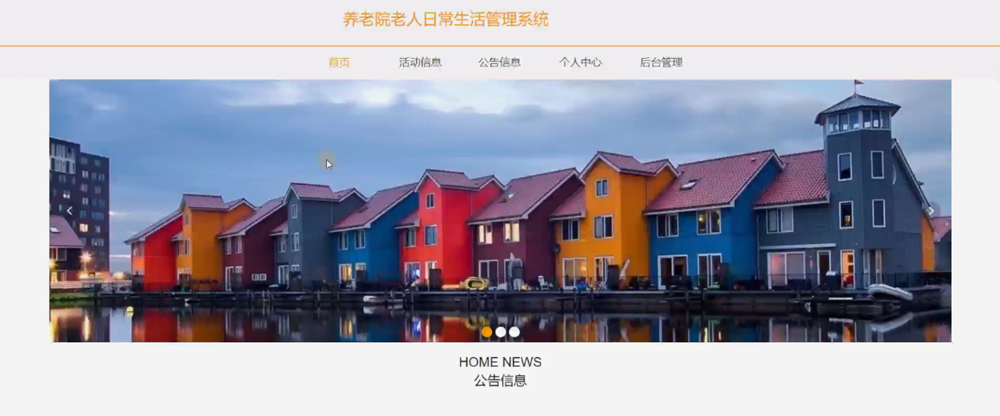
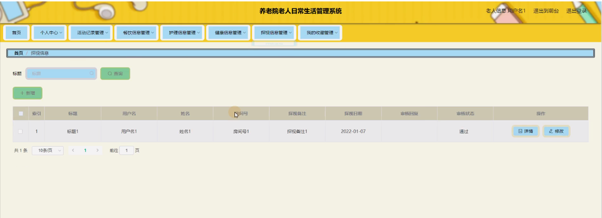

ssm+Vue计算机毕业设计养老院老人日常生活管理系统（程序+LW文档）

**项目运行**

**环境配置：**

**Jdk1.8 + Tomcat7.0 + Mysql + HBuilderX** **（Webstorm也行）+ Eclispe（IntelliJ
IDEA,Eclispe,MyEclispe,Sts都支持）。**

**项目技术：**

**SSM + mybatis + Maven + Vue** **等等组成，B/S模式 + Maven管理等等。**

**环境需要**

**1.** **运行环境：最好是java jdk 1.8，我们在这个平台上运行的。其他版本理论上也可以。**

**2.IDE** **环境：IDEA，Eclipse,Myeclipse都可以。推荐IDEA;**

**3.tomcat** **环境：Tomcat 7.x,8.x,9.x版本均可**

**4.** **硬件环境：windows 7/8/10 1G内存以上；或者 Mac OS；**

**5.** **是否Maven项目: 否；查看源码目录中是否包含pom.xml；若包含，则为maven项目，否则为非maven项目**

**6.** **数据库：MySql 5.7/8.0等版本均可；**

**毕设帮助，指导，本源码分享，调试部署** **(** **见文末** **)**

系统功能结构图

系统功能结构图是系统设计阶段，系统功能结构图只是这个阶段一个基础，整个系统的架构决定了系统的整体模式，是系统的根据。养老院老人日常生活管理系统的整个设计结构如图3-1所示。

图3-1系统功能结构图

### 数据库设计

信息管理系统的效率和实现的效果完全取决于数据库结构设计的好坏。为了保证数据的完整性，提高数据库存储的效率，那么统一合理地设计数据库结构是必要的。数据库设计一般包括如下几个步骤：

（1）根据用户需求，确定数据库信息进行保存

对用户的需求分析是数据库设计的第一阶段，用户的需求调研，熟悉企业运作流程，系统要求，这些都是以概念模型为基础的。

（2）设计数据的概念模型

概念模型与数据建模用户的观点一致，用于信息世界的建模工具。通过E-R图可以清楚地描述系统涉及到的实体之间的相互关系。

护理人员管理实体图如图4-1所示：

图4-1护理人员管理实体图

活动信息管理实体图如图4-2所示：

图4-2活动信息管理实体图

### 系统功能模块

养老院老人日常生活管理系统，在系统首页可查看首页、活动信息、公告信息、个人中心、后台管理等内容，如图5-1所示。

图5-1系统首页界面图

用户注册，用户通过输入用户名、密码、姓名、年龄、患病史、房间号、身份证、联系人、联系电话、家庭住址等内容进行注册，注册完通过输入账号、密码进行登录进入系统，如图5-2所示。

图5-2用户注册、登录界面图

活动信息，用户在活动信息页面可查看活动名称、活动图片、活动类型、活动地点、活动时间、活动人数、活动内容等内容，还可进行收藏或参与等操作，如图5-3所示。

图5-3活动信息界面图

个人中心，用户在个人中心页面可通过输入用户名、密码、姓名、性别、上传图片、年龄、患病史、房间号、身份证、联系人、联系电话、家庭住址等内容进行更新信息或查看我的收藏等内容，如图5-4所示。

图5-4个人中心界面图

5.2用户功能模块

用户进入系统后台可查看个人中心、活动记录管理、餐饮信息管理、护理信息管理、健康信息管理、探视信息管理、我的收藏管理等内容，如图5-5所示。

图5-5用户功能界面图

活动记录管理，用户可在活动记录管理页面查看活动名称、活动类型、活动图片、活动地点、活动时间、报名日期、报名备注、用户名、姓名、房间号、审核回复、审核状态等内容，还可进行修改等操作，如图5-6所示。

图5-6活动记录管理界面图

餐饮信息管理，用户可在餐饮信息管理页面查看标题、用户名、姓名、性别、年龄、患病史、房间号、送餐类型、送餐时间、餐饮备注、工号、电话等内容，如图5-7所示。

图5-7餐饮信息管理界图面

护理信息管理，用户可在护理信息管理页面查看护理标题、用户名、姓名、房间号、年龄、患病史、护理项目、护理时间、护理备注、工号、电话等内容，如图5-8所示。

图5-8护理信息管理界面图

探视信息管理，用户可在探视信息管理页面查看标题、用户名、姓名、房间号、探视备注、探视日期、审核回复、审核状态等内容，还可进行新增或修改等操作，如图5-9所示。

图5-9探视信息管理界面图

5.3护理人员功能模块

护理人员通过登录进入系统可查看个人中心、老人信息管理、活动记录管理、餐饮信息管理、护理信息管理、健康信息管理、探视信息管理等内容，如图5-10所示。

图5-10护理人员功能界面图

老人信息管理，护理人员可在老人信息管理页面查看用户名、姓名、性别、照片、年龄、患病史、房间号、身份证、联系人、联系电话、家庭住址等内容，还可进行送餐等操作，如图5-11所示。

图5-11老人信息管理界面图

活动记录管理，护理人员可在活动记录管理页面查看活动名称、活动类型、活动图片、活动地点、活动时间、报名日期、报名备注、用户名、姓名、房间号、审核回复、审核状态等内容，如图5-12所示。

图5-12活动记录管理界面图

#### **JAVA** **毕设帮助，指导，源码分享，调试部署**

