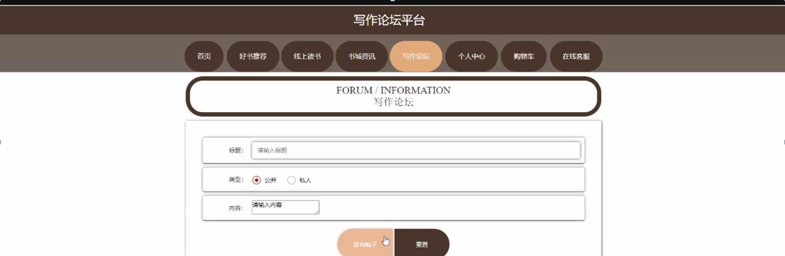
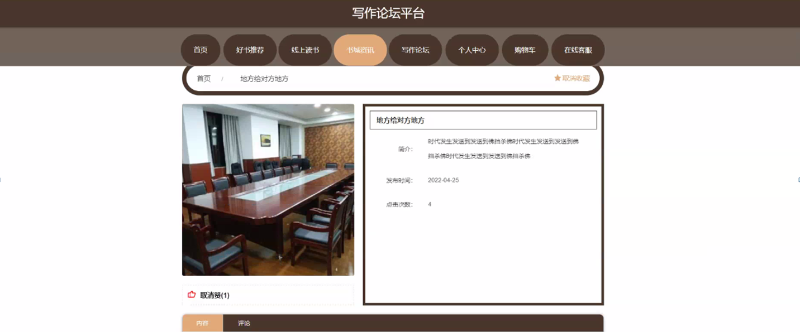
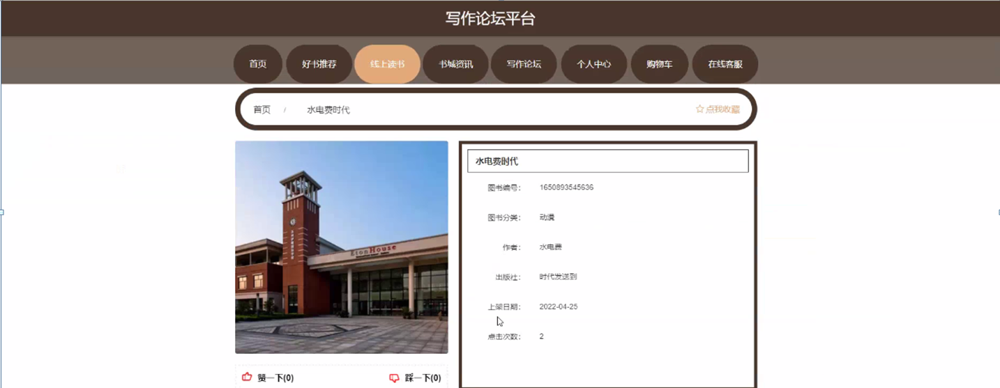
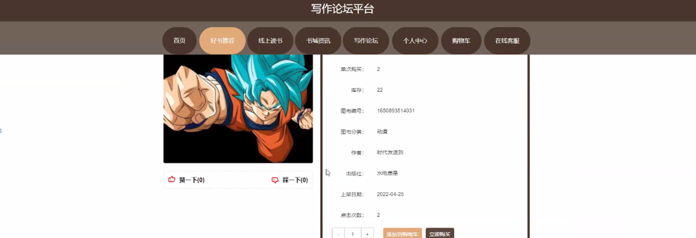
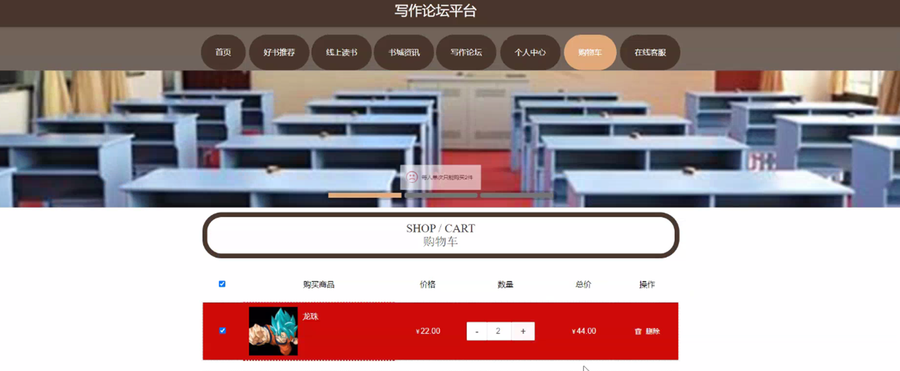
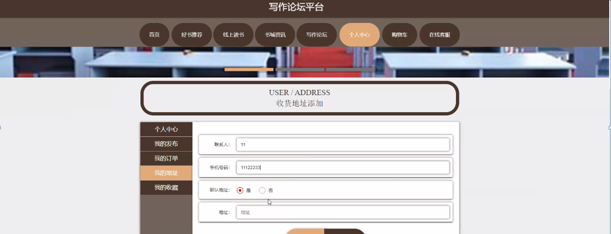
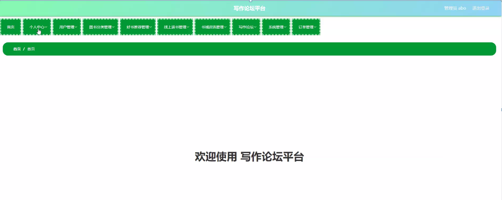
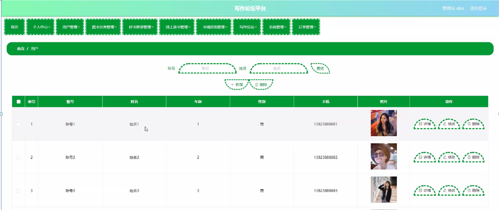
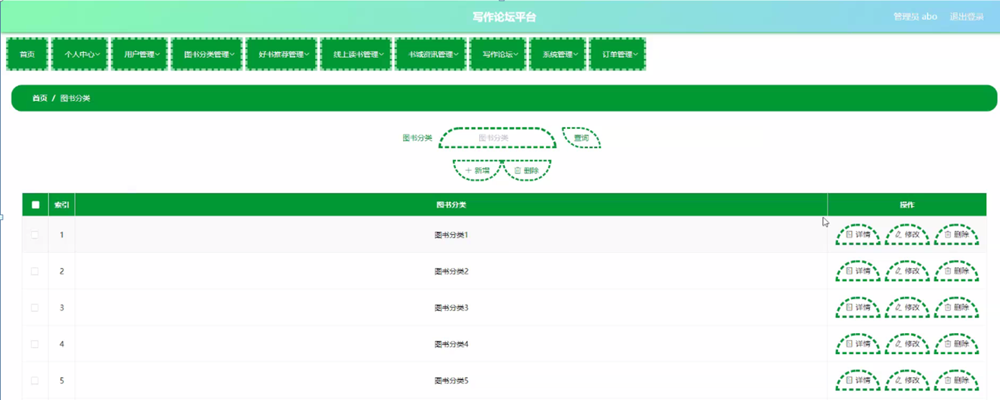

ssm+Vue计算机毕业设计写作论坛平台（程序+LW文档）

**项目运行**

**环境配置：**

**Jdk1.8 + Tomcat7.0 + Mysql + HBuilderX** **（Webstorm也行）+ Eclispe（IntelliJ
IDEA,Eclispe,MyEclispe,Sts都支持）。**

**项目技术：**

**SSM + mybatis + Maven + Vue** **等等组成，B/S模式 + Maven管理等等。**

**环境需要**

**1.** **运行环境：最好是java jdk 1.8，我们在这个平台上运行的。其他版本理论上也可以。**

**2.IDE** **环境：IDEA，Eclipse,Myeclipse都可以。推荐IDEA;**

**3.tomcat** **环境：Tomcat 7.x,8.x,9.x版本均可**

**4.** **硬件环境：windows 7/8/10 1G内存以上；或者 Mac OS；**

**5.** **是否Maven项目: 否；查看源码目录中是否包含pom.xml；若包含，则为maven项目，否则为非maven项目**

**6.** **数据库：MySql 5.7/8.0等版本均可；**

**毕设帮助，指导，本源码分享，调试部署** **(** **见文末** **)**

总体设计

写作论坛平台采用了结构化开发的方法。这种开发方法的优点是控制性比较强，开发过程中采用了结构化和模块化的设计思想，自顶向下，从总体到部分，合理划分系统的结构和模块。结构化开发时使用模块式开发，各模块之间互不影响，方便系统的开发与管理。

本系统的设计是基于
B/S架构的三层体系结构，也就是浏览器和服务器结构。计算机技术发展的速度非常快，以前的设计结构都以C/S的模式为主，也就是前台和后台模式。但随着网页技术的发展，越来越多的用户习惯于使用浏览器。现在的网页技术可以在浏览器中实现非常漂亮的效果，以前的单一低调的前台页面已经无法满足用户的需求。在B/S这种结构下，技术人员可以很轻松的设计出用户所需要的工作界面，页面代码通过浏览器进行解析展示，在浏览器中不做过多的事务逻辑的处理。主要的事务逻辑放在后台进行处理。这样用户的电脑就不会承载过多的东西，只需要浏览器展示即可。对于开发人员也很方便进行系统的维护和升级。开发人员只需要在服务端进行系统的维护就可以了。使用Java这样的跨平台性非常好的语言，这样的开发模式更加的方便，高效。本系统合理的进行了模块划分和组合，因此由于各个模块之间基本上是相互独立的，所以每个模块都可以独立的被解释、执行、调试和修改，让繁琐的系统设计工作简单化。系统总体设计图如下图4-1所示：

 图4-1系统总体设计图

### 4.2 数据库设计

#### 4.2.1 概念模型设计

数据可设计要遵循职责分离原则，即在设计时应该要考虑系统独立性，即每个系统之间互不干预不能混乱数据表和系统关系。

数据库命名也要遵循一定规范，否则容易混淆，数据库字段名要尽量做到与表名类似，多使用小写英文字母和下划线来命名并尽量使用简单单词。

概念模型是对现实中的问题出现的事物的进行描述，ER图是由实体及其关系构成的图，通过E-R图可以清楚地描述系统涉及到的实体之间的相互关系。

用户信息实体图如图4-2所示：

图4-2用户信息实体图

线上读书实体图如图4-3所示：

图4-3线上读书实体图

系统功能模块

写作论坛平台，在系统首页可查看首页、好书推荐、线上读书、书城资讯、写作论坛、个人中心、购物车、在线客服等内容，如图5-1所示。

图5-1系统首页界面图

用户注册，用户通过输入账号、密码、姓名、年龄、手机进行注册，如图5-2所示。

图5-2用户注册界面图

写作论坛，用户可在写作论坛页面通过输入标题、类型、内容进行提交或重置等操作，如图5-3所示。

图5-3写作论坛界面

书城资讯，用户可在书城资讯页面查看标题、简介、发布时间、点击次数、封面等内容，还可进行收藏或评论等操作，如图5-4所示。

图5-4书城资讯界面图

线上读书，用户可在线上读书页面查看标题、图书编号、图书分类、作者、出版社、上架日期、点击次数、封面等内容，还可进行赞、踩、评论或收藏等操作，如图5-5所示。

图5-5线上读书界面图

好书推荐，用户可在好书推荐页面查看标题、图书名称、图书封面、单次购买、库存、图书编号、图书分类、作者、出版社、上架日期、点击次数等内容，还可进行赞、踩、推荐到购物车、立即购买或收藏等操作，如图5-6所示。

图5-6好书推荐界面图

购物车，用户可在购物车页面查看购买商品、数量、价格、总价等内容，还可进行购买等操作，如图5-7所示。

图5-7购物车界面图

我的地址，用户可通过输入联系人、手机号码、地址进行添加或重置等操作，如图5-8所示。

图5-8我的地址界面

5.2管理员功能模块

管理员登录，管理员通过输入用户名、密码进行登录，如图5-9所示。

图5-9管理员登录界面

管理员通过登录进入系统可查看个人中心、用户管理、图书分类管理、好书推荐管理、线上读书管理、书城资讯管理、写作论坛、系统管理、订单管理等内容，如图5-10所示。

图5-10管理员功能界面

用户管理，管理员可在用户管理页面查看账号、姓名、性别、手机、年龄、照片等内容，还可进行新增、修改或删除等操作，如图5-11所示。

图5-11用户管理界面图

图书分类管理，管理员可在图书分类管理页面进行查询、新增、修改或删除等操作，如图5-12所示。

图5-12图书分类管理界面图

#### **JAVA** **毕设帮助，指导，源码分享，调试部署**

