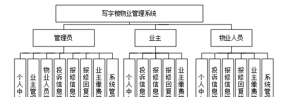
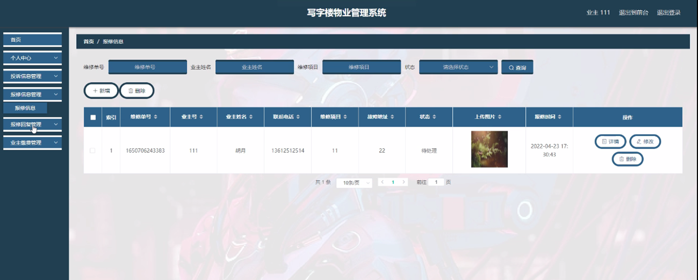

ssm+Vue计算机毕业设计写字楼物业管理系统（程序+LW文档）

**项目运行**

**环境配置：**

**Jdk1.8 + Tomcat7.0 + Mysql + HBuilderX** **（Webstorm也行）+ Eclispe（IntelliJ
IDEA,Eclispe,MyEclispe,Sts都支持）。**

**项目技术：**

**SSM + mybatis + Maven + Vue** **等等组成，B/S模式 + Maven管理等等。**

**环境需要**

**1.** **运行环境：最好是java jdk 1.8，我们在这个平台上运行的。其他版本理论上也可以。**

**2.IDE** **环境：IDEA，Eclipse,Myeclipse都可以。推荐IDEA;**

**3.tomcat** **环境：Tomcat 7.x,8.x,9.x版本均可**

**4.** **硬件环境：windows 7/8/10 1G内存以上；或者 Mac OS；**

**5.** **是否Maven项目: 否；查看源码目录中是否包含pom.xml；若包含，则为maven项目，否则为非maven项目**

**6.** **数据库：MySql 5.7/8.0等版本均可；**

**毕设帮助，指导，本源码分享，调试部署** **(** **见文末** **)**

总体设计

系统总体设计图如下图4-1所示：

 图4-1系统总体设计图

### 4.2 数据库设计

#### 4.2.1 概念模型设计

数据可设计要遵循职责分离原则，即在设计时应该要考虑系统独立性，即每个系统之间互不干预不能混乱数据表和系统关系。

数据库命名也要遵循一定规范，否则容易混淆，数据库字段名要尽量做到与表名类似，多使用小写英文字母和下划线来命名并尽量使用简单单词。

概念模型是对现实中的问题出现的事物的进行描述，ER图是由实体及其关系构成的图，通过E-R图可以清楚地描述系统涉及到的实体之间的相互关系。

投诉信息实体图如图4-2所示：

图4-2投诉信息实体图

报修回复实体图如图4-3所示：

图4-3报修回复实体图

业主缴费实体图如图4-4所示：

图4-4业主缴费实体图

系统功能模块

业主注册，业主通过输入业主号、密码、业主姓名、联系电话、身份证、楼房号、车牌号等内容进行注册，如图5-1所示。

图5-1业主注册界面图

业主通过登录进入系统可查看首页、通知公告、个人中心、后台管理、在线留言等内容，如图5-2所示。

图5-2系统首页界面图

5.2业主后台功能模块

后台管理，业主进入系统后台可查看个人中心、投诉信息管理、报修信息管理、报修回复管理、业主缴费管理等内容，如图5-3所示。

图5-3业主后台功能界面

投诉信息管理，业主可在投诉信息管理页面查看标题名称、图片、投诉日期、业主号、业主姓名、楼房号、联系电话、审核回复、审核状态等内容，还可进行新增、修改或删除等操作，如图5-4所示。

图5-4投诉信息管理界面图

报修回复管理，业主可在报修回复管理页面查看维修单号、业主号、业主姓名、联系方式、维修项目、故障地址、照片、更新时间等内容，如图5-5所示。

图5-5报修回复管理界面图

业主缴费管理，业主可在业主缴费管理页面查看月份、业主号、业主姓名、楼房号、缴费类型、缴费金额、登记时间、是否支付等内容，还可进行修改或删除等操作，如图5-6所示。

图5-6业主缴费管理界面图

报修信息管理，业主可在报修信息管理页面查看维修单号、业主号、业主姓名、联系电话、维修项目、故障地址、状态、上传图片、报修时间等内容，还可进行新增、修改或删除等操作，如图5-7所示。

图5-7报修信息管理界面图

5.3物业人员功能模块

物业人员通过登录进入系统可查看个人中心、投诉信息管理、报修信息管理、报修回复管理、业主缴费管理、系统管理等内容，如图5-8所示。

图5-8物业人员功能界面

投诉信息管理，物业人员可在投诉信息管理页面查看标题名称、图片、投诉日期、业主号、业主姓名、楼房号、联系电话、审核回复、审核状态等内容，还可进行修改或删除等操作，如图5-9所示。

图5-9投诉信息管理界面

业主缴费管理，物业人员可在业主缴费管理页面查看月份、业主号、业主姓名、楼房号、缴费类型、缴费金额、登记时间、是否支付等内容，还可进行新增、修改或删除等操作，如图5-10所示。

图5-10业主缴费管理界面

5.4管理员功能模块

管理员通过输入用户名、密码、角色进行登录，如图5-11所示。

图5-11管理员登录界面图

管理员通过登录进入系统可查看个人中心、业主管理、物业人员管理、投诉信息管理、报修信息管理、报修回复管理、业主缴费管理、系统管理等内容，如图5-12所示。

图5-12管理员功能界面图

#### **JAVA** **毕设帮助，指导，源码分享，调试部署**

