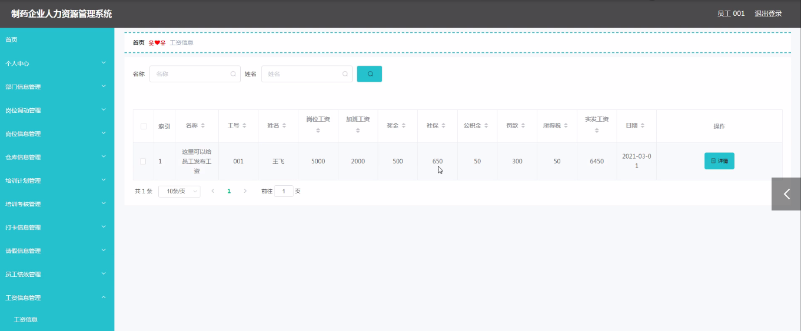
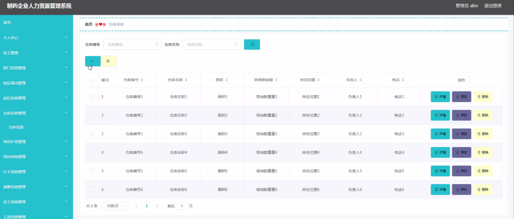

ssm+Vue计算机毕业设计制药企业人力资源管理系统（程序+LW文档）

**项目运行**

**环境配置：**

**Jdk1.8 + Tomcat7.0 + Mysql + HBuilderX** **（Webstorm也行）+ Eclispe（IntelliJ
IDEA,Eclispe,MyEclispe,Sts都支持）。**

**项目技术：**

**SSM + mybatis + Maven + Vue** **等等组成，B/S模式 + Maven管理等等。**

**环境需要**

**1.** **运行环境：最好是java jdk 1.8，我们在这个平台上运行的。其他版本理论上也可以。**

**2.IDE** **环境：IDEA，Eclipse,Myeclipse都可以。推荐IDEA;**

**3.tomcat** **环境：Tomcat 7.x,8.x,9.x版本均可**

**4.** **硬件环境：windows 7/8/10 1G内存以上；或者 Mac OS；**

**5.** **是否Maven项目: 否；查看源码目录中是否包含pom.xml；若包含，则为maven项目，否则为非maven项目**

**6.** **数据库：MySql 5.7/8.0等版本均可；**

**毕设帮助，指导，本源码分享，调试部署** **(** **见文末** **)**

### 系统结构设计

整个系统是由多个功能模块组合而成的，要将所有的功能模块都一一列举出来，然后进行逐个的功能设计，使得每一个模块都有相对应的功能设计，然后进行系统整体的设计。

本制药企业人力资源管理系统结构图如图3-2所示。

图3-2 制药企业人力资源管理系统结构图

3.3 数据库设计

数据库可以说是所有软件的根本，如果数据库存在缺陷，那么会导致系统开发的不顺利、维护困难、员工使用不顺畅等一系列问题，严重时将会直接损害利益，同时在开发完成后，数据库缺陷也更加难以解决。所以必须要对数据库设计重点把握，做到认真细致。因此，数据库设计是这个在线制药企业人力资源管理系统的重点要素。

3.3.1概念结构设计

(1)管理员信息实体属性图如下图3-3所示

图3-3管理员信息实体属性图

(2)员工信息实体属性如下图3-4所示

图3-4员工信息实体属性图

(3)仓库信息实体属性如下图3-5所示

图3-5仓库信息体属性图

(4)员工绩效信息实体属性如下图3-6所示

图3-6员工绩效信息实体属性图

(5)离职申请信息实体属性如下图3-7所示

图3-7离职申请信息实体属性图

员工功能模块

员工登录，通过填写用户名、密码、角色进行登录，如图4-1所示。

图4-1员工登录界面图

岗位信息管理，在岗位信息管理页面可以查看岗位名称、岗位职责、发布日期等详细内容进行修改，如图4-2所示。

图4-2 岗位信息管理界面图

仓库信息管理，在仓库信息管理页面通过查看仓库编号、仓库名称、面积、容纳数重量、所在位置、负责人、电话等信息进行详情、修改、删除，如图4-3所示。

在培训计划管理页面通过查看名称、培训内容、培训时间、培训日期等信息进行详情、删除操作，如图4-4所示。

图4-3仓库信息管理界面图

图4-4培训计划管理界面图

培训考核管理，在培训考核管理页面通过查看名称、工号、姓名、培训情况、考核评分、日期等信息进行详情、修改、删除，如图4-5所示。

在打卡信息管理页面通过查看工号、姓名、部门、打卡日期、打卡内容等信息进行详情、删除操作，如图4-6所示。

图4-5培训考核管理界面图

图4-6打卡信息管理界面图

员工绩效管理，在员工绩效管理页面通过查看名称、工号、姓名、部门、考勤绩效、奖惩绩效、总分、日期等信息进行详情、修改、删除，如图4-7所示。

在工资信息管理页面通过查看名称、工号、姓名、岗位工资、加班工资、奖金、社保、公积金、罚款、所得税、实发工资、日期等信息进行详情、删除操作，如图4-8所示。

图4-7员工绩效管理界面图

图4-8工资信息管理界面图

4.2管理员功能模块

管理员登录，通过填写用户名、密码、角色进行登录，如图4-9所示。

图4-9管理员登录界面图

管理员登录进入制药企业人力资源管理系统可以查看首页、个人中心、员工管理、部门信息管理、岗位调动管理、岗位信息管理、仓库信息管理、培训计划管理、培训考核管理、打卡信息管理、请假信息管理、员工绩效管理、工资信息管理、离职申请管理等信息。

员工管理，在员工管理页面中可以通过查看工号、姓名、性别、头像、部门、职位、电话等内容进行详情、修改、删除，如图4-10所示。还可以根据需要对岗位信息管理进行详情，修改或删除等详细操作，如图4-11所示。

图4-10员工管理界面图

图4-11岗位信息管理界面图

仓库信息管理，在仓库信息管理页面中可以查看仓库编号、仓库名称、面积、容纳数重量、所在位置、负责人、电话等信息，并可根据需要对已有仓库信息管理进行修改或删除等操作，如图4-12所示。

图4-12仓库信息管理界面图

**JAVA** **毕设帮助，指导，源码分享，调试部署**

