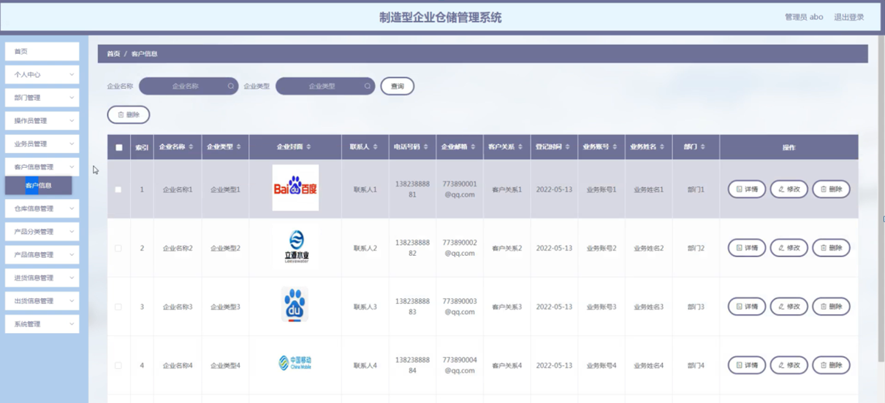

ssm+Vue计算机毕业设计制造型企业仓储管理系统（程序+LW文档）

**项目运行**

**环境配置：**

**Jdk1.8 + Tomcat7.0 + Mysql + HBuilderX** **（Webstorm也行）+ Eclispe（IntelliJ
IDEA,Eclispe,MyEclispe,Sts都支持）。**

**项目技术：**

**SSM + mybatis + Maven + Vue** **等等组成，B/S模式 + Maven管理等等。**

**环境需要**

**1.** **运行环境：最好是java jdk 1.8，我们在这个平台上运行的。其他版本理论上也可以。**

**2.IDE** **环境：IDEA，Eclipse,Myeclipse都可以。推荐IDEA;**

**3.tomcat** **环境：Tomcat 7.x,8.x,9.x版本均可**

**4.** **硬件环境：windows 7/8/10 1G内存以上；或者 Mac OS；**

**5.** **是否Maven项目: 否；查看源码目录中是否包含pom.xml；若包含，则为maven项目，否则为非maven项目**

**6.** **数据库：MySql 5.7/8.0等版本均可；**

**毕设帮助，指导，本源码分享，调试部署** **(** **见文末** **)**

### 系统总体架构设计

为了更好的去理清本系统整体思路，对该系统以结构图的形式表达出来，设计实现制造型企业仓储管理系统的功能结构图如下所示：

图4-1 系统总体功能结构图

### 4.3 系统数据库的设计

#### 4.3.1数据库E/R图

ER图是由实体及其关系构成的图，通过E/R图可以清楚地描述系统涉及到的实体之间的相互关系。在系统中对一些主要的几个关键实体如下图：

  1. 客户信息E/R图如下所示：

图4-2客户信息E/R图

(2) 进货信息E/R图如下所示：

图4-3进货信息E/R图

(3) 出货信息E/R图如下所示：

图4-4出货信息E/R图

制造型企业仓储管理系统，包括管理员、业务员和操作员三个角色，根据每个用户权限的不同，操作的功能也会不一样，接下来我将对制造型企业仓储管理系统的功能模块进行分析。

系统登录，用户进入系统前在登录页面根据要求填写用户名和密码，选择角色等信息，点击登录进行登录操作，如图5-1所示。

图5-1系统登录界面图

### 5\. 1管理员功能模块

管理员登录系统后，可以对首页、个人中心、部门管理、操作员管理、业务员管理、客户信息管理、仓库信息管理、产品分类管理、产品信息管理、进货信息管理、出货信息管理、系统管理等功能进行相应的操作管理，如图5-2所示。

图5-2管理员功能界面图

部门管理，在部门管理页面可以对索引、部门等内容进行详情，修改和删除等操作，如图5-3所示。

图5-3部门管理界面图

操作员管理，在操作员管理页面可以对索引、操作账号、操作姓名、性别、部门、联系方式、头像等信息进行详情，修改和删除等操作，如图5-4所示。

图5-4操作员管理界面图

业务员管理，在业务员管理页面可以对索引、业务账号、业务姓名、性别、部门、联系方式、头像等内容进行详情、修改和删除等操作，如图5-5所示。

图5-5业务员管理界面图

客户信息管理，在客户信息管理页面可以对索引、企业名称、企业类型、企业封面、联系人、电话号码、企业邮箱、客户关系、登记时间、业务账号、业务姓名、部门等内容进行详情、修改和删除等操作，如图5-6所示。

图5-6客户信息管理界面图

仓库信息管理，在仓库信息管理页面可以对索引、仓库编号、仓库名称、仓库类型、仓库位置、仓库封面、仓库面积等内容进行详情、修改和删除操作，如图5-7所示。

图5-7仓库信息管理界面图

产品分类管理，在产品分类管理页面可以对索引、产品分类等内容进行详情、修改和删除等操作，如图5-8所示。

图5-8产品分类管理界面图

产品信息管理，在产品信息管理页面可以对索引、产品编号、仓库名称、产品分类、产品图片、产品数量、产品型号等内容进行详情、修改和删除等操作，如图5-9所示。

图5-9产品信息管理界面图

进货信息管理，在进货信息管理页面可以对索引、进货编号、产品编号、仓库名称、产品名称、产品分类、产品型号、进货时间、操作账号、操作姓名等内容进行详情、修改和删除等操作，如图5-10所示。

图5-10进货信息管理界面图

出货信息管理，在出货信息管理页面可以对索引、出货编号、产品编号、仓库名称、产品名称、产品分类、产品型号、产品数量、出货时间、操作账号、操作姓名等内容进行详情、修改和删除等操作，如图5-11所示。

图5-11出货信息管理界面图

系统管理，在公告信息页面可以对索引、标题、图片等内容进行详情、修改详情、修改和删除等操作，如图5-12所示。

图5-12系统管理界面图

#### **JAVA** **毕设帮助，指导，源码分享，调试部署**

