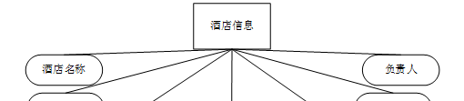
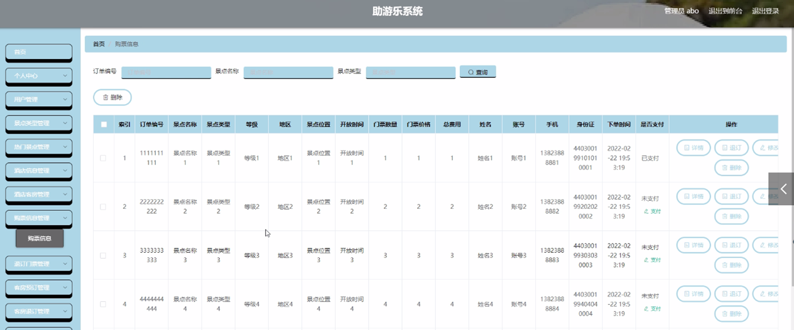

ssm+Vue计算机毕业设计助游乐系统（程序+LW文档）

**项目运行**

**环境配置：**

**Jdk1.8 + Tomcat7.0 + Mysql + HBuilderX** **（Webstorm也行）+ Eclispe（IntelliJ
IDEA,Eclispe,MyEclispe,Sts都支持）。**

**项目技术：**

**SSM + mybatis + Maven + Vue** **等等组成，B/S模式 + Maven管理等等。**

**环境需要**

**1.** **运行环境：最好是java jdk 1.8，我们在这个平台上运行的。其他版本理论上也可以。**

**2.IDE** **环境：IDEA，Eclipse,Myeclipse都可以。推荐IDEA;**

**3.tomcat** **环境：Tomcat 7.x,8.x,9.x版本均可**

**4.** **硬件环境：windows 7/8/10 1G内存以上；或者 Mac OS；**

**5.** **是否Maven项目: 否；查看源码目录中是否包含pom.xml；若包含，则为maven项目，否则为非maven项目**

**6.** **数据库：MySql 5.7/8.0等版本均可；**

**毕设帮助，指导，本源码分享，调试部署** **(** **见文末** **)**

### 系统结构设计

系统设计主要是管理员登录后对整个系统相关操作进行处理，可进行系统管理。系统的功能结构图如下图所示。

图3-1 系统结构图

### 3.4数据库设计

数据可设计要遵循职责分离原则，即在设计时应该要考虑系统独立性，即每个系统之间互不干预不能混乱数据表和系统关系。

数据库命名也要遵循一定规范，否则容易混淆，数据库字段名要尽量做到与表名类似。

#### 3.4.1 E-R图设计

概念模型是对现实中的问题出现的事物的进行描述，ER图是由实体及其关系构成的图，通过E-R图可以清楚地描述系统涉及到的实体之间的相互关系。

管理员实体包括用户名、密码和角色三个属性。管理员体ER图如下图所示。

图3-2管理员信息ER图

用户信息ER图如下图所示。

图3-3用户信息ER图

酒店信息ER图如下图所示。

图3-4酒店信息ER图

热门景点信息ER图如下图所示。

图3-5热门景点信息ER图

购票信息ER图如下图所示。

图3-6购票信息ER图

### 后台功能模块—管理员功能模块

#### 4.2.1管理员登录

管理员输入用户名，密码，选择角色后进行登录，管理员登录如下图4-1所示：

图4-1 管理员登录界面

#### 4.2.2管理员功能

管理员登录后，对首页、个人中心、用户管理、景点类型管理、热门景点管理、酒店信息管理、酒店客房管理、购票信息管理、退订门票管理、客房预订管理、客房退订管理、出行路线管理、管理员管理、系统管理等进行操作，管理员功能如图4-2所示：

图4-2 管理员功能界面

#### 4.2.3用户管理

点击用户管理，在用户管理页面查看账号、姓名、性别、手机、邮箱、身份证进行详情、修改、删除等操作，如下图4-3所示：

图4-3 用户管理页面

#### 4.2.4热门景点管理

在热门景点管理页面，管理员可以查看景点名称、图片、等级、景点类型、开放时间、地区、门票价格、门票数量、景点位置等内容，也可以进行修改，删除等操作。如下图4-4所示：

图4-4 热门景点管理页面

#### 4.2.5酒店信息管理

酒店信息管理，管理员可以查看酒店名称、酒店类型、星级、酒店图片、酒店地址、酒店电话、负责人等内容，并进行修改，删除等操作，如下图4-5所示：

图4-5 酒店信息管理页面

#### 4.2.6购票信息管理

在购票信息管理页面，管理员可以对订单编号、景点名称、景点类型、等级、地区、景点位置、开放时间、门票数量、门票价格、总费用、姓名、账号、手机、身份证、下单时间、是否支付等内容，并信息详情，修改，删除等操作，如下图4-6所示：

图4-6购票信息管理页面

#### 4.2.7退订门票管理

在退订门票管理页面，管理员可以对订单编号、景点名称、景点类型、等级、地区、景点位置、开放时间、门票价格、门票数量、总费用、姓名、账号、手机、身份证、退订原因、退订时间、审核回复、审核状态、审核等内容，并信息详情，修改，删除等操作，如下图4-7所示：

图4-7退订门票管理页面

#### 4.2.8客房退订管理

在客房退订管理页面，管理员可以对客房订单、客房名称、客房楼层、客房类型、客房设施、入住时间、客房价格、住宿天数、总费用、酒店名称、酒店地址、联系电话、账号、姓名、身份证、手机、退订原因、退订时间、审核回复、审核状态、审核等内容，并信息详情，修改，删除等操作，如下图4-8所示：

图4-8客房退订管理页面

#### 4.2.9管理员管理

在管理员管理页面，管理员可以对用户名、密码、角色等内容，进行详情、修改、删除等操作，如下图4-9所示：

图4-9管理员管理页面

### 4.3后台功能模块—用户功能模块

#### 4.3.1用户功能

用户在系统后台，可以对首页、个人中心、购票信息管理、退订门票管理、客房预订管理、客房退订管理等进行相关的操作，如下图4-10所示：

图4-10用户功能页面

#### 4.3.2购票信息管理

在购票信息管理页面，用户可以查看订单编号、景点名称、景点类型、等级、地区、景点位置、开放时间、门票数量、门票价格、总费用、姓名、账号、手机、身份证、下单时间、是否支付等内容进行详情、删除等操作，如下图4-11所示：

图4-11购票信息管理页面

#### 4.3.3客房退订管理

在客房退订管理页面，用户可以查看客房订单、客房名称、客房楼层、客房类型、客房设施、入住时间、客房价格、住宿天数、总费用、酒店名称、酒店地址、联系电话、账号、姓名、身份证、手机、退订原因、退订时间、审核回复、审核状态、审核等内容，进行详情等操作，如下图4-12所示：

图4-12客房退订管理页面

#### **JAVA毕设帮助，指导，源码获取** 👇🏻👇🏻👇🏻 **，调试部署**

####

