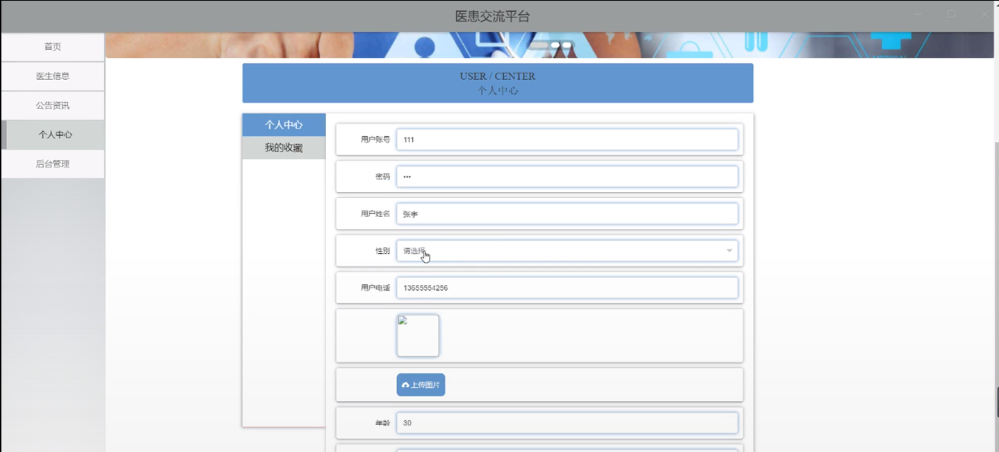

ssm+Vue计算机毕业设计医患交流平台（程序+LW文档）

**项目运行**

**环境配置：**

**Jdk1.8 + Tomcat7.0 + Mysql + HBuilderX（Webstorm也行）+ Eclispe（IntelliJ
IDEA,Eclispe,MyEclispe,Sts都支持）。**

**项目技术：**

**SSM + mybatis + Maven + Vue 等等组成，B/S模式 + Maven管理等等。**

**环境需要**

**1.运行环境：最好是java jdk 1.8，我们在这个平台上运行的。其他版本理论上也可以。**

**2.IDE环境：IDEA，Eclipse,Myeclipse都可以。推荐IDEA;**

**3.tomcat环境：Tomcat 7.x,8.x,9.x版本均可**

**4.硬件环境：windows 7/8/10 1G内存以上；或者 Mac OS；**

**5.是否Maven项目: 否；查看源码目录中是否包含pom.xml；若包含，则为maven项目，否则为非maven项目**

**6.数据库：MySql 5.7/8.0等版本均可；**

**毕设帮助，指导，本源码分享，调试部署(** **见文末)**

### 功能结构

为了更好的去理清本系统整体思路，对该系统以结构图的形式表达出来，设计实现该医患交流平台的功能结构图如下所示：

图4-1 系统总体结构图

### 4.2数据库设计

#### 4.2.1 数据库E/R图

ER图是由实体及其关系构成的图，通过E/R图可以清楚地描述系统涉及到的实体之间的相互关系。在系统中对一些主要的几个关键实体如下图：

(1)咨询信息E/R图如下所示：

图4-2咨询信息E/R图

(2)就诊信息E/R图如下所示：

图4-3就诊信息E/R图

(3)公告资讯E/R图如下所示：

图4-4公告资讯E/R图

### 系统功能模块

医患交流平台，在平台首页可以查看首页，医生信息，公告资讯，个人中心，后台管理等内容，并进行详细操作；如图5-1所示。

图5-1平台功能界面图

用户注册；在用户注册页面通过填写用户账号，密码，确认密码，用户姓名，用户电话，年龄，住址等信息进行注册操作，如图5-2所示。

图5-2用户注册界面图

医生信息，在医生信息页面可以查看医生姓名，科室名称，科室简介，挂号费，医生账号，医生电话，职称，点击次数等内容进行评论，收藏，挂号和咨询操作，如图5-3所示。

图5-3医生信息界面图

公告资讯，在公告资讯页面可以查看标题，发布时间，公告内容等内容；如图5-4所示。

图5-4公告资讯界面图

个人中心；在个人中心页面通过填写用户账号，用户姓名，密码，年龄，性别，住址，上传图片等内容进行更新信息操作，也可以对我的收藏进行相应的操作；如图5-5所示。

图5-5个人中心界面图

### 5.2后台功能模块

后台登录，管理员和用户进入系统前在登录页面根据要求填写用户名和密码，选择角色等信息，点击登录进行登录操作，如图5-6所示。

图5-6后台登录界面图

#### 5.2.1管理员功能

管理员登录系统后，可以对首页，个人中心，用户管理，医生管理，医生信息管理，预约挂号管理，就诊信息管理，病历信息管理，咨询信息管理，医生医嘱管理，系统管理等功能进行相应的操作管理，如图5-7所示。

图5-7管理员功能界面图

用户管理，在用户管理页面可以对索引，用户账号，用户姓名，性别，用户电话，头像，年龄，住址等内容进行详情，修改或删除操作，如图5-8所示。

图5-8用户管理界面图

医生管理，在医生管理页面可以对索引，医生账号，医生姓名，性别，医生电话，头像，职称等内容进行详情，修改或删除操作，如图5-9所示。

图5-9医生管理界面图

预约挂号管理，在预约挂号管理页面可以对索引，预约编号，科室名称，医生账号，医生姓名，挂号费，预约时间，用户账号，用户姓名，是否支付，审核回复，审核状态等内容进行详情、修改或删除操作，如图5-10所示。

图5-10预约挂号管理界面图

就诊信息管理，在就诊信息管理页面可以对索引，就诊编号，科室名称，医生账号，医生姓名，就诊时间，用户账号，用户姓名等内容进行详情，修改，或删除操作；如图5-11所示。

图5-11就诊信息管理界面图

病历信息管理，在病历信息管理页面可以对索引、病历编号，科室名称，医生账号，医生姓名，登记时间，病历文档，用户账号，用户姓名等内容进行详情，修改，或删除操作，如图5-12所示。

图5-12病历信息管理界面图

#### **JAVA毕设帮助，指导，源码分享，调试部署**

