ssm+Vue计算机毕业设计医生咨询系统（程序+LW文档）

**项目运行**

**环境配置：**

**Jdk1.8 + Tomcat7.0 + Mysql + HBuilderX** **（Webstorm也行）+ Eclispe（IntelliJ
IDEA,Eclispe,MyEclispe,Sts都支持）。**

**项目技术：**

**SSM + mybatis + Maven + Vue** **等等组成，B/S模式 + Maven管理等等。**

**环境需要**

**1.** **运行环境：最好是java jdk 1.8，我们在这个平台上运行的。其他版本理论上也可以。**

**2.IDE** **环境：IDEA，Eclipse,Myeclipse都可以。推荐IDEA;**

**3.tomcat** **环境：Tomcat 7.x,8.x,9.x版本均可**

**4.** **硬件环境：windows 7/8/10 1G内存以上；或者 Mac OS；**

**5.** **是否Maven项目: 否；查看源码目录中是否包含pom.xml；若包含，则为maven项目，否则为非maven项目**

**6.** **数据库：MySql 5.7/8.0等版本均可；**

**毕设帮助，指导，本源码分享，调试部署** **(** **见文末** **)**

### 系统结构设计

系统设计主要是管理员登录后对整个系统相关操作进行处理，可进行管理员的添加和删除，用户管理、医生管理、医生信息管理、医疗动态管理、留言板管理、系统管理等操作管理。

系统的功能结构图如下图所示。

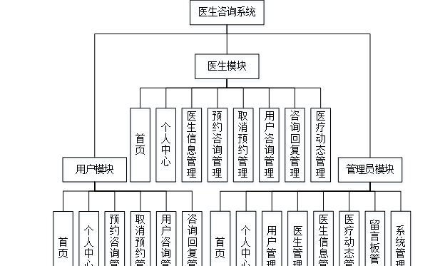

图4-1系统功能结构图

###

### 4.3数据库设计

系统里尤为关键的部分是在数据库方面，需要十分清晰的思路，所以从开始的设计时需要做到确立模块之间的联系，从而可以很明确的建立表间的联系和表中所需的内容。设计数据库还有一点是减少表的繁杂的创建，所以联系很关键，可以大大的减少，数据表中重复的事项。由此可以保证数据的完整和统一，不会造成数据的错误和重复，并且可以使数据得到数据库安全的保护，会使用户更加的放心。

#### 4.3.1 E-R图设计

概念设计是整个数据库设计的关键，在概念设计阶段，由需求分析得到了E-
R模型。E-R图是识别功能模型与数据模型间关联关系的，在主题数据库的抽取和规范化的过程中，采用的是简化的E-R图表示方法，从而避免过繁过细的E-
R图表示影响规划的直观和可用性。是对现实世界的抽象和概括，是数据库设计人员进行数据可设计的有力工具，能够方便直接地表达应用中的各种语义知识，令一方面它简单、清晰、易于用户理解。

管理员实体包括管理员名称、密码、角色三个属性。

管理员体ER图如下图所示。

图4-2管理员ER图

医生信息管理ER图如下图所示。

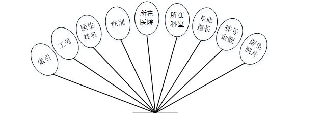

图4-3医生信息管理ER图

预约咨询管理ER图如下图所示。

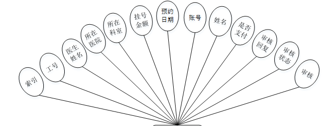

图4-4预约咨询管理ER图

医疗动态管理ER图如下图所示。

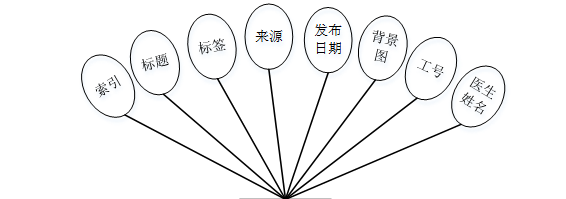

图4-5医疗动态管理ER图

### 登录模块

系统登录模块可分为前台登录模块和后台登录模块，为确保系统安全性，系统操作员只有在登录界面输入正确的管理员名、密码、角色，单击“登录”按钮后才能够进入本系统的主界面。

管理员登录流程图如下所示。

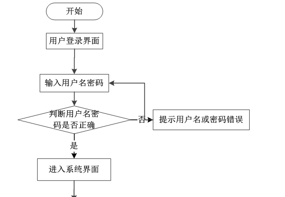

图5-1管理员登录流程图

登录界面如下图所示。

图5-2登录界面图

### 5.2系统功能模块

医生咨询系统，在系统首页可以查看首页、医生信息、医疗动态、医疗资讯、留言反馈、个人中心、后台管理等信息，如图5-3所示。

图5-3系统首页界面图

用户注册：在用户注册页面通过填写账号、密码、姓名、手机、邮箱、身份证等信息完成用户注册，如图5-4所示。

图5-4用户注册界面图

医生信息：在医生信息页面可以查看工号、医生姓名、性别、所在医院、所在科室、专业擅长、挂号金额、医生照片、医生介绍等信息，根据需要进行预约操作，如图5-5所示。

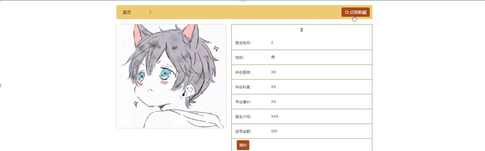

图5-5医生信息界面图

医疗动态：在医疗动态页面可以查看标签、来源、发布日期、工号、医生姓名等信息，如图5-6所示。

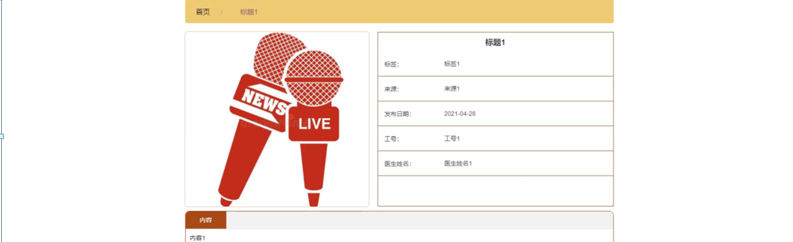

图5-6医疗动态界面图

个人中心：在个人中心页面可以通过填写用户信息等信息进行更新信息，根据需要对我的收藏进行相对应操作，如图5-7所示。

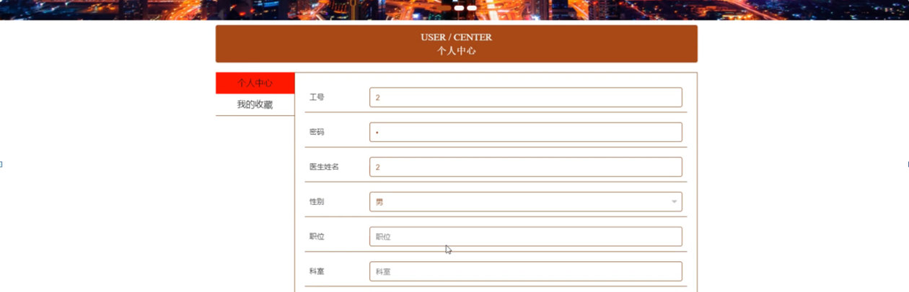

图5-7个人中心界面图

### 5.3管理员功能模块

管理员登录成功后进入到系统操作界面，可以对首页、个人中心、用户管理、医生管理、医生信息管理、医疗动态管理、留言板管理、系统管理等功能模块进行相对应操作。如图5-8所示。

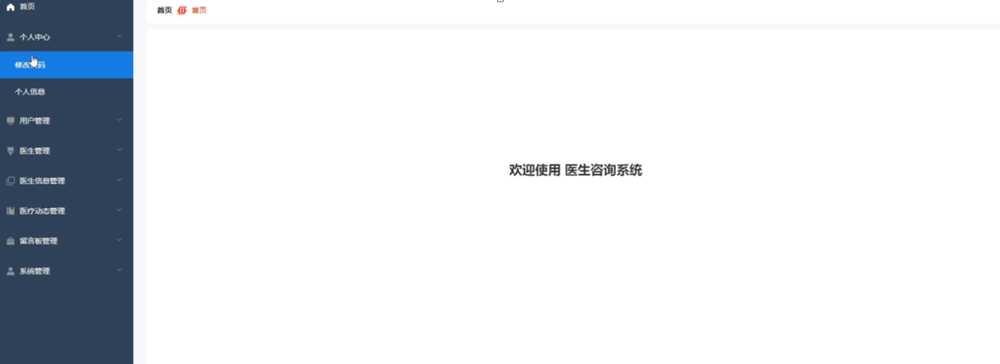

图5-8管理员功能界面图

用户管理：在用户管理页面可以查看个人账号、姓名、性别、年龄、身份证号码、手机号码、相片余额等信息，根据需要进行详情、修改或删除等操作，如图5-9所示。

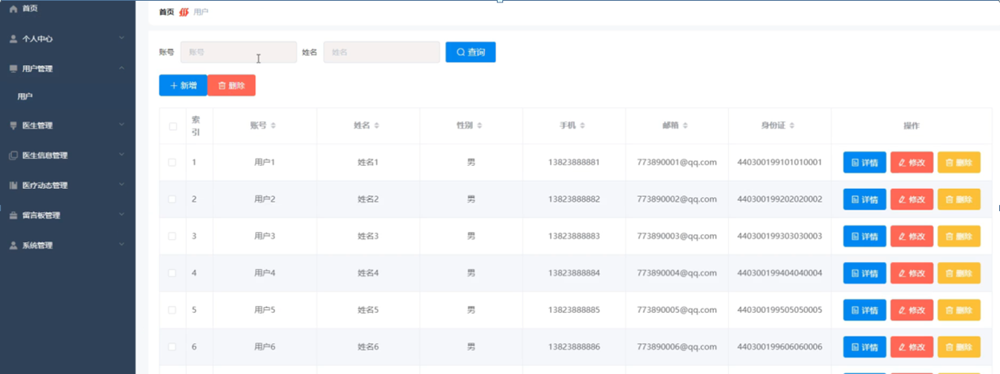

图5-9用户管理界面图

医生管理：在医生管理页面可以查看索引、工号、医生姓名、性别、职位、科室、手机、邮箱、图片等信息，根据需要进行详情、修改或删除等操作，如图5-10所示。

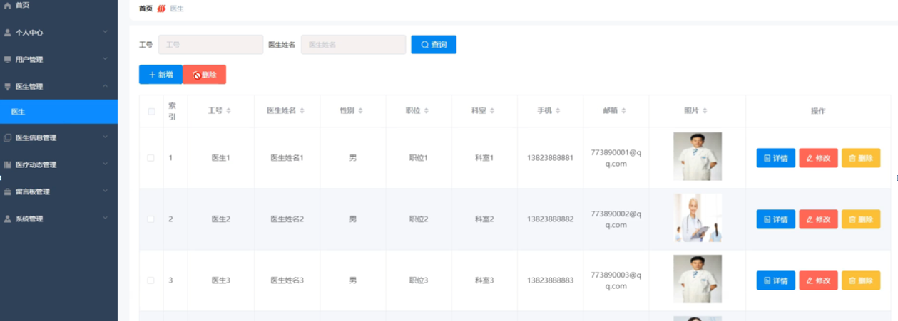

图5-10医生管理界面图

医生信息管理：在医生信息管理页面可以查看索引、工号、医生姓名、性别、所在医院、所在科室、专业擅长、挂号金额、医生照片等信息，根据需要进行详情、修改等操作，如图5-11所示。

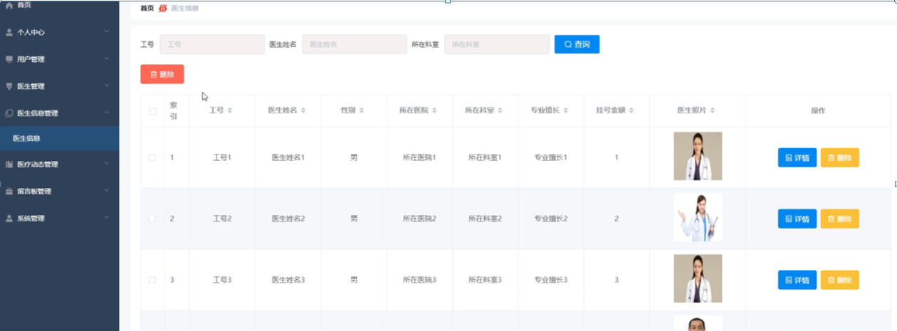

图5-11医生信息管理界面图

医疗动态管理：在医疗动态管理页面可以查看索引、标题、标签、来源、发布日期、背景图、工号、医生姓名等信息，根据需要进行详情、删除等操作，如图5-12所示。

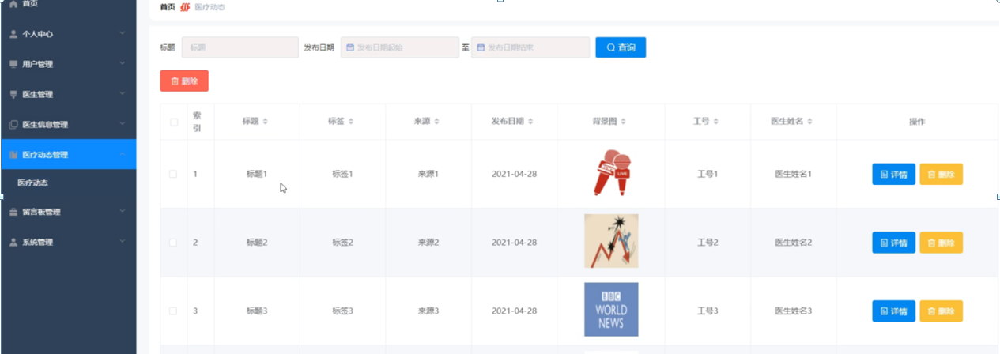

图5-12医疗动态管理界面图

**JAVA** **毕设帮助，指导，源码分享，调试部署**

