ssm+Vue计算机毕业设计医疗健康查询系统（程序+LW文档）

**项目运行**

**环境配置：**

**Jdk1.8 + Tomcat7.0 + Mysql + HBuilderX** **（Webstorm也行）+ Eclispe（IntelliJ
IDEA,Eclispe,MyEclispe,Sts都支持）。**

**项目技术：**

**SSM + mybatis + Maven + Vue** **等等组成，B/S模式 + Maven管理等等。**

**环境需要**

**1.** **运行环境：最好是java jdk 1.8，我们在这个平台上运行的。其他版本理论上也可以。**

**2.IDE** **环境：IDEA，Eclipse,Myeclipse都可以。推荐IDEA;**

**3.tomcat** **环境：Tomcat 7.x,8.x,9.x版本均可**

**4.** **硬件环境：windows 7/8/10 1G内存以上；或者 Mac OS；**

**5.** **是否Maven项目: 否；查看源码目录中是否包含pom.xml；若包含，则为maven项目，否则为非maven项目**

**6.** **数据库：MySql 5.7/8.0等版本均可；**

**毕设帮助，指导，本源码分享，调试部署** **(** **见文末** **)**

### 软件功能模块设计

系统整功能如下图所示：

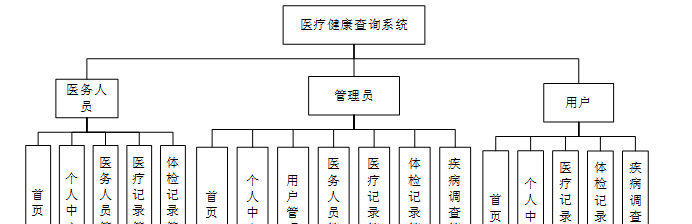

图 4-1 系统总体功能模块图

### 系统登录

系统登录，管理员，用户和医务人员进入系统前在登录页面根据要求填写用户名和密码，选择角色等信息，点击登录进行登录操作，如图5-1所示。

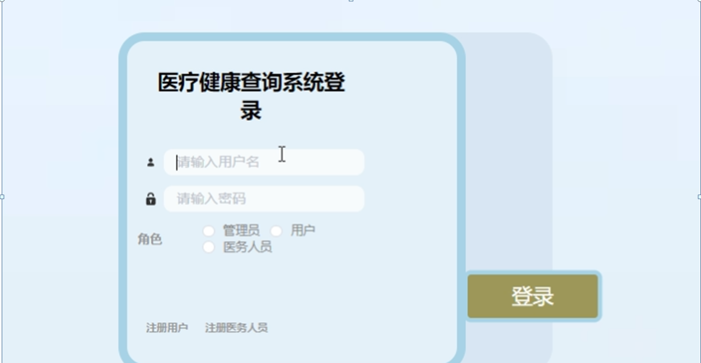

图5-1系统登录界面图

### 5.2管理员功能模块

管理员登录系统后，可以对首页、个人中心、用户管理、医务人员管理、医疗记录管理、体检记录管理、疾病调查管理等功能进行相应的操作管理，如图5-2所示。

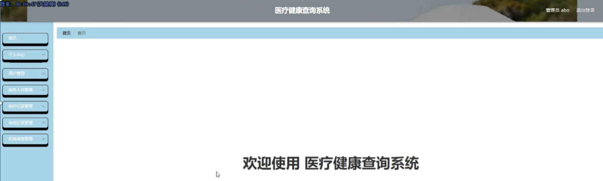

图5-2管理员功能界面图

用户管理，在用户管理页面可以对索引、账号、姓名、年龄、性别、手机、照片、单位等内容进行详情，修改和删除等操作，如图5-3所示。

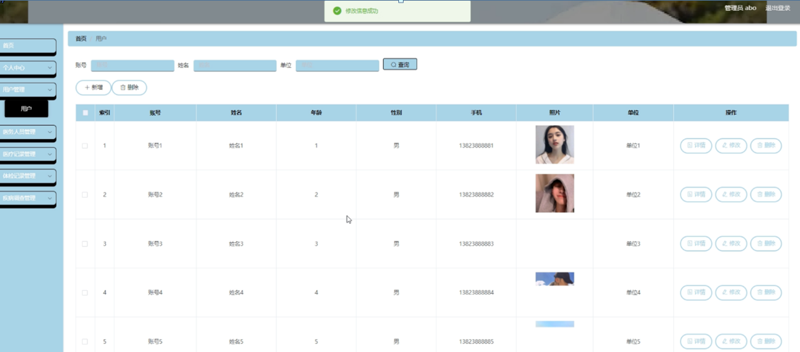

图5-3用户管理界面图

医务人员管理，在医务人员管理页面可以对索引、账号、姓名、年龄、性别、照片等内容进行详情、修改和删除等操作，如图5-4所示。

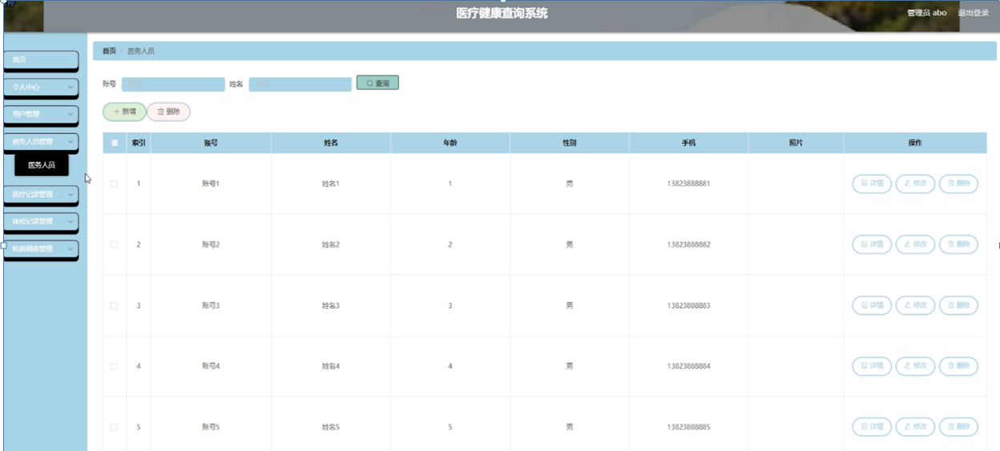

图5-4医务人员管理界面图

医疗记录管理，在医疗记录管理页面可以对索引、账号、姓名、性别、单位、主治医师、就诊日期等内容进行修改和删除等操作，如图5-5所示。

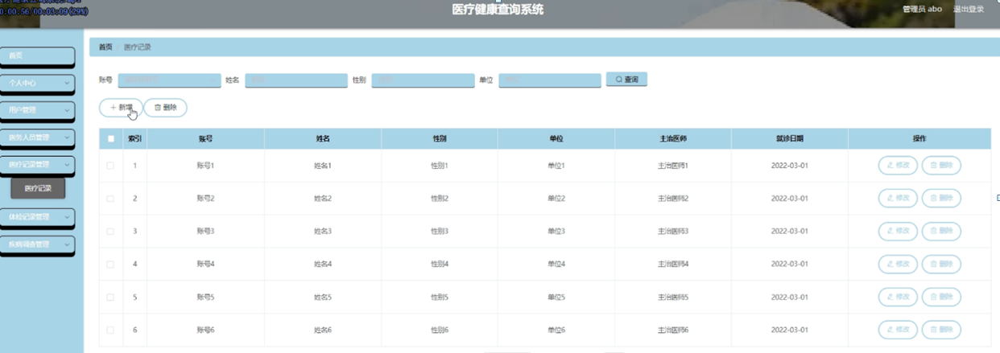

图5-5医疗记录管理界面图

体检记录管理，在体检记录管理页面可以对索引、账号、姓名、性别、单位、体检名称、体检图片、注意事项、体检日期等内容进行详情，修改和删除等操作，如图5-6所示。

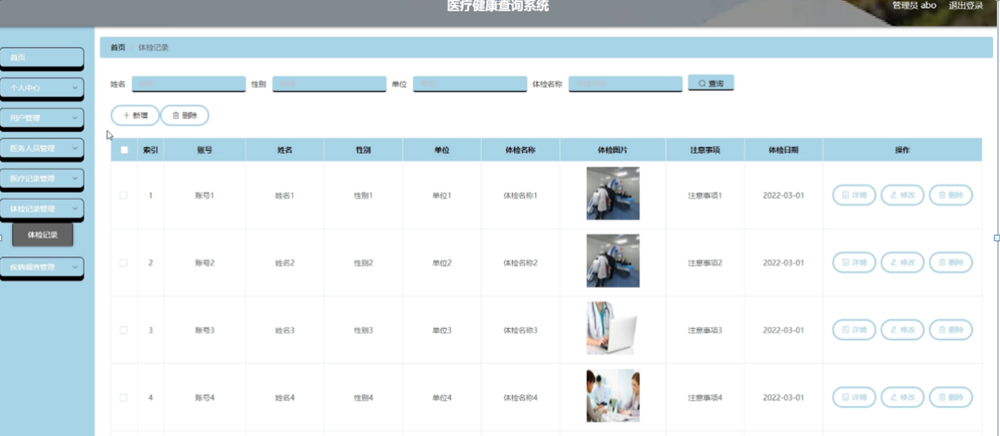

图5-6体检记录管理界面图

疾病调查管理，在疾病调查管理页面可以对索引、账号、姓名、性别、单位、疾病名称、相关疾病、传染、发病部位、登记日期等内容进行详情，修改和删除等操作，如图5-7所示。

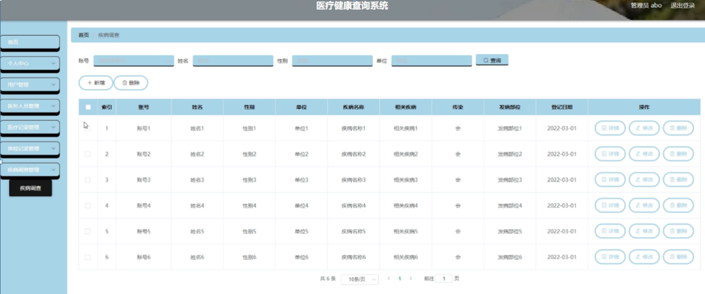

图5-7疾病调查管理界面图

### 5.3医务人员功能模块

医务人员登录进入医疗健康查询系统可以对首页、个人中心、医务人员管理、医疗记录管理、体检记录管理、疾病调查管理等功能进行相应操作，如图5-8所示。

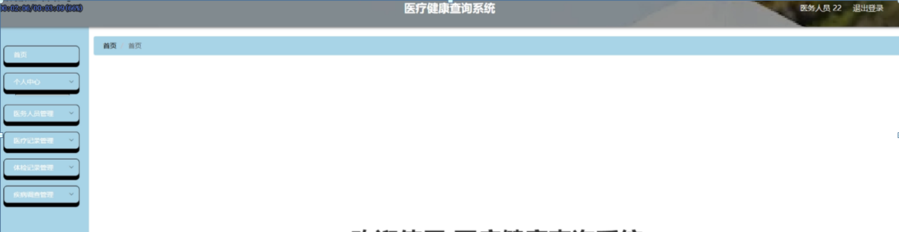

图5-8医务人员功能界面图

医务人员管理，在医务人员管理页面可以对索引、账号、姓名、年龄、性别、手机、照片等内容进行详情，如图5-9所示。

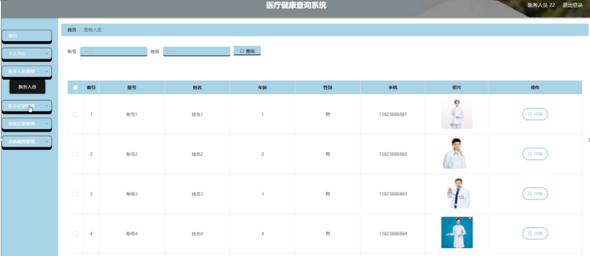

图5-9医务人员管理界面图

医疗记录管理，在医疗记录管理页面可以对索引、账号、姓名、性别、单位、主治医师、就诊日期等内容进行操作，如图5-10所示。

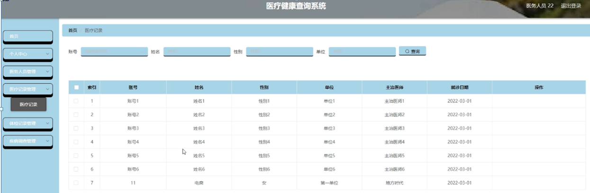

图5-10医疗记录管理管理界面图

体检记录管理，在体检记录管理页面可以对索引、账号、姓名、性别、单位、体检名称、体检图片、注意事项、体检日期等内容进行详情操作，如图5-11所示。

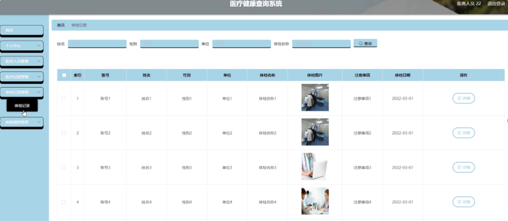

图5-11体检记录管理管理界面图

疾病调查管理，在疾病调查管理页面可以对索引、账号、姓名、性别、单位、疾病名称、相关疾病、传染、发病部位、登记日期等内容进行操作，如图5-12所示。

图5-12疾病调查管理管理界面图

**JAVA** **毕设帮助，指导，源码分享，调试部署**

