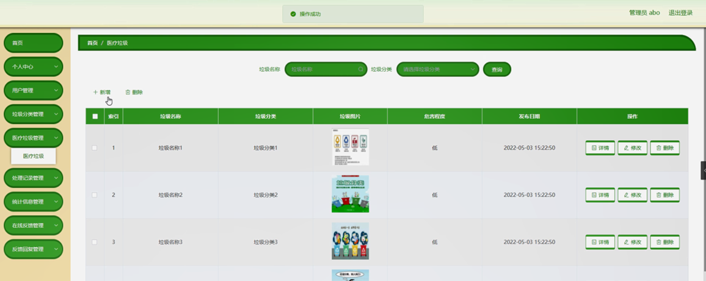
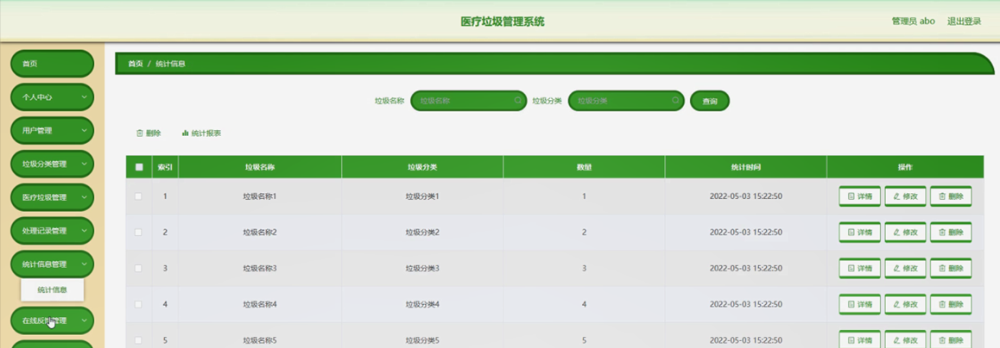

ssm+Vue计算机毕业设计医疗垃圾管理系统（程序+LW文档）

**项目运行**

**环境配置：**

**Jdk1.8 + Tomcat7.0 + Mysql + HBuilderX** **（Webstorm也行）+ Eclispe（IntelliJ
IDEA,Eclispe,MyEclispe,Sts都支持）。**

**项目技术：**

**SSM + mybatis + Maven + Vue** **等等组成，B/S模式 + Maven管理等等。**

**环境需要**

**1.** **运行环境：最好是java jdk 1.8，我们在这个平台上运行的。其他版本理论上也可以。**

**2.IDE** **环境：IDEA，Eclipse,Myeclipse都可以。推荐IDEA;**

**3.tomcat** **环境：Tomcat 7.x,8.x,9.x版本均可**

**4.** **硬件环境：windows 7/8/10 1G内存以上；或者 Mac OS；**

**5.** **是否Maven项目: 否；查看源码目录中是否包含pom.xml；若包含，则为maven项目，否则为非maven项目**

**6.** **数据库：MySql 5.7/8.0等版本均可；**

**毕设帮助，指导，本源码分享，调试部署** **(** **见文末** **)**

### 功能结构

为了更好的去理清本系统整体思路，对该系统以结构图的形式表达出来，设计实现该医疗垃圾管理系统的功能结构图如下所示：

图4-1 系统总体结构图

### 4.2 数据库设计

####  4.2.1 数据库E/R图

ER图是由实体及其关系构成的图，通过E/R图可以清楚地描述系统涉及到的实体之间的相互关系。在系统中对一些主要的几个关键实体如下图：

(1) 用户注册E/R图如下所示：

图4-2用户注册E/R图

(2) 医疗垃圾E/R图如下所示：

图4-3医疗垃圾E/R图

(4) 处理记录E/R图如下所示：

图4-4处理记录E/R图

### 系统登录注册模块

系统登录，管理员和用户进入系统前在登录页面根据要求填写用户，密码和选择角色等信息，点击登录进行登录操作，如图5-1所示。

图5-1系统登录界面图

用户注册，在用户注册页面通过填写用户名、密码、确认密码、姓名、年龄、身份证、手机等信息进行注册操作，如图5-2所示。

图5-2用户注册界面图

### 5.2管理员功能模块

管理员登陆系统后，可以查看首页、个人中心、用户管理、垃圾分类管理、医疗垃圾管理、处理记录管理、统计信息管理、在线反馈管理、反馈回复管理等功能，还能对每个功能逐一进行相应操作，如图5-3所示。

图5-3管理员功能界面图

用户管理，在用户管理页面可以对索引、用户名、姓名、性别、年龄、身份证、手机等内容进行详情，修改和删除操作，如图5-4所示。

图5-4用户管理界面图

垃圾分类管理，在垃圾分类管理页面可以对索引、垃圾分类等内容进行详情，修改和删除等操作，如图5-5所示。

图5-5垃圾分类管理界面图

医疗垃圾管理，在医疗垃圾管理页面可以对索引、垃圾名称、垃圾分类、垃圾图片、危害程度、发布日期等内容进行详情，修改和删除等操作，如图5-6所示。

图5-6医疗垃圾管理界面图

处理记录管理，在处理记录管理页面可以对索引、垃圾名称、垃圾分类、数量、处理时间、处理地点、用户名、姓名、手机等内容进行详情，名称统计，修改和删除操作，如图5-7所示。

图5-7处理记录管理界面图

统计信息管理，在统计信息管理页面可以对索引、垃圾名称、垃圾分类、数量、统计时间等内容进行详情，修改和删除等操作，如图5-8所示。

图5-8统计信息管理界面图

在线反馈管理，在在线反馈管理页面可以对索引、标题、反馈时间、用户名、姓名等内容进行详情，回复和删除操作，如图5-9所示。

图5-9在线反馈管理界面图

反馈回复管理，在反馈回复管理页面可以对索引、标题、回复时间、用户名、姓名等内容进行详情，修改和删除等操作，如图5-10所示。

图5-10反馈回复管理界面图

### 5.3用户功能模块

用户登陆系统，可以查看首页、个人中心、医疗垃圾管理、处理记录管理、在线反馈管理、反馈回复管理等功能，还能对每个功能逐一进行相应操作，如图5-11所示。

图5-11用户功能界面图

处理记录管理，在处理记录管理页面可以对索引、垃圾名称、垃圾分类、数量、处理时间、处理地点、用户名、姓名、手机等内容进行详情，修改和删除操作，如图5-12所示。

图5-12处理记录管理界面图

**JAVA** **毕设帮助，指导，源码分享，调试部署**

