ssm+Vue计算机毕业设计医疗机构药房管理系统软件开发-后台软件（程序+LW文档）

**项目运行**

**环境配置：**

**Jdk1.8 + Tomcat7.0 + Mysql + HBuilderX** **（Webstorm也行）+ Eclispe（IntelliJ
IDEA,Eclispe,MyEclispe,Sts都支持）。**

**项目技术：**

**SSM + mybatis + Maven + Vue** **等等组成，B/S模式 + Maven管理等等。**

**环境需要**

**1.** **运行环境：最好是java jdk 1.8，我们在这个平台上运行的。其他版本理论上也可以。**

**2.IDE** **环境：IDEA，Eclipse,Myeclipse都可以。推荐IDEA;**

**3.tomcat** **环境：Tomcat 7.x,8.x,9.x版本均可**

**4.** **硬件环境：windows 7/8/10 1G内存以上；或者 Mac OS；**

**5.** **是否Maven项目: 否；查看源码目录中是否包含pom.xml；若包含，则为maven项目，否则为非maven项目**

**6.** **数据库：MySql 5.7/8.0等版本均可；**

**毕设帮助，指导，本源码分享，调试部署** **(** **见文末** **)**

### 系统结构

本系统架构网站系统，本系统的具体功能如下：

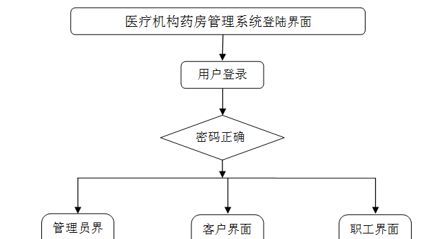

图4-2系统功能结构图

### 4.2 系统结构设计

系统架构图属于系统设计阶段，系统架构图只是这个阶段一个产物，系统的总体架构决定了整个系统的模式，是系统的基础。医疗机构药房管理系统的整体结构设计如图4-3所示。

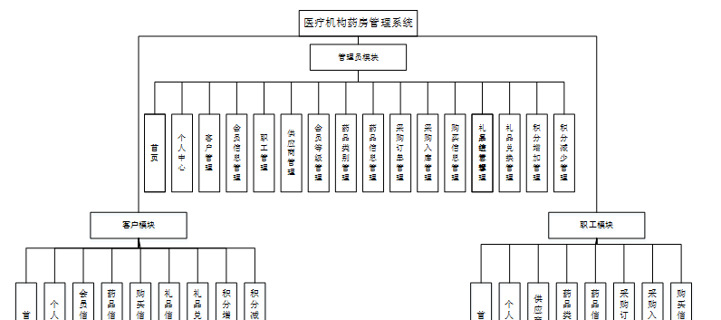

图4-3 系统结构图

### 4.3. 数据库设计

4.3.1 数据库实体

管理员信息结构图，如图4-4所示：

图4-4 管理员信息实体结构图

药品信息管理实体属性图，如图4-5所示：

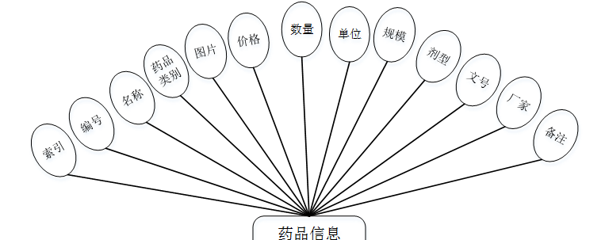

图4-5药品信息管理实体属性图

采购订单管理实体属性图，如图4-6所示：

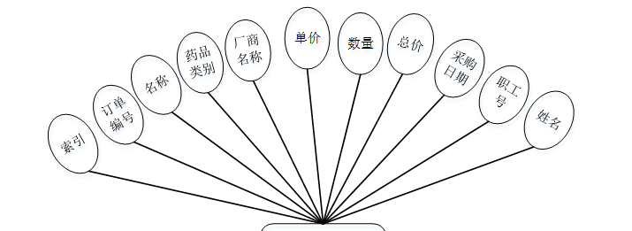

图4-6采购订单管理实体属性图

### 登录注册

登录，通过输入账号，密码，选择角色等信息即可进行系统登录，如图5-1所示。

图5-1登录界面图

注册，在用户注册页面通过填写用户名、密码、姓名、身份证、年龄、联系电话、地址等信息进行注册操作；如图5-2所示。

图5-2注册界面图

### 5.2管理员功能模块

管理员登录进入系统可以查看首页、个人中心、客户管理、会员信息管理、职工管理、供应商管理、会员等级管理、药品类别管理、药品信息管理、采购订单管理、采购入库管理、购买信息管理、礼品信息管理、礼品兑换管理、积分增加管理、积分减少管理等内容，并根据需要对其进行相对应操作；如图5-3所示。

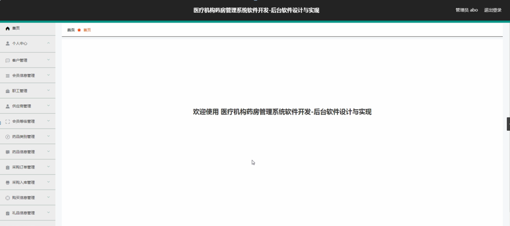

图5-3管理员功能界面图

客户管理，在客户管理页面可以查看索引、用户名、密码、姓名、性别、头像、身份证、年龄、联系电话、地址等信息进行开卡、修改或删除等操作，如图5-4所示。

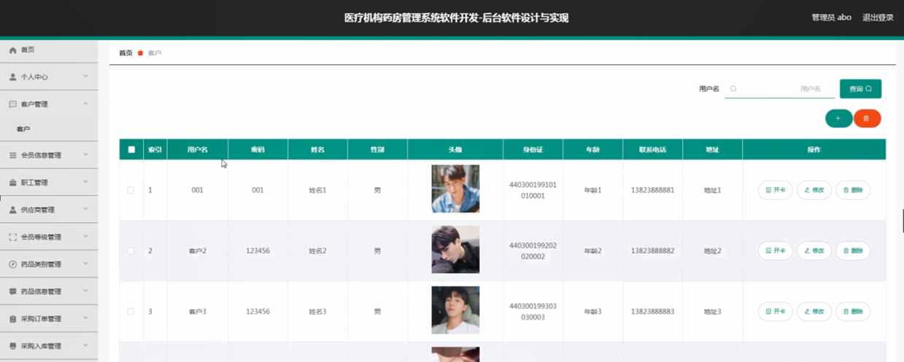

图5-4客户管理界面图

会员信息管理，在会员信息管理页面可以对索引、用户名、会员卡号、姓名、性别、年龄、身份证、地址、联系电话、会员等级、积分、备注等信息进行详情、增加、减少、修改或删除等操作，如图5-5所示。

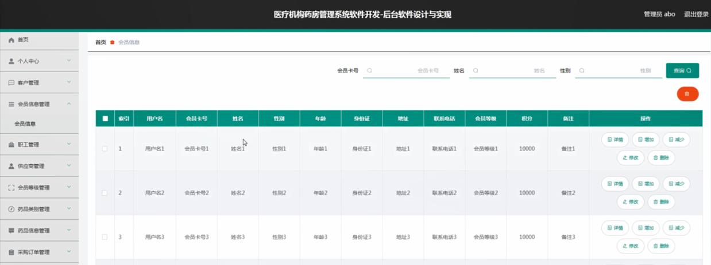

图5-5会员信息管理界面图

职工管理，在职工管理页面可以对索引、职工号、密码、姓名、性别、头像、出生年月、身份证、地址、职务等信息进行修改或删除等操作，如图5-6所示。

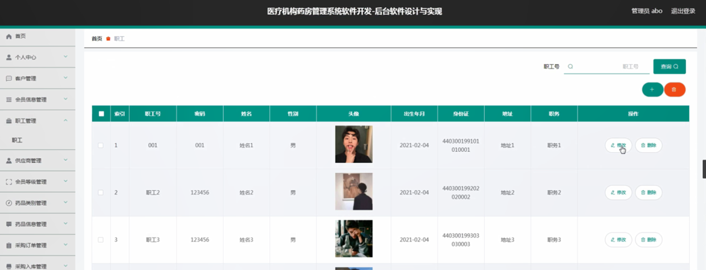

图5-6职工管理界面图

供应商管理，在供应商管理页面可以对索引、账号、厂商名称、联系人、性别、电话、邮箱等信息进行修改或删除等操作，如图5-7所示。

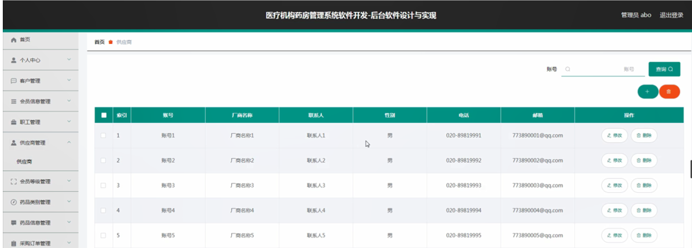

图5-7供应商管理界面图

会员等级管理，在会员等级管理页面可以对索引、会员等级、备注等信息进行修改或删除等操作，如图5-8所示。

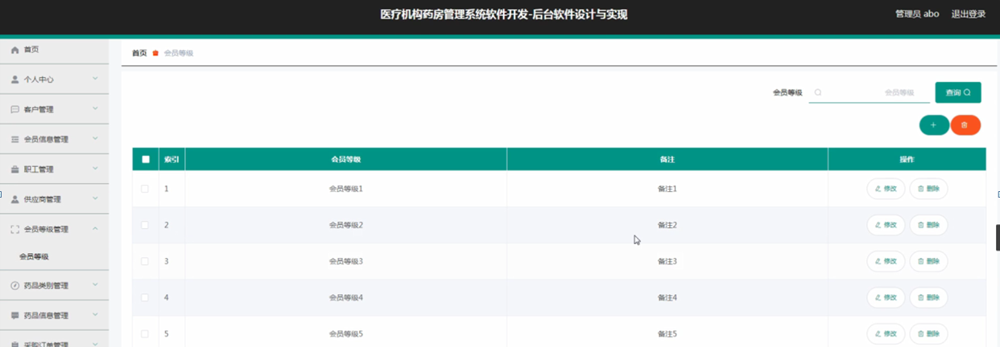

图5-8会员等级管理界面图

药品信息管理，在药品信息管理页面可以对索引、编号、名称、药品类别、图片、价格、数量、单位、规模、剂型、文号、厂家、备注等信息进行详情、修改或删除等操作，如图5-9所示。

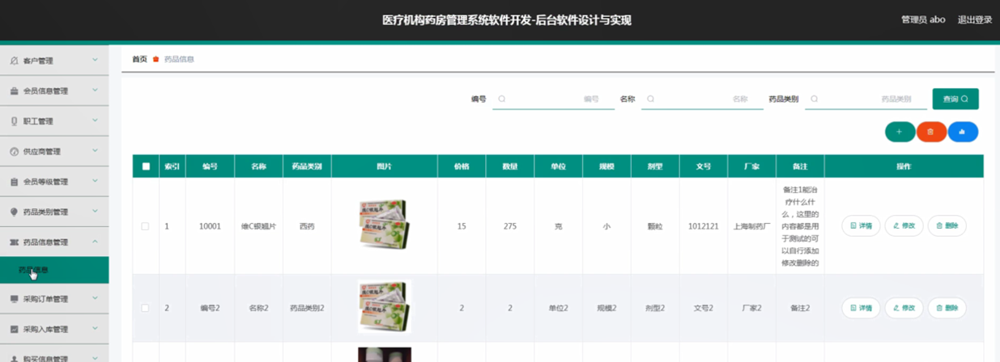

图5-9药品信息管理界面图

采购订单管理，在采购订单管理页面可以对索引、订单编号、名称、药品类别、厂商名称、单价、数量、总价、采购日期、职工号、姓名等信息进行详情、修改或删除等操作，如图5-10所示。

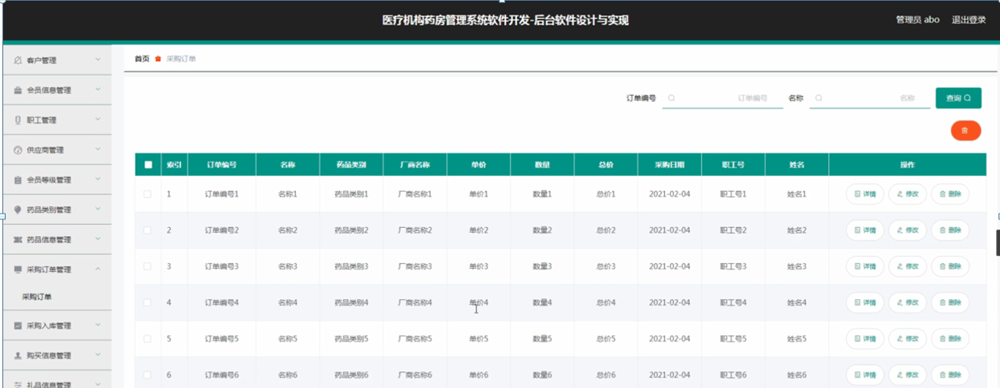

图5-10采购订单管理界面图

采购入库管理，在采购入库管理页面可以对索引、订单编号、单据号、名称、药品类别、数量、入库日期、备注、职工号、姓名等信息进行修改或删除等操作，如图5-11所示。

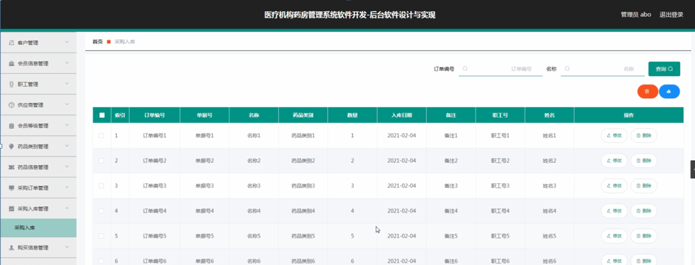

图5-11采购入库管理界面图

购买信息管理，在购买信息管理页面可以对索引、订单编号、名称、药品类别、价格、数量、总价、购买日期、用户名、会员卡号、姓名、是否支付等信息进行修改或删除等操作，如图5-12所示。

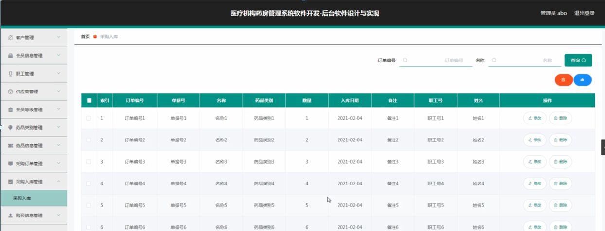

图5-12购买信息管理界面图

**JAVA** **毕设帮助，指导，源码分享，调试部署**

