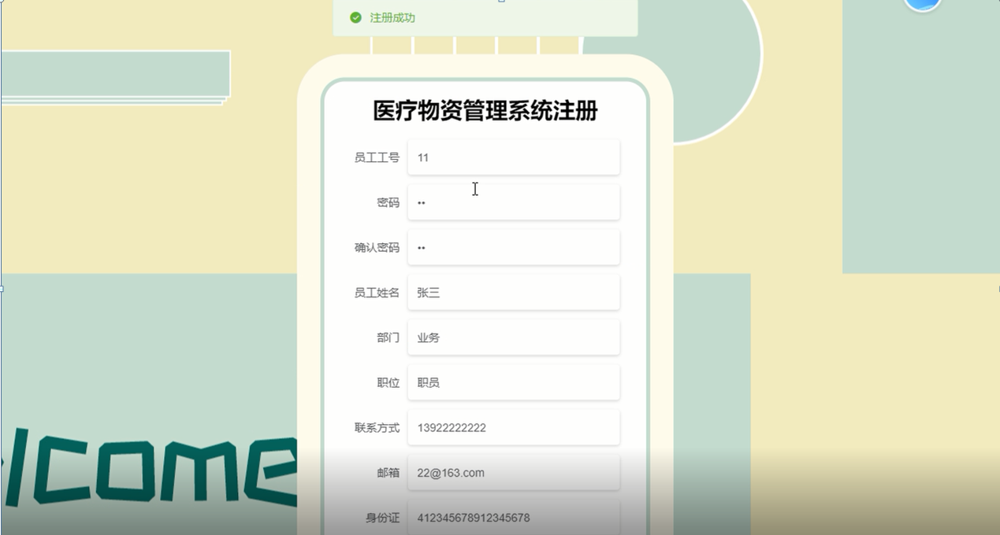

ssm+Vue计算机毕业设计医疗物资管理系统（程序+LW文档）

**项目运行**

**环境配置：**

**Jdk1.8 + Tomcat7.0 + Mysql + HBuilderX** **（Webstorm也行）+ Eclispe（IntelliJ
IDEA,Eclispe,MyEclispe,Sts都支持）。**

**项目技术：**

**SSM + mybatis + Maven + Vue** **等等组成，B/S模式 + Maven管理等等。**

**环境需要**

**1.** **运行环境：最好是java jdk 1.8，我们在这个平台上运行的。其他版本理论上也可以。**

**2.IDE** **环境：IDEA，Eclipse,Myeclipse都可以。推荐IDEA;**

**3.tomcat** **环境：Tomcat 7.x,8.x,9.x版本均可**

**4.** **硬件环境：windows 7/8/10 1G内存以上；或者 Mac OS；**

**5.** **是否Maven项目: 否；查看源码目录中是否包含pom.xml；若包含，则为maven项目，否则为非maven项目**

**6.** **数据库：MySql 5.7/8.0等版本均可；**

**毕设帮助，指导，本源码分享，调试部署** **(** **见文末** **)**

总体设计

根据医疗物资管理系统的功能需求，进行系统设计。

后台功能：员工进入系统可以实现首页、个人中心、医疗物资管理、物资计划管理、物资采购管理、物资入库管理、物资调拨管理等进行操作；

主任进入系统可以实现首页、个人中心、员工管理、物资类型管理、医疗物资管理、物资计划管理、物资采购管理、物资入库管理、物资调拨管理等；

系统对这些功能进行整合，产生的功能结构图如下：

图3-1 系统总体结构图

3.5 数据库设计与实现

在每一个系统中数据库有着非常重要的作用，数据库的设计得好将会增加系统的效率以及系统各逻辑功能的实现。所以数据库的设计我们要从系统的实际需要出发，才能使其更为完美的符合系统功能的实现。

#### **3.4.1** **数据库概念结构设计**

数据库的E-R图反映了实体、实体的属性和实体之间的联系。下面是各个实体以及实体的属性。

管理员信息实体属性图如下所示：

图3-2 管理员信息实体属性图

医疗物资信息实体属性图如下所示：

图3-3医疗物资信息实体属性图

员工信息实体属性图如下所示：

图3-4员工信息实体属性图

物资调拨信息实体属性图如下所示：

图3-5物资调拨信息实体属性图

### 员工功能模块

员工注册，通过注册页面输入员工工号、密码、确认密码、员工姓名、部门、职位、联系方式、邮箱、身份证等信息进行注册操作，如图4-1所示。

图4-1员工注册界面图

员工登录，通过登录页面输入用户名、密码、选择角色等信息进行登录操作，如图4-2所示。

图4-2员工登录界面图

员工登录进入医疗物资管理系统可以查看首页、个人中心、医疗物资管理、物资计划管理、物资采购管理、物资入库管理、物资调拨管理等信息进行详细操作，如图4-3所示。

图4-3员工功能界面图

个人中心：员工在个人中心页面可以填写员工工号、员工姓名、性别、部门、职位、入职时间、联系方式、邮箱、身份证、照片等信息，可进行个人信息修改，如图4-4所示。

图4-4个人中心界面图

医疗物资管理；在医疗物资管理页面中可以查看物资编号、物资名称、物资类型、物资图片、适用范围、储存仓库、数量、规格、来源等内容，并进行详情、物资入库、物资调拨等操作；如图4-5所示。

图4-5医疗物资管理界面图

物资计划管理；在物资计划管理页面中可以新增申请编号、物资编号、物资名称、物资类型、适用范围、数量、规格、来源、员工工号、申请时间、审核回复、审核状态等内容，以及对物资计划管理进行修改和删除等操作；如图4-6所示。

图4-6物资计划管理界面图

物资采购管理；在物资采购管理页面中可以新增申请编号、物资名称、物资类型、物资图片、适用范围、数量、规格、来源、采购时间、登记时间、员工工号、采购合同、审核回复、审核状态等内容，以及对物资采购管理进行详情和删除等操作；如图4-7所示。

图4-7物资采购管理界面图

物资入库管理；在物资入库管理页面中可以查看物资编号、物资名称、物资类型、物资图片、适用范围、储存仓库、来源、申请编号、数量、规格、员工工号、入库时间、入库备注等内容，并进行详情和删除等操作；如图4-8所示。

图4-8物资入库管理界面图

物资调拨管理；在物资调拨管理页面中可以查看物资编号、物资名称、物资类型、物资图片、适用范围、储存仓库、数量、来源、规格、员工工号、出库时间等内容，并进行详情、删除等操作；如图4-9所示。

图4-9物资调拨管理界面图

### 4.2 主任功能模块

主任注册，通过注册页面输入主任账号、密码、确认密码、主任姓名、职称、电话、医院名称、医院地址等信息进行注册操作，如图4-10所示。

图4-10主任注册界面图

主任登录，通过登录页面输入用户名、密码、选择角色等信息进行登录操作，如图4-11所示。

图4-11主任登录界面图

主任登录进入医疗物资管理系统可以查看首页、个人中心、员工管理、物资类型管理、医疗物资管理、物资计划管理、物资采购管理、物资入库管理、物资调拨管理等信息进行详细操作，如图4-12所示。

图4-12主任功能界面图

#### **JAVA** **毕设帮助，指导，源码分享，调试部署**

