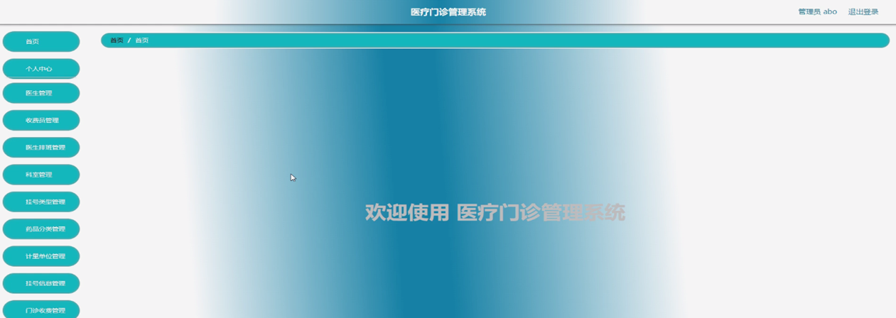
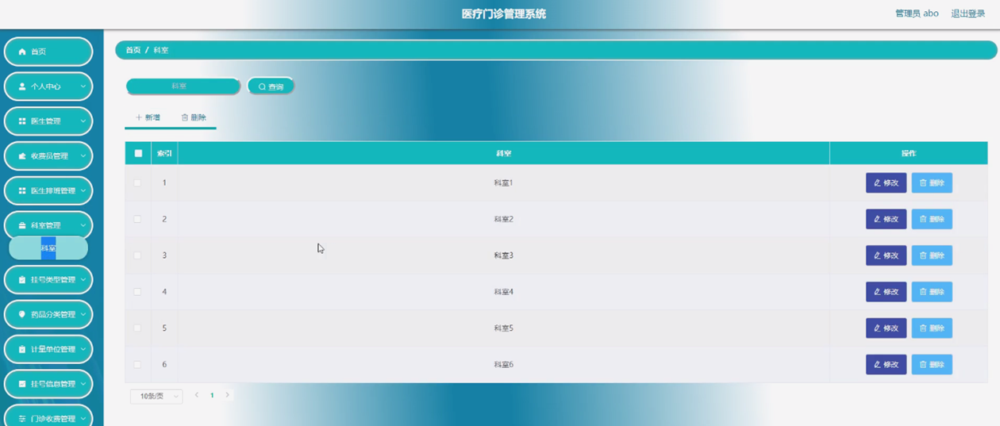

ssm+Vue计算机毕业设计医疗门诊管理系统（程序+LW文档）

**项目运行**

**环境配置：**

**Jdk1.8 + Tomcat7.0 + Mysql + HBuilderX** **（Webstorm也行）+ Eclispe（IntelliJ
IDEA,Eclispe,MyEclispe,Sts都支持）。**

**项目技术：**

**SSM + mybatis + Maven + Vue** **等等组成，B/S模式 + Maven管理等等。**

**环境需要**

**1.** **运行环境：最好是java jdk 1.8，我们在这个平台上运行的。其他版本理论上也可以。**

**2.IDE** **环境：IDEA，Eclipse,Myeclipse都可以。推荐IDEA;**

**3.tomcat** **环境：Tomcat 7.x,8.x,9.x版本均可**

**4.** **硬件环境：windows 7/8/10 1G内存以上；或者 Mac OS；**

**5.** **是否Maven项目: 否；查看源码目录中是否包含pom.xml；若包含，则为maven项目，否则为非maven项目**

**6.** **数据库：MySql 5.7/8.0等版本均可；**

**毕设帮助，指导，本源码分享，调试部署** **(** **见文末** **)**

### 系统设计主要功能

通过市场调研及咨询研究，了解了医疗门诊管理系统及管理者的使用需求，于是制定了管理员、收费员和医生等模块。功能结构图如下所示：

图4-1系统功能结构图

### 4.2 数据库设计

#### 4.2.1 数据库设计规范

数据可设计要遵循职责分离原则，即在设计时应该要考虑系统独立性，即每个系统之间互不干预不能混乱数据表和系统关系。

数据库命名也要遵循一定规范，否则容易混淆，数据库字段名要尽量做到与表名类似，多使用小写英文字母和下划线来命名并尽量使用简单单词。

#### 4.2.2 E/R图

医生管理E/R图，如下所示：

图4-2 医生管理E/R图

医生排班管理E/R图，如下所示：

图4-3医生排班管理E/R图

门诊发药管理E/R图，如下所示。

图4-4门诊发药管理E/R图

### 管理员功能模块

管理员登录，管理员通过输入用户名、密码、角色进行登录，如图5-1所示。

图5-1管理员登录界面图

管理员通过登录进入医疗门诊管理系统可查看个人中心、医生管理、收费员管理、医生排班管理、科室管理、挂号类型管理、药品分类管理、计量单位管理、挂号信息管理、门诊收费管理、月度挂号统计管理等内容，如图5-2所示。

图5-2管理员功能界面图

医生管理，管理员可在医生管理页面查看医生工号、医生姓名、科室、职称、性别、医龄、联系电话、头像等内容，还可进行新增、修改、医生排班或删除等操作，如图5-3所示。

图5-3医生管理界面图

收费员管理，管理员可在收费员管理页面查看收费员账号、收费员姓名、性别、年龄、收费员手机等内容，还可进行新增、修改或删除等操作，如图5-4所示。

图5-4收费员管理界面图

医生排班管理，管理员可在医生排班管理页面查看医生工号、医生姓名、科室、职称、性别、医龄、头像、挂号费、挂号类型等内容，还可进行修改或删除等操作，如图5-5所示。

图5-5医生排班管理界面图

科室管理，管理员可在科室管理页面进行查询、新增、修改或删除等操作，如图5-6所示。

图5-6科室管理界面图

计量单位管理，管理员可在计量单位管理页面进行查询、新增、修改或删除等操作，如图5-7所示。

图5-7计量单位管理界面图

挂号信息管理，管理员可在挂号信息管理页面查看挂号编号、患者姓名、身份证、患者手机、性别、年龄、收费员账号、收费员姓名、收费员手机、挂号时间、医生工号、医生姓名、科室、挂号费、挂号类型等内容，还可进行统计、修改或删除等操作，如图5-8所示。

图5-8挂号信息管理界图面

门诊收费管理，管理员可在门诊收费管理页面查看患者姓名、身份证、患者手机、收费员账号、收费员姓名、收费员手机、挂号费、检查费、药品费、退费、合计费用、结清状态、添加时间等内容，看进行统计、修改或删除等操作，如图5-9所示。

图5-9门诊收费管理界图面

月度挂号统计管理，管理员可在月度挂号统计管理查看统计时间、挂号费、统计编号等内容，还可进行新增、统计、修改或删除等操作，如图5-10所示。

图5-10月度挂号统计管理界面图

5.2收费员功能模块

收费员通过登录进入系统可查看个人中心、患者信息管理、挂号信息管理、门诊收费管理、药品信息管理、药品入库管理、药品出库管理、药品损耗管理、门诊发药管理、门诊退药管理、药品回收管理、开药信息管理、检查信息管理等内容，如图5-11所示。

图5-11收费员功能界面图

患者信息管理，收费员可在患者信息管理页面查看患者姓名、身份证、患者手机、性别、年龄、收费员账号、收费员姓名、收费员手机、登记时间、患者备注等内容，还可进行新增、修改或删除等操作，如图5-12所示。

图5-12患者信息管理界面图

#### **JAVA** **毕设帮助，指导，源码分享，调试部署**

