ssm+Vue计算机毕业设计医院人事及科室病区管理（程序+LW文档）

**项目运行**

**环境配置：**

**Jdk1.8 + Tomcat7.0 + Mysql + HBuilderX** **（Webstorm也行）+ Eclispe（IntelliJ
IDEA,Eclispe,MyEclispe,Sts都支持）。**

**项目技术：**

**SSM + mybatis + Maven + Vue** **等等组成，B/S模式 + Maven管理等等。**

**环境需要**

**1.** **运行环境：最好是java jdk 1.8，我们在这个平台上运行的。其他版本理论上也可以。**

**2.IDE** **环境：IDEA，Eclipse,Myeclipse都可以。推荐IDEA;**

**3.tomcat** **环境：Tomcat 7.x,8.x,9.x版本均可**

**4.** **硬件环境：windows 7/8/10 1G内存以上；或者 Mac OS；**

**5.** **是否Maven项目: 否；查看源码目录中是否包含pom.xml；若包含，则为maven项目，否则为非maven项目**

**6.** **数据库：MySql 5.7/8.0等版本均可；**

**毕设帮助，指导，本源码分享，调试部署** **(** **见文末** **)**

### **系统设计主要功能**

通过市场调研及咨询研究，了解了用户的使用需求，于是制定了管理员、医生模块。其功能结构图如下图4-1所示：

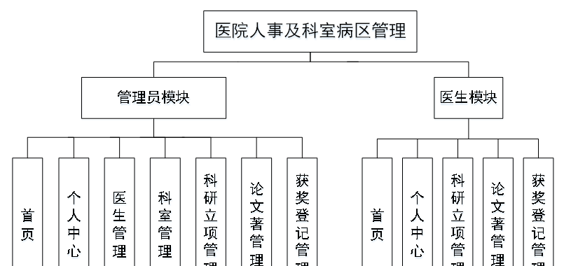

图4.1系统功能结构图

### **4.2** **数据库设计**

#### 4.2.1 数据库设计规范

数据可设计要遵循职责分离原则，即在设计时应该要考虑系统独立性，即每个系统之间互不干预不能混乱数据表和系统关系。

数据库命名也要遵循一定规范，否则容易混淆，数据库字段名要尽量做到与表名类似。

#### 4.2.2 E-R图

论文著信息E-R图，如图4-2所示：

图4-2 论文著信息E-R图

获奖登记信息E-R图，如图4-3所示：

图4-3获奖登记信息E-R图

医生信息E-R图如图4-4所示。

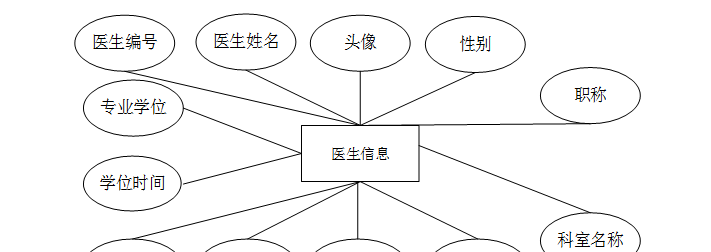

图4-4医生信息E-R图

### **管理员功能模块**

管理员登录，通过登录页面输入用户名、密码、选择角色等信息进行登录操作，如图5-1所示。

图5-1管理员登录界面图

管理员登录进入医院人事及科室病区管理可以查看首页、个人中心、医生管理、科室管理、科研立项管理、论文著管理、获奖登记管理等信息进行相应操作，如图5-2所示。

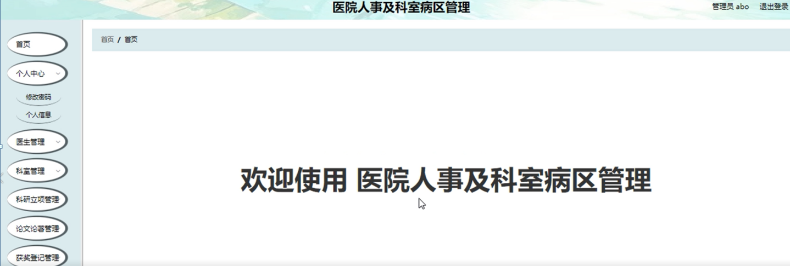

图5-2管理员功能界面图

医生管理；在医生管理页面中可以查看医生编号、医生姓名、头像、性别、职称、科室名称、出生日期、专业、文件程度、电话、学位时间、专业学位等内容，并进行详情、修改或删除等操作；如图5-3所示。

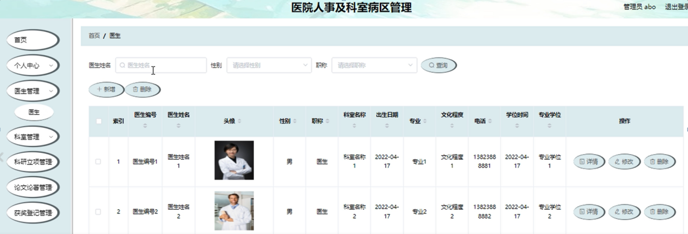

图5-3医生管理界面图

科室管理：在科室管理页面中可以查看科室编号、科室名称、英文名称等内容，并进行详情、修改或删除等操作，如图5-4所示。

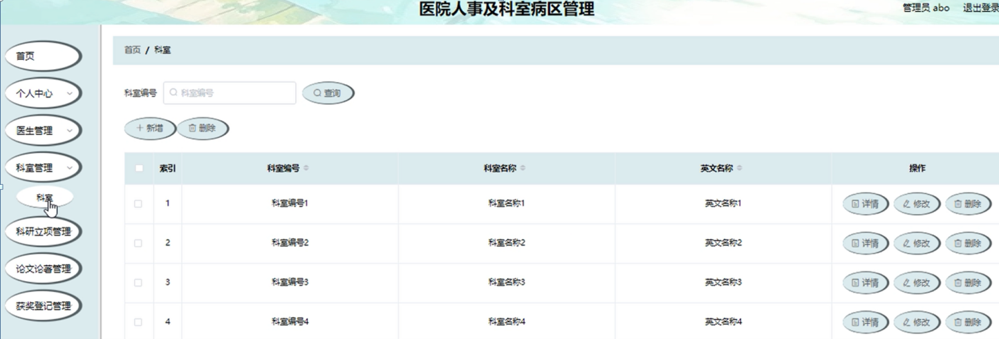

图5-4科室管理界面图

科研立项管理；在科研立项管理页面中可以查看项目编号、项目名称、级别、委托单位、合同编号、合同金额、总金额、医生编号、医生姓名、职称、科室名称、立项日期等内容，并进行详情、修改、删除等操作；如图5-5所示。

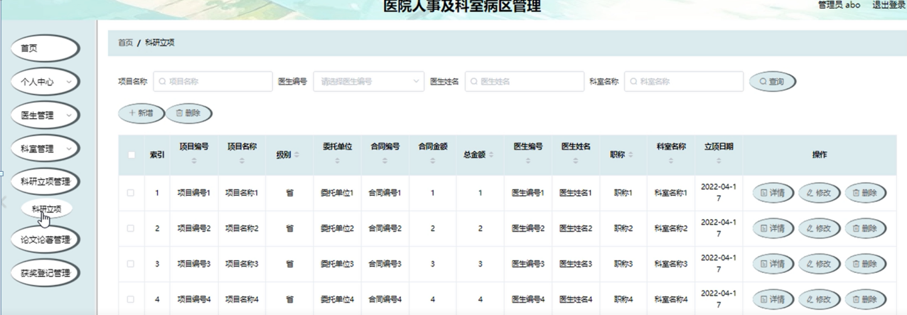

图5-5科研立项管理界面图

论文著管理；在论文著管理页面中可以查看论文标题、论文论著、医生编号、医生姓名、登记日期等内容，并进行详情、修改、删除等操作；如图5-6所示。

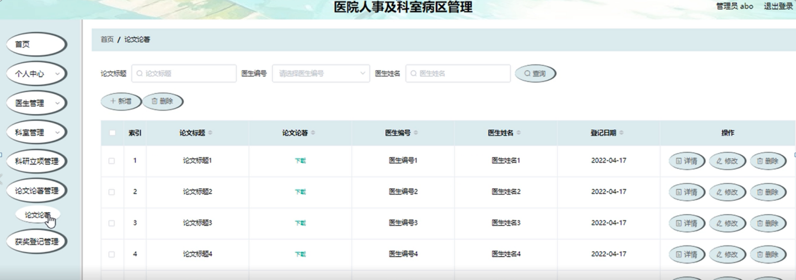

图5-6论文著管理界面图

获奖登记管理；在获奖登记管理页面中可以查看医生编号、医生姓名、获奖名称、颁发单位、获奖日期等内容，并进行详情、修改、删除等操作；如图5-7所示。

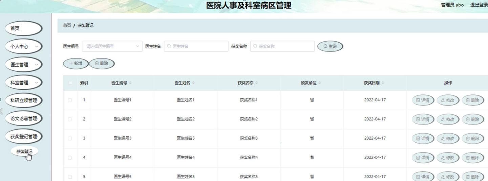

图5-7获奖登记管理界面图

### **5.2** **医生功能模块**

医生注册，在注册页面通过填写医生编号、医生姓名、密码、确认密码、专业、文化程度、电话、专业学位等信息进行注册，在登录页面通过填写账号、密码等信息进行登录，如图5-8所示。

图5-8医生注册、登录界面图

医生登录进入医院人事及科室病区管理后台查看首页、个人中心、科研立项管理、论文著管理、获奖登记管理等内容进行相应操作，如图5-9所示。

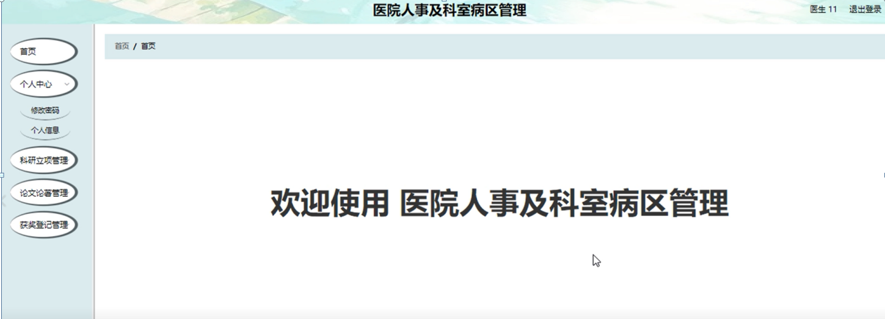

图5-9医生功能界面图

个人中心：医生通过自己的个人中心，可进行修改密码，也可对个人信息进行编辑医生编号、医生姓名、头像、性别、职称、科室名称、出生日期、专业、文件程度、电话、学位时间、专业学位，进行修改操作，如图5-10
5-11所示

图5-10修改密码界面图

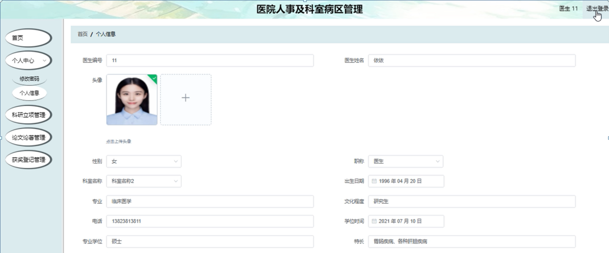

图5-11个人信息界面图

科研立项管理；在科研立项管理页面中查看项目编号、项目名称、级别、委托单位、合同编号、合同金额、总金额、医生编号、医生姓名、职称、科室名称、立项日期等内容，进行详情操作，如图5-12所示。

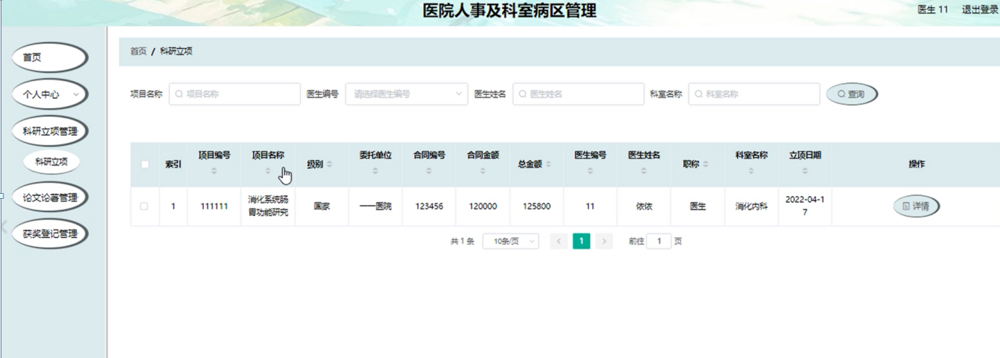

图5-12科研立项管理界面图

**JAVA** **毕设帮助，指导，源码分享，调试部署**

