ssm+Vue计算机毕业设计医院人事管理系统（程序+LW文档）

**项目运行**

**环境配置：**

**Jdk1.8 + Tomcat7.0 + Mysql + HBuilderX** **（Webstorm也行）+ Eclispe（IntelliJ
IDEA,Eclispe,MyEclispe,Sts都支持）。**

**项目技术：**

**SSM + mybatis + Maven + Vue** **等等组成，B/S模式 + Maven管理等等。**

**环境需要**

**1.** **运行环境：最好是java jdk 1.8，我们在这个平台上运行的。其他版本理论上也可以。**

**2.IDE** **环境：IDEA，Eclipse,Myeclipse都可以。推荐IDEA;**

**3.tomcat** **环境：Tomcat 7.x,8.x,9.x版本均可**

**4.** **硬件环境：windows 7/8/10 1G内存以上；或者 Mac OS；**

**5.** **是否Maven项目: 否；查看源码目录中是否包含pom.xml；若包含，则为maven项目，否则为非maven项目**

**6.** **数据库：MySql 5.7/8.0等版本均可；**

**毕设帮助，指导，本源码分享，调试部署** **(** **见文末** **)**

系统结构设计

系统设计主要是管理员登录后对整个系统相关操作进行处理，可进行管理员的添加和删除，首页、个人中心、医生管理、应聘信息管理、个人档案管理、科室信息管理、合同信息管理、考勤打卡管理、考勤信息管理、工资信息管理、调职信息管理、复职信息管理、离职信息管理等操作管理。

系统的功能结构图如下图所示。

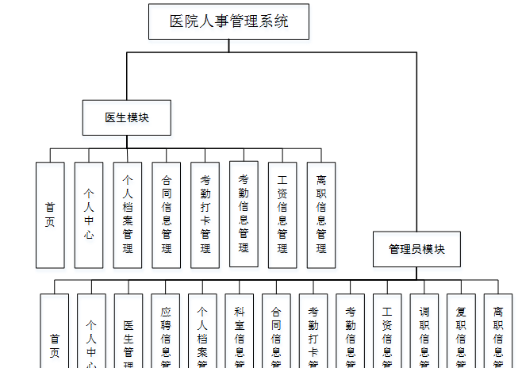

图4-1系统功能结构图

4.3数据库设计

系统里尤为关键的部分是在数据库方面，需要十分清晰的思路，所以从开始的设计时需要做到确立模块之间的联系，从而可以很明确的建立表间的联系和表中所需的内容。设计数据库还有一点是减少表的繁杂的创建，所以联系很关键，可以大大的减少，数据表中重复的事项。由此可以保证数据的完整和统一，不会造成数据的错误和重复，并且可以使数据得到数据库安全的保护，会使用户更加的放心。

4.3.1 E-R图设计

概念设计是整个数据库设计的关键，在概念设计阶段，由需求分析得到了E-
R模型。E-R图是识别功能模型与数据模型间关联关系的，在主题数据库的抽取和规范化的过程中，采用的是简化的E-R图表示方法，从而避免过繁过细的E-
R图表示影响规划的直观和可用性。是对现实世界的抽象和概括，是数据库设计人员进行数据可设计的有力工具，能够方便直接地表达应用中的各种语义知识，令一方面它简单、清晰、易于用户理解。

医生管理ER图如下图所示。

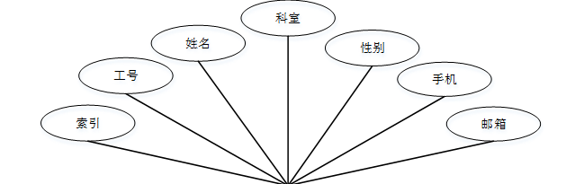

图4-2医生管理ER图

应聘信息管理ER图如下图所示。

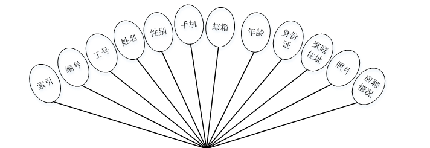

图4-3应聘信息管理ER图

个人档案管理ER图如下图所示。

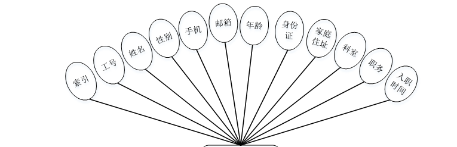

图4-4个人档案管理ER图

登录注册模块的实现

系统登录模块，为确保系统安性，系统操作员只有在登录界面输入正确的管理员名、密码和角色，单击“登录”按钮后才能够进入本系统的主界面。

登录流程图如下所示。

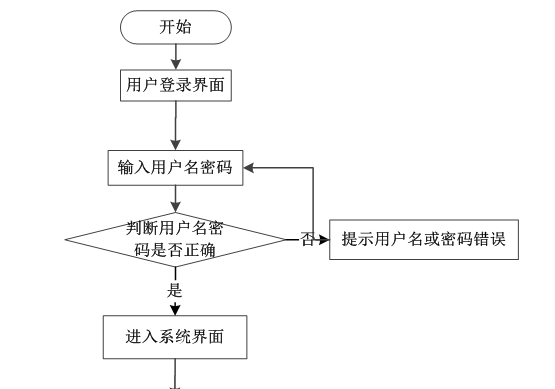

图5-1登录流程图

登录界面如下图所示。

图5-2登录界面图

医生注册，在医生注册页面通过填写工号、密码、姓名、手机、邮箱等信息进行注册操作，如图5-3所示。

图5-3医生注册界面图

5.2管理员功能模块

管理员登录进入医院人事管理系统可以查看首页、个人中心、医生管理、应聘信息管理、个人档案管理、科室信息管理、合同信息管理、考勤打卡管理、考勤信息管理、工资信息管理、调职信息管理、复职信息管理、离职信息管理等信息进行相应操作，如图5-4所示。

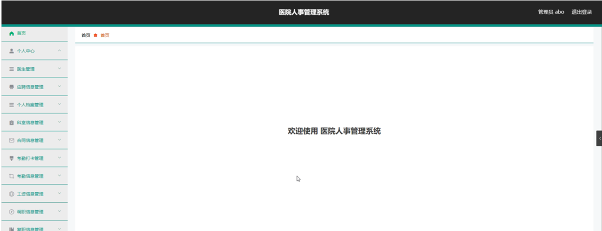

图5-4管理员功能界面图

医生管理，在医生管理页面中可以对索引、工号、姓名、科室、性别、手机、邮箱等信息进行详情、发放工资、调职、复职、新建应聘信息、修改或删除等操作，如图5-5所示。

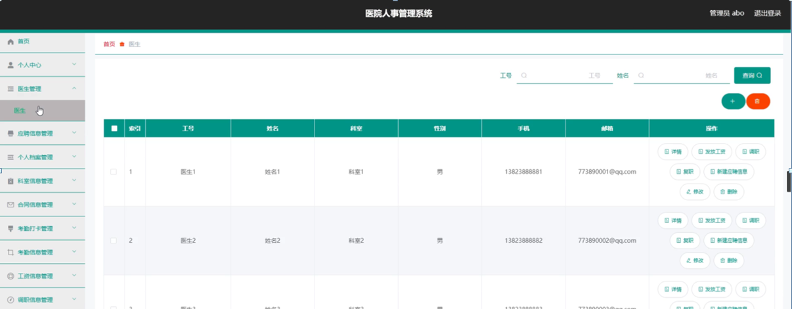

图5-5医生管理界面图

应聘信息管理，在应聘信息管理页面中可以对索引、编号、工号、姓名、性别、手机、邮箱、年龄、身份证、家庭住址、照片、应聘情况等信息进行详情、新建员工档案、修改或删除等详细操作，如图5-6所示。

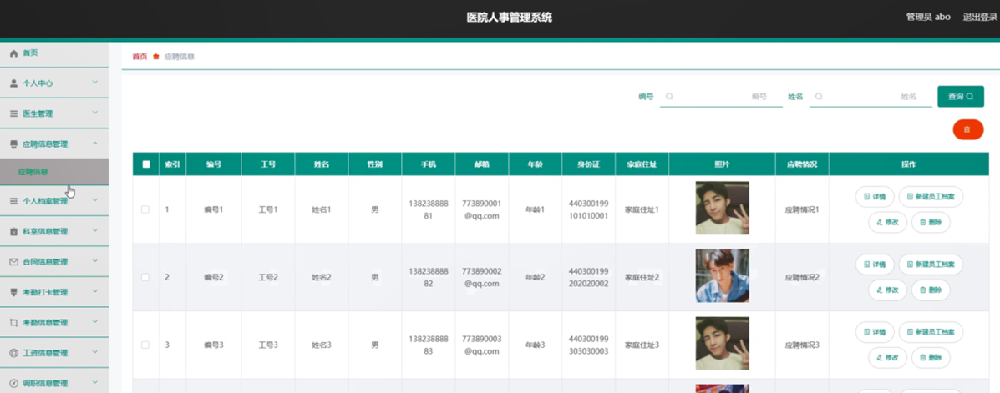

图5-6应聘信息管理界面图

个人档案管理，在个人档案管理页面中可以对索引、工号、姓名、性别、手机、邮箱、年龄、身份证、家庭住址、科室、职务、入职时间等信息进行详情、签证合同、修改或删除等详细操作，如图5-7所示。

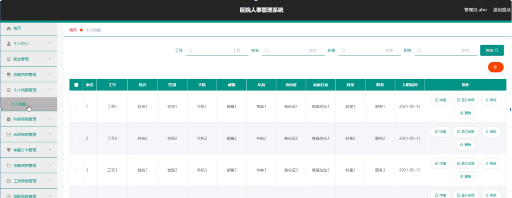

图5-7个人档案管理界面图

科室信息管理，在科室信息管理页面中可以对索引、科室等信息进行详情，修改或删除等详细操作，如图5-8所示。

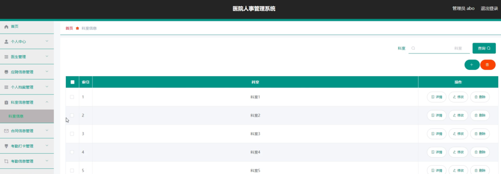

图5-8科室信息管理界面图

合同信息管理，在合同信息管理页面中可以对索引、合同编号、工号、姓名、部门、合同名称、合同附件、签订日期等信息进行详情，修改或删除等详细操作，如图5-9所示。

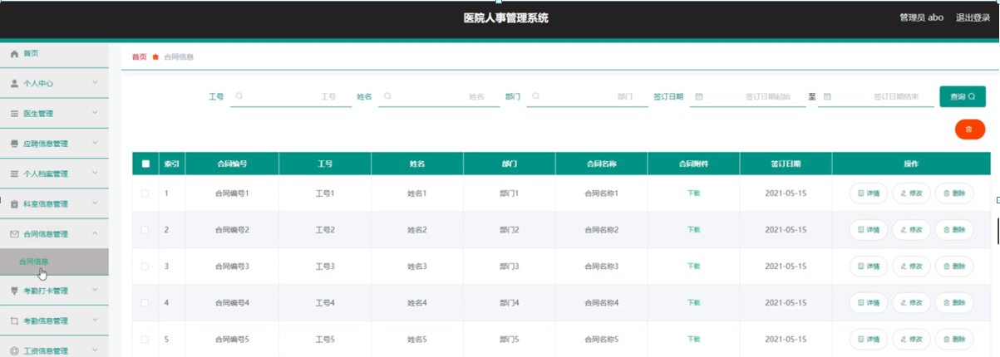

图5-9合同信息管理界面图

考勤打卡管理，在考勤打卡管理页面中可以对索引、工号、姓名、部门、类型、时间等信息进行详情、考勤或删除等详细操作，如图5-10所示。

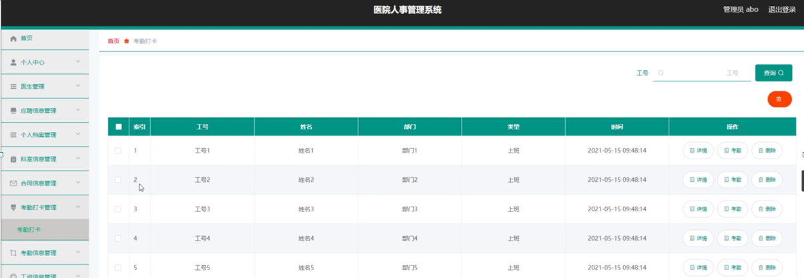

图5-10考勤打卡管理界面图

考勤信息管理，在考勤信息管理页面中可以对索引、工号、姓名、部门、日常考勤、是否加班、是否出差、是否休假、考勤日期等信息进行详情或删除等详细操作，如图5-11所示。

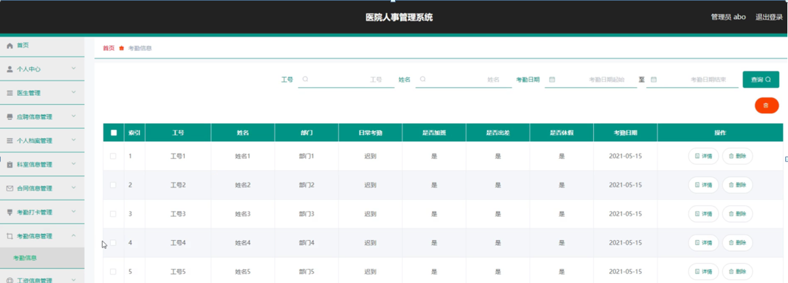

图5-11考勤信息管理界面图

工资信息管理，在工资信息管理页面中可以对索引、工号、姓名、基本工资、加班补助、高温补贴、考勤异常扣款、实发工资、收款账号、备注等信息进行详情，修改或删除等详细操作，如图5-12所示。

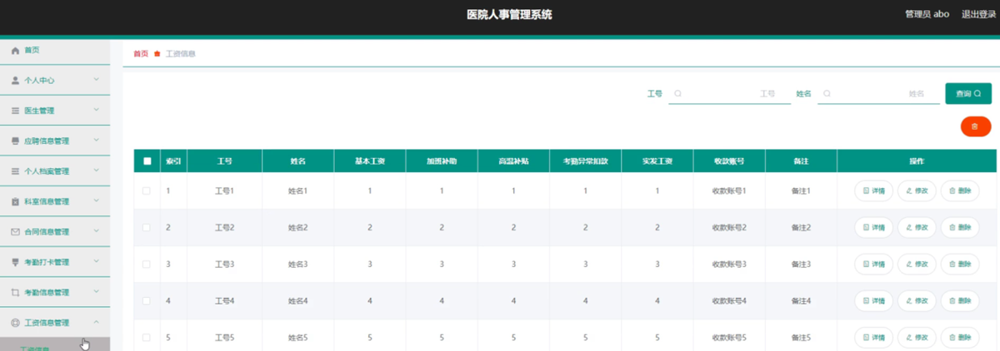

图5-12工资信息管理界面图

#### **JAVA** **毕设帮助，指导，源码分享，调试部署**

