ssm+Vue计算机毕业设计医院住院管理系统（程序+LW文档）

**项目运行**

**环境配置：**

**Jdk1.8 + Tomcat7.0 + Mysql + HBuilderX** **（Webstorm也行）+ Eclispe（IntelliJ
IDEA,Eclispe,MyEclispe,Sts都支持）。**

**项目技术：**

**SSM + mybatis + Maven + Vue** **等等组成，B/S模式 + Maven管理等等。**

**环境需要**

**1.** **运行环境：最好是java jdk 1.8，我们在这个平台上运行的。其他版本理论上也可以。**

**2.IDE** **环境：IDEA，Eclipse,Myeclipse都可以。推荐IDEA;**

**3.tomcat** **环境：Tomcat 7.x,8.x,9.x版本均可**

**4.** **硬件环境：windows 7/8/10 1G内存以上；或者 Mac OS；**

**5.** **是否Maven项目: 否；查看源码目录中是否包含pom.xml；若包含，则为maven项目，否则为非maven项目**

**6.** **数据库：MySql 5.7/8.0等版本均可；**

**毕设帮助，指导，本源码分享，调试部署** **(** **见文末** **)**

### 总体设计

根据医院住院管理功能需求，进行系统设计。

CSS+DIV进行页面布局。CSS+DIV
是一种网页的布局方法,这一种网页布局方法有别于传统的HTML网页设计语言中的表格（Table）定位方式,真正地达到了w3c内容与表现相分离，但是不是很兼容老版本的浏览器。

使用 JAVA 母版页可以为应用程序中的页创建一致的布局，各个模块继承母版页。

后台由管理员,医生两个角色组成，主要功能包括首页，个人中心，医生管理，病房信息管理，医生信息管理，入院登记管理，出院信息管理等；

系统对这些功能进行整合，产生的功能结构图如下：

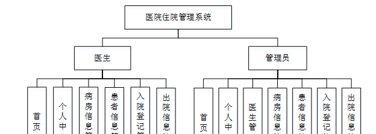

图4-1 系统总体结构图

### 4.2数据库设计

#### 4.2.1概念模型设计

概念模型是对现实中的问题出现的事物的进行描述，ER图是由实体及其关系构成的图，通过E-R图可以清楚地描述系统涉及到的实体之间的相互关系。

医生管理实体图如图4-2所示：

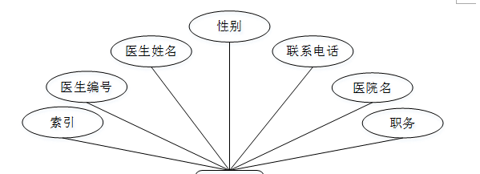

图4-2医生管理实体图

病房信息管理实体图如图4-3所示：

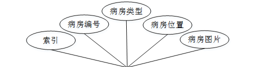

图4-3病房信息管理实体图

患者信息管理实体图如图4-4所示：

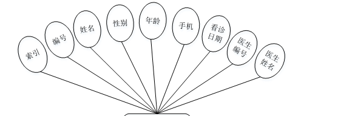

图4-4患者信息管理实体图

### 登录功能模块

运行系统，首先进入登录界面，按照登录界面的要求填写相应的“用户名”和“密码”以及用户类型，点击“登录”然后系统判断填写是否正确，若正确进入相应的界面，否则给出要求先注册信息。具体流程如图5-1所示

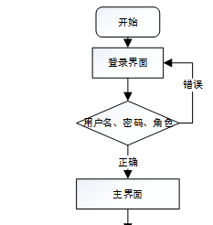

图5-1登录流程图

图5-2登录界面图

### 5.2管理员功能模块

管理员登录系统后，可以对首页，个人中心，医生管理，病房信息管理，患者信息管理，入院登记管理，出院信息管理等功能进行相应的操作管理，如图5-3所示。

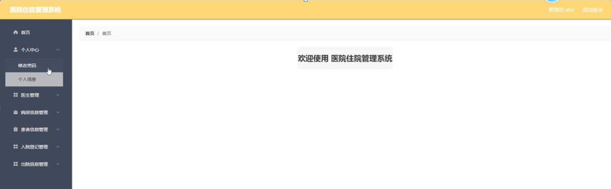

图5-3管理员功能界面图

医生管理，在医生管理页面可以对索引，医生编号，医生姓名，性别，联系电话，医院名，职务等内容进行详情,修改,删除操作，如图5-4所示。

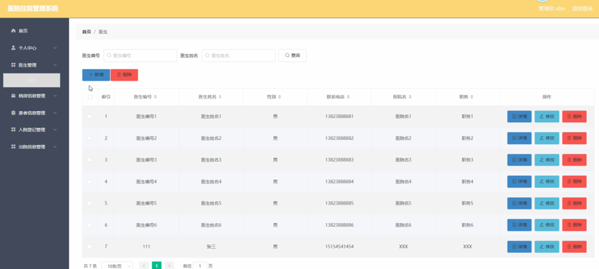

图5-4医生管理界面图

病房信息管理，在病房信息管理页面可以对索引，病房编号，病房类型，病房位置，病房图片等信息进行详情，修改，删除操作，如图5-5所示。

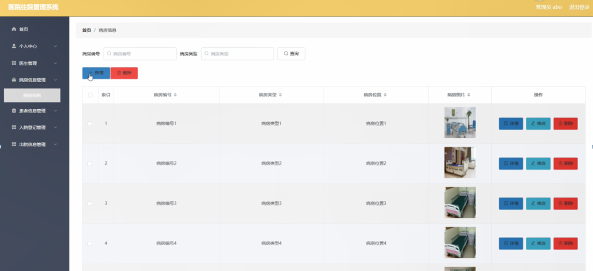

图5-5病房信息管理界面图

患者信息管理，在患者信息管理页面可以对索引，编号，姓名，性别，年龄，手机，看诊日期，医生编号，医生姓名等信息进行详情,修改,删除操作，如图5-6所示。

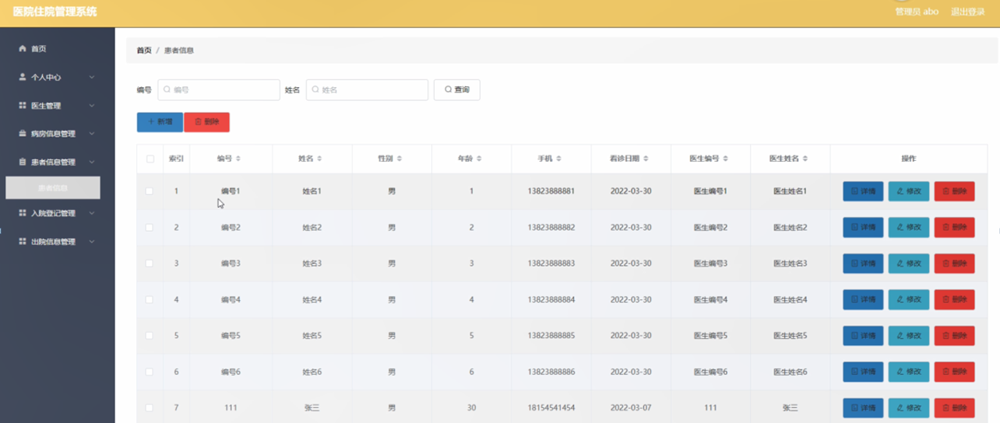

图5-6患者信息管理界面图

入院登记管理，在入院登记管理页面可以对索引，编号，医生姓名，性别，年龄，病房编号，住院日期，住院备注，医生编号，医生姓名等内容进行详情，删除操作，如图5-7所示。

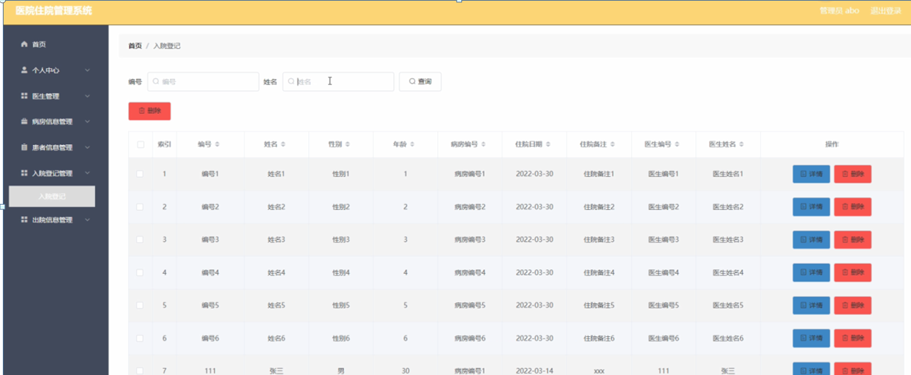

图5-7入院登记管理界面图

出院信息管理，在出院信息管理页面可以对索引，编号，姓名，性别，年龄，病房编号，出院时间，出院备注，医生编号，医生姓名等内容进行详情，删除操作，如图5-8所示。

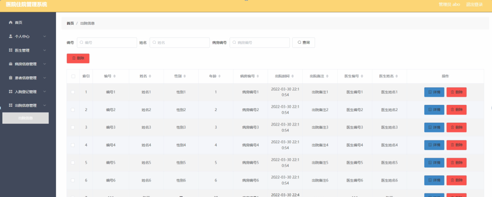

图5-8出院信息管理界面图

### 5.3医生功能模块

医生登录进入系统可以对首页，个人中心，病房信息管理，患者信息管理，入院登记管理，出院信息管理等功能进行相应操作，如图5-9所示。

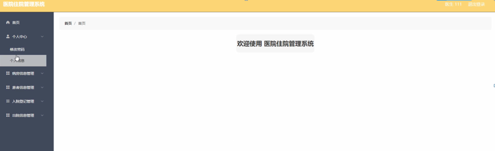

图5-9医生功能界面图

个人中心，在个人中心页面可以对医生编号，医生姓名，性别，联系电话，职务，医院名，职务等内容进行修改操作，如图5-10所示。

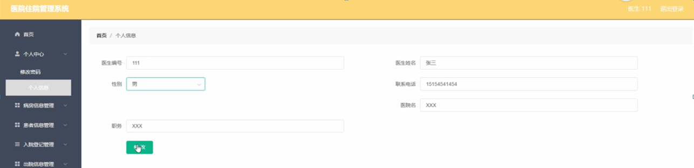

图5-10个人中心界面图

病房信息管理，在病房信息管理页面可以对索引，病房编号，病房类型，病房位置，病房图片等内容进行详情操作，如图5-11所示。

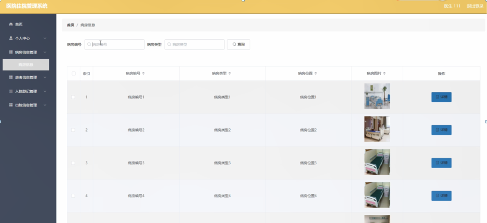

图5-11病房信息管理界面图

入院登记管理，在入院登记管理页面可以对索引，编号，医生姓名，性别，年龄，病房编号，住院日期，住院备注，医生编号，医生姓名等内容进行详情，出院，修改，删除操作，如图5-12所示。

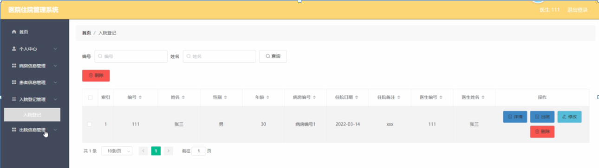

图5-12入院登记管理界面图

#### **JAVA** **毕设帮助，指导，源码分享，调试部署**

