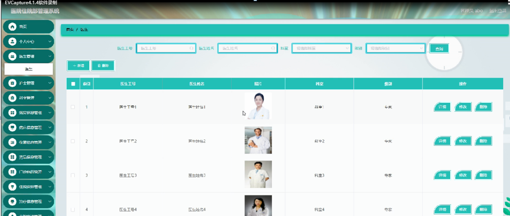

ssm+Vue计算机毕业设计医院住院部管理系统（程序+LW文档）

**项目运行**

**环境配置：**

**Jdk1.8 + Tomcat7.0 + Mysql + HBuilderX** **（Webstorm也行）+ Eclispe（IntelliJ
IDEA,Eclispe,MyEclispe,Sts都支持）。**

**项目技术：**

**SSM + mybatis + Maven + Vue** **等等组成，B/S模式 + Maven管理等等。**

**环境需要**

**1.** **运行环境：最好是java jdk 1.8，我们在这个平台上运行的。其他版本理论上也可以。**

**2.IDE** **环境：IDEA，Eclipse,Myeclipse都可以。推荐IDEA;**

**3.tomcat** **环境：Tomcat 7.x,8.x,9.x版本均可**

**4.** **硬件环境：windows 7/8/10 1G内存以上；或者 Mac OS；**

**5.** **是否Maven项目: 否；查看源码目录中是否包含pom.xml；若包含，则为maven项目，否则为非maven项目**

**6.** **数据库：MySql 5.7/8.0等版本均可；**

**毕设帮助，指导，本源码分享，调试部署** **(** **见文末** **)**

### 功能结构

为了更好的去理清本系统整体思路，对该系统以结构图的形式表达出来，设计实现该医院住院部管理系统的功能结构图如下所示：

图4-1 系统总体结构图

### 4.2数据库设计

#### 4.2.1数据库E/R图

ER图是由实体及其关系构成的图，通过E/R图可以清楚地描述系统涉及到的实体之间的相互关系。在系统中对一些主要的几个关键实体如下图：

(1)病房信息E/R图如下所示：

图4-2病房信息E/R图

(2)仪器信息E/R图如下所示：

图4-3仪器信息E/R图

系统登录，管理员，医生和护士进入系统前在登录页面根据要求填写账号，密码，验证码和选择角色等信息，点击登录进行登录操作，如图5-1所示。

图5-1系统登录界面图

### 5.1管理员功能模块

管理员登陆系统后，可以查看首页，个人中心，医生管理，护士管理，科室管理，病房信息管理，病床信息管理，仪器信息管理，药品信息管理，门诊病历管理，住院安排管理，治疗信息管理，出院申请管理，系统管理等功能，还能对每个功能逐一进行相应操作，如图5-2所示。

图5-2管理员功能界面图

医生管理，在医生管理页面可以对索引，医生工号，医生姓名，照片，科室，级别等内容进行详情，修改和删除操作，如图5-3所示。

图5-3医生管理界面图

护士管理，在护士管理页面可以对索引，护士工号，护士姓名，头像，性别，科室，联系电话等内容进行详情，修改和删除等操作，如图5-4所示。

图5-4护士管理界面图

病房信息管理，在病房信息管理页面可以对索引，病房号，图片，科室，病房位置等内容进行详情，修改和删除等操作，如图5-5所示。

图5-5病房信息管理界面图

病床信息管理，在病床信息管理页面可以对索引，病床号，图片，使用状态，科室，病房号，病床价格等内容进行详情，修改和删除等操作，如图5-6所示。

图5-6病床信息管理界面图

仪器信息管理，在仪器信息管理页面可以对索引，仪器编号，仪器名称，仪器图片，仪器数量，仪器价格，仪器用途等内容进行详情，修改和删除等操作，如图5-7所示。

图5-7仪器信息管理界面图

药品信息管理，在药品信息管理页面可以对索引，药品编号，药品名称，药品图片，剂型，生产日期，药品价格，数量等内容进行详情，修改和删除操作，如图5-8所示。

图5-8药品信息管理界面图

门诊病历管理，在门诊病历管理页面可以对索引，病历编号，患者姓名，身份证，家庭住址，药敏史，临床诊断，护士工号，护士姓名，科室，医生工号，医生姓名，诊断时间等内容进行详情，修改和删除等操作，如图5-9所示。

图5-9门诊病历管理界面图

### 5.2医生功能

医生登陆系统，可以查看首页，个人中心，门诊病历管理，住院安排管理，治疗信息管理，出院申请管理，系统管理等功能，还能对每个功能逐一进行相应操作，如图5-10所示。

图5-10医生功能界面图

住院安排管理，在住院安排管理页面可以对索引，病床号，病房号，病床价格，病历编号，患者姓名，身份证，医生工号，护士工号，护士姓名等内容进行详情和删除等操作，如图5-11所示。

图5-11住院安排管理界面图

### 5.3护士功能

护士登陆系统，可以对首页，个人中心，病床信息管理，门诊病历管理，住院安排管理，治疗信息管理，出院申请管理，系统管理等功能进行详细操作，如图5-12所示。

图5-12护士功能界面图

**JAVA** **毕设帮助，指导，源码分享，调试部署**

