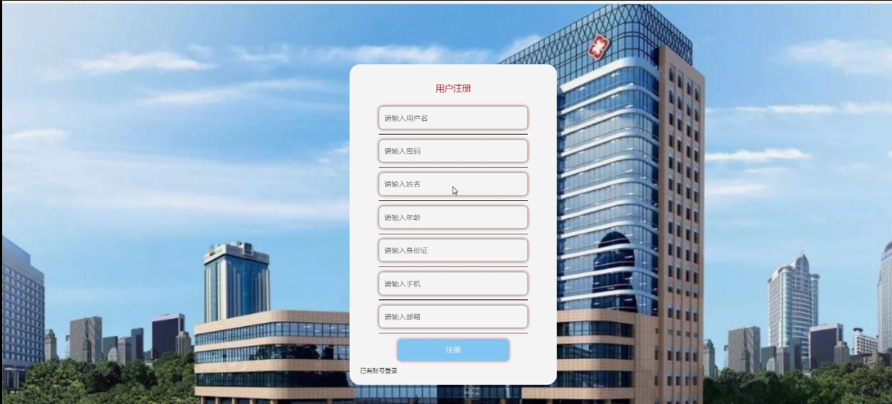

ssm+Vue计算机毕业设计医院就诊预约管理（程序+LW文档）

**项目运行**

**环境配置：**

**Jdk1.8 + Tomcat7.0 + Mysql + HBuilderX** **（Webstorm也行）+ Eclispe（IntelliJ
IDEA,Eclispe,MyEclispe,Sts都支持）。**

**项目技术：**

**SSM + mybatis + Maven + Vue** **等等组成，B/S模式 + Maven管理等等。**

**环境需要**

**1.** **运行环境：最好是java jdk 1.8，我们在这个平台上运行的。其他版本理论上也可以。**

**2.IDE** **环境：IDEA，Eclipse,Myeclipse都可以。推荐IDEA;**

**3.tomcat** **环境：Tomcat 7.x,8.x,9.x版本均可**

**4.** **硬件环境：windows 7/8/10 1G内存以上；或者 Mac OS；**

**5.** **是否Maven项目: 否；查看源码目录中是否包含pom.xml；若包含，则为maven项目，否则为非maven项目**

**6.** **数据库：MySql 5.7/8.0等版本均可；**

**毕设帮助，指导，本源码分享，调试部署** **(** **见文末** **)**

### 系统的功能结构图

经过系统需求分析，该医院就诊预约管理系统的设计与实现功能结构图如图4-1所示：

图4-1系统功能结构图

### 4.2数据库概念结构设计

####  4.2.1数据库E-R图

概念设计主要是通过数据库的概念结构和模式进行建立数据库嗯逻辑结构，然后利用数据库的DBMS进行完成，它不需要计算机系统的支持。通过系统的整体来看，主要是对数据库进行管理、整理、更新等操作。数据库的功能是非常强大的，每个系统的开发肯定离不开数据库，通过数据库可以看得出整个系统的质量和效率，根据以上的系统分析，对系统中的主要实体进行规划。以下是几个关键实体的实体关系图：

(1)用户管理实体E-R图如图4-2所示：

图4-2用户管理实体属性图

(2)医生管理实体E-R图如图4-3所示：

图4-2医生管理实体属性图

### 系统功能模块

医院就诊预约管理，在系统首页可以查看首页、医生、科室信息、医院资讯、留言反馈、个人中心、后台管理等内容，如图5-1所示。

图5-1系统功能界面图

医生：在医生页面中可以查看医生姓名、账号、性别、职称、科室、电话、挂号费、出生日期、个人简介等内容，进行收藏等操作；如图5-2所示。

图5-2医生界面图

科室信息：在科室信息页面中可以查看科室名称、科室编号、账号、主治医生、服务时间等内容进行评论或收藏等操作；如图5-3所示；在个人中心页面中输入用户名、密码、姓名、性别、图片、年龄、身份证、手机、邮箱等内容进行更新信息，并可以根据我的收藏进行相应的操作；如图5-4所示。

图5-3科室信息界面图

图5-4个人中心界面图

### 5.2管理员功能模块

管理员登录，通过填写注册时输入的用户名、密码选择角色进行登录，如图5-5所示。

图5-5管理员登录界面图

管理员进入系统页面中可以查看首页、个人中心、用户管理、医生管理、科室信息管理、预约信息管理、系统管理等内容，如图5-6所示。

图5-6管理员功能界面图

用户管理：在用户管理页面中可以对索引、用户名、姓名、性别、头像、年龄、身份证、手机、邮箱等内容，进行详情、修改或删除等操作；如图5-7所示。

图5-7用户管理界面图

医生管理：在医生管理页面中可以对索引、账号、医生姓名、性别、头像、职称、科室、电话、挂号费、出生日期等内容，进行详情、修改、查看评论或删除等操作；如图5-8所示。

图5-8医生管理界面图

科室信息管理；在科室信息管理页面中可以对索引、科室编号、科室名称、科室图片、账号、主治医生、服务时间等内容，进行详情、修改、查看评论、删除等操作；如图5-9所示。

图5-9科室信息管理界面图

医生咨询：在医生咨询页面中可以对索引、标题、图片等内容进行详情、修改或删除等操作；如图5-10所示。

图5-10医生咨询界面图

### 5.3用户功能模块

用户注册：通过填写用户名、密码、姓名、年龄、身份证、手机、邮箱等内容，进行注册；如图5-11所示。

图5-11用户注册界面图

用户；在用户页面中可以查看首页、个人中心、预约信息管理、我的收藏管理、留言板管理；如图5-12所示。

图5-12用户功能界面图

#### **JAVA** **毕设帮助，指导，源码分享，调试部署**

