ssm+Vue计算机毕业设计医院患者信息管理系统（程序+LW文档）

**项目运行**

**环境配置：**

**Jdk1.8 + Tomcat7.0 + Mysql + HBuilderX** **（Webstorm也行）+ Eclispe（IntelliJ
IDEA,Eclispe,MyEclispe,Sts都支持）。**

**项目技术：**

**SSM + mybatis + Maven + Vue** **等等组成，B/S模式 + Maven管理等等。**

**环境需要**

**1.** **运行环境：最好是java jdk 1.8，我们在这个平台上运行的。其他版本理论上也可以。**

**2.IDE** **环境：IDEA，Eclipse,Myeclipse都可以。推荐IDEA;**

**3.tomcat** **环境：Tomcat 7.x,8.x,9.x版本均可**

**4.** **硬件环境：windows 7/8/10 1G内存以上；或者 Mac OS；**

**5.** **是否Maven项目: 否；查看源码目录中是否包含pom.xml；若包含，则为maven项目，否则为非maven项目**

**6.** **数据库：MySql 5.7/8.0等版本均可；**

**毕设帮助，指导，本源码分享，调试部署** **(** **见文末** **)**

### 软件功能模块设计

网站整功能如下图所示：

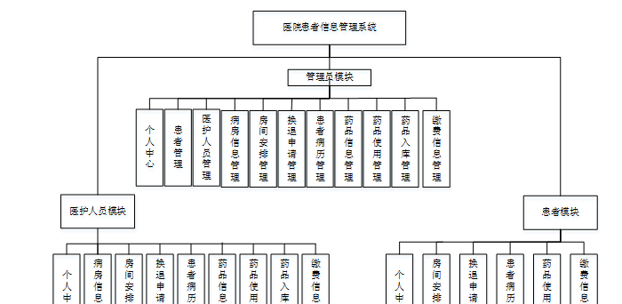

**图 4-1** **医院患者信息管理系统总体功能模块图**

### 4.2 数据库设计

#### 4.2.1 概念模型设计

概念模型是对现实中的问题出现的事物的进行描述，ER图是由实体及其关系构成的图，通过E-R图可以清楚地描述系统涉及到的实体之间的相互关系。

管理员登录信息实体图如图4-2所示：

图4-2管理员登录信息实体图

患者管理实体图如图4-3所示：

图4-3患者管理实体图

病房信息管理实体图如图4-4所示：

图4-4病房信息管理实体图

### 管理员功能模块

管理员通过输入用户名、密码、角色进行登录进入医院患者信息管理系统，如图5-1所示。

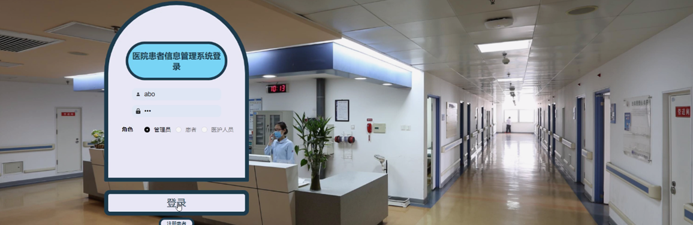

图5-1管理员功能界面图

管理员通过登录进入系统可查看个人中心、患者管理、医护人员管理、病房信息管理、房间安排管理、换退申请管理、患者病历管理、药品信息管理、药品使用管理、药品入库管理、缴费信息管理等内容，如图5-2所示。

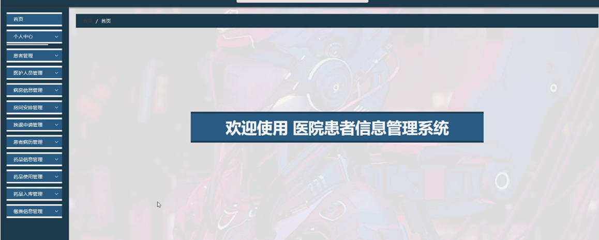

图5-2管理员功能界面图

患者管理，管理员可在患者管理页面查看用户名、姓名、性别、头像、年龄、身份证、手机、住址等内容，还可进行修改或删除等操作，如图5-3所示。

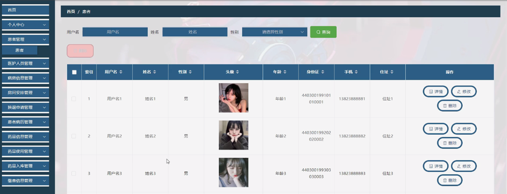

图5-3患者管理界面图

病房信息管理，管理员可在病房信息管理页面查看房间号、房间类型、位置、备注、状态等内容，还可进行新增、修改或删除等操作，如图5-4所示。

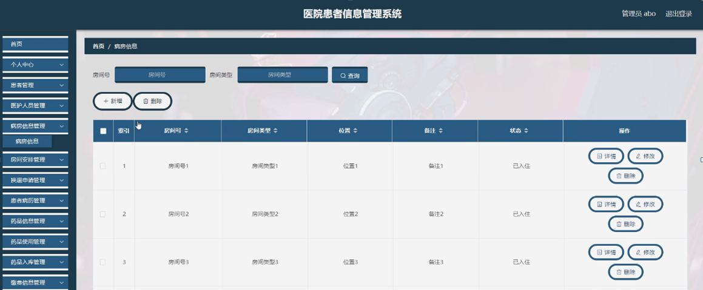

图5-4病房信息管理界面图

房间安排管理，管理员可在房间安排管理页面查看房间号、房间类型、用户名、姓名、位置、安排时间等内容，还可进行修改或删除等操作，如图5-5所示。

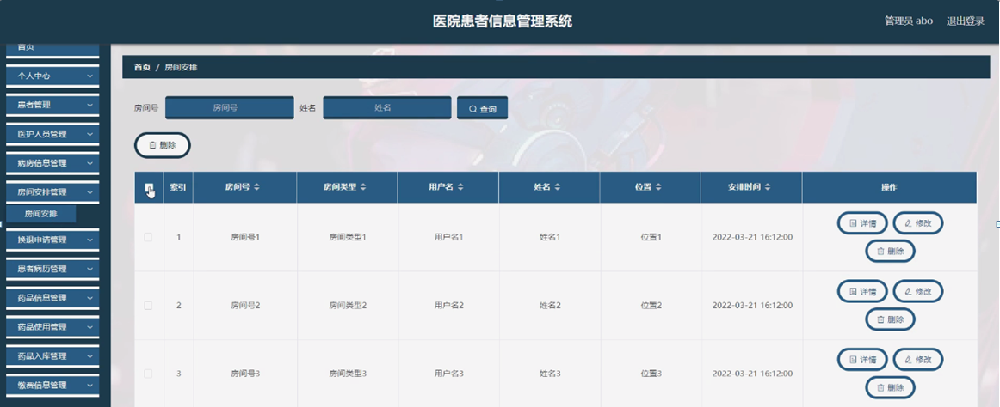

图5-5房间安排管理界面图

换退申请管理，管理员可在换退申请管理页面查看房间号、房间类型、用户名、姓名、类型、发布时间、审核回复、审核状态等内容，还可进行修改或删除等操作，如图5-6所示。

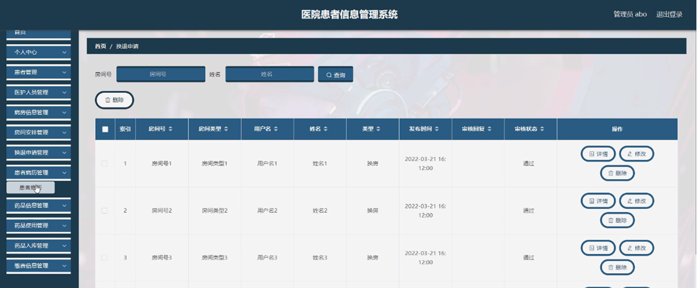

图5-6换退申请管理界面图

患者病历管理，管理员可在患者病历管理页面查看病历编号、用户名、姓名、年龄、身份证、手机、住址、账号、医生姓名等内容，还可进行修改或删除等操作，如图5-7所示。

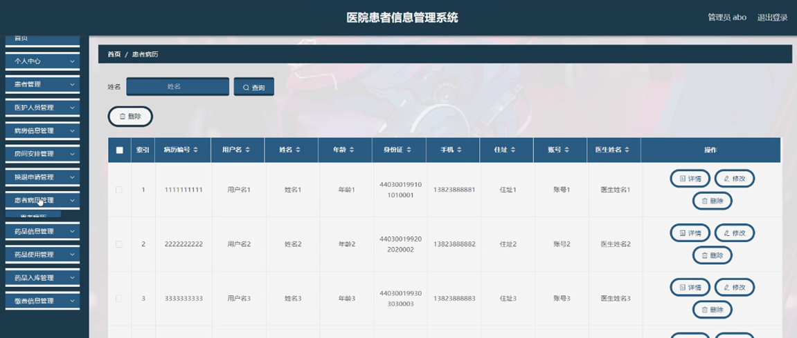

图5-7患者病历管理界面图

药品信息管理，管理员可在药品信息管理页面查看药品名称、药品类型、图片、规格、批次、价格、数量等内容，还可进行修改或删除等操作，如图5-8所示。

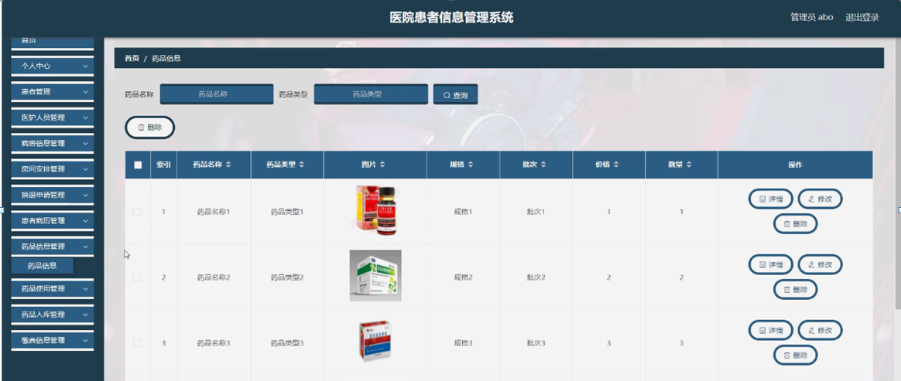

图5-8药品信息管理界面图

药品使用管理，管理员可在药品使用管理页面查看药品名称、药品类型、用户名、姓名、数量、账号、医生姓名等内容，还可进行修改或删除等操作，如图5-9所示。

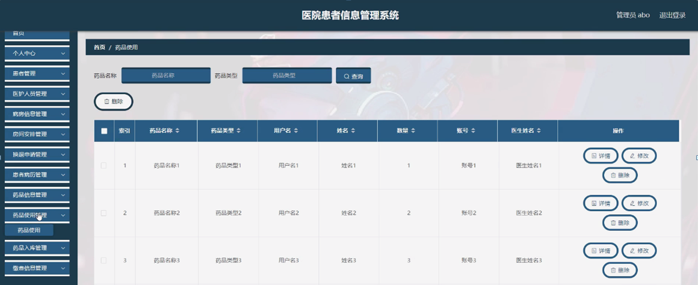

图5-9药品使用管理界图面

5.2医护人员功能模块

医护人员通过登录进入系统可查看个人中心、病房信息管理、房间安排管理、换退申请管理、患者病历管理、药品信息管理、药品使用管理、药品入库管理、缴费信息管理等内容，如图5-10所示。

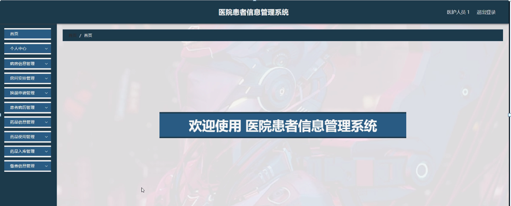

图5-10医护人员功能界面图

病房信息管理，医护人员可在病房信息管理页面查看房间号、房间类型、位置、备注、状态等内容，还可进行删除等操作，如图5-11所示。

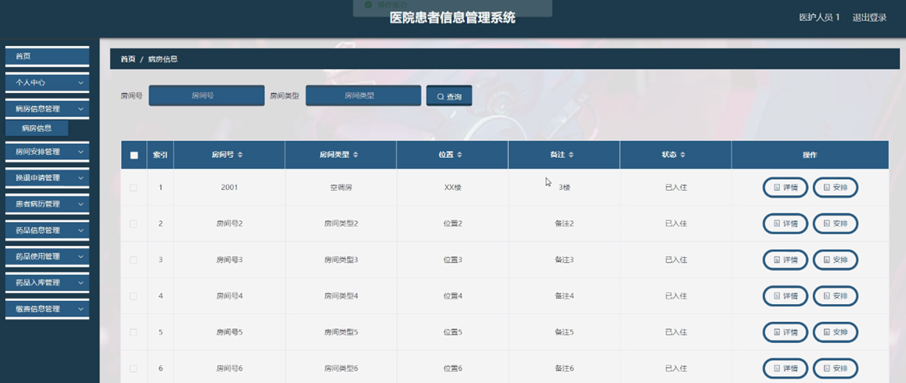

图5-11病房信息管理界面图

换退申请管理，医护人员可在换退申请管理页面查看房间号、房间类型、用户名、姓名、类型、发布时间、审核回复、审核状态等内容，还可进行删除等操作，如图5-12所示。

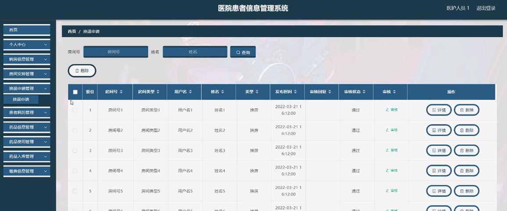

图5-12换退申请管理界面图

#### **JAVA** **毕设帮助，指导，源码分享，调试部署**

