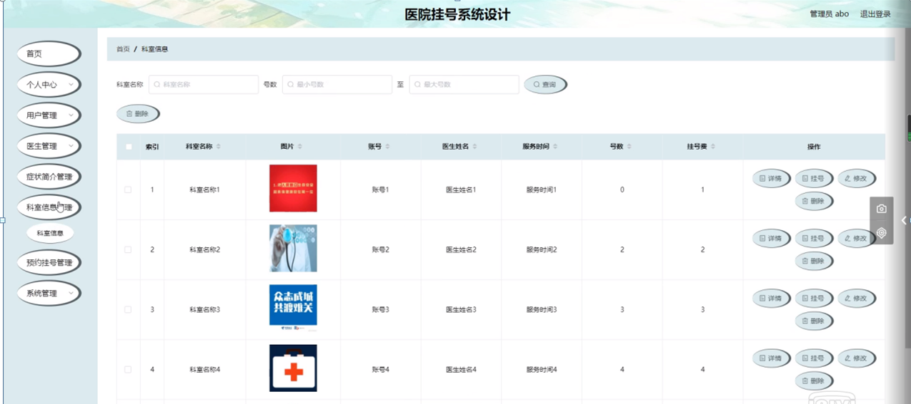

ssm+Vue计算机毕业设计医院挂号系统设计（程序+LW文档）

**项目运行**

**环境配置：**

**Jdk1.8 + Tomcat7.0 + Mysql + HBuilderX** **（Webstorm也行）+ Eclispe（IntelliJ
IDEA,Eclispe,MyEclispe,Sts都支持）。**

**项目技术：**

**SSM + mybatis + Maven + Vue** **等等组成，B/S模式 + Maven管理等等。**

**环境需要**

**1.** **运行环境：最好是java jdk 1.8，我们在这个平台上运行的。其他版本理论上也可以。**

**2.IDE** **环境：IDEA，Eclipse,Myeclipse都可以。推荐IDEA;**

**3.tomcat** **环境：Tomcat 7.x,8.x,9.x版本均可**

**4.** **硬件环境：windows 7/8/10 1G内存以上；或者 Mac OS；**

**5.** **是否Maven项目: 否；查看源码目录中是否包含pom.xml；若包含，则为maven项目，否则为非maven项目**

**6.** **数据库：MySql 5.7/8.0等版本均可；**

**毕设帮助，指导，本源码分享，调试部署** **(** **见文末** **)**

### 系统功能模块

根据系统功能分析，可以画出系统的功能模块图，系统总体功能如下图所示：

图 4-1 系统总体功能模块图

### 4.2数据库设计

#### 4.2.1 数据库需求分析

管理员：具有最高的管理权限，支持后台管理，对用户信息进行增删改查，对处方信息进行及时更新，还可以管理留言信息，删除一些不健康的留言。

#### 4.2.2 数据库概念结构设计

概念模型是对现实中的问题出现的事物的进行描述，ER图是由实体及其关系构成的图，通过E-R图可以清楚地描述系统涉及到的实体之间的相互关系。

用户注册实体图如图4-2所示：

图4-2用户注册实体图

症状简介实体图如图4-3所示：

图4-3症状简介实体图

科室信息实体图如图4-4所示：

图4-4科室信息实体图

### 系统功能模块

医院挂号系统，在系统首页可以查看首页，症状简介，科室信息，医院简介，个人中心，后台管理等内容进行详细操作，如图5-1所示。

图5-1系统首页界面图

症状简介，在症状简介页面可以查看症状名称，治疗科室，症状描述等详细内容操作，如图5-2所示。

图5-2症状简介界面图

科室信息，在科室信息页面可以查看科室名称，账号，医生姓名，服务时间，号数，挂号费，挂号说明，挂号等详细内容，并进行收藏操作，如图5-3所示。

图5-3科室信息界面图

用户注册，在用户注册页面通过填写用户名,密码,确认密码,姓名,年龄，邮箱等信息完成注册操作，如图5-4所示。

图5-4用户注册界面图

个人中心，在个人中心页面通过填写用户名,密码,姓名,性别,年龄,上传图片,邮箱,手机等内容进行更新信息，根据需要对我的收藏进行相对应操作，如图5-5所示。

图5-5个人中心界面图

### 5.2后台功能模块

管理员，用户和医生进行登录，进入系统前在登录页面根据要求填写用户名、密码，选择角色等信息，点击登录进行登录操作，如图5-6所示。

图5-6后台登录界面图

#### 5.2.1管理员功能模块

管理员登录系统后，可以对首页，个人中心，用户管理，医生管理，症状简介管理，科室信息管理，预约挂号管理，系统管理等功能进行相应的操作管理，如图5-7所示。

图5-7管理员功能界面图

用户管理，在用户管理页面可以对索引，用户名，姓名，性别，年龄，头像，邮箱，手机等内容进行详情，修改和删除等操作，如图5-8所示。

图5-8用户管理界面图

医生管理，在医生管理页面可以对索引，账号，医生姓名，性别，头像，医龄，科室，电话等内容进行详情，修改和删除等操作，如图5-9所示。

图5-9医生管理界面图

症状简介管理，在症状简介管理页面可以对索引，疾病名称，图片，治疗科室等内容进行详情，修改和删除等操作，如图5-10所示。

图5-10症状简介管理界面图

科室信息管理，在科室信息管理页面可以对索引，科室名称，图片，账号，医生姓名，服务时间，号数，挂号费等内容进行详情，挂号，修改和删除等操作，如图5-11所示。

图5-11科室信息管理界面图

预约挂号管理，在预约挂号管理页面可以对索引，订单编号，科室名称，账号，医生姓名，挂号费，号数，预约内容，预约日期，用户名，姓名，手机，是否支付，审核回复，审核状态等内容进行详情，修改和删除等操作，如图5-12所示。

图5-12预约挂号管理界面图

#### **JAVA** **毕设帮助，指导，源码分享，调试部署**

