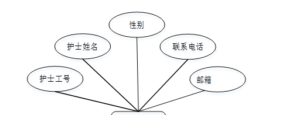
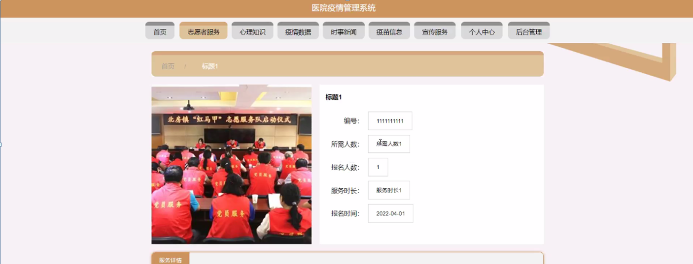

ssm+Vue计算机毕业设计医院疫情管理系统（程序+LW文档）

**项目运行**

**环境配置：**

**Jdk1.8 + Tomcat7.0 + Mysql + HBuilderX** **（Webstorm也行）+ Eclispe（IntelliJ
IDEA,Eclispe,MyEclispe,Sts都支持）。**

**项目技术：**

**SSM + mybatis + Maven + Vue** **等等组成，B/S模式 + Maven管理等等。**

**环境需要**

**1.** **运行环境：最好是java jdk 1.8，我们在这个平台上运行的。其他版本理论上也可以。**

**2.IDE** **环境：IDEA，Eclipse,Myeclipse都可以。推荐IDEA;**

**3.tomcat** **环境：Tomcat 7.x,8.x,9.x版本均可**

**4.** **硬件环境：windows 7/8/10 1G内存以上；或者 Mac OS；**

**5.** **是否Maven项目: 否；查看源码目录中是否包含pom.xml；若包含，则为maven项目，否则为非maven项目**

**6.** **数据库：MySql 5.7/8.0等版本均可；**

**毕设帮助，指导，本源码分享，调试部署** **(** **见文末** **)**

### 功能结构

为了更好的去理清本系统整体思路，对该系统以结构图的形式表达出来，设计实现该医院疫情管理系统的功能结构图如下所示：

图4-1 系统总体结构图

### 4.2 数据库设计

####  4.2.1 数据库E/R图

ER图是由实体及其关系构成的图，通过E/R图可以清楚地描述系统涉及到的实体之间的相互关系。在系统中对一些主要的几个关键实体如下图：

(1) 前台护士信息E/R图如下所示：

图4-2前台护士信息E/R图

(2) 心理知识E/R图如下所示：

图4-3心理知识E/R图

### 系统功能模块

医院疫情管理系统，在系统首页可查看首页、志愿者服务、心理知识、疫情数据、时事新闻、疫苗信息、宣传服务、个人中心、后台管理等内容，如图5-1所示。

图5-1系统首页界面图

志愿者服务，在志愿者服务页面可查看标题、封面、编号、所需人数、报名人数、服务时长、报名时间、服务详情等内容，如图5-2所示。

图5-2志愿者服务界图面

心理知识，在心理知识页面可查看标题、分类、来源、相关资料等内容，如图5-3所示。

图5-3心理知识界面图

疫情数据，在疫情数据页面可查看标题、封面、国家、地区、现有确诊、累计确诊、无症状、现有重症、新增治愈、累计治愈、新增死亡等内容，如图5-4所示。

图5-4疫情数据界面图

5.2前台护士功能模块

前台护士通过登录进入系统可查看个人中心、疫苗信息管理、疫苗预约管理、体检报告管理、体温登记管理、住院信息管理、ct报告管理、出院登记管理等内容，如图5-5所示。

图5-5前台护士功能界面图

疫苗信息管理，前台护士可在疫苗信息管理页面查看疫苗名称、疫苗种类、封面、疫苗类型、适用年龄、产品规格、生产厂家、接种剂次等内容，还可进行新增、修改、查看评论或删除等操作，如图5-6所示。

图5-6疫苗信息管理界面图

疫苗预约管理，前台护士可在疫苗预约管理页面查看疫苗名称、疫苗种类、生产厂家、患者账号、患者姓名、账号年龄、患者手机、预约时间等内容，还可进行修改或删除等操作，如图5-7所示。

图5-7疫苗预约管理界面图

体检报告管理，前台护士可在体检报告管理页面查看患者账号、患者姓名、患者性别、患者年龄、身高、体重、左眼视力、右眼视力、血糖、舒张压、收缩压、高血压、新冠肺炎、核酸检查、时间等内容，还可进行新增、修改或删除等操作，如图5-8所示。

图5-8体检报告管理界图面

住院信息管理，前台护士可在住院信息管理页面查看患者账号、患者姓名、患者年龄、患者性别、科室、床位、住院时间等内容，还可进行新增、修改或删除等操作，如图5-9所示。

图5-9住院信息管理界面图

5.3病房护士功能模块

病房护士通过登录进入系统可查看个人中心、体温登记管理、住院信息管理、出院登记管理等内容，如图5-10所示。

图5-10病房护士功能界面图

体温登记管理，病房护士可在体温登记管理页面查看患者账号、患者姓名、患者手机、体温、登记时间等内容，还可进行新增、修改或删除等操作，如图5-11所示。

图5-11体温登记管理界面图

出院登记管理，病房护士可在出院登记管理页面查看患者账号、患者姓名、患者年龄、患者性别、科室、床位、出院时间等内容，还可进行修改或删除等操作，如图5-12所示。

图5-12出院登记管理界面图

**JAVA** **毕设帮助，指导，源码分享，调试部署**

