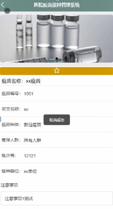
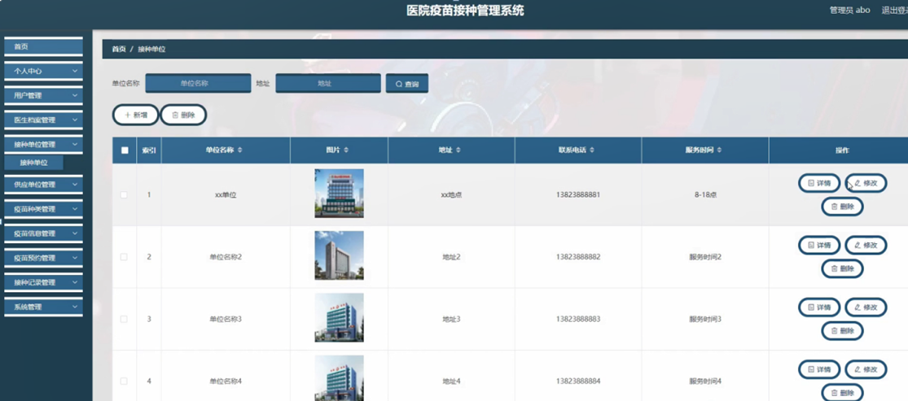
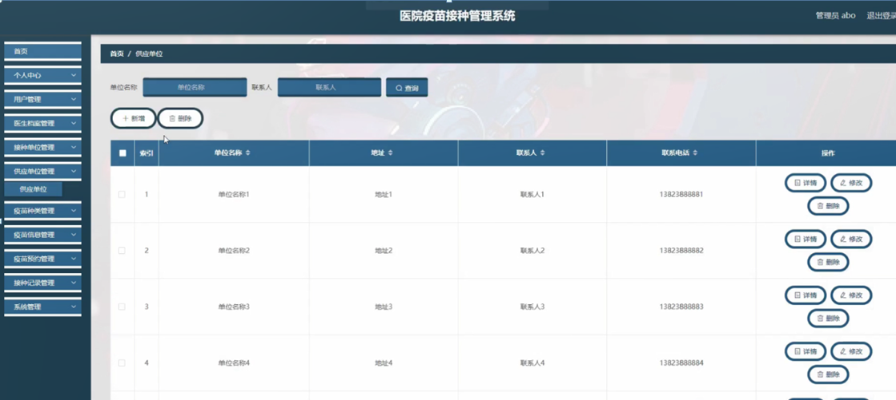

ssm+Vue计算机毕业设计医院疫苗接种管理系统（程序+LW文档）

**项目运行**

**环境配置：**

**Jdk1.8 + Tomcat7.0 + Mysql + HBuilderX** **（Webstorm也行）+ Eclispe（IntelliJ
IDEA,Eclispe,MyEclispe,Sts都支持）。**

**项目技术：**

**SSM + mybatis + Maven + Vue** **等等组成，B/S模式 + Maven管理等等。**

**环境需要**

**1.** **运行环境：最好是java jdk 1.8，我们在这个平台上运行的。其他版本理论上也可以。**

**2.IDE** **环境：IDEA，Eclipse,Myeclipse都可以。推荐IDEA;**

**3.tomcat** **环境：Tomcat 7.x,8.x,9.x版本均可**

**4.** **硬件环境：windows 7/8/10 1G内存以上；或者 Mac OS；**

**5.** **是否Maven项目: 否；查看源码目录中是否包含pom.xml；若包含，则为maven项目，否则为非maven项目**

**6.** **数据库：MySql 5.7/8.0等版本均可；**

**毕设帮助，指导，本源码分享，调试部署** **(** **见文末** **)**

医院疫苗接种管理系统APP的主要功能的结构如图4-1所示。

图4-1 APP功能结构图

### 4.2系统设计

#### 4.2.1数据表E-R图

E-R图为实体-关系图，本系统的E-R图展现了各个实体之间的关系，在本数据库中，各个实体之间的关系均为多对多的关系，如下图：

用户管理属性图如图4-2所示。

图4-2用户管理实体属性图

接种单位管理实体属性图如图4-3所示。

图4-3接种单位管理实体属性图

### APP端（用户功能）

用户登录，用户进入app，输入自己的账号和密码，并选择对应的角色进行系统登录操作，如图5-1所示。

图5-1登录界面图

注册用户，进入用户注册页面，通过填写用户名，密码，确认密码，姓名，性别，户籍，身份证，手机，现住地址等信息进行注册操作，如图5-2所示。

图5-2用户注册界面图

用户登陆系统后，可以对首页，接种单位，疫苗信息，我的等内容进行详细操作，如图5-3所示。

图5-3 app首页界面图

疫苗信息，在疫苗信息页面可以查看疫苗名称，疫苗编号，英文名称，疫苗种类，推荐人群，批次号，接种单位，注意事项，疫苗功效等信息，进行预约操作，如图5-4所示。

图5-4疫苗信息界面图

用户，在我的页面可以对疫苗预约，接种记录，我的收藏管理等详细信息进行操作，如图5-5所示。

图5-5用户功能界面图

用户信息，在用户信息页面通过用户名，密码，姓名，性别，户籍，头像，身份证，手机，现住地址等信息进行保存操作，如图5-6所示。

图5-6用户信息界面图

5.2后端（管理员功能）

管理员登录，管理员通过输入用户名，密码，点击登录进入系统操作进行操作，如图5-7所示。

图5-7管理员登录界面图

管理员登陆系统后，可以查看首页，个人中心，用户管理，医生档案管理，接种单位管理，供应单位管理，疫苗种类管理，疫苗信息管理，疫苗预约管理，接种记录管理，系统管理等功能，还能对每个功能逐一进行相应操作，如图5-8所示。

图5-8管理员功能界面图

用户管理，在用户管理页面可以对索引，用户名，姓名，性别，出生日期，户籍，头像，身份证，手机，现住地址等内容进行详情，修改或删除等操作，如图5-9所示。

图5-9用户管理界面图

医生档案管理，在医生档案管理页面可以对索引，医生姓名，性别，年龄，科室职务，联系电话等内容进行详情，修改或删除等操作，如图5-10所示。

图5-10医生档案管理界面图

接种单位管理，在接种单位管理页面可以对索引，单位名称，图片，地址，联系电话，服务时间等内容进行详情，修改或删除等操作，如图5-11所示。

图5-11接种单位管理界面图

供应单位管理，在供应单位管理页面可以对索引，单位名称，地址，联系人，联系电话等内容进行详情，修改或删除等操作，如图5-12所示。

图5-12供应单位管理界面图

#### **JAVA** **毕设帮助，指导，源码分享，调试部署**

