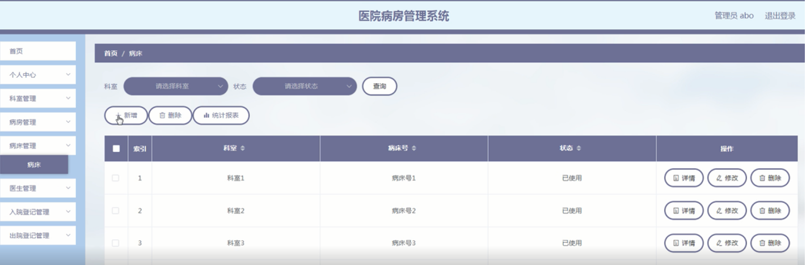

ssm+Vue计算机毕业设计医院病房管理系统（程序+LW文档）

**项目运行**

**环境配置：**

**Jdk1.8 + Tomcat7.0 + Mysql + HBuilderX** **（Webstorm也行）+ Eclispe（IntelliJ
IDEA,Eclispe,MyEclispe,Sts都支持）。**

**项目技术：**

**SSM + mybatis + Maven + Vue** **等等组成，B/S模式 + Maven管理等等。**

**环境需要**

**1.** **运行环境：最好是java jdk 1.8，我们在这个平台上运行的。其他版本理论上也可以。**

**2.IDE** **环境：IDEA，Eclipse,Myeclipse都可以。推荐IDEA;**

**3.tomcat** **环境：Tomcat 7.x,8.x,9.x版本均可**

**4.** **硬件环境：windows 7/8/10 1G内存以上；或者 Mac OS；**

**5.** **是否Maven项目: 否；查看源码目录中是否包含pom.xml；若包含，则为maven项目，否则为非maven项目**

**6.** **数据库：MySql 5.7/8.0等版本均可；**

**毕设帮助，指导，本源码分享，调试部署** **(** **见文末** **)**

系统功能结构图

系统功能结构图是系统设计阶段，系统功能结构图只是这个阶段一个基础，整个系统的架构决定了系统的整体模式，是系统的根据。医院病房管理系统的整个设计结构如图3-1所示。

图3-1系统功能结构图

### **数据库设计**

信息管理系统的效率和实现的效果完全取决于数据库结构设计的好坏。为了保证数据的完整性，提高数据库存储的效率，那么统一合理地设计数据库结构是必要的。数据库设计一般包括如下几个步骤：

（1）根据用户需求，确定数据库信息进行保存。

对用户的需求分析是数据库设计的第一阶段，用户的需求调研，熟悉医院运作流程，系统要求，这些都是以概念模型为基础的。

（2）设计数据的概念模型

概念模型与数据建模用户的观点一致，用于信息的建模工具。通过E-R图可以清楚地描述系统涉及到的实体之间的相互关系。

病床信息实体图如图4-1所示：

图4-1病床信息实体图

医生信息实体图如图4-2所示：

图4-2医生信息实体图

入院登记信息实体图如图4-3所示：

图4-3入院登记信息实体图

出院登记信息实体图如图4-4所示：

图4-4出院登记信息实体图

### **管理员功能模块**

管理员登录系统，管理员登录页面通过输入用户名、密码，选择角色并点击登录进行系统登录操作，如图5-1所示。

图5-1管理员登录界面图

管理员登录系统后，可以对首页、个人中心、科室管理、病房管理、病床管理、医生管理、入院登记管理、出院登记管理等功能模块进行相应操作，如图5-2所示。

图5-2管理员功能界图面

科室管理，在科室管理页面可以对科室、科室地址等信息进行查看、修改或删除等操作，如图5-3所示。

图5-3科室管理界面图

病房管理，在病房管理页面可以对科室、病房号、状态等内容进行修改或删除等操作，如图5-4所示。

图5-4病房管理界面图

病床管理，在病床管理页面可以对科室、病房号、状态等内容进行查看、修改或删除等操作，如图5-5所示。

图5-5病床管理界面图

医生管理，在医生管理页面可以对医生工号、医生姓名、科室、职称、性别、医龄、联系电话等内容进行查看、修改或删除等操作，如图5-6所示。

图5-6医生管理界面图

入院登记管理，在入院登记管理页面可以对病历号、患者姓名、患者年龄、患者性别、科室、病房号、病床号、住址、状态等内容进行查看、修改或删除等操作，如图5-7所示。

图5-7入院登记管理界面图

### **5.2** **医生功能模块**

医生登录，在登录页面通过填写账号、密码、选择角色等信息进行登录，如图5-8所示。

图5-8医生登录界面图

医生登录进入系统后台，可以对首页、个人中心、病房管理、病床管理、入院登记管理、出院登记管理等功能模块进行相应操作，如图5-9所示。

图5-9医生功能界面图

病房管理，在病房管理页面通过查看科室、病房号、状态等信息进行详情等操作，如图5-10所示。

图5-10病房管理界面图

病床管理，在病床管理页面可以对科室、病房号、状态等内容进行查看等操作，如图5-11所示。

图5-11病床管理界面图

入院登记管理，在入院登记管理页面可以对病历号、患者姓名、患者年龄、患者性别、科室、病房号、病床号、住址、状态等内容进行详情、出院等操作，如图5-12所示。

图5-12入院登记管理界面图

**JAVA** **毕设帮助，指导，源码分享，调试部署**

