ssm+Vue计算机毕业设计医院管理系统（程序+LW文档）

**项目运行**

**环境配置：**

**Jdk1.8 + Tomcat7.0 + Mysql + HBuilderX** **（Webstorm也行）+ Eclispe（IntelliJ
IDEA,Eclispe,MyEclispe,Sts都支持）。**

**项目技术：**

**SSM + mybatis + Maven + Vue** **等等组成，B/S模式 + Maven管理等等。**

**环境需要**

**1.** **运行环境：最好是java jdk 1.8，我们在这个平台上运行的。其他版本理论上也可以。**

**2.IDE** **环境：IDEA，Eclipse,Myeclipse都可以。推荐IDEA;**

**3.tomcat** **环境：Tomcat 7.x,8.x,9.x版本均可**

**4.** **硬件环境：windows 7/8/10 1G内存以上；或者 Mac OS；**

**5.** **是否Maven项目: 否；查看源码目录中是否包含pom.xml；若包含，则为maven项目，否则为非maven项目**

**6.** **数据库：MySql 5.7/8.0等版本均可；**

**毕设帮助，指导，本源码分享，调试部署** **(** **见文末** **)**

### 软件功能模块设计

系统整体功能如下图所示：

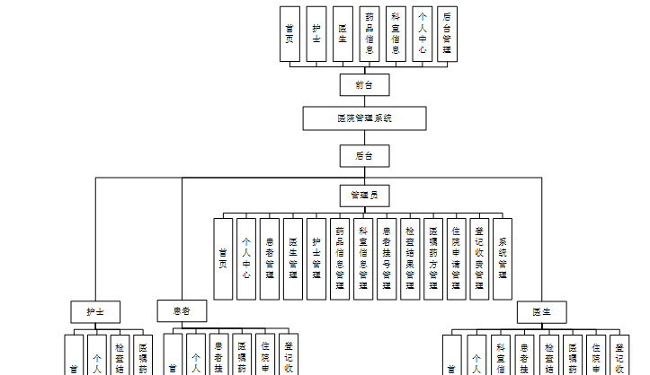

图 4-1 系统总体功能模块图

### 前台模块设计

系统首页的主要功能展示了首页，护士，医生，药品信息，科室信息，个人中心，后台管理等，根据权限进行相应操作。运行结果如图5-1所示。

图5-1 系统首页界面图

患者注册，在患者注册页面通过填写账号，密码，确认密码，姓名，年龄，手机，身份证等信息完成注册操作，如图5-2所示。

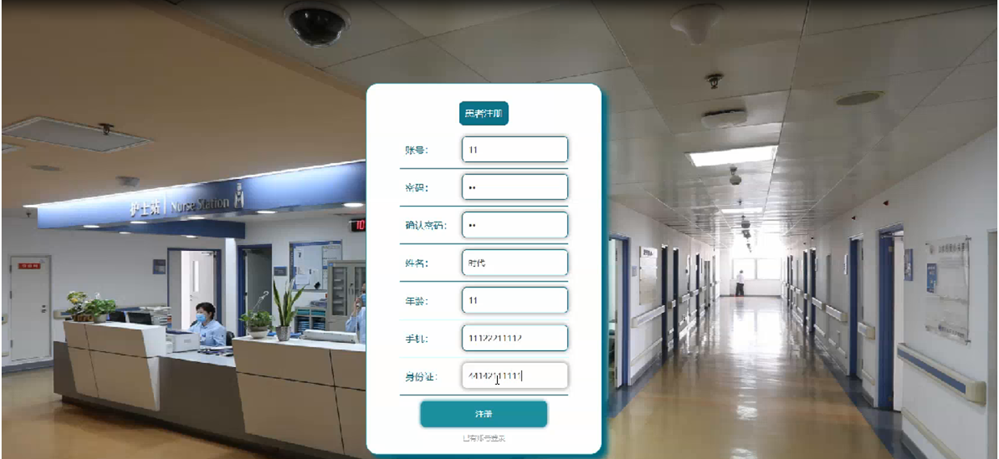

图5-2患者注册界面图

药品信息，在药品信息页面可以药品编号，类型，药品类别，批次号，生产日期，有效期，生产单位，生产地址，使用说明，禁忌，点击次数等内容，如图5-3所示。

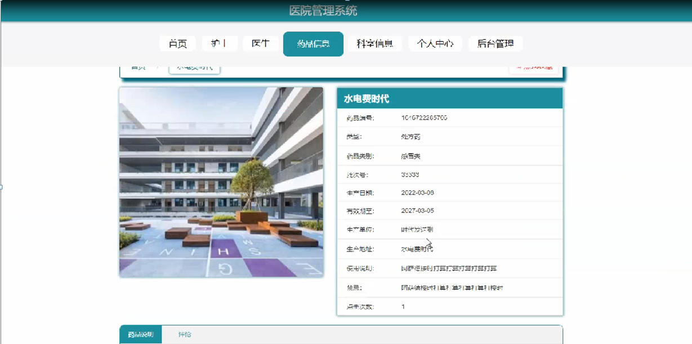

图5-3药品信息界面图

### 5.2管理员功能模块

系统登录，进入系统前在登录页面根据要求填写用户名和密码，选择角色等信息，点击登录进行登录操作，如图5-4所示。

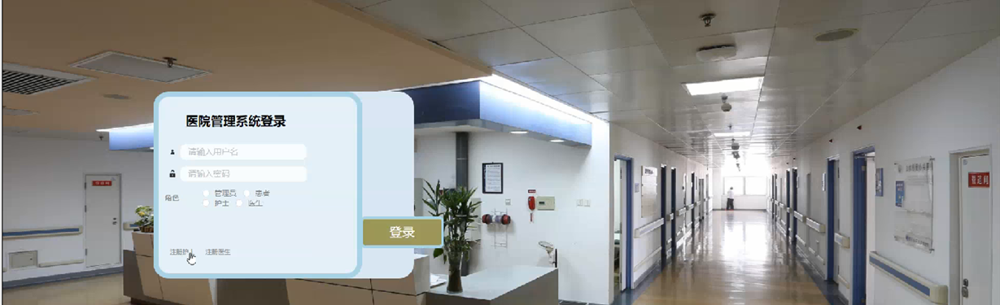

图5-4系统登录界面图

管理员登录系统后，可以对首页，个人中心，患者管理，医生管理，护士管理，药品信息管理，科室信息管理，患者挂号管理，检查结果管理，医嘱药方管理，住院申请管理，登记收费管理，系统管理等功能进行相应的操作，如图5-5所示。

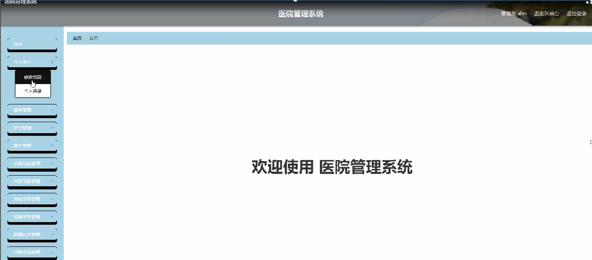

图5-5管理员功能界面图

患者管理，在患者管理页面可以对索引，账号，姓名，年龄，性别，手机，身份证，照片等内容进行详情，修改和删除等操作，如图5-6所示。

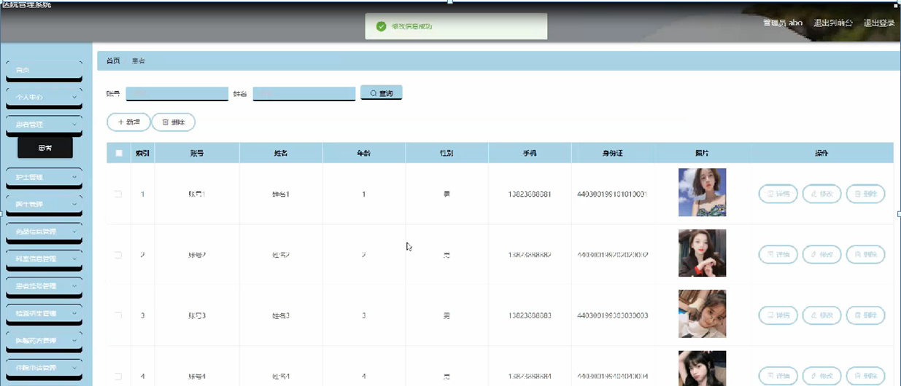

图5-6患者管理界面图

护士管理，在护士管理页面可以对索引，护士账号，护士姓名，年龄，性别，职称，科室，图片，联系电话等信息进行详情，修改和删除等操作，如图5-7所示。

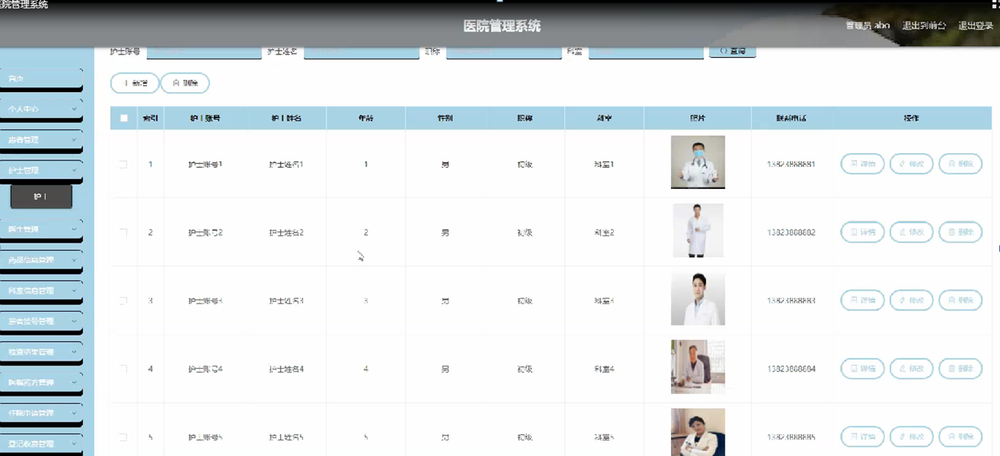

图5-7护士管理界面图

医生管理，在医生管理页面可以对索引，医生账号，医生姓名，年龄，职称，性别，科室，年龄，联系电话 照片等内容进行详情、修改和删除等操作，如图5-8所示。

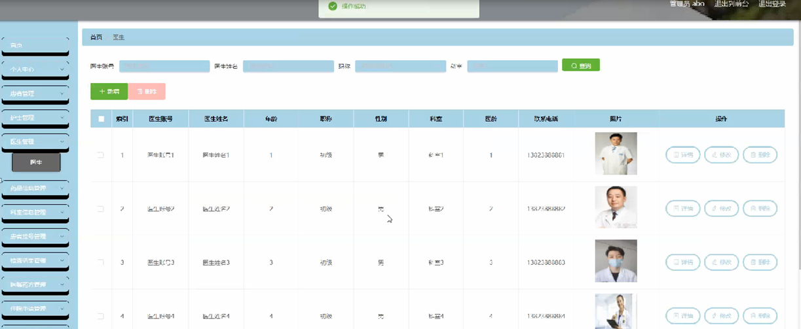

图5-8医生管理界面图

药品信息管理，在药品信息管理页面可以对索引，药品编号，药品名称，类型，药品类别，批次号，生产日期，有效期，生产单位，生产地址，药品图片等内容进行详情，修改，查看评论和删除等操作，如图5-9所示。

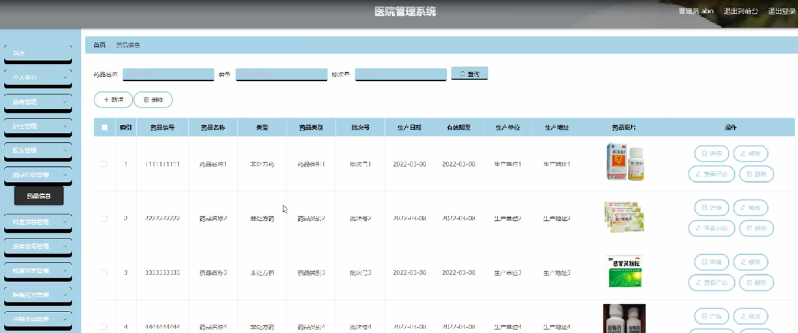

图5-9药品信息管理界面图

科室信息管理，在科室信息管理页面可以对索引，科室号，科室名称，封面，上班时间，挂号费，医生账号，医生姓名，医龄，联系电话等内容进行详情，修改和删除等操作，如图5-10所示。

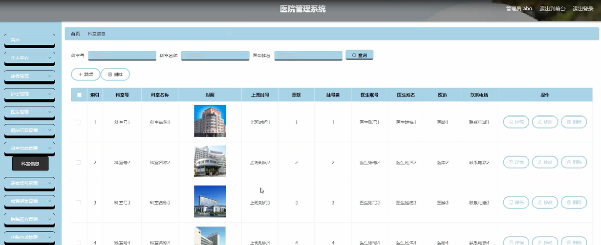

图5-10科室信息管理界面图

患者挂号管理，在患者挂号管理页面可以对索引，预约编号，科室号，科室名称，挂号费，就诊时间，医生姓名，账号，姓名，手机，身份证，是否支付等内容进行详情，删除等操作，如图5-11所示。

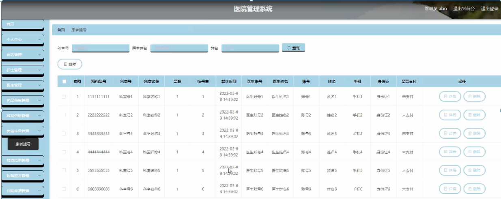

图5-11患者挂号管理界面图

### 5.3护士功能模块

护士登录进入医院管理系统可以对首页，个人中心，患者挂号管理，医嘱药方管理，住院申请管理，登记收费管理等功能进行相应操作，如图5-12所示。

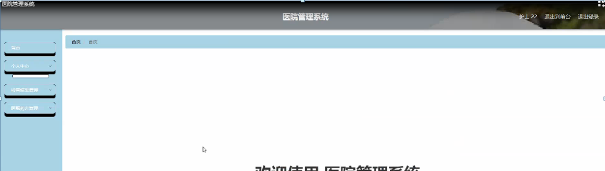

图5-12护士功能界面图

#### **JAVA** **毕设帮助，指导，源码分享，调试部署**

