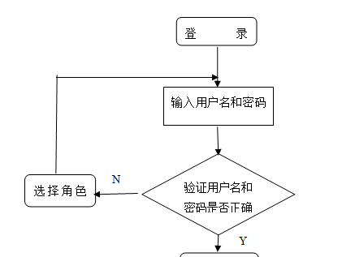
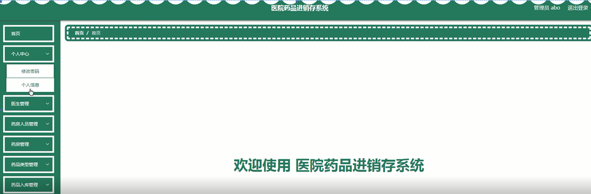

ssm+Vue计算机毕业设计医院药品进销存系统（程序+LW文档）

**项目运行**

**环境配置：**

**Jdk1.8 + Tomcat7.0 + Mysql + HBuilderX** **（Webstorm也行）+ Eclispe（IntelliJ
IDEA,Eclispe,MyEclispe,Sts都支持）。**

**项目技术：**

**SSM + mybatis + Maven + Vue** **等等组成，B/S模式 + Maven管理等等。**

**环境需要**

**1.** **运行环境：最好是java jdk 1.8，我们在这个平台上运行的。其他版本理论上也可以。**

**2.IDE** **环境：IDEA，Eclipse,Myeclipse都可以。推荐IDEA;**

**3.tomcat** **环境：Tomcat 7.x,8.x,9.x版本均可**

**4.** **硬件环境：windows 7/8/10 1G内存以上；或者 Mac OS；**

**5.** **是否Maven项目: 否；查看源码目录中是否包含pom.xml；若包含，则为maven项目，否则为非maven项目**

**6.** **数据库：MySql 5.7/8.0等版本均可；**

**毕设帮助，指导，本源码分享，调试部署** **(** **见文末** **)**

### 系统功能设计

系统的功能设计是整个系统的运行基础，是一个把设计需求替换成以计算机系统的形式表示出来。通过对医院药品进销存系统的调查、分析和研究，得出了该网站的总体规划，这是开发设计系统的初步核心。

根据前期所得的数据流图，进一步的进行分析和研究，得到系统各模块的属性结构图。下面显示了系统功能的结构图。

医院药品进销存系统功能模块的结构图，如图4-1所示：

图4-1医院药品进销存系统结构图

### 4.2数据库设计

在整个系统来说，数据库的设计是相当重要的，需要非常仔细去设计。

本系统中涉及的各级权限分别是：

  1. 医生登录权限，可以查看销售出库、处方信息等信息，修改查看自己的信息。

（2）药房人员登录权限，可以查看药房、药品入库、销售出库、耗损出库、处方信息等信息，修改查看自己的信息。

（3）管理员权限，管理员有系统的所有权限，包括医生管理，可以添加、修改和删除任意权限的医生；还包括发布网站的销售出库、耗损出库、处方信息等等。

#### 4.2.1概念结构设计

根据分析系统的数据需求，得到系统的实体属性图。

(1)药房人员信息E-R图，如图4-2所示：

图4-2药房人员信息E-R图

(2)医生信息E-R图，如图4-3所示：

图4-3医生信息E-R图

(3)处方信息E-R图，如图4-4所示：

图4-4处方信息E-R图

(4)药房信息E-R图，如图4-5所示：

图4-5药房信息E-R图

### 医生功能模块

医生登录；在医生登录页面填写用户名、密码、选择角色进行登录，如图5-1所示。

图5-1医生登录界面图

医生登录进入医院药品进销存系统可以查看首页、个人中心、销售出库管理、处方信息管理等内容，如图5-2所示。

图5-2医生功能界面图

销售出库管理：医生通过销售出库管理页面可以查看药品名称、剂型、含量规格、药品类型、国药准字、生产厂商、厂商地址、数量、生产日期、有效期至、人员账号、人员姓名、出库日期、售价、金额、处方号、医生账号、医生姓名、科室、病人姓名、身份证、审核回复、审核状态等操作，如图5-3所示。

图5-3销售出库管理界面图

处方信息管理：医生通过处方信息管理页面可以查看处方号、医生账号、医生姓名、科室、日期、病人姓名、身份证号、审核回复、审核状态等操作，如图5-4所示。

图5-4处方信息管理界面图

### 5.2药房人员功能模块

药房人员登录；在药房人员登录页面填写用户名、密码、选择角色进行登录，如图5-5所示。

图5-5药房人员登录界面图

药房人员登录进入医院药品进销存系统可以查看首页、个人中心、药房管理、药品入库管理、销售出库管理、耗损出库管理、处方信息管理等内容，如图5-6所示。

图5-6药房人员功能界面图

药房管理：药房人员通过药房管理页面可以查看药品名称、剂型、含量规格、药品类型、国药准字、生产厂商、厂商地址、数量、审核回复、审核状态、审核等操作，如图5-7所示。

图5-7药房管理界面图

处方信息管理：药房人员通过处方信息管理页面可以查看处方号、医生账号、医生姓名、科室、日期、病人姓名、身份证号、审核回复、审核状态、审核等内容，如图5-8所示。

图5-8处方信息管理界面图

### 5.3管理员功能模块

运行系统，首先进入登录界面，按照登录界面的要求填写相应的“用户名”和“密码”以及选择角色，点击“登录”然后系统判断填写是否正确，若正确进入相应的界面，具体流程如图5-9所示。

登录流程图

图5-9管理员登录界面图

管理员登录进入医院药品进销存系统查看首页、个人中心、医生管理、药房人员管理、药房管理、药品类型管理、药品入库管理、销售出库管理、耗损出库管理、处方信息管理等内容，如图5-10所示。

图5-10管理员功能界面图

医生管理，管理员在医生管理页面可以查看医生账号、医生姓名、医生手机、头像、性别、科室、职称等内容，并可根据需要对医生管理进行修改或删除等操作，如图5-11所示。

图5-11医生管理界面图

药房人员管理，管理员在药房人员管理页面可以查看人员账号、人员姓名、手机号码、头像、性别、职称等内容，并可根据需要对药房人员管理进行修改或删除等操作，如图5-12所示。

图5-12药房人员管理界面图

**JAVA** **毕设帮助，指导，源码分享，调试部署**

