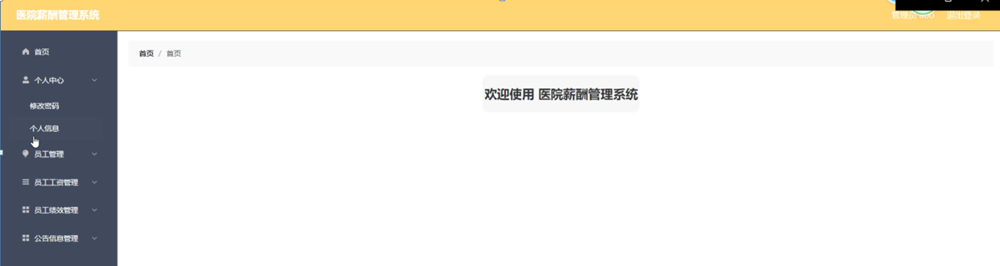
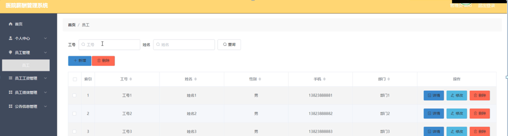

ssm+Vue计算机毕业设计医院薪酬管理系统（程序+LW文档）

**项目运行**

**环境配置：**

**Jdk1.8 + Tomcat7.0 + Mysql + HBuilderX** **（Webstorm也行）+ Eclispe（IntelliJ
IDEA,Eclispe,MyEclispe,Sts都支持）。**

**项目技术：**

**SSM + mybatis + Maven + Vue** **等等组成，B/S模式 + Maven管理等等。**

**环境需要**

**1.** **运行环境：最好是java jdk 1.8，我们在这个平台上运行的。其他版本理论上也可以。**

**2.IDE** **环境：IDEA，Eclipse,Myeclipse都可以。推荐IDEA;**

**3.tomcat** **环境：Tomcat 7.x,8.x,9.x版本均可**

**4.** **硬件环境：windows 7/8/10 1G内存以上；或者 Mac OS；**

**5.** **是否Maven项目: 否；查看源码目录中是否包含pom.xml；若包含，则为maven项目，否则为非maven项目**

**6.** **数据库：MySql 5.7/8.0等版本均可；**

**毕设帮助，指导，本源码分享，调试部署** **(** **见文末** **)**

总体设计

根据医院薪酬管理系统的功能需求，进行系统设计。

后台主要是管理员，管理员功能包括首页，个人中心，员工管理，员工工资管理，员工绩效管理，公告信息管理等；

系统对这些功能进行整合，产生的功能结构图如下：

图3-1 系统总体结构图

3.6数据库设计与实现

在每一个系统中数据库有着非常重要的作用，数据库的设计得好将会增加系统的效率以及系统各逻辑功能的实现。所以数据库的设计我们要从系统的实际需要出发，才能使其更为完美的符合系统功能的实现。

#### 3.6.1数据库概念结构设计

数据库的E-R图反映了实体、实体的属性和实体之间的联系。下面是各个实体以及实体的属性。

员工管理实体属性图如下所示：

图3-2员工管理实体属性图

员工工资管理属性图如下所示：

图3-3员工工资管理实体属性图

员工绩效管理实体属性图如下所示：

图3-4员工绩效管理实体属性图

### 管理员功能模块

管理员登录，通过填写注册时输入的用户名、密码、选择角色等信息进行登录操作，如图4-1所示。

图4-1管理员登录界面图

管理员登录进入医院薪酬管理系统可以查看首页，个人中心，员工管理，员工工资管理，员工绩效管理，公告信息管理等内容进行详细操作，如图4-2所示。

图4-2管理员功能界面图

员工管理；在员工管理页面中可以查看索引，工号，姓名，性别，手机，部门等内容，并进行详情，修改和删除等操作；如图4-3所示。

图4-3员工管理界面图

员工工资管理：在员工工资管理页面中可以查看索引，工号，姓名，部门，基本工资，全勤奖，绩效奖，扣款金额，实发工资，备注，月份，是否支付，审核回复，审核状态等内容，并进行详情，修改和删除等操作，如图4-4所示。

图4-4员工工资管理界面图

员工绩效管理；在员工绩效管理页面中可以查看索引，工号，姓名，部门，员工考勤，工作态度，工作业绩，工作能力，绩效分，评价等级，绩效月份等内容，并进行详情，修改和删除等操作；如图4-5所示。

图4-5员工绩效管理界面图

公告信息管理；在公告信息管理页面中可以查看索引，公告标题，公告内容，发布时间等内容，并进行详情，修改和删除等操作；如图4-6所示。

图4-6公告信息管理界面图

### 4.2员工功能模块

员工登录进入医院薪酬管理系统后台可以查看首页，个人中心，员工工资管理，员工绩效管理，公告信息管理等内容进行详细操作，如图4-7所示。

图4-7员工功能界面图

员工工资管理：在员工工资管理页面中可以查看索引，工号，姓名，部门，基本工资，全勤奖，绩效奖，扣款金额，实发工资，备注，月份，是否支付，审核回复，审核状态等内容，并进行详情操作，如图4-8所示。

图4-8员工工资管理界面图

员工绩效管理；在员工绩效管理页面中可以查看索引，工号，姓名，部门，员工考勤，工作态度，工作业绩，工作能力，绩效分，评价等级，绩效月份等内容，并进行详情操作；如图4-9所示。

图4-9员工绩效管理界面图

公告信息管理；在公告信息管理页面中可以查看索引，公告标题，公告内容，发布时间等内容，并进行详情操作；如图4-10所示。

图4-10公告信息管理界面图

**JAVA** **毕设帮助，指导，源码分享，调试部署**

