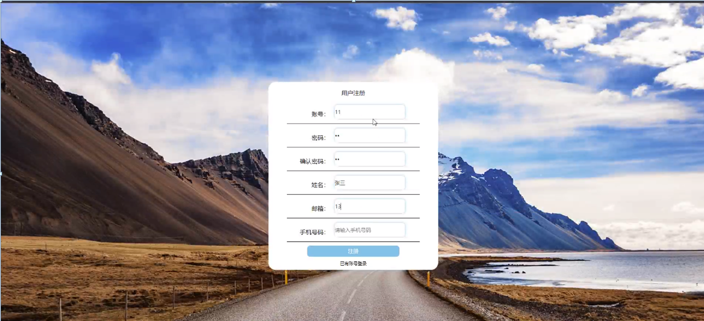
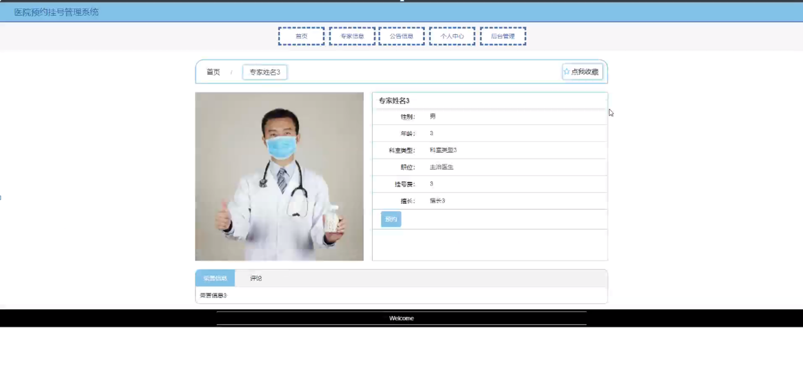
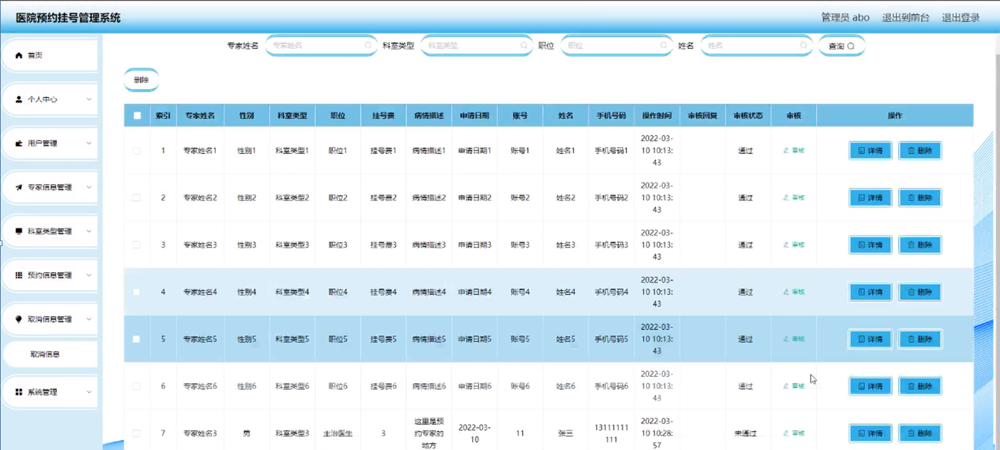

ssm+Vue计算机毕业设计医院预约挂号管理系统（程序+LW文档）

**项目运行**

**环境配置：**

**Jdk1.8 + Tomcat7.0 + Mysql + HBuilderX** **（Webstorm也行）+ Eclispe（IntelliJ
IDEA,Eclispe,MyEclispe,Sts都支持）。**

**项目技术：**

**SSM + mybatis + Maven + Vue** **等等组成，B/S模式 + Maven管理等等。**

**环境需要**

**1.** **运行环境：最好是java jdk 1.8，我们在这个平台上运行的。其他版本理论上也可以。**

**2.IDE** **环境：IDEA，Eclipse,Myeclipse都可以。推荐IDEA;**

**3.tomcat** **环境：Tomcat 7.x,8.x,9.x版本均可**

**4.** **硬件环境：windows 7/8/10 1G内存以上；或者 Mac OS；**

**5.** **是否Maven项目: 否；查看源码目录中是否包含pom.xml；若包含，则为maven项目，否则为非maven项目**

**6.** **数据库：MySql 5.7/8.0等版本均可；**

**毕设帮助，指导，本源码分享，调试部署** **(** **见文末** **)**

### 功能结构

为了更好的去理清本系统整体思路，对该系统以结构图的形式表达出来，设计实现该医院预约挂号管理系统的功能结构图如下所示：

图4-1 系统总体结构图

### 4.2 数据库设计

#### 4.2.1 数据库E/R图

ER图是由实体及其关系构成的图，通过E/R图可以清楚地描述系统涉及到的实体之间的相互关系。在系统中对一些主要的几个关键实体如下图：

(1) 用户注册E/R图如下所示：

图4-2用户注册E/R图

(2)专家信息E/R图如下所示：

图4-3专家信息E/R图

(4)取消信息E/R图如下所示：

 图4-4取消信息E/R图

### 系统功能模块

医院预约挂号管理系统，在网站首页可以查看首页，专家信息，公告信息，个人中心，后台管理等内容，并进行详细操作；如图5-1所示。

图5-1网站首页界面图

用户注册，在用户注册页面通过填写用户账号,密码,确认密码，姓名,手机,邮箱等信息进行注册操作，如图5-2所示。

图5-2用户注册界面图

专家信息，在专家信息页面可以查看专家姓名，性别，年龄，科室类别，职位，挂号费，擅长等内容，并进行收藏操作，如图5-3所示。

图5-3专家信息界面图

个人中心，在个人中心页面通过填写用户账号,密码,姓名,性别,上传图片,手机,邮箱等内容进行更新信息操作，并根据需要对我的收藏进行详细操作；如图5-4所示。

图5-4个人中心界面图

### 5.2后台登录模块

后台登录，管理员和用户进入系统前在登录页面根据要求填写账号，密码，验证码和选择角色等信息，点击登录进行登录操作，如图5-5所示。

图5-5后台登录界面图

#### 5.2.1管理员功能

管理员登陆系统后，可以查看首页，个人中心，用户管理，专家信息管理，科室类型管理，预约信息管理，取消信息管理，系统管理等功能，还能对每个功能逐一进行相应操作，如图5-6所示。

图5-6管理员功能界面图

用户管理，在用户管理页面可以对账号，姓名，性别，邮箱，手机号码，图片等内容进行详情，修改和删除操作，如图5-7所示。

图5-7用户管理界面图

科室类型管理，在科室类型管理页面可以对索引，科室类型等内容进行详情，修改和删除等操作，如图5-8所示。

图5-8科室类型管理界面图

专家信息管理，在专家信息管理页面可以对专家姓名，性别，年龄，专家相片，科室类型，职位，挂号费等内容进行详情，修改，查看评论和删除等操作，如图5-9所示。

图5-9专家信息管理界面图

预约信息管理，在预约信息管理页面可以对专家姓名，性别，科室类型，职位，挂号费，病情描述，申请日期，账号，姓名，手机号码，是否支付，审核回复，审核状态等内容进行详情和删除等操作，如图5-10所示。

图5-10预约信息管理界面图

取消信息管理，在取消信息管理页面可以对专家姓名，性别，科室类型，职位，挂号费，病情描述，申请日期，账号，姓名，手机号码，操作时间，审核回复，审核状态等内容进行详情和删除等操作，如图5-11所示。

图5-11取消信息管理界面图

系统管理，在公告信息页面可以对标题,图片等内容进行详情，修改和删除等操作，还可以对轮播图管理进行详细操作；如图5-12所示。

图5-12系统管理界面图

**JAVA** **毕设帮助，指导，源码分享，调试部署**

