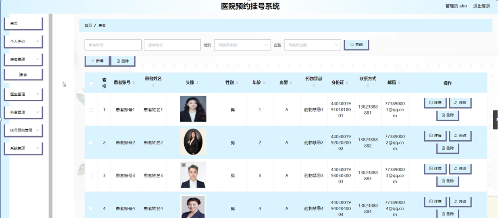

ssm+Vue计算机毕业设计医院预约挂号系统（程序+LW文档）

**项目运行**

**环境配置：**

**Jdk1.8 + Tomcat7.0 + Mysql + HBuilderX** **（Webstorm也行）+ Eclispe（IntelliJ
IDEA,Eclispe,MyEclispe,Sts都支持）。**

**项目技术：**

**SSM + mybatis + Maven + Vue** **等等组成，B/S模式 + Maven管理等等。**

**环境需要**

**1.** **运行环境：最好是java jdk 1.8，我们在这个平台上运行的。其他版本理论上也可以。**

**2.IDE** **环境：IDEA，Eclipse,Myeclipse都可以。推荐IDEA;**

**3.tomcat** **环境：Tomcat 7.x,8.x,9.x版本均可**

**4.** **硬件环境：windows 7/8/10 1G内存以上；或者 Mac OS；**

**5.** **是否Maven项目: 否；查看源码目录中是否包含pom.xml；若包含，则为maven项目，否则为非maven项目**

**6.** **数据库：MySql 5.7/8.0等版本均可；**

**毕设帮助，指导，本源码分享，调试部署** **(** **见文末** **)**

### 系统总体架构设计

该款医院预约挂号系统；患者可以通过注册账号从而登入系统主界面来实现相对应的功能，分别是查看首页，医生，医院公告，个人中心，后台管理等功能。

系统使用Eclipse设计开发，使用MySql进行对数据的存储。后台读取数据并转换成json类型的数据进行传输，在客户端接收数据解析实现各功能并显示给用户。

该系统软件的功能结构图：

图4-1 系统功能结构图

### 4.3 系统数据库的设计

#### 4.3.1数据库E/R图

ER图是由实体及其关系构成的图，通过E/R图可以清楚地描述系统涉及到的实体之间的相互关系。在系统中对一些主要的几个关键实体如下图：

  1. 患者管理E/R图如下所示：

图4-2患者管理E/R图

(2)收藏表E/R图如下所示：

图4-3收藏表E/R图

(3)医院公告E/R图如下所示：

图4-4医院公告管理E/R图

### 系统功能模块

医院预约挂号系统，在系统首页可以查看首页，医生，医院公告，个人中心，后台管理等内容，并进行详细操作；如图5-1所示。

图5-1系统首页界面图

患者注册，在患者注册页面通过填写患者账号，密码，确认密码，患者姓名，年龄，药物禁忌，身份证，联系方式，邮箱，验证码等信息进行注册操作；如图5-2所示。

图5-2患者注册界面图

医生，在医生页面可以查看医生姓名，医生工号，科室，级别，挂号费，擅长疾病，职业履历，点击次数等内容，并进行点我收藏，赞一下，踩一下操作，如图5-3所示。

图5-3医生界面图

个人中心，在个人中心页面通过患者账号，密码，患者姓名，头像，性别，年龄，血型，药物禁忌，身份证，联系方式，邮箱等内容进行更新信息操作，还可以对我的收藏进行详细操作；如图5-4所示。

图5-4个人中心界面图

### 5.2后台功能模块

后台登录，进入系统前在登录页面根据要求填写用户名和密码，选择角色等信息，点击登录进行登录操作，如图5-5所示。

图5-5后台登录界面图

#### 5.2.1管理员功能

管理员登录系统后，可以对首页，个人中心，患者管理，医生管理，科室管理，挂号预约管理，系统管理等功能进行相应的操作管理，如图5-6所示。

图5-6管理员功能界面图

患者管理，在患者管理页面可以对索引，患者账号，患者姓名，头像，性别，年龄，血型，药物禁忌，身份证，联系方式，邮箱等内容进行详情，修改和删除等操作，如图5-7所示。

图5-7患者管理界面图

医生管理，在医生管理页面可以对索引，医生工号，医生姓名，照片，科室，级别，挂号费等信息进行详情，修改和删除等操作，如图5-8所示。

图5-8医生管理界面图

科室管理，在科室管理页面可以对索引，科室等内容进行详情，修改，删除等操作，如图5-9所示。

图5-9科室管理界面图

挂号预约管理，在挂号预约管理页面可以对索引，预约编号，医生工号，医生姓名，科室，挂号费，预约备注，预约时间，患者账号，患者姓名，性别，年龄，联系方式，图片，是否支付，审核回复，审核状态等内容进行详情，修改和删除等操作，如图5-10所示。

图5-10挂号预约管理界面图

系统管理，在轮播图管理页面可以对索引，名称，值等内容进行详情，修改等操作，还可以对医院公告进行详细的操作管理；如图5-11所示。

图5-11系统管理界面图

#### 5.2.2患者功能

患者登录进入医院预约挂号系统可以对首页，个人中心，挂号预约管理等功能进行相应操作，如图5-12所示。

图5-12患者功能界面图

#### **JAVA** **毕设帮助，指导，源码分享，调试部署**

