ssm+Vue计算机毕业设计原创网络文学管理系统（程序+LW文档）

**项目运行**

**环境配置：**

**Jdk1.8 + Tomcat7.0 + Mysql + HBuilderX** **（Webstorm也行）+ Eclispe（IntelliJ
IDEA,Eclispe,MyEclispe,Sts都支持）。**

**项目技术：**

**SSM + mybatis + Maven + Vue** **等等组成，B/S模式 + Maven管理等等。**

**环境需要**

**1.** **运行环境：最好是java jdk 1.8，我们在这个平台上运行的。其他版本理论上也可以。**

**2.IDE** **环境：IDEA，Eclipse,Myeclipse都可以。推荐IDEA;**

**3.tomcat** **环境：Tomcat 7.x,8.x,9.x版本均可**

**4.** **硬件环境：windows 7/8/10 1G内存以上；或者 Mac OS；**

**5.** **是否Maven项目: 否；查看源码目录中是否包含pom.xml；若包含，则为maven项目，否则为非maven项目**

**6.** **数据库：MySql 5.7/8.0等版本均可；**

**毕设帮助，指导，本源码分享，调试部署** **(** **见文末** **)**

### 系统体系结构

原创网络文学管理系统的结构图4-1所示：

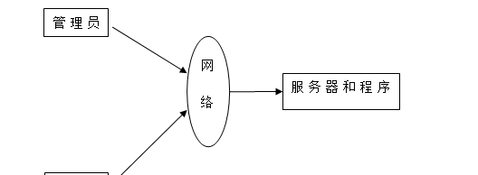

图4-1 系统结构

登录系统结构图，如图4-2所示：

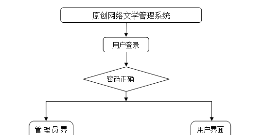

图4-2 登录结构图

系统结构图，如图4-3所示：

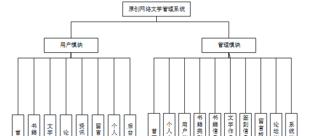

图4-3 系统结构图

### 4.2 数据库实体设计

数据库的功能就是对系统中所有的数据进行存储和管理。所有的数据可以在数据库中产时间的进行存储，方便用户的使用。而且所有的数据库中的数据也应该具有一定的共享性，任何的系统可以对一些数据进行使用，同时还应该保持一定的独立性，每一个数据库中的数据都有很强的安全性，可以被很好的存放到数据库，没有进行身份的验证是不能对这些数据进行查看和使用的。数据库的设计需要明确每一个实体之间的联系，系统的E-
R图如下图所示：

管理员实体主要存储管理信息包括用户名、密码、角色属性。管理员信息属性图如图4-4所示。

图4-4 管理员信息实体属性图

用户信息主要包括用户名、姓名、性别、头像、身份证、手机等属性，用户信息属性图如图4-5所示。

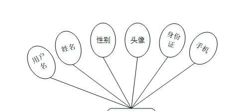

图4-5用户信息实体属性图

书籍信息管理实体属性主要包括索引、书籍编号、书籍名称、书籍类型、图书、简述、作者、书籍资料、出版社等属性。书籍信息管理实体属性图如图4-6所示。

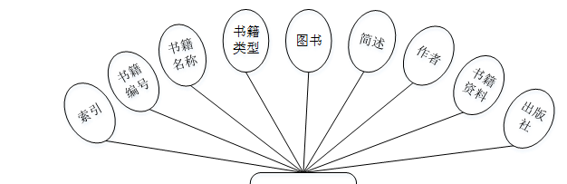

图4-6书籍信息管理实体属性图

文字作品管理属性主要包括索引、标题、书籍类型、图片、方向、字数、简述、用户名、姓名等属性。文字作品管理实体属性图如图4-7所示。

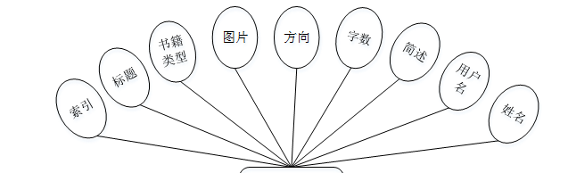

图4-7文字作品管理实体属性图

### 系统功能模块

原创网络文学管理系统，在系统首页可以查看首页、书籍信息、文字作品、论坛、资讯信息、留言反馈、个人中心、后台管理等内容，如图5-1所示。

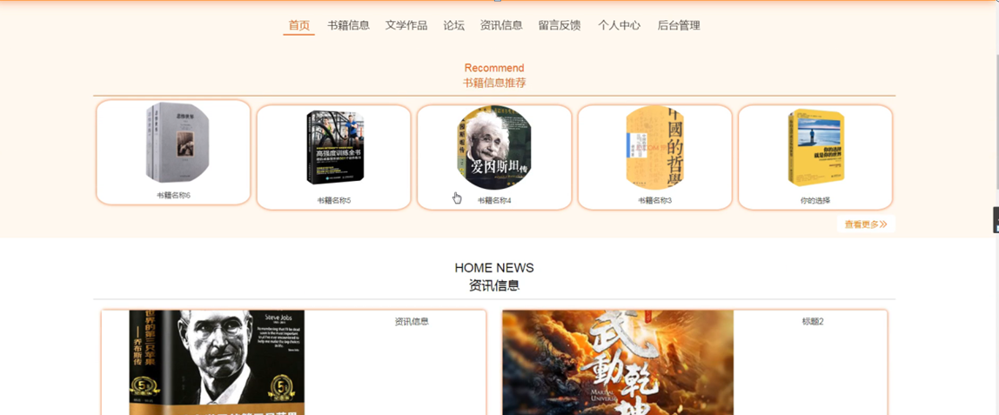

图5-1系统首页界面图

用户注册，在用户注册页面通过填写用户名、密码、姓名、身份证、手机等信息完成用户注册，如图5-2所示。

图5-2用户注册界面图

书籍信息，在书籍信息页面可以查看书籍编号、书籍名称、书籍类型、图书、简述、作者、书籍资料、出版社、点击次数等信息，根据需要进行签到，如图5-3所示。

图5-3书籍信息界面图

文字作品，在文字作品页面可以查看标题、书籍类型、图书、方向、字数、简述、用户名、姓名等信息，如图5-4所示。

图5-4文字作品界面图

论坛，在论坛页面通过填写标题、类型、内容等信息进行发布帖子如图5-5所示。

图5-5论坛界面图

留言反馈，在留言反馈页面通过输入留言内容并立即提交，如图5-6所示。

图5-6留言反馈界面图

个人中心，在个人中心页面通过填写用户名、密码、姓名、性别、身份证、手机等信息，进行更新信息，根据需要对我的发布、我的收藏进行相对应操作，如图5-7所示。

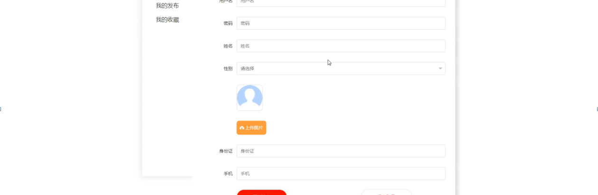

图5-7个人中心界面图

### 5.2管理员功能模块

管理员登录，管理员通过输入账号、密码、角色等信息即可进行系统登录，如图5-8所示。

图5-8管理员登录界面图

管理员登录进入原创网络文学管理系统设计可以查看首页、个人中心、用户管理、书籍类型管理、书籍信息管理、文字作品管理、签到信息管理、留言板管理、论坛管理、系统管理等内容，如图5-9所示。

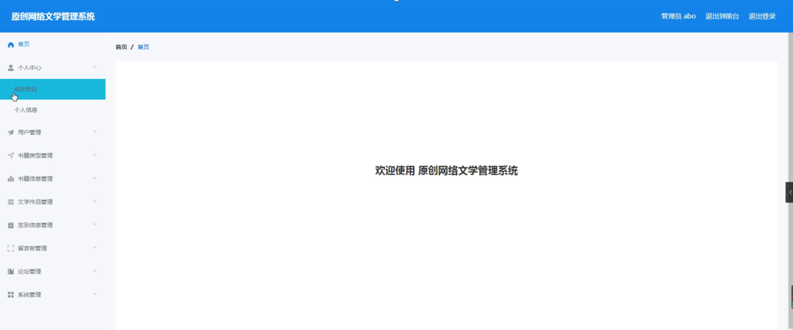

图5-9管理员功能界面图

用户管理，在用户管理页面可以查看索引、用户名、姓名、性别、头像、身份证、手机等信息，并可根据需要进行修改或删除等操作，如图5-10所示。

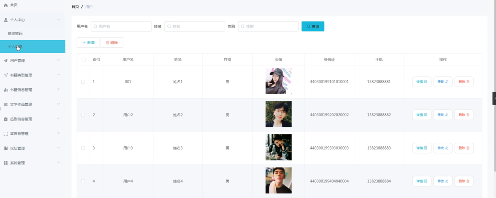

图5-10用户管理界面图

书籍类型管理，在书籍类型管理页面可以查看索引、书籍类型等信息，并可根据需要进行修改或删除等操作，如图5-11所示。

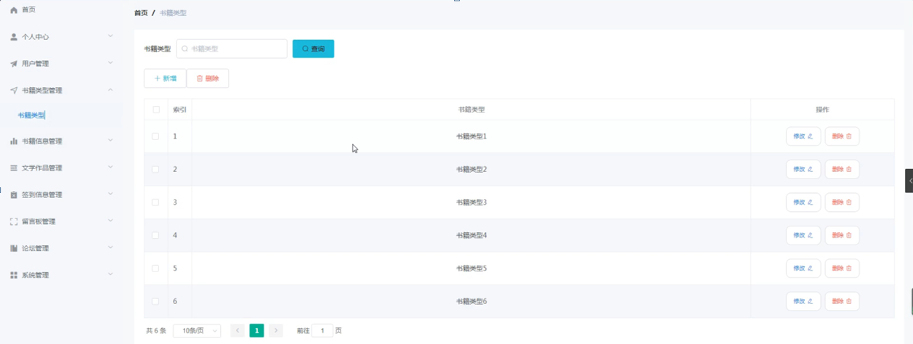

图5-11书籍类型管理界面图

书籍信息管理，在书籍信息管理页面可以查看索引、书籍编号、书籍名称、书籍类型、图书、简述、作者、书籍资料、出版社等信息，并可根据需要进行查看评论、修改或删除等操作，如图5-12所示。

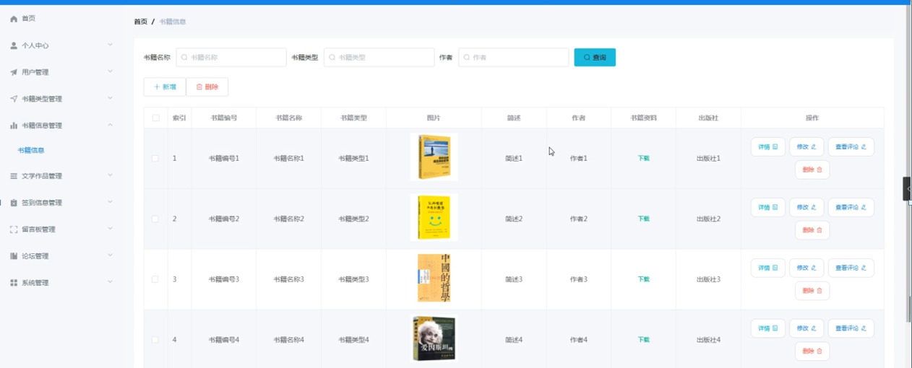

图5-12书籍信息管理界面图

#### **JAVA** **毕设帮助，指导，源码分享，调试部署**

