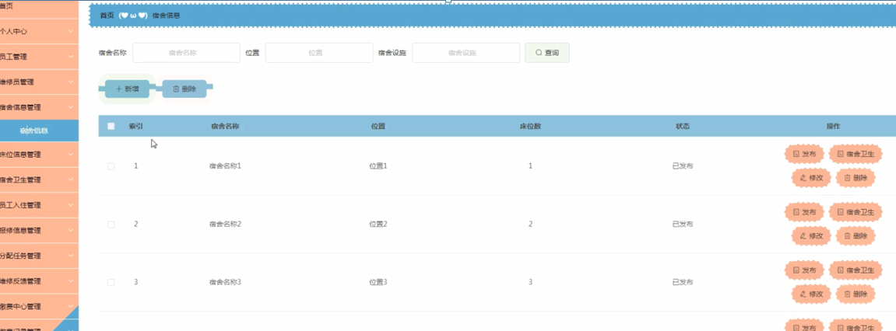
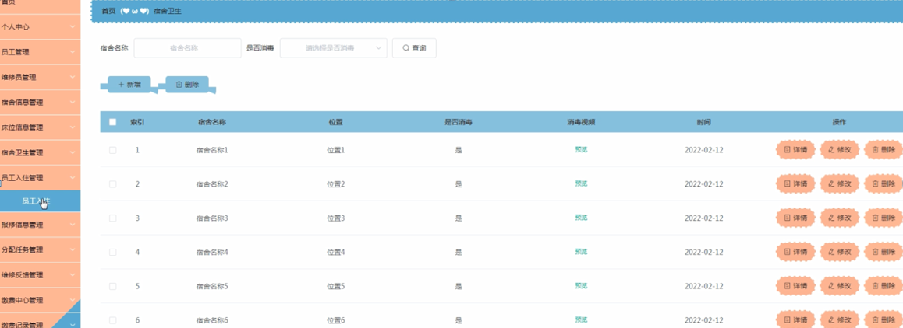

ssm+Vue计算机毕业设计员工宿舍管理系统（程序+LW文档）

**项目运行**

**环境配置：**

**Jdk1.8 + Tomcat7.0 + Mysql + HBuilderX** **（Webstorm也行）+ Eclispe（IntelliJ
IDEA,Eclispe,MyEclispe,Sts都支持）。**

**项目技术：**

**SSM + mybatis + Maven + Vue** **等等组成，B/S模式 + Maven管理等等。**

**环境需要**

**1.** **运行环境：最好是java jdk 1.8，我们在这个平台上运行的。其他版本理论上也可以。**

**2.IDE** **环境：IDEA，Eclipse,Myeclipse都可以。推荐IDEA;**

**3.tomcat** **环境：Tomcat 7.x,8.x,9.x版本均可**

**4.** **硬件环境：windows 7/8/10 1G内存以上；或者 Mac OS；**

**5.** **是否Maven项目: 否；查看源码目录中是否包含pom.xml；若包含，则为maven项目，否则为非maven项目**

**6.** **数据库：MySql 5.7/8.0等版本均可；**

**毕设帮助，指导，本源码分享，调试部署** **(** **见文末** **)**

系统功能结构图

系统功能结构图是系统设计阶段，系统功能结构图只是这个阶段一个基础，整个系统的架构决定了系统的整体模式，是系统的根据。员工宿舍管理系统的整个设计结构如图3-1所示。

图3-1系统功能结构图

### 数据库设计

信息管理系统的效率和实现的效果完全取决于数据库结构设计的好坏。为了保证数据的完整性，提高数据库存储的效率，那么统一合理地设计数据库结构是必要的。数据库设计一般包括如下几个步骤：

（1）根据用户需求，确定数据库信息进行保存

对用户的需求分析是数据库设计的第一阶段，用户的需求调研，熟悉小区运作流程，系统要求，这些都是以概念模型为基础的。

（2）设计数据的概念模型

概念模型与数据建模用户的观点一致，用于信息世界的建模工具。通过E-R图可以清楚地描述系统涉及到的实体之间的相互关系。

员工注册实体图如图4-1所示：

图4-1员工注册实体图

宿舍卫生管理实体图如图4-2所示：

图4-2宿舍卫生管理实体图

### 登录注册模块

员工宿舍管理系统，管理员、员工和维修员通过填写用户名、密码等信息选择角色进行登录就可以使用了，如图5-1所示。

图5-1系统登录界面图

员工注册，在员工注册页面通过填写员工账号、员工姓名、密码、确认密码、 手机号码、邮箱等信息完成员工注册，如图5-2所示。

图5-2员工注册界面图

维修员注册，通过填写维修员账号、维修员账号、密码、 确认密码、联系方式、邮箱等内容进行注册等操作，如图5-3所示。

图5-3维修员注册界面图

### 5.2管理员功能模块

管理员登录系统后，可以对首页、个人中心、员工管理、维修员管理、宿舍信息管理、床位信息管理、宿舍卫生管理、员工入住管理、报修信息管理、分配任务管理、维修反馈管理、缴费中心管理、缴费记录管理等内容进行详细的操作，如图5-4所示。

图5-4管理员功能界面图

员工管理，在员工管理页面中可以对索引、员工账号、员工姓名、手机号码、头像、性别、邮箱、审核回复、审核状态、审核等内容进行详情、修改或删除等操作，如图5-5所示。

图5-5员工管理界面图

维修员管理，在维修员管理页面中可以对索引、维修员账号、维修员姓名、联系方式、头像、性别、邮箱、审核回复、审核状态、审核等内容进行详情、修改或删除等操作，如图5-6所示。

图5-6维修员管理界面图

宿舍信息管理，在宿舍信息管理页面可以对索引、宿舍名称、位置、床位数、状态等内容进行发布、宿舍卫生修改或删除等操作，如图5-7所示。

图5-7宿舍信息管理界面图

床位信息管理，在床位信息管理页面可以对索引、宿舍名称、位置、床位数等内容进行详情、员工入住、修改或删除等操作，如图5-8所示。

图5-8床位信息管理界面图

宿舍卫生管理，在宿舍卫生管理页面可以对索引、宿舍名称、位置、是否消毒、消毒视频、时间等内容进行详情、修改或删除等操作，如图5-9所示。

图5-9宿舍卫生管理界面图

员工入住管理，在员工入住管理页面可以对索引、宿舍名称、 位置、床位数、员工账号、员工姓名等内容进行详情、修改或删除等操作，如图5-10所示。

图5-10员工入住管理界面图

报修信息管理，在报修信息管理页面可以对索引、宿舍名称、位置、报修名称、员工账号、员工姓名、上报日期、审核回复、审核状态、审核等内容进行详情、分配任务、修改或删除等操作，如图5-11所示。

图5-11报修信息管理界面图

分配任务管理，在分配任务管理页面可以对索引、宿舍名称、位置、报修名称、员工账号、员工姓名、上报日期、维修员账号、维修员姓名、分配时间等内容进行详情、修改或删除等操作，如图5-12所示。

图5-12分配任务管理界面图

#### **JAVA** **毕设帮助，指导，源码分享，调试部署**

