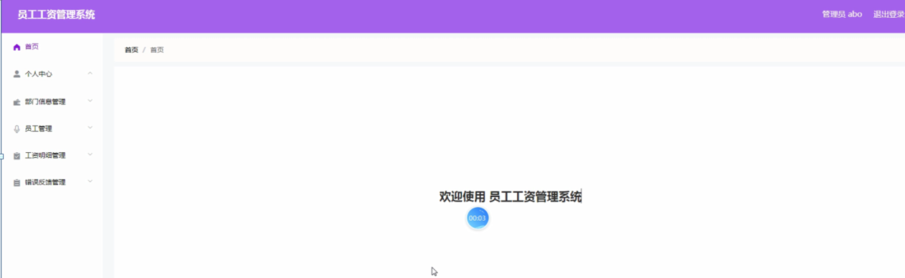

ssm+Vue计算机毕业设计员工工资管理系统（程序+LW文档）

**项目运行**

**环境配置：**

**Jdk1.8 + Tomcat7.0 + Mysql + HBuilderX** **（Webstorm也行）+ Eclispe（IntelliJ
IDEA,Eclispe,MyEclispe,Sts都支持）。**

**项目技术：**

**SSM + mybatis + Maven + Vue** **等等组成，B/S模式 + Maven管理等等。**

**环境需要**

**1.** **运行环境：最好是java jdk 1.8，我们在这个平台上运行的。其他版本理论上也可以。**

**2.IDE** **环境：IDEA，Eclipse,Myeclipse都可以。推荐IDEA;**

**3.tomcat** **环境：Tomcat 7.x,8.x,9.x版本均可**

**4.** **硬件环境：windows 7/8/10 1G内存以上；或者 Mac OS；**

**5.** **是否Maven项目: 否；查看源码目录中是否包含pom.xml；若包含，则为maven项目，否则为非maven项目**

**6.** **数据库：MySql 5.7/8.0等版本均可；**

**毕设帮助，指导，本源码分享，调试部署** **(** **见文末** **)**

### 系统结构

系统架构图属于系统设计阶段，系统架构图只是这个阶段一个产物，系统的总体架构决定了整个系统的模式，是系统的基础。员工工资管理系统的整体结构设计如图4-2所示。

图4-2 系统结构图

### 4.3. 数据库设计

#### 4.3.1 数据库实体

管理员信息结构图，如图4-3所示：

图4-3 管理员信息实体结构图

部门信息管理实体属性图，如图4-4所示：

图4-4部门信息管理实体属性图

员工管理实体属性图如图4-5所示。

图4-5员工管理实体属性图

### 管理员功能模块

管理员登录，管理员通过输入用户，密码，选择角色等信息进行系统登录，如图5-1所示。

图5-1管理员登录界面图

管理员登录进入员工工资管理系统可以查看首页、个人中心、部门信息管理、员工管理、工资明细管理、错误反馈管理等内容进行详细操作，如图5-2所示。

图5-2管理员功能界面图

部门信息管理，在部门信息管理页面通过可以查看索引、部门名称、部门经理、联系电话、办公地点等内容，并可根据需要进行修改或删除等详细操作，如图5-3所示。

图5-3部门信息管理界面图

员工管理，在员工管理页面可以通过查看索引、工号、姓名、性别、头像、部门名称、职位、联系电话、联系邮箱、银行账号、身份证号码、入职时间等内容，并可根据需要进行详情，修改或删除等详细操作，如图5-4所示。

图5-4员工管理界面图

工资明细管理，在工资明细管理页面可以通过查看索引、工号、姓名、基本工资、部门补贴、职位补贴、工龄补贴、全勤补贴、业绩提成、五险一金、扣发事项、扣发工资、实发工资、是否支付等内容，并可根据需要进行修改或删除等详细操作，如图5-5所示。

图5-5工资明细管理界面图

错误反馈管理，在错误反馈管理页面可以通过查看索引、工号、姓名、应发工资、详细说明、审核回复、审核状态、审核等内容，并可根据需要进行修改或删除等详细操作，如图5-6所示。

图5-6错误反馈管理界面图

### 5.2员工功能模块

员工登录进入员工工资管理系统可以查看首页、个人中心、工资明细管理、错误反馈管理等内容进行详细操作，如图5-7所示。

图5-7员工功能界面图

个人中心，在个人中心页面通过填写工号、姓名、性别、头像、部门名称、职位、联系电话、联系邮箱、银行账号、身份证号码、入职时间等内容，并可根据需要进行个人信息修改操作，如图5-8所示。

图5-8个人中心界面图

**JAVA** **毕设帮助，指导，源码分享，调试部署**

