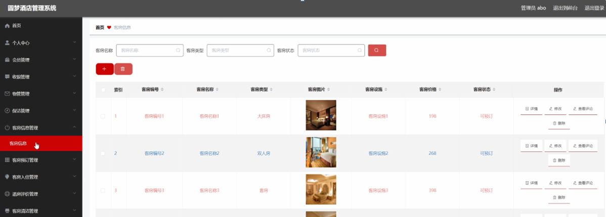

ssm+Vue计算机毕业设计圆梦酒店管理系统（程序+LW文档）

**项目运行**

**环境配置：**

**Jdk1.8 + Tomcat7.0 + Mysql + HBuilderX** **（Webstorm也行）+ Eclispe（IntelliJ
IDEA,Eclispe,MyEclispe,Sts都支持）。**

**项目技术：**

**SSM + mybatis + Maven + Vue** **等等组成，B/S模式 + Maven管理等等。**

**环境需要**

**1.** **运行环境：最好是java jdk 1.8，我们在这个平台上运行的。其他版本理论上也可以。**

**2.IDE** **环境：IDEA，Eclipse,Myeclipse都可以。推荐IDEA;**

**3.tomcat** **环境：Tomcat 7.x,8.x,9.x版本均可**

**4.** **硬件环境：windows 7/8/10 1G内存以上；或者 Mac OS；**

**5.** **是否Maven项目: 否；查看源码目录中是否包含pom.xml；若包含，则为maven项目，否则为非maven项目**

**6.** **数据库：MySql 5.7/8.0等版本均可；**

**毕设帮助，指导，本源码分享，调试部署** **(** **见文末** **)**

### 系统结构

系统架构图属于系统设计阶段，系统架构图只是这个阶段一个产物，系统的总体架构决定了整个系统的模式，是系统的基础。圆梦酒店管理系统的整体结构设计如图4-2所示。

图4-2 系统结构图

### 4.3. 数据库设计

#### 4.3.1 数据库实体

管理员信息结构图，如图4-3所示：

图4-3 管理员信息实体结构图

客房信息管理实体属性图，如图4-4所示：

图4-4客房信息管理实体属性图

客房清洁管理实体属性图如图4-5所示。

图4-5客房清洁管理实体属性图

### 系统功能模块

圆梦酒店管理系统系统，在系统首页可以查看首页、客房信息、公告信息、个人中心、后台管理等内容进行详细操作，如图5-1所示。

图5-1系统首页界面图

客房信息，在客房信息页面可以查看客房名称、客房编号、客房类型、客房图片、客房设施、客房价格、客房状态、客房介绍等详细信息，根据需要进行客房预订、评论或收藏等操作，如图5-2所示。

图5-2客房信息界面图

会员注册，在会员注册页面可以填写用户名、密码、姓名、手机、邮箱、身份证等信息进行注册操作，如图5-3所示。在个人中心页面可以填写用户名、密码、姓名、性别、图片、手机、邮箱、身份证等信息进行更新操作，还可以根据需要对我的收藏进行详细操作；如图5-4所示。

图5-3会员注册界面图

图5-4个人中心界面图

### 5.2管理员功能模块

管理员登录，管理员通过输入账号，密码，选择角色等信息即可进行系统登录，如图5-5所示。

图5-5管理员登录界面图

管理员登录进入系统可以查看首页、个人中心、会员管理、收银管理、物管管理、保洁管理、客房信息管理、客房预订管理、客房入住管理、退房评价管理、客房清洁管理、物品信息管理、物品领用管理、物品入库管理、系统管理等内容进行详细操作，如图5-6所示。

图5-6管理员功能界面图

客房信息管理，在客房信息管理页面可以对索引、客房编号、客房名称、客房类型、客房图片、客房设施、客房价格、客房状态等内容进行详情、修改、查看评论或删除等操作，如图5-7所示。

图5-7客房信息管理界面图

客房入住管理，在客房入住管理页面可以对索引、客房编号、客房名称、客房类型、客房图片、客房状态、客房价格、入住天数、订单价格、入住人数、下单时间、入住时间、入住备注、用户名、姓名、手机、身份证、收银工号、收银姓名、审核回复、审核状态等信息进行详情、修改或删除等操作，如图5-8所示。

图5-8客房入住管理界面图

物品信息管理，在物品信息管理页面可以对索引、物品编号、物品名称、物品类别、物品图片、规格、品牌、数量等内容进行详情、修改或删除等操作，如图5-9所示。

图5-9物品信息管理界面图

物品领用管理，在物品领用管理页面可以对索引、物品编号、物品名称、客房编号、客房名称、数量、领用日期、领用备注、保洁工号、保洁姓名、审核回复、审核状态等内容进行详情、修改或删除等操作，如图5-10所示。

图5-10物品领用管理界面图

物品入库管理，在物品入库管理页面可以对索引、物品编号、物品名称、数量、入库日期、入库备注、物管工号、物管姓名、审核回复、审核状态、审核等内容进行详情、修改或删除等操作，如图5-11所示。

图5-11物品入库管理界面图

### 5.3会员后台功能模块

会员登录进入系统后台可以查看首页、个人中心、客房预订管理、客房入住管理、退房评价管理、我的收藏管理等内容进行详细操作，如图5-12所示。

图5-12会员后台功能界面图

**JAVA** **毕设帮助，指导，源码分享，调试部署**

