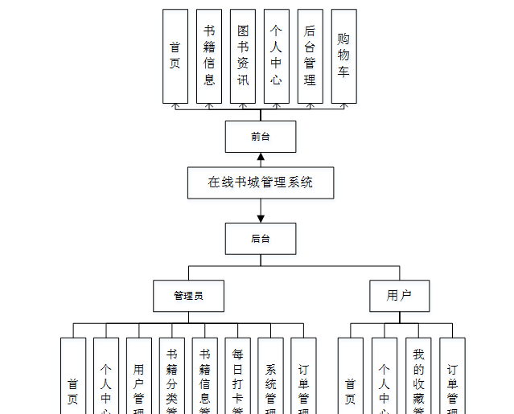
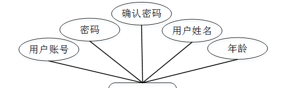
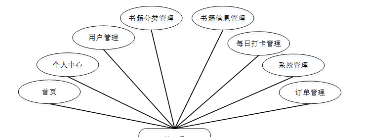
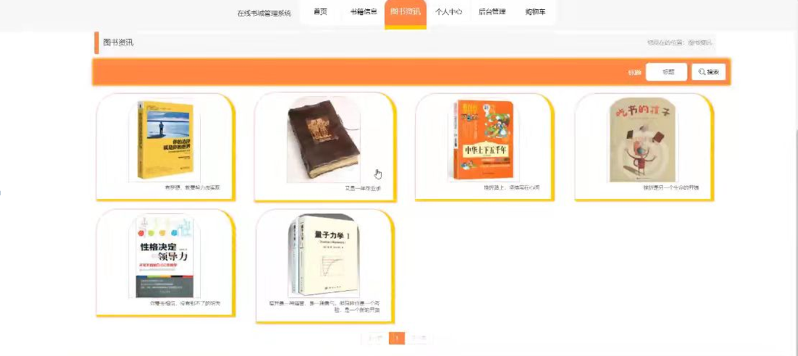
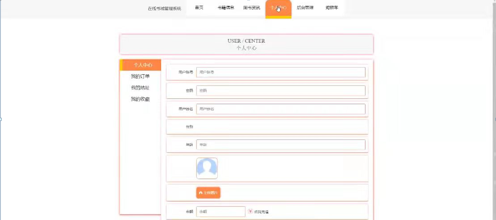
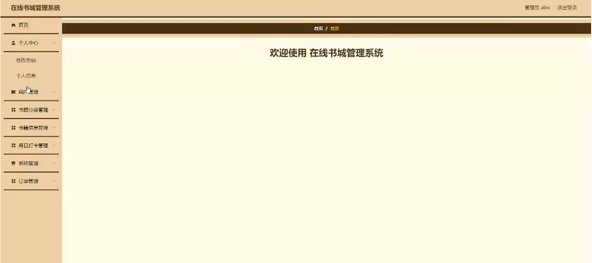
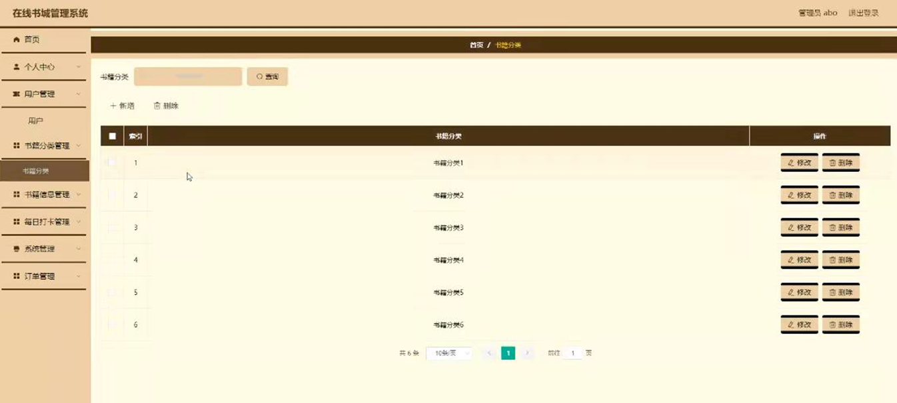
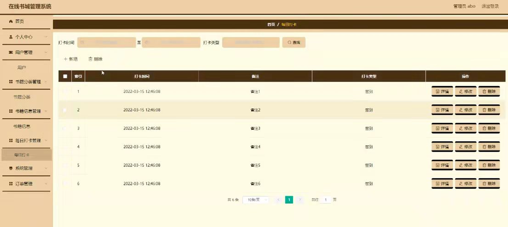
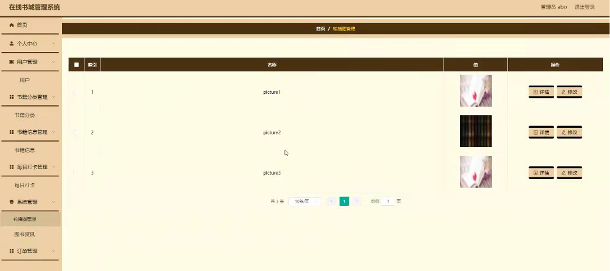

ssm+Vue计算机毕业设计在线书城管理系统（程序+LW文档）

**项目运行**

**环境配置：**

**Jdk1.8 + Tomcat7.0 + Mysql + HBuilderX** **（Webstorm也行）+ Eclispe（IntelliJ
IDEA,Eclispe,MyEclispe,Sts都支持）。**

**项目技术：**

**SSM + mybatis + Maven + Vue** **等等组成，B/S模式 + Maven管理等等。**

**环境需要**

**1.** **运行环境：最好是java jdk 1.8，我们在这个平台上运行的。其他版本理论上也可以。**

**2.IDE** **环境：IDEA，Eclipse,Myeclipse都可以。推荐IDEA;**

**3.tomcat** **环境：Tomcat 7.x,8.x,9.x版本均可**

**4.** **硬件环境：windows 7/8/10 1G内存以上；或者 Mac OS；**

**5.** **是否Maven项目: 否；查看源码目录中是否包含pom.xml；若包含，则为maven项目，否则为非maven项目**

**6.** **数据库：MySql 5.7/8.0等版本均可；**

**毕设帮助，指导，本源码分享，调试部署** **(** **见文末** **)**

### 总体设计

在线书城管理系统采用了结构化开发的方法。这种开发方法的优点是控制性比较强，开发过程中采用了结构化和模块化的设计思想，自顶向下，从总体到部分，合理划分系统的结构和模块。结构化开发时使用模块式开发，各模块之间互不影响，方便系统的开发与管理。

本系统的设计是基于
B/S架构的三层体系结构，也就是浏览器和服务器结构。计算机技术发展的速度非常快，以前的设计结构都以C/S的模式为主，也就是客户端和服务端模式。但随着网页技术的发展，越来越多的用户习惯于使用浏览器。现在的网页技术可以在浏览器中实现非常漂亮的效果，以前的单一低调的客户端页面已经无法满足用户的需求。在B/S这种结构下，技术人员可以很轻松的设计出用户所需要的工作界面，页面代码通过浏览器进行解析展示，在浏览器中不做过多的事务逻辑的处理。主要的事务逻辑放在服务端进行处理。这样用户的电脑就不会承载过多的东西，只需要浏览器展示即可。对于开发人员也很方便进行系统的维护和升级。开发人员只需要在服务端进行系统的维护就可以了。使用Java这样的跨平台性非常好的语言，这样的开发模式更加的方便，高效。本系统合理的进行了模块划分和组合，因此由于各个模块之间基本上是相互独立的，所以每个模块都可以独立的被解释、执行、调试和修改，让繁琐的系统设计工作简单化。系统总体设计图如下图4-1所示：

图4-1系统总体设计图

### 4.2数据库设计

#### 4.2.1概念模型设计

数据可设计要遵循职责分离原则，即在设计时应该要考虑系统独立性，即每个系统之间互不干预不能混乱数据表和系统关系。

数据库命名也要遵循一定规范，否则容易混淆，数据库字段名要尽量做到与表名类似，多使用小写英文字母和下划线来命名并尽量使用简单单词。

概念模型是对现实中的问题出现的事物的进行描述，ER图是由实体及其关系构成的图，通过E-R图可以清楚地描述系统涉及到的实体之间的相互关系。

用户注册实体图如图4-2所示：

图4-2用户注册实体图

管理员功能实体图如图4-3所示：

图4-3管理员功能实体图

用户功能实体图如图4-4所示：

图4-4用户功能实体图

### 系统功能模块

在线书城管理系统，在系统首页可以查看首页,书籍信息，图书资讯，个人中心，后台管理，购物车等内容，并进行详细操作；如图5-1所示。

图5-1系统首页界面图

用户注册，在用户注册页面通过填写用户账号,密码,确认密码，用户姓名,年龄等信息进行注册操作，如图5-2所示。

图5-2用户注册界面图

书籍信息，在书籍信息页面可以查看书籍分类，还可以对书籍名称，作者，出版社等内容进行搜索操作，如图5-3所示。

图5-3书籍信息界面图

图书资讯，在图书资讯页面可以对书籍标题进行搜索，如图5-4所示。

图5-4图书资讯界面图

个人中心，在个人中心页面通过填写用户账号,密码,用户姓名,性别，年龄，照片等内容进行更新信息操作，如图5-5所示。

图5-5个人中心界面图

### 5.2管理员功能模块

管理员进行登录，进入系统前在登录页面根据要求填写用户名和密码，选择角色等信息，点击登录进行登录操作，如图5-6所示。

图5-6管理员登录界面图

管理员登录系统后，可以对首页，个人中心，用户管理，书籍分类管理，书籍信息管理，每日打卡管理，系统管理。订单管理等功能进行相应的操作管理，如图5-7所示。

图5-7管理员功能界面图

用户管理，在用户管理页面可以对索引,用户账号,用户姓名,性别,年龄，头像等内容进行详情，修改和删除等操作，如图5-8所示。

图5-8用户管理界面图

书籍分类管理，在书籍分类管理页面可以对索引,书籍分类等信息进行修改和删除等操作，如图5-9所示。

图5-9书籍分类管理界面图

书籍信息管理，在书籍信息管理页面可以对索引,书籍名称，书籍分类，图片，作者，出版社，出版时间，价格等内容进行详情，修改，查看评论和删除等操作，如图5-10所示。

图5-10书籍信息管理界面图

每日打卡管理，在每日打卡管理页面可以对索引,打卡时间，备注打卡类型等内容进行详情，修改和删除等操作，如图5-11所示。

图5-11每日打卡管理界面图

系统管理，在轮播图管理可以对索引，名称，值等内容进行详情，或修改等操作，如图5-12所示。

图5-12系统管理界面图

**JAVA** **毕设帮助，指导，源码分享，调试部署**

