ssm+Vue计算机毕业设计在线二手书店（程序+LW文档）

**项目运行**

**环境配置：**

**Jdk1.8 + Tomcat7.0 + Mysql + HBuilderX** **（Webstorm也行）+ Eclispe（IntelliJ
IDEA,Eclispe,MyEclispe,Sts都支持）。**

**项目技术：**

**SSM + mybatis + Maven + Vue** **等等组成，B/S模式 + Maven管理等等。**

**环境需要**

**1.** **运行环境：最好是java jdk 1.8，我们在这个平台上运行的。其他版本理论上也可以。**

**2.IDE** **环境：IDEA，Eclipse,Myeclipse都可以。推荐IDEA;**

**3.tomcat** **环境：Tomcat 7.x,8.x,9.x版本均可**

**4.** **硬件环境：windows 7/8/10 1G内存以上；或者 Mac OS；**

**5.** **是否Maven项目: 否；查看源码目录中是否包含pom.xml；若包含，则为maven项目，否则为非maven项目**

**6.** **数据库：MySql 5.7/8.0等版本均可；**

**毕设帮助，指导，本源码分享，调试部署** **(** **见文末** **)**

### 系统的功能结构图

经过系统需求分析，该在线二手书店的设计与实现功能结构图如图4-1所示：

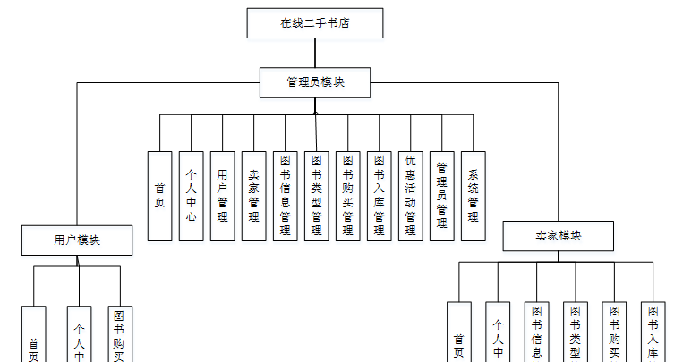

图4-1 系统功能结构图

### 4.2 数据库概念结构设计

####  4.2.1 数据库E-R图

概念设计主要是通过数据库的概念结构和模式进行建立数据库嗯逻辑结构，然后利用数据库的DBMS进行完成，它不需要计算机系统的支持。通过系统的整体来看，主要是对数据库进行管理、整理、更新等操作。数据库的功能是非常强大的，每个系统的开发肯定离不开数据库，通过数据库可以看得出整个系统的质量和效率，根据以上的系统分析，对系统中的主要实体进行规划。以下是几个关键实体的实体关系图：

(1) 图书信息实体E-R图如图4-2所示：

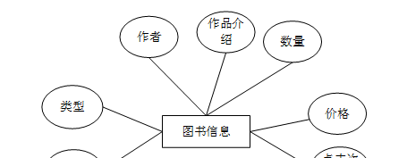

图4-2图书信息实体图

(2)用户信息实体E-R图如图4-3所示：

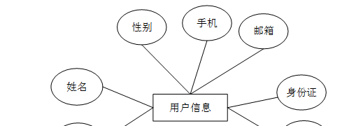

图4-3 用户信息实体图

(3) 图书购买管理实体E-R图如图4-4所示：

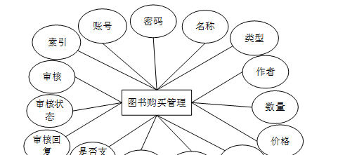

图4-4图书购买管理实体图

### 系统功能模块

在线二手书店，在系统首页可以查看首页、图书信息、优惠活动、个人中心、后台管理等内容，如图5-1所示。

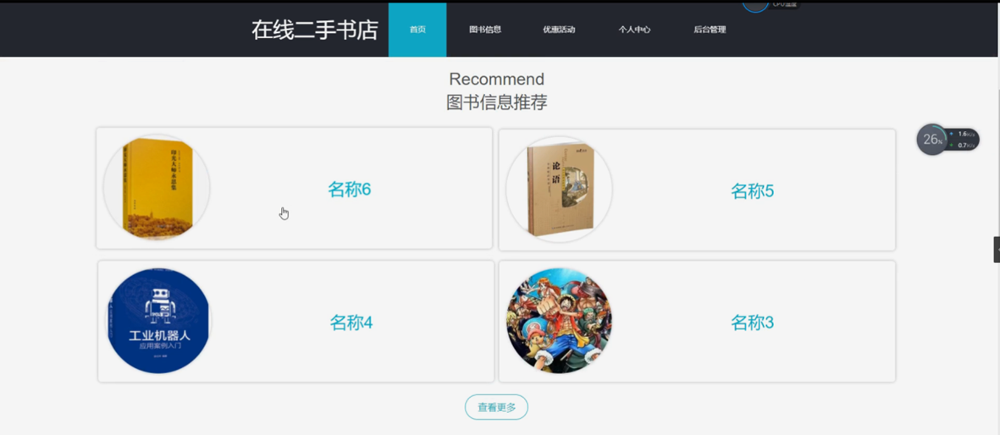

图5-1系统首页界面图

用户注册，在用户注册页面通过填写账号、密码、姓名、手机、邮箱、身份证等信息完成用户注册，如图5-2所示。

图5-2用户注册界面图

图书信息，在图书信息页面可以查看名称、类型、作者、作品介绍、数量、价格、点击次数等详细内容，根据需要进行购买操作，如图5-3所示。

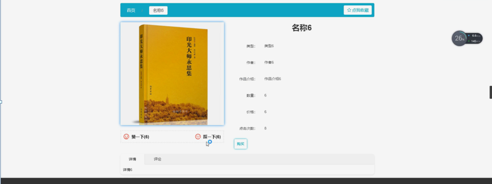

图5-3图书信息界面图

优惠活动，在优惠活动页面可以查看活动名称、优惠内容、开始时间、结束时间、联系电话等详细内容，如图5-4所示。

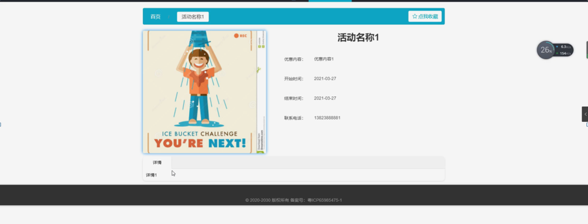

图5-4优惠活动界面图

个人中心，在个人中心页面通过填写用户信息进行更新信息，根据需要对我的收藏进行相对应操作，如图5-5所示。

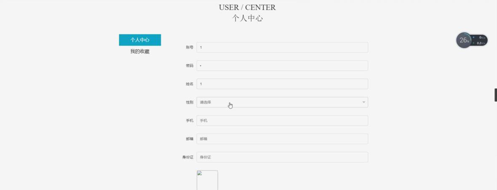

图5-5个人中心界面图

### 5.2管理员功能模块

管理员登录，管理员通过输入用户名、密码，选择角色并点击登录进行系统登录操作，如图5-6所示。

图5-6管理员登录界图面

管理员登录系统后，可以对首页、个人中心、用户管理、卖家管理、图书信息管理、图书类型管理、图书购买管理、图书入库管理、优惠活动管理、管理员管理、系统管理等功能模块进行相应操作，如图5-7所示。

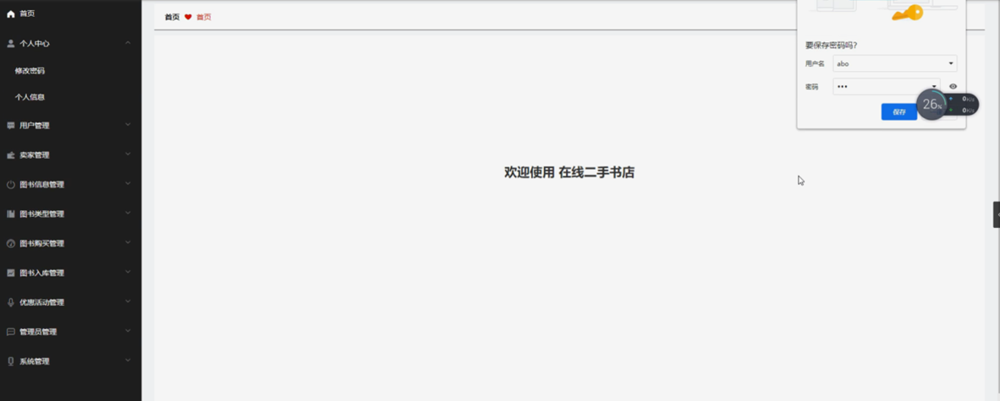

图5-7管理员功能界图面

用户管理，在用户管理页面可以对索引、账号、姓名、性别、手机、邮箱、身份证、图片等内容进行详情、修改或删除等操作，如图5-8所示。

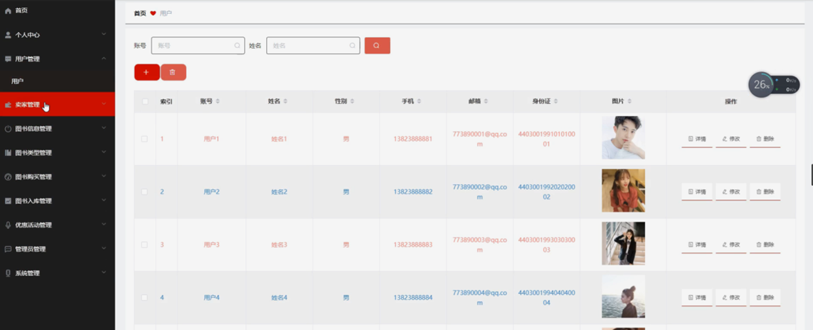

图5-8用户管理界面图

卖家管理，在卖家管理页面可以对索引、工号、姓名、性别、手机、邮箱、身份证、图片等内容进行详情、修改或删除等操作，如图5-9所示。

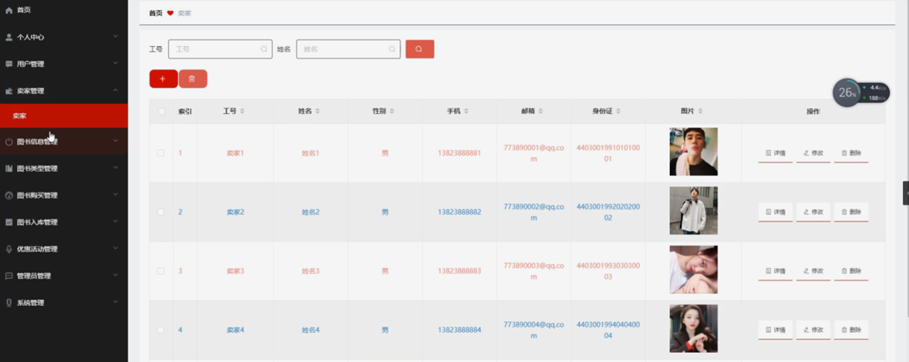

图5-9卖家管理界面图

图书信息管理，在图书信息管理页面可以对索引、名称、类型、作者、作品介绍、数量、价格、图片等内容进行查看评论、详情、修改或删除等操作，如图5-10所示。

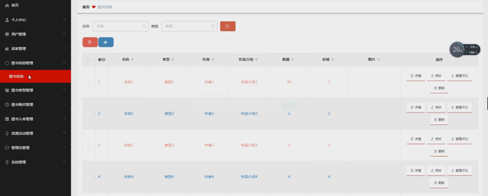

图5-10图书信息管理界面图

图书类型管理，在图书类型管理页面可以对索引、类型等内容进行修改或删除等操作，如图5-11所示。

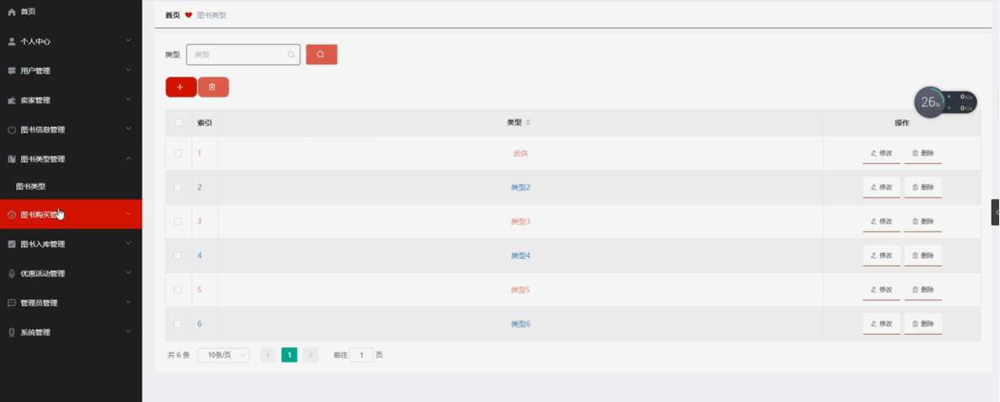

图5-11图书类型管理界面图

图书购买管理，在图书购买管理页面可以对索引、账号、密码、名称、类型、作者、数量、价格、总价、收货地址、联系电话、是否支付、审核回复、审核状态、审核等内容进行详情、修改或删除等操作，如图5-12所示。

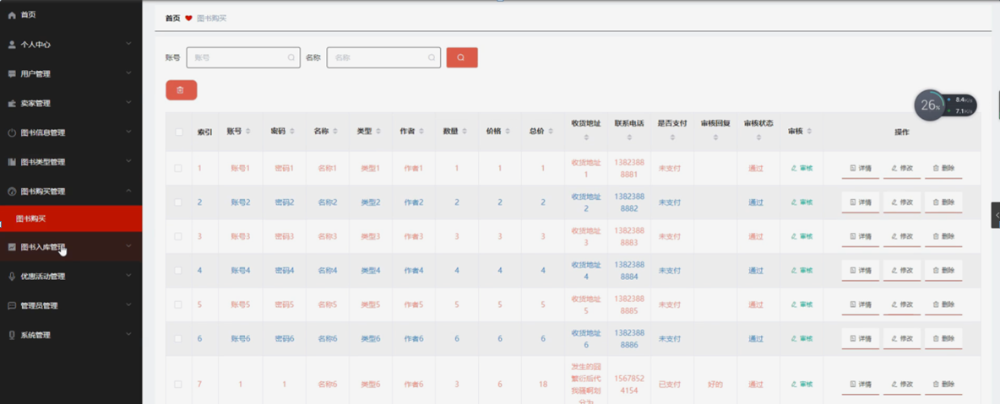

图5-12图书购买管理界面图

#### **JAVA** **毕设帮助，指导，源码分享，调试部署**

