ssm+Vue计算机毕业设计在线二手交易管理系统（程序+LW文档）

**项目运行**

**环境配置：**

**Jdk1.8 + Tomcat7.0 + Mysql + HBuilderX** **（Webstorm也行）+ Eclispe（IntelliJ
IDEA,Eclispe,MyEclispe,Sts都支持）。**

**项目技术：**

**SSM + mybatis + Maven + Vue** **等等组成，B/S模式 + Maven管理等等。**

**环境需要**

**1.** **运行环境：最好是java jdk 1.8，我们在这个平台上运行的。其他版本理论上也可以。**

**2.IDE** **环境：IDEA，Eclipse,Myeclipse都可以。推荐IDEA;**

**3.tomcat** **环境：Tomcat 7.x,8.x,9.x版本均可**

**4.** **硬件环境：windows 7/8/10 1G内存以上；或者 Mac OS；**

**5.** **是否Maven项目: 否；查看源码目录中是否包含pom.xml；若包含，则为maven项目，否则为非maven项目**

**6.** **数据库：MySql 5.7/8.0等版本均可；**

**毕设帮助，指导，本源码分享，调试部署** **(** **见文末** **)**

### 系统体系结构

在线二手交易管理系统开发系统的结构图4-1所示：

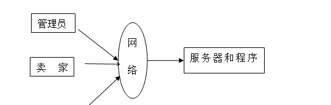

图4-1 系统结构图

模块包括主界面：首页、商品信息、个人中心、后台管理等进行相应的操作。

登录系统结构图，如图4-2所示：

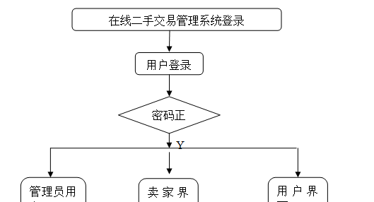

图4-2 登录结构图

管理员功能可以充分满足管理员在线二手交易管理系统的需求。管理员功能结构如图4-4所示。

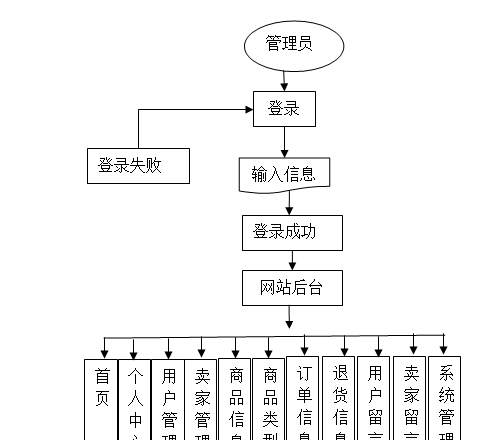

图4-4管理员功能结构图

### 数据库设计原则

数据库是整个软件编程中最重要的一个步骤，对于数据库问题主要是判定数据库的数量和结构公式的创建。在线二手交易管理系统使用的是Mysql进行对数据库进行管理，进行保证数据的安全性、稳定性等。

每个数据库的应用它们都是和区分开的，当运行到一定的程序当中，它就会与自己相关的协议与客户端进行通讯。那么这个系统就会对使这些数据进行连接。当我们选择哪个桥段的时候，接下来就会简单的叙述这个数据库是如何来创建的。当点击完成按钮的时候就会自动在对话框内弹出数据源的名称，在进行点击下一步即可，直接在输入相对应的身份验证和登录密码。

概念模型的设计是为了抽象真实世界的信息，并对信息世界进行建模。它是数据库设计的强大工具。数据库概念模型设计可以通过E-R图描述现实世界的概念模型。系统的E-
R图显示了系统中实体之间的链接。而且Mysql数据库是自我保护能力比较强的数据库，下图主要是对数据库实体的E-R图：

在线二手交易管理系统的数据流程：

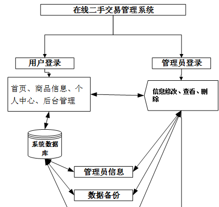

图4-5 系统数据流程图

用户注册E-R图，如图4-6所示。

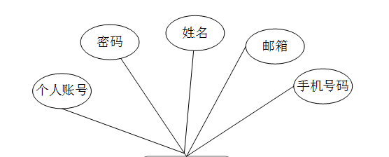

图4-6用户注册图

### 卖家功能模块

卖家注册，卖家通过输入卖家账号、密码、卖家姓名、邮箱、联系电话等内容进行注册，如图5-1所示。

图5-1卖家注册界面图

卖家登录，卖家通过输入用户名、密码、角色进行登录，如图5-2所示。

图5-2卖家登录界面图

卖家通过登录进入在线二手交易管理系统，可查看首页、个人中心、商品信息管理、商品类型管理、订单信息管理、退货信息管理、卖家留言管理等内容，如图5-3所示。

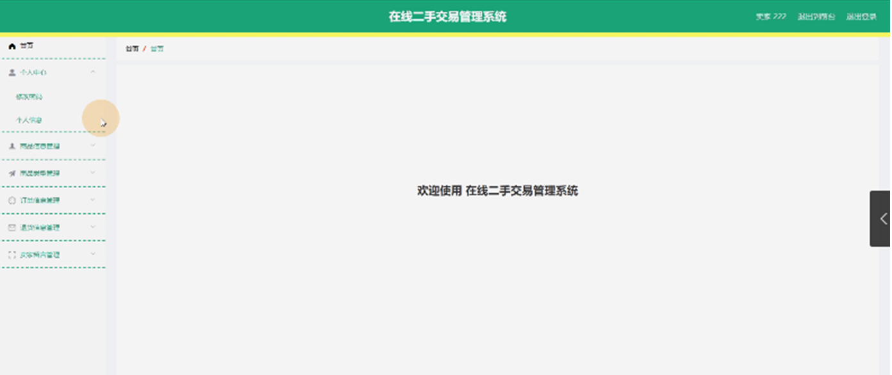

图5-3卖家前台功能界面图

商品信息管理，卖家可在商品信息管理页面进行查询、新增、修改、查看评论或删除等操作，如图5-4所示。

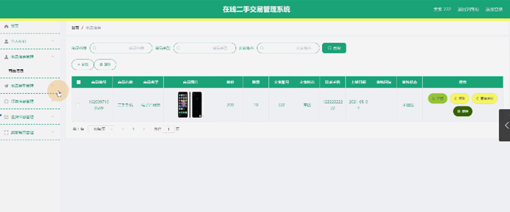

图5-4商品信息管理界面图

商品类型管理，卖家可在商品类型管理页面进行查询等操作，如图5-5所示。

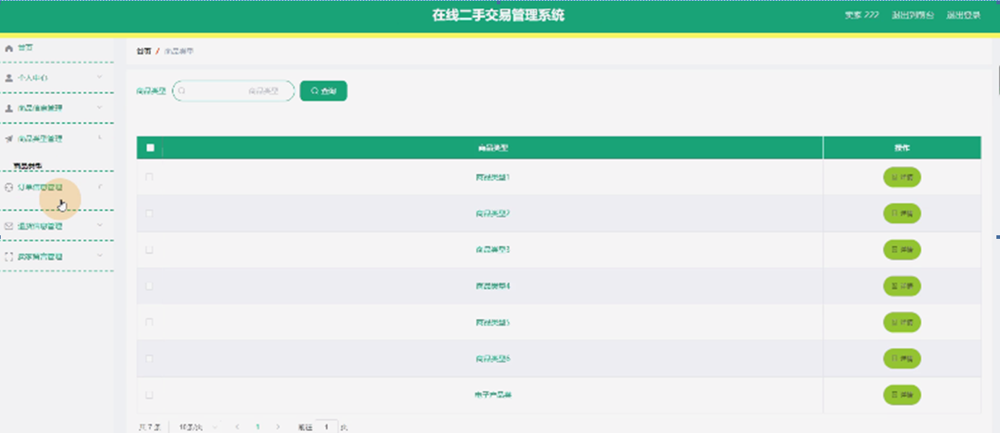

图5-5商品类型管理界面图

卖家留言管理，卖家可在卖家留言管理页面进行查询、新增或删除等操作，如图5-6所示。

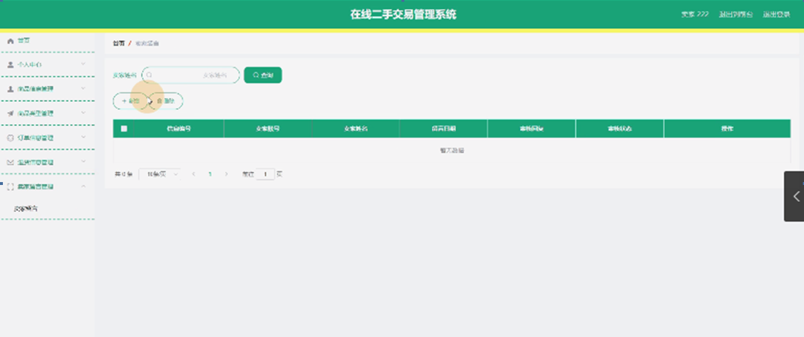图5-6卖家留言管理界面图

5.3用户前台功能模块

用户注册，用户通过输入个人账号、密码、姓名、邮箱、手机号码等内容进行注册，如图5-7所示。

图5-7用户注册界面图

用户通过输入账号、密码进行登录进入在线二手交易管理系统可查看首页、商品信息、个人中心、后台管理等内容，如图5-8所示。

图5-8用户前台功能界面图

用户在首页可通过点击商品名称进行查看商品编号、商品类型、商品简介、单价、数量、卖家账号、卖家姓名、手机、上架日期等内容，还可根据需要进行购买、评论或点赞等操作，如图5-9所示。

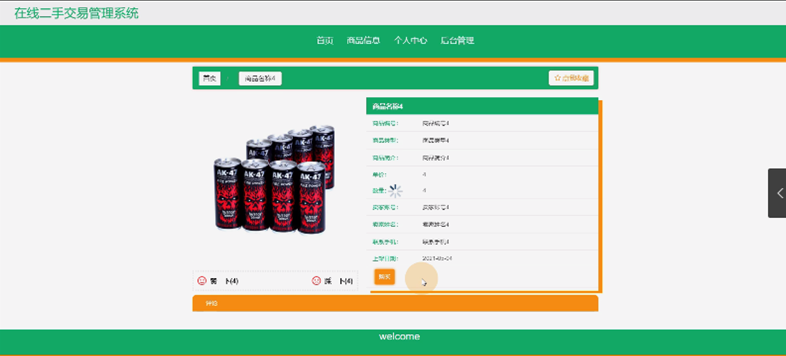图5-9商品界面图

个人中心，用户可在个人中心页面查看个人信息、我的收藏等内容，如图5-10所示。

图5-10个人中心界面图

5.3用户后台功能模块

用户点击后台管理可查看首页、个人中心、订单信息管理、退货信息管理、用户留言管理、我的收藏管理等内容，如图5-11所示。

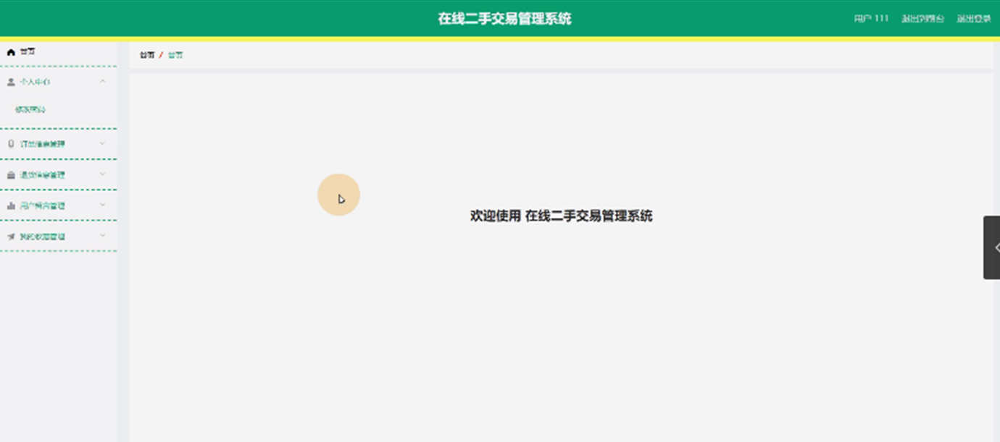

图5-11用户后台功能管理界面图

用户留言管理，用户可在用户留言管理页面进行查询、新增或删除等操作，如图5-12所示。

###  
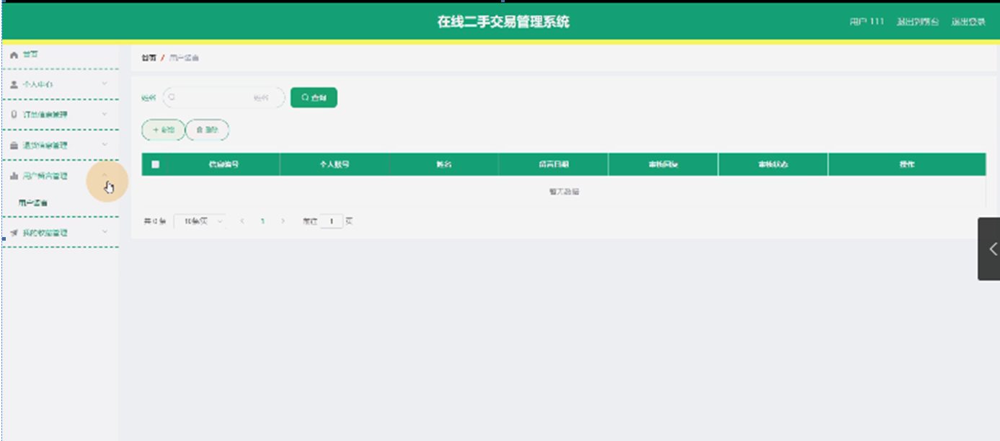

图5-12用户留言管理界面图

#### **JAVA** **毕设帮助，指导，源码分享，调试部署**

