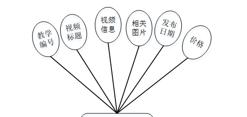
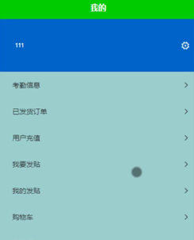

ssm+Vue计算机毕业设计在线付费课程学习平台（程序+LW文档）

**项目运行**

**环境配置：**

**Jdk1.8 + Tomcat7.0 + Mysql + HBuilderX** **（Webstorm也行）+ Eclispe（IntelliJ
IDEA,Eclispe,MyEclispe,Sts都支持）。**

**项目技术：**

**SSM + mybatis + Maven + Vue** **等等组成，B/S模式 + Maven管理等等。**

**环境需要**

**1.** **运行环境：最好是java jdk 1.8，我们在这个平台上运行的。其他版本理论上也可以。**

**2.IDE** **环境：IDEA，Eclipse,Myeclipse都可以。推荐IDEA;**

**3.tomcat** **环境：Tomcat 7.x,8.x,9.x版本均可**

**4.** **硬件环境：windows 7/8/10 1G内存以上；或者 Mac OS；**

**5.** **是否Maven项目: 否；查看源码目录中是否包含pom.xml；若包含，则为maven项目，否则为非maven项目**

**6.** **数据库：MySql 5.7/8.0等版本均可；**

**毕设帮助，指导，本源码分享，调试部署** **(** **见文末** **)**

### **系统的结构划分**

本网站可以分为:用户使用的功能、管理员进行管理的功能。

用户使用功能：登陆、注册验证，课程资料、教学视频、论坛、我的等。

管理员管理功能：登陆验证，首页、个人中心、用户管理、课程资料管理、教学视频管理、考勤信息管理、用户考勤管理、管理员管理、我的收藏管理、论坛管理、系统管理、订单管理等。

在线付费课程学习平台系统的结构图3-1所示：

图3-1 系统结构

登录系统结构图，如图3-2所示：

图3-2 登录结构图

这些功能可以充分满足在线付费课程学习平台的需求。此系统功能较为全面如下图系统功能结构如图3-3所示。

图3-3系统功能结构图

### 数据库设计

#### 3.3.1 数据库实体

管理员信息结构图，如图4-7所示：

图4-7 管理员信息实体结构图

课程资料管理实体属性图，如图4-8所示：

图4-8课程资料管理实体属性图

教学视频管理实体属性图如图4-9所示。

图4-9教学视频管理实体属性图

### 系统实现

#### 4.2.1前端功能模块

用户登录，用户通过输入账号、密码，选择用户类型并点击登录进行系统登录操作，如图4-1所示。

图4-1用户登录界面图

用户注册，在注册页面通过输入账号、密码、姓名、性别、身份证号码、手机号码等信息进行注册，如图4-2所示。

图4-2用户注册界面图

用户登陆系统后，可以对首页、课程资料、教学视频、论坛、我的等功能模块进行操作，如图4-3所示。

图4-3系统首页界面图

课程资料，在课程资料页面可以查看课程标题、课程编号、课程图片、课程信息、价格、出版社、发布日期等信息进行加入购物车、立即订购、评论或收藏等操作，如图4-4所示。

图4-4课程资料界面图

教学视频，在教学视频页面可以查看视频标题、教学编号、图片、发布日期等信息进行加入购物车、立即订购或收藏等操作，如图4-5所示。

图4-5教学视频界面图

我的，在我的页面可以对考勤信息、已发货订单、用户充值、我要发贴、我的发贴、购物车、我的订单等详细信息进行操作，如图4-6所示。

图4-6我的界面图

用户信息，在用户信息页面可以填写账号、密码、姓名、性别、身份证号码、手机号码、照片等详细信息进行保存操作，如图4-7所示。

图4-7用户信息界面图

#### 4.2.2管理员功能模块（后端）

管理员登录，通过填写注册时输入的用户名、密码、选择角色进行登录，如图4-8所示。

图4-8管理员登录界面图

管理员登录进入平台可以查看首页、个人中心、用户管理、课程资料管理、教学视频管理、考勤信息管理、用户考勤管理、管理员管理、我的收藏管理、论坛管理、系统管理、订单管理等信息进行详细操作，如图4-9所示。

图4-9管理员功能界面图

用户管理，在用户管理页面中可以对账号、密码、姓名、性别、身份证号码、手机号码、照片等信息进行详情，修改或删除等操作，如图4-10所示。

图4-10用户管理界面图

课程资料管理，在课程资料管理页面中可以对课程编号、课程标题、课程信息、出版社、相关图片、发布日期、价格等信息进行详情，修改或删除等操作，如图4-11所示。

图4-11课程资料管理界面图

教学视频管理，在教学视频管理页面中可以对教学编号、视频标题、视频信息、相关图片、发布日期、价格等信息进行详情，修改或删除等操作，如图4-12所示。

图4-12教学视频管理界面图

#### **JAVA** **毕设帮助，指导，源码分享，调试部署**

