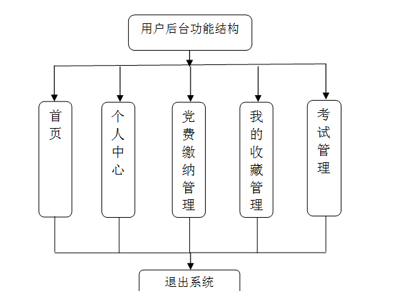
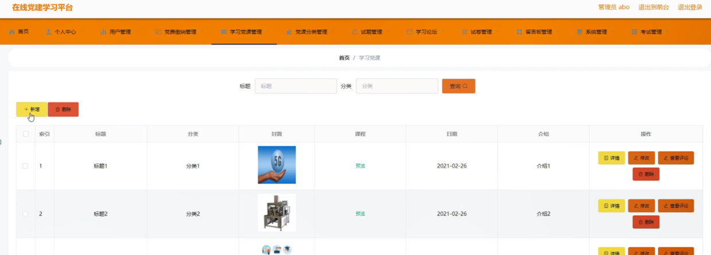

ssm+Vue计算机毕业设计在线党建学习平台（程序+LW文档）

**项目运行**

**环境配置：**

**Jdk1.8 + Tomcat7.0 + Mysql + HBuilderX** **（Webstorm也行）+ Eclispe（IntelliJ
IDEA,Eclispe,MyEclispe,Sts都支持）。**

**项目技术：**

**SSM + mybatis + Maven + Vue** **等等组成，B/S模式 + Maven管理等等。**

**环境需要**

**1.** **运行环境：最好是java jdk 1.8，我们在这个平台上运行的。其他版本理论上也可以。**

**2.IDE** **环境：IDEA，Eclipse,Myeclipse都可以。推荐IDEA;**

**3.tomcat** **环境：Tomcat 7.x,8.x,9.x版本均可**

**4.** **硬件环境：windows 7/8/10 1G内存以上；或者 Mac OS；**

**5.** **是否Maven项目: 否；查看源码目录中是否包含pom.xml；若包含，则为maven项目，否则为非maven项目**

**6.** **数据库：MySql 5.7/8.0等版本均可；**

**毕设帮助，指导，本源码分享，调试部署** **(** **见文末** **)**

### 系统结构

本系统架构网站系统，本系统的具体功能如下：

图4-2系统功能结构图

管理员功能结构图，如图4-3所示：

图4-3 管理员功能结构图

用户后台功能结构图，如图4-4所示：

图4-4 用户后台功能结构图

### 4.3. 数据库设计

#### 4.3.1 数据库实体

管理员信息结构图，如图4-5所示：

图4-5 管理员信息实体结构图

党费缴纳管理实体属性图，如图4-6所示：

图4-6党费缴纳管理实体属性图

学习党课管理实体属性图，如图4-7所示：

图4-6学习党课管理实体属性图

### 系统功能模块

在线党建学习平台设计，在在线党建学习平台首页可以查看首页、学习党课、学习论坛、试卷列表、公告通知、留言反馈、个人中心、后台管理、在线交流等内容，如图5-1所示。

图5-1网站首页界面图

学习党课，在学习党课页面可以查看标题、分类、封面、课程、日期、介绍、详情等详细信息，根据需要进行下载该视频，评论或收藏，如图5-2所示。

图5-2学习党课界面图

试卷列表，在试卷列表页面可以查看试卷名称、考试时长、创建时间等详细信息，根据需要进行考试，如图5-3所示。

图5-3试卷列表界面图

用户注册，在用户注册页面可以查看账号、密码、姓名、年龄、电话、邮箱等信息进行注册，如图5-4所示。在个人中心页面可以查看账号、密码、姓名、性别、年龄、电话、邮箱、图片等信息进行信息更新操作，还可以根据需要对我的发布、考试记录、错题本、我的收藏进行详细操作；如图5-5所示。

图5-4用户注册界面图

图5-5个人中心界面图

### 5.2管理员功能模块

管理员登录，管理员通过输入账号，密码，选择角色等信息即可进行系统登录，如图5-6所示。

图5-6管理员登录界面图

管理员登录进入在线党建学习平台可以查看首页、个人中心、用户管理、党费缴纳管理、学习党课管理、党课分类管理、试题管理、学习论坛、试卷管理、留言板管理、系统管理、考试管理等内容进行操作，如图5-7所示。

图5-7管理员功能界面图

用户管理，在用户管理页面可以对索引、账号、密码、姓名、性别、年龄、电话、邮箱、照片等信息进行详情，修改或删除等操作，如图5-8所示。

图5-8用户管理界面图

党费缴纳管理，在党费缴纳管理页面可以对索引、账号、姓名、年份、月份、费用、日期、是否支付等信息进行详情，修改或删除等操作，如图5-9所示。

图5-9党费缴纳管理界面图

学习党课管理，在学习党课管理页面可以对索引、标题、分类、封面、课程、日期、介绍等信息进行详情、修改、查看评论或删除等操作，如图5-10所示。

图5-10学习党课管理界面图

党课分类管理，在党课分类管理页面可以对索引、分类等信息进行修改或删除等操作，如图5-11所示。

图5-11党课分类管理界面图

试题管理，在试题管理页面可以对试卷、试题名称、分值、答案、类型等信息进行修改或删除等操作，如图5-12所示。

图5-12试题管理界面图

#### **JAVA** **毕设帮助，指导，源码分享，调试部署**

