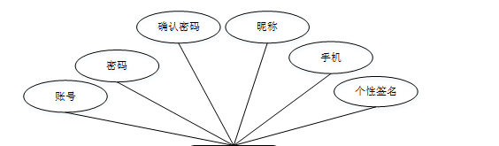
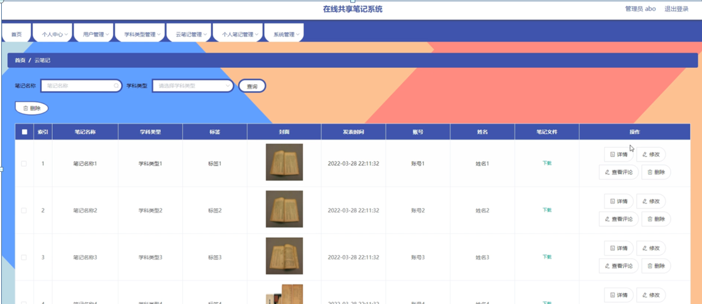

ssm+Vue计算机毕业设计在线共享笔记系统（程序+LW文档）

**项目运行**

**环境配置：**

**Jdk1.8 + Tomcat7.0 + Mysql + HBuilderX** **（Webstorm也行）+ Eclispe（IntelliJ
IDEA,Eclispe,MyEclispe,Sts都支持）。**

**项目技术：**

**SSM + mybatis + Maven + Vue** **等等组成，B/S模式 + Maven管理等等。**

**环境需要**

**1.** **运行环境：最好是java jdk 1.8，我们在这个平台上运行的。其他版本理论上也可以。**

**2.IDE** **环境：IDEA，Eclipse,Myeclipse都可以。推荐IDEA;**

**3.tomcat** **环境：Tomcat 7.x,8.x,9.x版本均可**

**4.** **硬件环境：windows 7/8/10 1G内存以上；或者 Mac OS；**

**5.** **是否Maven项目: 否；查看源码目录中是否包含pom.xml；若包含，则为maven项目，否则为非maven项目**

**6.** **数据库：MySql 5.7/8.0等版本均可；**

**毕设帮助，指导，本源码分享，调试部署** **(** **见文末** **)**

### 系统设计主要功能

通过市场调研及咨询研究，了解了在线共享笔记系统及管理者的使用需求，于是制定了管理员和用户等模块。功能结构图如下所示：

图4-1系统功能结构图

### 4.2 数据库设计

#### 4.2.1 数据库设计规范

数据可设计要遵循职责分离原则，即在设计时应该要考虑系统独立性，即每个系统之间互不干预不能混乱数据表和系统关系。

数据库命名也要遵循一定规范，否则容易混淆，数据库字段名要尽量做到与表名类似，多使用小写英文字母和下划线来命名并尽量使用简单单词。

#### 4.2.2 E/R图

用户注册E/R图，如下所示：

图4-2用户注册E/R图

云笔记E/R图，如下所示：

图4-3云笔记E/R图

### 系统功能模块

在线共享笔记系统，在系统首页可以查看首页、云笔记、系统介绍、个人中心、后台管理等内容，并进行详细操作；如图5-1所示。

图5-1系统首页界面图

用户注册，在用户注册页面通过填写账号、密码、确认密码、昵称、手机、个性签名等信息进行注册操作，如图5-2所示。

图5-2用户注册界面图

云笔记，在云笔记页面可以查看笔记名称、笔记封面、学科类型、标签、发表时间、账号、姓名、点击次数、笔记文件、内容等信息，如图5-3所示。

图5-3云笔记界面图

个人中心，在个人中心页面通过填写账号、密码、昵称、性别、手机、个性签名等内容进行更新信息，还可以根据需要对我的收藏进行相对应操作，如图5-4所示。

图5-4个人中心界面图

### 5.2后台模块

系统后台登录，通过填写注册时输入的用户名、密码，点击登录进行登录操作，如图5-5所示。

图5-5系统后台登录界面图

#### 5.2.1管理员功能模块

管理员登录进入系统可以查看首页、个人中心、用户管理、学科类型管理、云笔记管理、个人笔记管理、系统管理等功能，并进行详细操作，如图5-6所示。

图5-6管理员功能界面图

用户管理；在用户管理页面中可以查看索引、账号、昵称、性别、手机、个性签名等内容，并进行详情，修改和删除操作；如图5-7所示。

图5-7用户管理界面图

学科类型管理；在学科类型管理页面中可以查看索引、学科类型等内容，并进行修改和删除操作；如图5-8所示。

图5-8学科类型管理界面图

云笔记管理；在云笔记管理页面中可以查看索引、笔记名称、学科类型、标签、封面、发表时间、账号、姓名、笔记文件等内容，并进行详情，修改，查看评论和删除操作；如图5-9所示。

图5-9云笔记管理界面图

个人笔记管理；在个人笔记管理页面中可以查看索引、笔记名称、学科类型、标签、封面、发表时间、账号、昵称、笔记文件等内容，并进行详情，云笔记，修改和删除操作；如图5-10所示。

图5-10个人笔记管理界面图

系统管理；在系统介绍页面中可以查看索引、标题、图片等内容，并进行详情，修改和删除等操作；还可以对轮播图管理进行详细操作；如图5-11所示。

图5-11系统管理界面图

#### 5.2.2用户功能模块

用户登录进入系统可以查看首页、个人中心、云笔记管理、个人笔记管理等功能，并根据需要进行详细操作，如图5-12所示。

图5-12用户功能界面图

#### **JAVA** **毕设帮助，指导，源码分享，调试部署**

