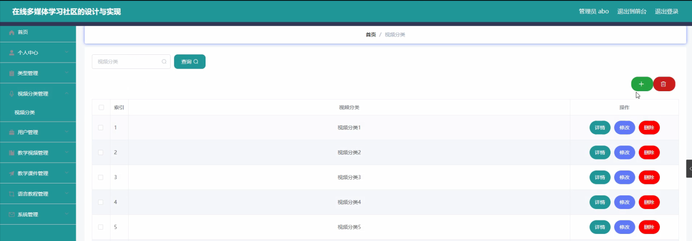

ssm+Vue计算机毕业设计在线多媒体学习社区的（程序+LW文档）

**项目运行**

**环境配置：**

**Jdk1.8 + Tomcat7.0 + Mysql + HBuilderX** **（Webstorm也行）+ Eclispe（IntelliJ
IDEA,Eclispe,MyEclispe,Sts都支持）。**

**项目技术：**

**SSM + mybatis + Maven + Vue** **等等组成，B/S模式 + Maven管理等等。**

**环境需要**

**1.** **运行环境：最好是java jdk 1.8，我们在这个平台上运行的。其他版本理论上也可以。**

**2.IDE** **环境：IDEA，Eclipse,Myeclipse都可以。推荐IDEA;**

**3.tomcat** **环境：Tomcat 7.x,8.x,9.x版本均可**

**4.** **硬件环境：windows 7/8/10 1G内存以上；或者 Mac OS；**

**5.** **是否Maven项目: 否；查看源码目录中是否包含pom.xml；若包含，则为maven项目，否则为非maven项目**

**6.** **数据库：MySql 5.7/8.0等版本均可；**

**毕设帮助，指导，本源码分享，调试部署** **(** **见文末** **)**

### 系统结构设计

整个系统是由多个功能模块组合而成的，要将所有的功能模块都一一列举出来，然后进行逐个的功能设计，使得每一个模块都有相对应的功能设计，然后进行系统整体的设计。

本在线多媒体学习社区的设计与实现结构图如图4-2所示。

图4-2 系统功能结构图

#### 数据库E-R图设计

本在线多媒体学习社区的设计与实现采用的是MYSQL数据库，数据存储快，因为在线多媒体学习社区的设计与实现，主要的就是对信息的管理，信息内容比较多，这就需要好好的设计一个好的数据库，分类要清楚，不能添加信息的时候，造成信息太过混乱，设计好的数据库首先就需要先把各个实体之间的关系表达明确，系统的E-
R图如下图所示：

1、教学视频管理实体图如图4-5所示：

图4-5教学视频管理实体图

2、教学课件管理实体图如图4-6所示：

图4-6教学课件管理实体图

系统功能模块

在线多媒体学习社区的设计与实现，在系统首页可以查看首页、教学视频、教学课件、语言教程、系统公告、个人中心、在线咨询等内容进行详细操作，如图5-1所示。

图5-1系统首页界面图

教学视频，在教学视频页面可以查看标题、视频分类、封面、讲师、教学视频、发布时间、基本介绍等详细内容进行评论或收藏操作，如图5-2所示。

图5-2教学视频界面图

教学课件，在教学课件页面可以查看课件编号、课件名称、课程图片、课程附件、发布时间、课件内容等详细内容进行评论或收藏操作，如图5-3所示。

图5-3教学课件界面图

用户注册，在用户注册页面通过填写账号、姓名、密码、年龄、联系电话、电子邮箱等信息完成用户注册，如图5-4所示。在个人中心页面通过填写账号、姓名、密码、性别、年龄、联系电话、电子邮箱等信息进行更新操作，还可以根据需要对我的收藏进行相应操作；如图5-5所示。

图5-4用户注册界面图

图5-5个人中心界面图

5.2管理员功能模块

管理员登录，通过填写注册时输入的用户名、密码、选择角色进行登录，如图5-6所示。

图5-6管理员登录界面图

管理员登录进入系统可以查看系统首页、个人中心、类型管理、视频分类管理、用户管理、教学视频管理、教学课件管理、语言教程管理、系统管理等信息进行详细操作，如图5-7所示。

图5-7管理员功能界面图

类型管理，在类型管理页面中可以对索引、类型等信息进行详情、修改或删除等操作，如图5-8所示。

图5-8类型管理界面图

视频分类管理，在视频分类管理页面中可以对索引、视频分类等信息进行详情、修改或删除等操作，如图5-9所示。

图5-9视频分类管理界面图

用户管理，在用户管理页面中可以对索引、账号、姓名、性别、年龄、联系电话、电子邮箱等信息进行详情、修改或删除等操作，如图5-10所示。

图5-10用户管理界面图

教学视频管理，在教学视频管理页面中可以对索引、标题、视频分类、封面、讲师、教学视频、发布时间等信息进行详情、修改、查看评论或删除等操作，如图5-11所示。

图5-11教学视频管理界面图

教学课件管理，在教学课件管理页面中可以对索引、课件编号、课件名称、课程图片、课程附件、发布时间等信息进行详情、修改、查看评论或删除等操作，如图5-12所示。

图5-12教学课件管理界面图

#### **JAVA** **毕设帮助，指导，源码分享，调试部署**

