ssm+Vue计算机毕业设计在线学习交流平台（程序+LW文档）

**项目运行**

**环境配置：**

**Jdk1.8 + Tomcat7.0 + Mysql + HBuilderX** **（Webstorm也行）+ Eclispe（IntelliJ
IDEA,Eclispe,MyEclispe,Sts都支持）。**

**项目技术：**

**SSM + mybatis + Maven + Vue** **等等组成，B/S模式 + Maven管理等等。**

**环境需要**

**1.** **运行环境：最好是java jdk 1.8，我们在这个平台上运行的。其他版本理论上也可以。**

**2.IDE** **环境：IDEA，Eclipse,Myeclipse都可以。推荐IDEA;**

**3.tomcat** **环境：Tomcat 7.x,8.x,9.x版本均可**

**4.** **硬件环境：windows 7/8/10 1G内存以上；或者 Mac OS；**

**5.** **是否Maven项目: 否；查看源码目录中是否包含pom.xml；若包含，则为maven项目，否则为非maven项目**

**6.** **数据库：MySql 5.7/8.0等版本均可；**

**毕设帮助，指导，本源码分享，调试部署** **(** **见文末** **)**

### 功能结构

为了更好的去理清本系统整体思路，对该系统以结构图的形式表达出来，设计实现该在线学习交流平台的功能结构图如下所示：

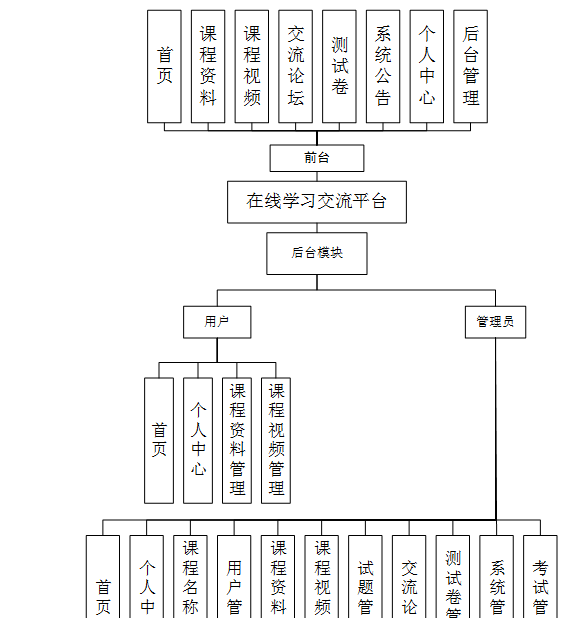

图4-1 系统总体结构图

### 4.2 数据库设计

#### 4.2.1 数据库E/R图

ER图是由实体及其关系构成的图，通过E/R图可以清楚地描述系统涉及到的实体之间的相互关系。在系统中对一些主要的几个关键实体如下图：

(1) 课程资料E/R图如下所示：

图4-2课程资料E/R图

(2) 测试卷E/R图如下所示：

图4-3测试卷E/R图

(3) 用户信息E/R图如下所示：

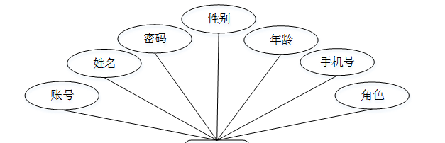

图4-4用户信息E/R图

### 系统功能模块

在线学习交流平台，在平台首页可以查看首页、课程资料、课程视频、交流论坛、测试卷、系统公告、个人中心、后台管理等内容，并进行详细操作；如图5-1所示。

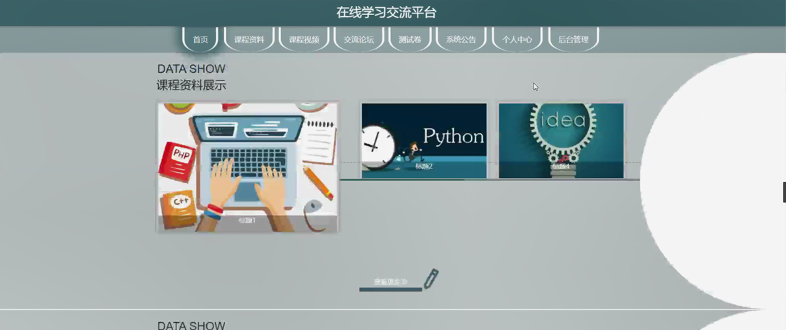

图5-1平台首页界面图

用户注册，在用户注册页面通过填写账号、姓名、密码、确认密码、年龄、手机号等信息进行注册操作，如图5-2所示。

图5-2用户注册界面图

课程资料，在课程资料页面可以查看标题、课程名称、账号、姓名、角色、图片、发布时间、附件、内容等内容，并进行评论或收藏操作，如图5-3所示。

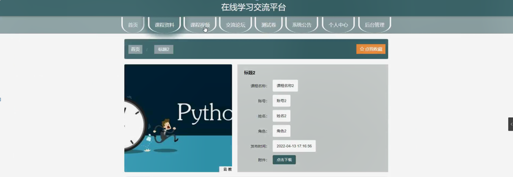

图5-3课程资料界面图

测试卷，在测试卷列表可以查看测试卷名称、考试时长、创建时间等内容进行考试操作，如图5-4所示。

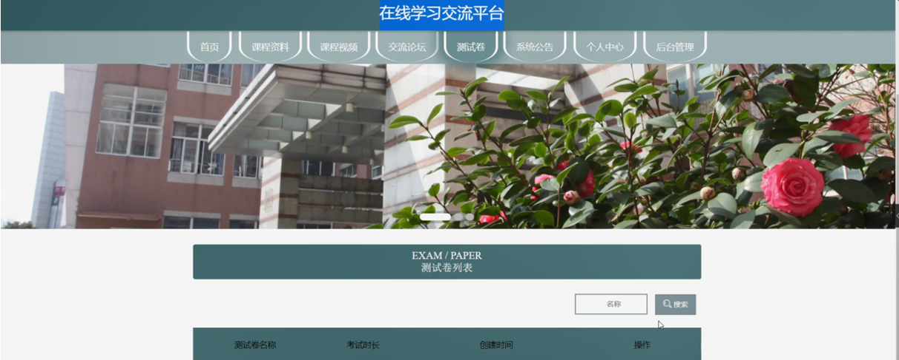

图5-4测试卷界面图

个人中心，在个人中心页面通过填写账号、姓名、密码、性别、年龄、手机号、角色等内容进行更新信息或退出等操作，还可以对我的发布，考试记录，错题本，我的收藏进行相应的操作，如图5-5所示。

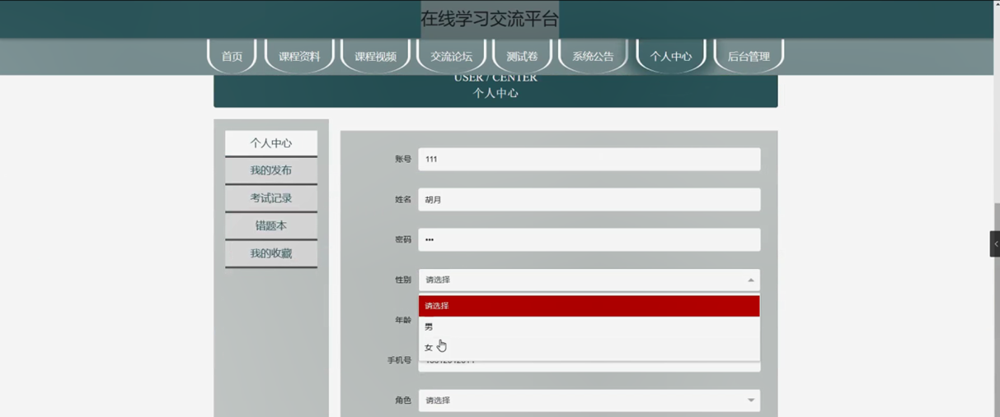

图5-5个人中心界面图

### 5.2后台功能模块

后台登录，管理员和用户进入系统前在登录页面根据要求填写用户名和密码，选择角色等信息，点击登录进行登录操作，如图5-6所示。

图5-6后台登录界面图

#### 5.2.1管理员功能模块

管理员登录系统后，可以对首页、个人中心、课程名称管理、用户管理、课程资料管理、课程视频管理、试题管理、交流论坛、测试卷管理、系统管理、考试管理等功能进行相应的操作管理，如图5-7所示。

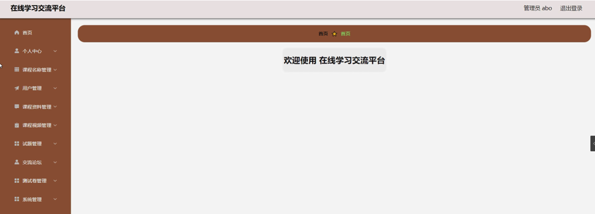

图5-7管理员功能界面图

课程名称管理，在课程名称管理页面可以对索引、课程名称等内容进行详情、修改或删除等操作，如图5-8所示。

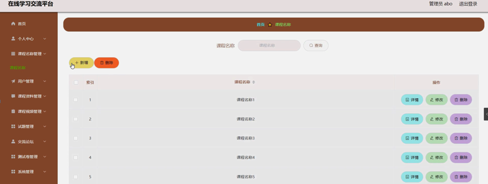

图5-8课程名称管理界面图

用户管理，在用户管理页面可以对索引、账号、姓名、性别、年龄、手机号、角色等内容进行详情、修改或删除等操作，如图5-9所示。

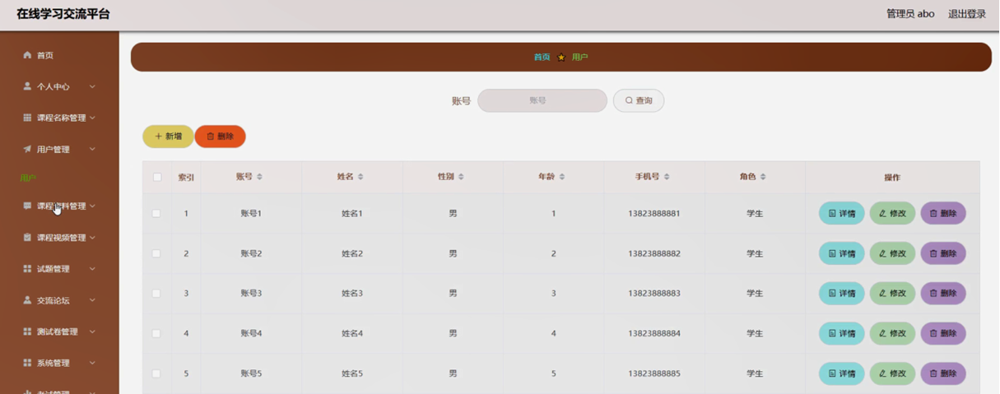

图5-9用户管理界面图

课程资料管理，在课程资料管理页面可以对索引、标题、课程名称、图片、附件、账号、姓名、角色、发布时间、审核回复、审核状态、审核等内容进行详情，修改，查看评论或删除操作，如图5-10所示。

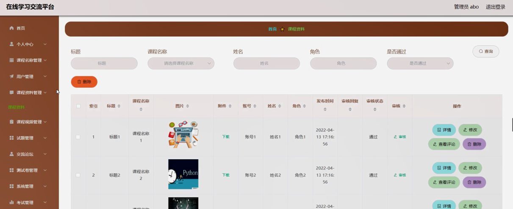

图5-10课程资料管理界面图

课程视频管理，在课程视频管理页面可以对索引、标题、课程名称、封面、账号、姓名、角色、发布时间、教学视频、审核回复、审核状态、审核等内容进行详情，修改，查看评论或删除操作，如图5-11所示。

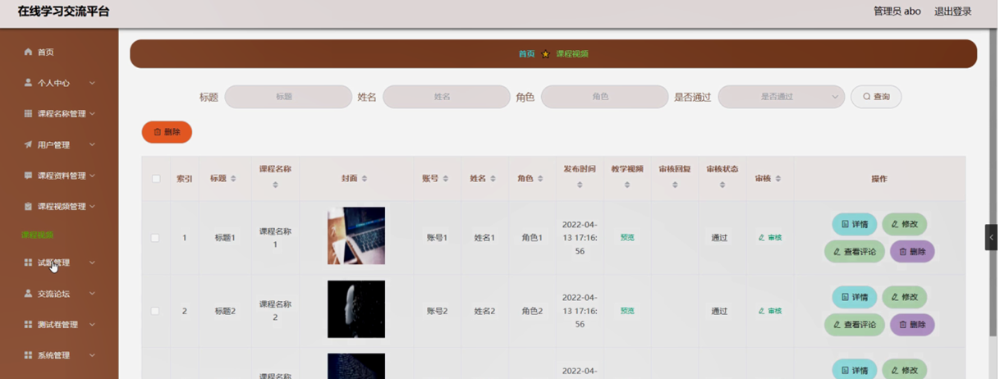

图5-11课程视频管理界面图

试题管理，在试题管理页面可以对测试卷、试题名称、分值、答案、类型等内容进行修改和删除操作，如图5-12所示。

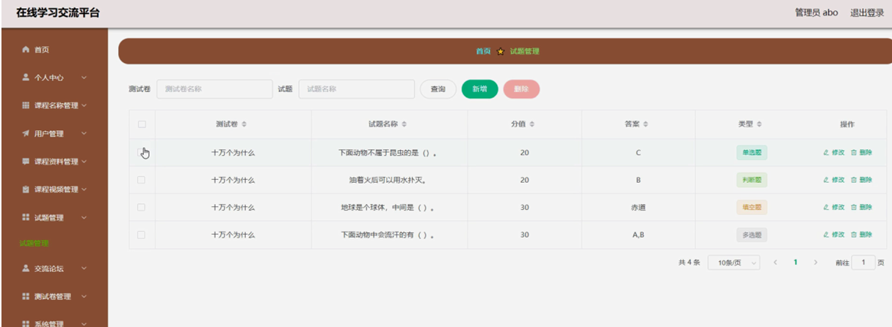

图5-12试题管理界面图

#### **JAVA** **毕设帮助，指导，源码分享，调试部署**

