ssm+Vue计算机毕业设计在线学习平台（程序+LW文档）

**项目运行**

**环境配置：**

**Jdk1.8 + Tomcat7.0 + Mysql + HBuilderX** **（Webstorm也行）+ Eclispe（IntelliJ
IDEA,Eclispe,MyEclispe,Sts都支持）。**

**项目技术：**

**SSM + mybatis + Maven + Vue** **等等组成，B/S模式 + Maven管理等等。**

**环境需要**

**1.** **运行环境：最好是java jdk 1.8，我们在这个平台上运行的。其他版本理论上也可以。**

**2.IDE** **环境：IDEA，Eclipse,Myeclipse都可以。推荐IDEA;**

**3.tomcat** **环境：Tomcat 7.x,8.x,9.x版本均可**

**4.** **硬件环境：windows 7/8/10 1G内存以上；或者 Mac OS；**

**5.** **是否Maven项目: 否；查看源码目录中是否包含pom.xml；若包含，则为maven项目，否则为非maven项目**

**6.** **数据库：MySql 5.7/8.0等版本均可；**

**毕设帮助，指导，本源码分享，调试部署** **(** **见文末** **)**

### 4.1系统总体设计

系统总体设计即对有关系统全局问题的设计，也就是设计系统总的处理方案，又称系统概要设计。它包括系统规划与系统功能设计等内容。

在线学习平台主要有三类用户。分别是管理员，学生和教师，详细规划如图4-1所示。

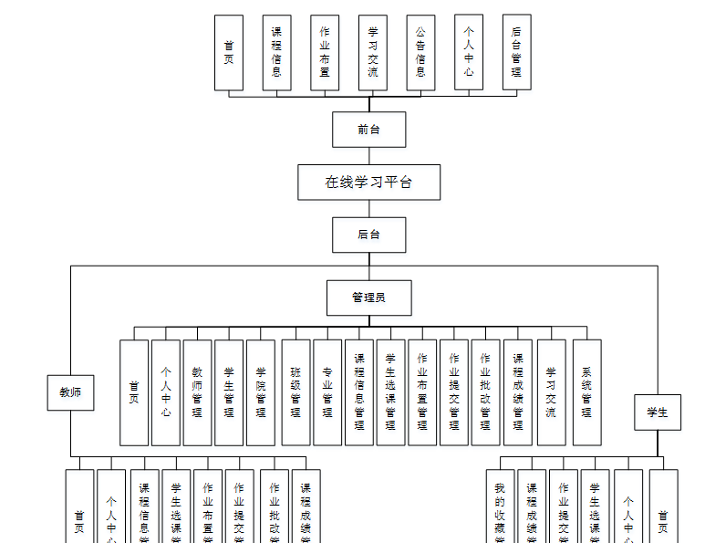图4-1 系统规划图

其中各子模块的主要功能如下：

1、用户登录：用户进入网页先输入用户名与密码，选择权限登录，用户登录成功，要记录登录的用户名和登录类型。

2、新用户注册：新用户填写用户名，密码，姓名，手机，邮箱等信息完成注册操作。

3、查看在线学习信息：用户登录成功后，能够按分类或者查找在线学习信息进行管理。

4、主页内容管理：管理员登录以后，可以对首页，个人中心，学院管理，专业管理，班级管理，学生管理，教师管理，课程信息管理，学生选课管理，作业布置管理，作业提交管理，作业批改管理，课程成绩管理，学习交流，系统管理进行详细操作。

### 4.2数据库设计

数据库是一个软件项目的根基，它决定了整个项目代码的走势，同时也决定了整个项目在后期的维护以及升级的难易程度。

#### 4.2.1 数据库概念设计

根据在线学习平台的功能需求，对数据库进行分析，得到相应的数据，设计用户需要的各种实体，以及相互之间的关联，为逻辑结构设计铺好路。根据所实体内的各种具体信息得于实现。

1.公告信息实体

公告信息实体包括标题，图片，简介，内容等属性。公告信息实体图如图4-2所示：

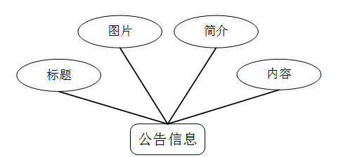

图4-2.公告信息实体图

2.学生实体

学生实体包括学号，密码，学生姓名，性别，头像，学院，专业，班级，手机，邮箱等属性；学生实体图如图4-3所示：

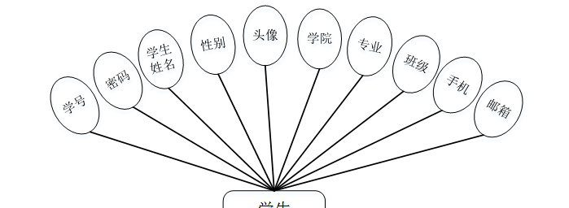

图4-3学生实体图

3.教师实体

教师实体包括教师工号，教师姓名，密码，性别，照片，职称，联系电话，教师邮箱等属性。教师实体图如图4-4所示：

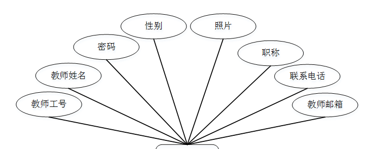图4-4教师实体图

### 5.1功能页面实现

按照不同功能模块，在此对系统所涉及的关键页面的实现细节进行阐述，包括页面功能描述，页面涉及功能分析，介绍以及界面展示。

系统登录：运行系统，首先进入登录界面，按照登录界面的要求填写相应的“账号”和“密码”以及用户类型，点击“登录”然后系统判断填写是否正确，若正确进入相应的界面，否则给出要求先注册信息。具体流程如图5-1所示。

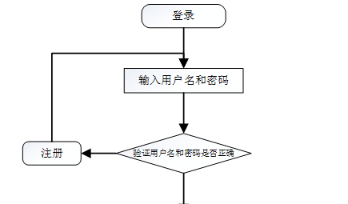

图5-1 登录流程图

登录，通过输入账号，密码，选择角色并点击登录进行系统登录操作，如图5-2所示。

图5-2登录界面图

### 5.2系统功能模块

在线学习平台；在平台首页可以查看首页，课程信息，作业布置，学习交流，公告信息，个人中心，后台管理等内容进行详细操作，如图5-3所示。

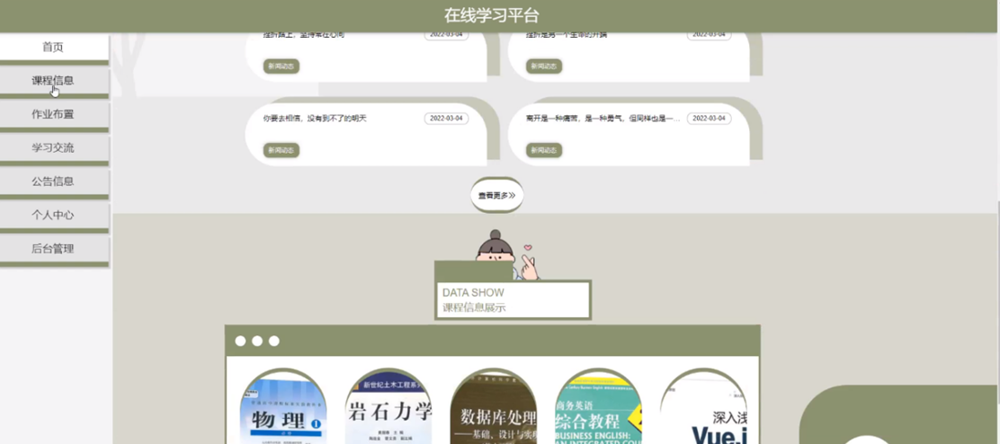

图5-3平台首页界面图

作业布置；在作业布置页面可以通过课程名称，年级，专业等内容进行搜索，如图5-4所示。

图5-4作业布置界面图

课程信息；在课程信息页面可以通过课程名称，年级，专业等内容进行搜索，如图5-5所示。

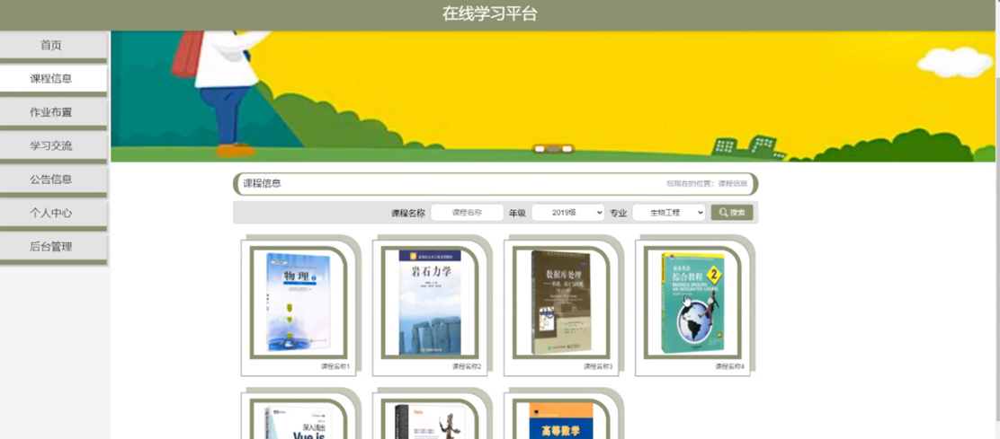

图5-5课程信息界面图

个人中心；在个人中心页面通过填写用学号，密码，学生姓名，性别，上传图片，学院，专业，班级，手机，邮箱等信息进行更新操作，还可以对我的发布，我的收藏进行相应操作，如图5-6所示。

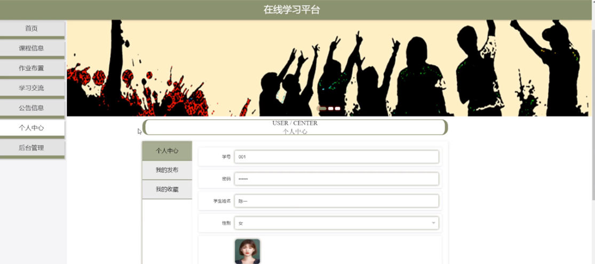

图5-6个人中心界面图

### 5.3管理员功能模块

管理员登录系统后，可以对首页，个人中心，学院管理，专业管理，班级管理，学生管理，教师管理，课程信息管理，学生选课管理，作业布置管理，作业提交管理，作业批改管理，课程成绩管理，学习交流，系统管理等功能进行相应操作，如图5-7所示。

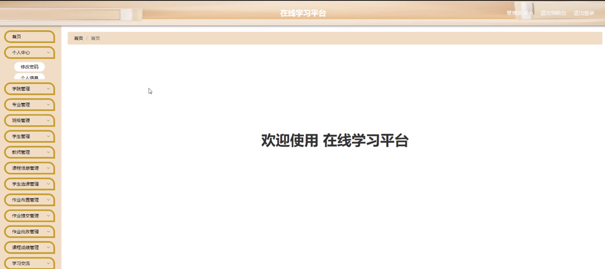

图5-7管理员功能界面图

学院管理；在学院管理页面可以对索引，学院等内容进行详情，修改或删除等操作，如图5-8所示。

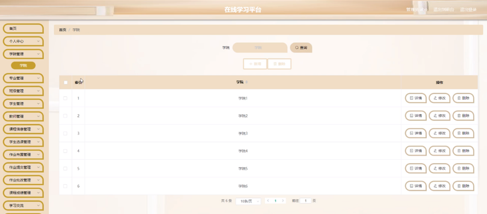

图5-8学院管理界面图

专业管理；在专业管理页面可以对索引，专业等内容进行详情，修改或删除等操作，如图5-9所示。

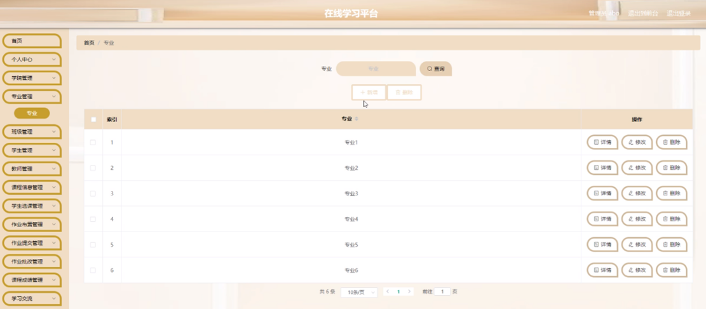

图5-9专业管理界面图

班级管理；在班级管理页面可以对索引，班级等内容进行详情，修改或删除等操作，如图5-10所示。

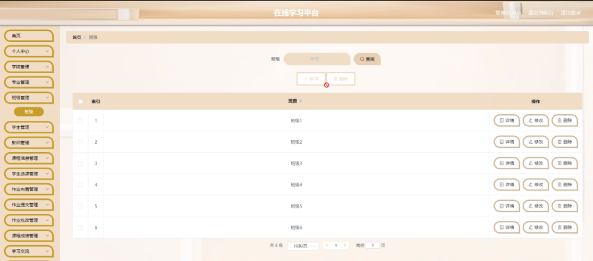

图5-10班级管理界面图

学生管理；在学生管理页面可以对索引，学号，学生姓名，性别，头像，学院，专业，班级，手机，邮箱等内容进行详情，修改或删除等操作，如图5-11所示。

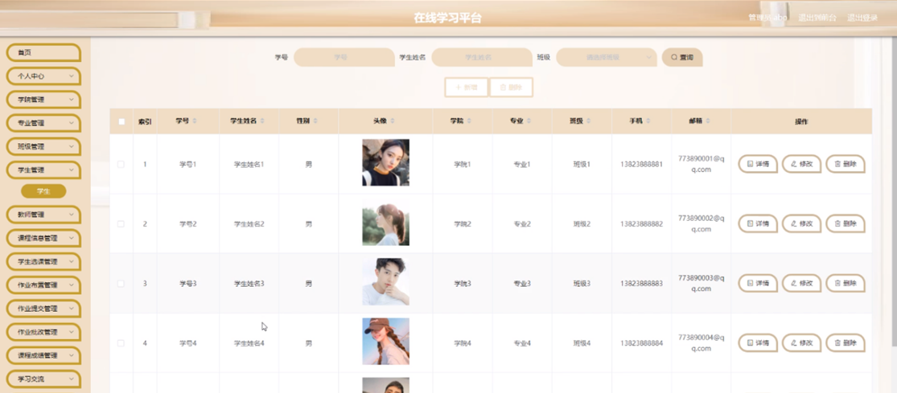

图5-11学生管理界面图

课程信息管理；在课程信息管理页面可以对索引，课程名称，课程类型，图片，年级，学年，学期，专业，发布日期，教师工号，教师姓名等内容进行详情，修改或删除等操作，如图5-12所示。

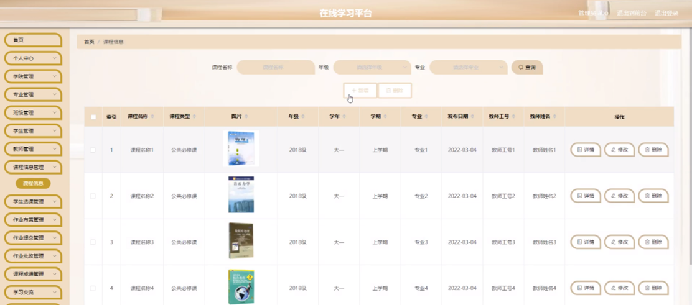

图5-12课程信息管理界面图

**JAVA** **毕设帮助，指导，源码分享，调试部署**

